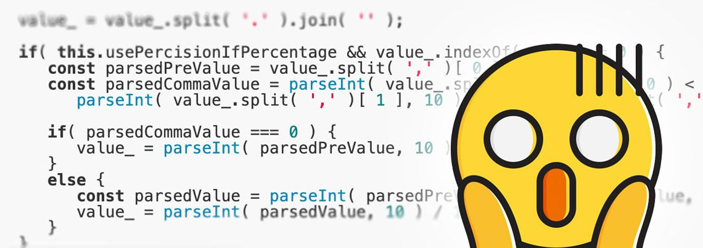
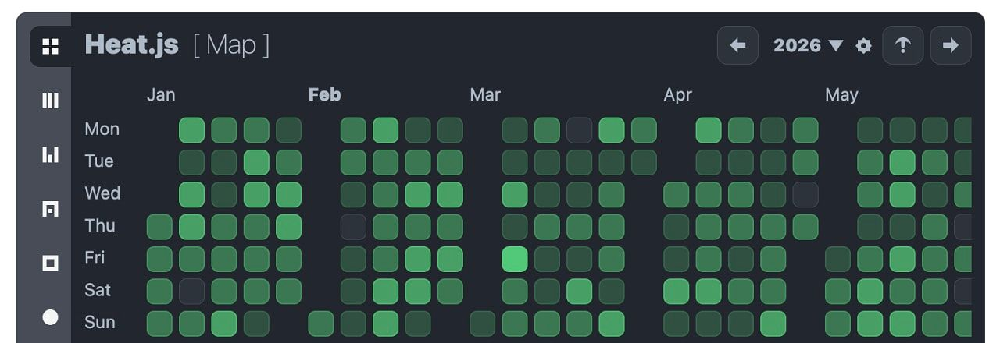

# Babel 8 RC Arrives, Gatsby Lives, Lodash Resets

Four Heavyweights Drop Updates

Four stalwarts of the JavaScript ecosystem all shipped notable releases this week, and odds are you're using at least one of them:

- [Gatsby v5.16](https://javascriptweekly.com/link/180162/web) proves Gatsby, once considered neck-and-neck with Next.js in the React world, is [_not_ 'dead'.](https://javascriptweekly.com/link/180163/web) The headline feature is React 19 support.
- [Babel 7 just shipped its final release.](https://javascriptweekly.com/link/180164/web) _"After years in the making, Babel 8 is finally ready,"_ in [release candidate form](https://javascriptweekly.com/link/180166/web), at least.
- [Rspress 2.0](https://javascriptweekly.com/link/180167/web) is a major release for the high-performance Rust-powered, but JavaScript-facing, static site generator.
- [Lodash 4.17.23](https://javascriptweekly.com/link/180168/web) sounds minor, but it's a 'security reset' for the still heavily used [utility library](https://javascriptweekly.com/link/180169/web) and is designed to provide a base for a longer future.

  
- [Only Fools Write Tests](https://javascriptweekly.com/link/180111/web) — Modern engineering teams like Notion, Dropbox, Wiz, and LaunchDarkly use Meticulous to maintain E2E UI tests that [cover every edge case](https://javascriptweekly.com/link/180111/web) of your web app. **_\--- Meticulous sponsor_**

  
- 🦀 [OpenClaw: The Runaway AI Assistant](https://javascriptweekly.com/link/180171/web "openclaw.ai") — An intense week for a new open source TypeScript project: [150k stars on GitHub](https://javascriptweekly.com/link/180172/web), hordes buying Mac Minis to run it, _two_ rebrands (it was originally _Clawdbot_), and an ecosystem of projects the agents use autonomously (e.g. [an entire social network](https://javascriptweekly.com/link/180173/web)). Another example of TypeScript at the heart of the AI boom. **_\--- Peter Steinberger_**

**IN BRIEF:**

- The popular [JSBin](https://javascriptweekly.com/link/180112/web) collaborative JavaScript pastebin went down for a few days and Remy Sharp [shares the war story of what happened.](https://javascriptweekly.com/link/180113/web)
- 🔒 [The OpenJS Foundation has shared an annual report](https://javascriptweekly.com/link/180175/web) covering its efforts in securing the JS ecosystem.
- Angular is [changing components' default change detection strategy.](https://javascriptweekly.com/link/180114/web)
- Both [Astro](https://javascriptweekly.com/link/180115/web) and [Svelte](https://javascriptweekly.com/link/180116/web) have shared monthly roundups of what's new.

**RELEASES:**

- [Node.js v25.6.0 (Current)](https://javascriptweekly.com/link/180118/web) – `async_hooks` can now skip `Promise` hooks to reduce overhead. Plus, URL parsing now supports Unicode 17.
- [jQuery UI 1.14.2](https://javascriptweekly.com/link/180119/web) – The legacy UI library gets its first update in over a year and now works with jQuery 4.0.
- [Bun v1.3.8](https://javascriptweekly.com/link/180176/web) – Say hello to native Markdown parsing.
- [Astro 5.17](https://javascriptweekly.com/link/180177/web), [ESLint 10.0.0-rc2](https://javascriptweekly.com/link/180178/web), [tRPC v11.9.0](https://javascriptweekly.com/link/180120/web), [Lexical 0.40.0](https://javascriptweekly.com/link/180121/web), [Reka UI 2.8](https://javascriptweekly.com/link/180180/web) (formerly Radix Vue)

## 📖  Articles and Videos

  
- ⁉️ [How Not to Parse Numbers in JavaScript](https://javascriptweekly.com/link/180122/web "thedailywtf.com") — Why use a proper locale-aware API to parse numbers when you can hand-roll a maze of string splits, separator swaps, and implicit type coercions that silently break on edge cases? **_\--- Remy Porter (The Daily WTF)_**
  
- 📉 [Node.js 16 to 25 Benchmarked Version-by-Version](https://javascriptweekly.com/link/180123/web "www.repoflow.io") — The jumps in performance in various areas are striking (with Node 25, especially), with other areas getting more modest gains. **_\--- RepoFlow_**
  
- [A Practical Checklist for B2B Enterprise Readiness](https://javascriptweekly.com/link/180124/web "hello.descope.com") — Measure gaps in auth, admin UX, security, monitoring, and architecture for landing enterprise customers. [Download today!](https://javascriptweekly.com/link/180124/web) **_\--- Descope sponsor_**
  
- [Explicit Resource Management in JavaScript](https://javascriptweekly.com/link/180125/web "allthingssmitty.com") — You can use `using` for deterministic cleanup, calling `Symbol.dispose`/`asyncDispose` at scope exit without `try`/`finally`. A small fix for leaks and forgotten teardowns in streams, observers, locks, and similar APIs. **_\--- Matt Smith_**
  
- [The History of C# and TypeScript with Anders Hejlsberg](https://javascriptweekly.com/link/180181/web "github.blog") — GitHub interviewed the creator of both C# and TypeScript about his career, why TypeScript was created in the first place, some internal Microsoft politics, as well as the ongoing Go port of the TypeScript compiler. There's a video of the full interview, as well as 'seven learnings' boiled down in written form. **_\--- GitHub_**
  

- 📄 [My Opinionated ESLint Setup for Vue Projects](https://javascriptweekly.com/link/180127/web) – Packed with examples to pick and choose from. **_\--- Alexander Opalic_**
- 📄 [A Scroll-Revealed WebGL Gallery with GSAP, Three.js, Astro and Barba.js](https://javascriptweekly.com/link/180128/web) – Striking visual image reveal effect with [a live demo.](https://javascriptweekly.com/link/180129/web) **_\--- Chakib Mazouni_**
- 📄 [Predicting `Math.random()` in Firefox Using Z3 SMT-Solver](https://javascriptweekly.com/link/180130/web) **_\--- Dennis Yurichev_**
- 🎤 [Securing npm is Table Stakes](https://javascriptweekly.com/link/180131/web) **_\--- Nicholas C. Zakas (Changelog Podcast)_**
- 📄 [Building a Simple RSS Aggregator with Astro](https://javascriptweekly.com/link/180132/web) **_\--- Raymond Camden_**

## 🛠 Code & Tools

  
- [Heat.js 5.0: A Flexible Heat Map Rendering Solution](https://javascriptweekly.com/link/180133/web "www.heatjs.com") — Generate customized interactive heatmaps (think GitHub contributions graph), or render heatmaps as [lines](https://javascriptweekly.com/link/180134/web) and [bar charts](https://javascriptweekly.com/link/180135/web). The site is [packed with demos](https://javascriptweekly.com/link/180136/web) to enjoy. [GitHub repo.](https://javascriptweekly.com/link/180137/web) **_\--- William Troup_**
  
- [Building an MCP Server? Don't Roll Your Own Auth](https://javascriptweekly.com/link/180138/web "workos.com") — WorkOS AuthKit handles OAuth 2.1 flows so your MCP server just verifies tokens. Control which tools AI agents access. **_\--- WorkOS sponsor_**
  
- 🕒 [Croner 10.0: Cron-Style Triggers and Evaluation](https://javascriptweekly.com/link/180139/web "croner.56k.guru") — Trigger functions on any cron schedule using [cron syntax.](https://javascriptweekly.com/link/180140/web) It can also evaluate cron expressions to give you a list of upcoming times. [v10.0](https://javascriptweekly.com/link/180141/web) brings full OCPS (Open Cron Pattern Specification) 1.4 compliance and even more scheduling options. **_\--- Hexagon_**
  
- 🗓️ [DayFlow: A Full Calendar Component for React](https://javascriptweekly.com/link/180142/web "dayflow-js.github.io") — A React-only feature-rich calendar component with drag-and-drop, multiple views, and all the usual GCal-style richness. Its infinite scrolling feature is nifty. [GitHub repo.](https://javascriptweekly.com/link/180143/web) **_\--- DayFlow Contributors_**
  
- [Tsonic: A TypeScript to C# Transpiler](https://javascriptweekly.com/link/180144/web "tsonic.org") — The idea is for creating native executables that run on .NET. I’ve not tested it as I’m not in that ecosystem but it’s an interesting idea. **_\--- Jeswin_**
- 📄 [EmbedPDF 2.4](https://javascriptweekly.com/link/180145/web) – Framework-agnostic JavaScript PDF viewer. ([Demo.](https://javascriptweekly.com/link/180146/web))
- [JavaScriptKit v0.40](https://javascriptweekly.com/link/180147/web) – Swift framework for interacting with JS via WASM.
- [StackBlur.js 3.0](https://javascriptweekly.com/link/180148/web) – Long-standing Gaussian blur library; now using ESM.
- [Knip 5.83](https://javascriptweekly.com/link/180149/web) – Finds and fixes unused files, dependencies and exports.
- 📄 [jsPDF 4.1](https://javascriptweekly.com/link/180150/web) – Generate PDFs directly in JavaScript. ([Demo.](https://javascriptweekly.com/link/180151/web))
- [qrcode.vue 3.8](https://javascriptweekly.com/link/180152/web) – Vue.js component to generate QR codes.
- [focus-trap 8.0](https://javascriptweekly.com/link/180153/web) – Trap focus within a DOM node. ([Demo.](https://javascriptweekly.com/link/180154/web))

## 📢  Elsewhere in the ecosystem

Some other interesting tidbits in the broader landscape:

- [GitHub is exploring solutions to tackle low-quality contributions](https://javascriptweekly.com/link/180155/web), which could include giving you the option to disable PRs entirely or at least restrict them to collaborators. Got opinions? Join the discussion.
- [How to throttle individual network requests](https://javascriptweekly.com/link/180156/web) in Chrome, rather than at a global level. Ideal for testing what happens when your dependencies load very _slooooooowwwwwly...._
- 🤖 OpenAI has released [a desktop version of its agentic-coding _Codex_ app](https://javascriptweekly.com/link/180157/web). macOS only for now, though someone [used Codex to port itself to Linux..](https://javascriptweekly.com/link/180158/web) 😂
- ⚠️ If you're a Windows user using the popular [Notepad++](https://javascriptweekly.com/link/180159/web) editor, you might want to double check your install as the project [suffered a suspected state-sponsored hijack](https://javascriptweekly.com/link/180160/web) in 2025.
- [svelteesp32](https://javascriptweekly.com/link/180161/web) is a curious project for embedding Svelte, React, Angular or Vue frontends into ESP32 microcontroller apps.
