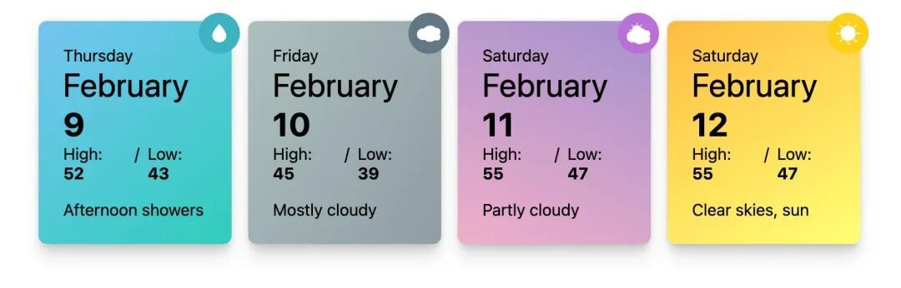
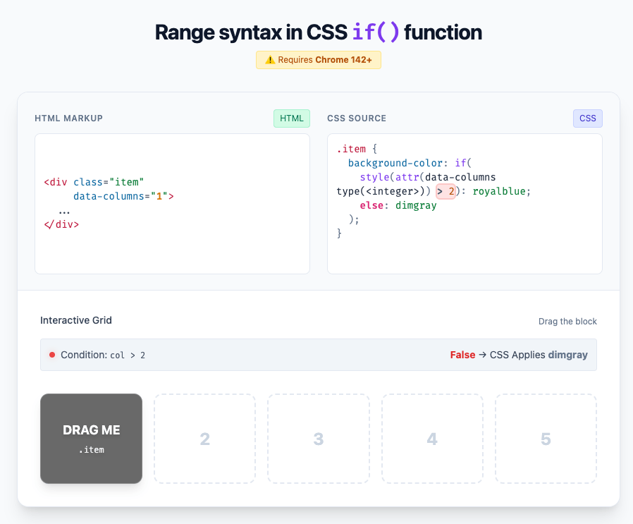

# 【第3640期】用 Range 语法让样式查询更灵活

前言

Chrome 142 为样式查询（Style Queries）带来了全新升级 —— 支持范围语法（Range Syntax）！这意味着现在可以像使用媒体查询一样，用 `>`, `<`, `>=`, `<=` 来比较数值，实现更智能的响应式样式。

今日前端早读课文章由 @Una 分享，@飘飘编译。

译文从这开始～～

样式查询（Style Queries）即将迎来了升级！就像媒体查询（Media Queries）和容器查询（Container Queries）一样，它们现在也可以响应一系列数值范围，而不再局限于预设的固定状态。

如果你以前使用过样式查询，可能注意到它们以前只能进行精确匹配，例如 `style(--theme: dark)`。但从 Chrome 142 开始，你可以在样式查询以及 CSS 的 `if()` 函数中使用比较运算符，如 `>`, `<`, `>=`, `<=`。这为创建响应式和状态感知组件打开了新的可能性。

[【第3627期】从媒体查询到样式查询：Chrome 142 如何让 CSS 更懂“数值”](https://mp.weixin.qq.com/s?__biz=MjM5MTA1MjAxMQ==&mid=2651278210&idx=1&sn=64ba5c14880aae308f0e311a22024cc6&scene=21#wechat_redirect)

#### 样式查询的范围语法

新的范围语法让 `@container style()` 查询功能更加强大。现在，你可以比较自定义属性、字面值，甚至是函数（如 `attr()`）返回的值。要使比较有效，两个值必须解析为相同的数值类型，例如长度（length）、数字（number）、角度（angle）、时间（time）、频率（frequency）或分辨率（resolution）。

##### 示例：天气卡片（Weather Cards）

让我们更新一个示例，使其更灵活，并引入范围查询的用法。

示例：https://developer.chrome.com/docs/css-ui/style-queries#weather\_cards

以前，我们只能对精确的值进行查询，例如：

```
 /* 样式查询必须是精确匹配（旧版） */
 @container style(--rainy: true) {
   .weather-card {
     background: linear-gradient(140deg, skyblue, lightblue);
   }
 }
```
现在，我们可以使用一个新的自定义属性，比如 `--rain-percent` 来控制样式。如果降雨概率大于 45%，就可以为其设置特定的背景渐变：

```
 /* 降雨百分比范围查询（新版） */
 @container style(--rain-percent > 45%) {
   .weather-card {
     background: linear-gradient(140deg, skyblue, lightblue);
   }
 }
```
在实际场景中，你可能会通过组件属性（props）来实现类似的效果。借助 `attr()` 函数的新功能，也可以利用这些属性。例如，我们可以将 `[data-rain-percent]` 属性值转换为 CSS 自定义属性 `--rain-percent`，并将其指定为百分比类型，以便在范围查询中使用：

```
 .card-container {
   container-name: weather;
   --rain-percent: attr(data-rain-percent type(<percentage>));
 }
```


codepen：https://codepen.io/una/pen/zxrEzdq

#### 在 `if()` 中使用范围语法

范围语法的强大之处不仅限于 `@container` 规则。你还可以在 CSS 的 `if()` 函数中使用它，为属性创建条件值。因此，我们可以进一步优化上面的代码，让它看起来更简洁：

[【第3548期】全新 CSS if 函数将彻底改变样式写法](https://mp.weixin.qq.com/s?__biz=MjM5MTA1MjAxMQ==&mid=2651276923&idx=1&sn=e7260e8cd7cf9b13dd6dcf9b6941d48b&scene=21#wechat_redirect)

```
 /* 在 if() 语句中使用范围样式查询 */
 .weather-card {
   background: if(
     style(--rain-percent > 45%): blue;
     else: gray;
   );
 }
```
##### 示例：网格布局位置（Grid Position）

这种技巧不仅能用于组件的不同状态，还可以用在网格布局、样式切换、动画效果等场景中。举个例子，假设你有一个网格（grid），并希望根据列数（通过 data 属性设置）来改变背景颜色。使用带范围语法的 `if()`，就可以这样写：

```
 .item-grid {
   background-color: if(style(attr(data-columns, type) > 2): blue; else: gray);
 }
```


codepen：https://codepen.io/una/pen/PwNqMOB

关于本文  
译者：@飘飘  
作者：@Una  
原文：https://una.im/range-style-queries/

这期前端早读课  
对你有帮助，帮” 赞 “一下，  
期待下一期，帮” 在看” 一下。
