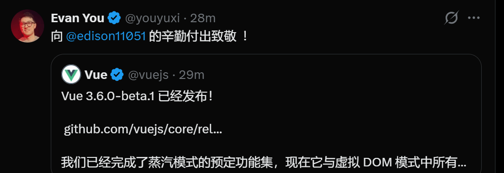

# 尤雨溪：Vue 3.6-beta.1 正式发布！史诗级更新！

Vue 3.6 现已进入公测（beta）阶段！我们已完成路线图中规划的 Vapor 模式全部既定功能开发，该模式目前已实现与虚拟 DOM（Virtual DOM）模式下所有稳定功能的功能对等。需要注意的是，纯 Vapor 模式暂不支持 Suspense 特性，但你可以在 VDOM 环境的 Suspense 中渲染 Vapor 组件。

3.6 版本还基于 alien-signals 对 `@vue/reactivity` 进行了重大重构，这一改动显著提升了响应式系统的性能表现，并降低了内存占用。
- 新功能 runtime-vapor：支持在 createDynamicComponent 中渲染代码块（render block） ([#14213](javascript:;)) (ddc1bae)
- 性能优化 runtime-vapor：实现动态 props/插槽数据源缓存 ([#14208](javascript:;)) (1428c06)

### 关于 Vapor 模式

Vapor 模式是 Vue 单文件组件（SFC）的全新编译模式，核心目标是降低基准包体积、提升运行性能。该模式为 100% 可选启用，支持现有 Vue API 的一个子集，且绝大部分功能表现与原 API 一致。

第三方基准测试显示，Vapor 模式的性能表现已与 Solid 和 Svelte 5 持平。

### 通用稳定性说明

Vue 3.6 公测版中的 Vapor 模式已完成功能开发，但仍被标记为不稳定状态。现阶段我们建议在以下场景中使用：

1. 现有项目中的局部使用（例如：将性能敏感的子页面用 Vapor 模式实现）；
2. 基于 Vapor 模式构建小型全新应用。

### 启用 Vapor 模式

Vapor 模式仅适用于使用 `<script setup>` 的单文件组件。如需启用，只需在 `<script setup>` 上添加 `vapor` 属性：

```
<script setup vapor>
// ...
</script>
```
Vapor 组件可在以下两种场景中使用：

#### 场景 1：Vapor 应用实例中

通过 `createVaporApp` 创建的应用实例，不会引入虚拟 DOM 运行时代码，能大幅降低基准包体积。

#### 场景 2：VDOM 应用实例中

若要在通过 `createApp` 创建的 VDOM 应用实例中使用 Vapor 组件，必须安装 `vaporInteropPlugin` 插件：

```
import { createApp, vaporInteropPlugin } from 'vue'
import App from './App.vue'

createApp(App)
  .use(vaporInteropPlugin) // 启用 vapor 互操作
  .mount('#app')
```
Vapor 应用实例也可安装 `vaporInteropPlugin` 以支持在其中使用 VDOM 组件，但这会引入 VDOM 运行时，抵消包体积优化的收益。

### VDOM 互操作限制

安装互操作插件后，Vapor 组件与非 Vapor 组件可互相嵌套使用。目前该特性已支持标准的 props、事件、插槽用法，但尚未覆盖所有极端场景。例如：在 Vapor 模式中使用基于 VDOM 开发的组件库时，很可能仍存在兼容问题。

已知问题：VDOM 组件中无法通过 `slots.default()` 渲染 Vapor 插槽，必须改用 `renderSlot` 方法。\[示例\]

我们会持续优化这一问题，但总体建议：在应用中划分清晰的「模式区域」，尽量避免混合嵌套两种模式的组件。

未来我们可能会提供配套工具，用于在代码库中强制管控 Vapor 模式的使用边界。

### 功能兼容性

Vapor 模式在设计上仅支持现有 Vue 功能的一个子集。对于受支持的功能，我们保证其行为完全符合 API 规范；同时这也意味着，部分功能在 Vapor 模式中被明确不支持：

- 选项式 API（Options API）；
- `app.config.globalProperties`；
- Vapor 组件中 `getCurrentInstance()` 始终返回 null；
- 元素级别的 `@vue:xxx` 生命周期事件。

此外，Vapor 模式中的自定义指令拥有不同的接口定义：

```
type VaporDirective = (
  node: Element | VaporComponentInstance,
  value?: () => any,
  argument?: string,
  modifiers?: DirectiveModifiers,
) => (() => void) | void
```
其中 `value` 是一个返回绑定值的响应式 getter 函数。开发者可通过 `watchEffect` 建立响应式副作用（组件卸载时会自动清理），并可选返回一个清理函数。示例如下：

```
const MyDirective = (el, source) => {
  watchEffect(() => {
    el.textContent = source()
  })
  return () => console.log('cleanup')
}
```
## 结语

我是林三心，一个待过**小型toG型外包公司、大型外包公司、小公司、潜力型创业公司、大公司**的作死型前端选手

我建了一些**前端学习群**，如果大家想进群交流前端知识，可以关注我，回复**加群**
