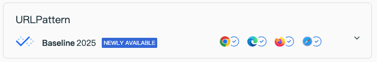
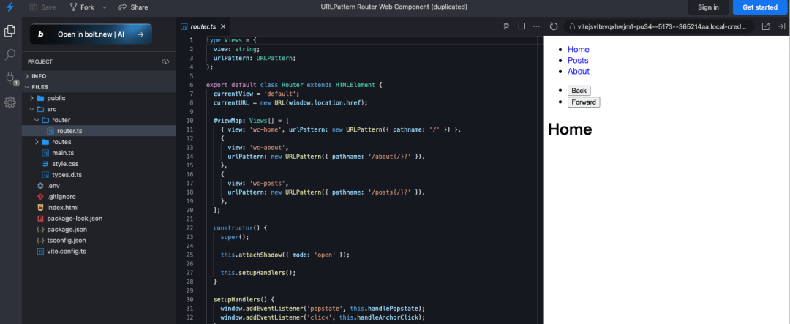

# 【第3622期】深入浅出：用 URLPattern 打造轻量级 SPA 路由

前言

主要介绍了如何使用原生 JavaScript 和浏览器 API 构建一个简单的单页应用 (SPA) 路由器。今日前端早读课文章由 @Jim Schofield 分享，@飘飘编译。

译文从这开始～～

自 2025 年 9 月起，URLPattern 现已在所有浏览器中可用。此功能在较旧的设备或浏览器中可能无法使用。：



所以我想深入研究一下，如何仅使用原生 JavaScript 和浏览器 API 来构建一个简单的单页应用（SPA）路由器。我们的目标是创建一个组件，它接收路由配置，并根据浏览器 URL 渲染对应的组件。

[【第3533期】Cursor AI 最佳实践：使用“金标准文件”工作流以获得更精确的结果](https://mp.weixin.qq.com/s?__biz=MjM5MTA1MjAxMQ==&mid=2651276735&idx=1&sn=53efe1dcb5f8e4b494a08d80e84f6689&scene=21#wechat_redirect)

#### `URLPattern()` 的作用 📎

在路由器中，条件渲染组件并不是难点，真正的挑战在于如何准确匹配浏览器的 URL，从而判断该显示哪个组件。不仅如此，我们还需要能够捕获路由中的动态部分（例如 `/posts/{post_id}` 这样的路径）。

下面我们来看几个示例，了解如何判断一个 URL 是否符合指定的模式。之后，就可以利用这个机制轻松构建一个可配置的路由系统。

[【第3604期】URLPattern：让浏览器原生支持更强大的 URL 路由与匹配](https://mp.weixin.qq.com/s?__biz=MjM5MTA1MjAxMQ==&mid=2651277725&idx=1&sn=d8867e2c8125eb5409ce978449a155c7&scene=21#wechat_redirect)

```
 const catUrlPattern = new URLPattern({ pathname: "/cat" });

 catUrlPattern.test("http://www.jschof.dev/cat"); // True!
 catUrlPattern.test("http://www.jschof.dev/dog"); // False!
 catUrlPattern.test({ pathname: "/cat" }); // True!
 catUrlPattern.test("http://www.jschof.dev/cat/"); // False!
 catUrlPattern.test("http://www.jschof.dev/cat/other-things?yes"); // False!
```
你可能会对第四个示例感到意外。在 URLPattern 中，`/cat` 与 `/cat/` 是不同的。  
为了解决这个问题，我们可以让模式中结尾的斜杠成为可选项，用花括号 `{}` 包裹并在后面加上 `?` 标记：

```
 const catUrlPattern = new URLPattern({ pathname: "/cat{/}?" });

 catUrlPattern.test("http://www.jschof.dev/cat"); // True!
 catUrlPattern.test({ pathname: "/cat/" }); // True!
 catUrlPattern.test("http://www.jschof.dev/cat/"); // True!
 catUrlPattern.test("http://www.jschof.dev/cat/other-things?yes"); // False!
```
然而，还有另一个意外！如果你希望 `/cat/` 后还能接更多路径，可以在模式中加入通配符 `*`：

```
 const catUrlPattern = new URLPattern({ pathname: "/cat{/}?*" });

 catUrlPattern.test("http://www.jschof.dev/cat"); // True!
 catUrlPattern.test({ pathname: "/cat/" }); // True!
 catUrlPattern.test("http://www.jschof.dev/cat/"); // True!
 catUrlPattern.test("http://www.jschof.dev/cat/other-things?yes"); // True!
```
#### 从哪里开始？📎

我打算使用一个包含配置对象的数组，将 URL 路径与特定的 Web 组件关联起来。这种方式与 vue-router 的实现思路非常相似。

```
 const routerConfig = [
   { pathName: new URLPattern("/home{/}?"), component: "my-home" },
   { pathName: new URLPattern("/posts{/}?"), component: "my-posts" },
   { pathName: new URLPattern("/about{/}?"), component: "my-about" },
 ];
```
配置对象的顺序非常重要。我们会依次检测每个模式，一旦找到匹配项，就渲染对应的组件。

```
 for (const config of routerConfig) {
   if (config.pathName.test(window.location.href)) {
     // 渲染 config.component！
     return;
   }
 }

 // TODO: 处理 404 页面
```
**如何渲染组件？**

这部分逻辑将由我们定义的 Web 组件来完成。该组件会读取当前的浏览器 URL，依次检测所有路由配置（使用 URLPattern 匹配），然后创建并渲染相应的 Web 组件作为子元素。

[【第3575期】解锁 AI 响应中的丰富 UI 组件渲染](https://mp.weixin.qq.com/s?__biz=MjM5MTA1MjAxMQ==&mid=2651277284&idx=1&sn=c96010fa50abd506a21064e332bbf967&scene=21#wechat_redirect)

有些框架把这种路由组件称为 “outlet”（插槽）组件。

```
 const routerConfig = [
   { pathName: new URLPattern("/home{/}?"), component: "my-home" },
   { pathName: new URLPattern("/posts{/}?"), component: "my-posts" },
   { pathName: new URLPattern("/about{/}?"), component: "my-about" },
 ];

 class MyRouter extends HTMLElement {
   constructor() {
     super();
     const matchedComponent = this.getRouteMatch();
     this.renderComponent(matchedComponent);
   }

   getRouteMatch() {
     for (const config of routerConfig) {
       if (config.pathName.test(window.location.href)) {
         return config.component;
       }
     }
     // TODO: 处理 404 页面
   }

   renderComponent(component) {
     this.innerHTML = "";
     const viewElement = document.createElement(component);
     this.appendChild(viewElement);
   }
 }

 customElements.define("my-router", MyRouter);
```
当然，你还需要事先注册好 `my-home`、`my-posts` 和 `my-about` 这三个 Web 组件。

这样，我们就得到了一个能在页面加载时根据 URL 渲染对应组件的简单路由器。不过工作还没结束 —— 如果用户点击了链接怎么办？如果用户使用浏览器的前进或后退按钮呢？这些交互也需要处理，幸运的是，解决它们并不难。

#### 处理 SPA 导航与链接点击 📎

首先要明白一点：当你访问 `http://www.myblog.com/some/path` 时，服务器通常会尝试在后端解析 `/some/path`，也就是说，它可能会去查找名为 “some” 和 “path” 的文件夹。但在单页应用（SPA）中，我们并没有这些真实的文件夹 —— 只有一个 `index.html` 文件来处理所有虚拟路径。整个路由逻辑都在客户端通过 JavaScript 完成。

[【第3054期】京东百亿补贴通用H5导航栏方案](https://mp.weixin.qq.com/s?__biz=MjM5MTA1MjAxMQ==&mid=2651265745&idx=1&sn=e6bf3bbe7bca05e057f4b38bad1ff9d9&scene=21#wechat_redirect)

无论访问哪个路径，服务器都只需返回同一个首页文件，接下来由客户端使用我们定义好的 `URLPattern` 来匹配并渲染相应的组件。

**在 Vite 中的配置**

在 Vite 中实现这一点非常简单，只需使用 `spa` 模式配置即可。修改你的 Vite 配置文件如下：

```
 import { defineConfig } from "vite";

 export default defineConfig({
   appType: "spa",
 });
```
这样，你的 Vite 本地服务器就能正确地处理所有路径请求。不过，部署后情况可能会因环境而异。  
例如，在 Netlify \* 上，你需要在配置文件中添加重定向规则。如果使用其他框架或服务器，请根据具体情况查阅 Stack Overflow、Google 或你常用的 LLM（大语言模型）获取相应解决方案。

当服务器和重定向配置好之后，我们就可以开始处理点击事件了！

**接管链接点击事件**

我们的目标是 “接管” 页面中的所有链接点击，阻止浏览器默认的跳转行为。也就是说，对所有点击事件调用 `preventDefault()`，然后获取被点击链接的目标地址，使用我们的 `URLPattern` 来匹配并渲染相应组件。最后，我们手动更新浏览器地址栏的 URL，使其看起来像页面跳转，但实际上只是模拟了页面切换。

可以在路由组件挂载到 DOM 时设置点击事件监听器：

```
 class MyRouter extends HTMLElement {
   // ...

   connectedCallback() {
     window.addEventListener("click", this.handleClicks);
   }

   handleClicks = (event) => {
     if (event.target instanceof HTMLAnchorElement) {
       // 阻止浏览器默认跳转行为
       event.preventDefault();

       // 手动设置 URL
       const toUrl = event.target.getAttribute("href");
       window.history.pushState({}, "", toUrl);

       // 根据新的 URL 匹配并渲染组件
       const matchedComponent = this.getRouteMatch();
       this.renderComponent(matchedComponent);
     }
   };

   disconnectedCallback() {
     window.removeEventListener("click", this.handleClicks);
   }
 }
```
一定要在 `disconnectedCallback()` 中清除事件监听器，以防内存泄漏。

当用户点击链接时，他们会看到 URL 变化、页面切换，甚至浏览器历史记录中也会新增一条记录。接下来，我们还需要确保用户点击浏览器的前进或后退按钮时，应用能正确响应，而不是让浏览器真正刷新页面。

> 在上面的例子中，我们拦截了页面中所有 `<a>` 标签的点击。不过你也可以选择只处理当前路由组件内的链接，避免影响页面上其他不相关的链接。
> 
> 此外，我们还没有处理 “外部链接” 的逻辑，这部分需要特别处理，不过这超出了本文范围。

#### 最后一步：浏览器导航 📎

当用户使用浏览器的前进或后退功能（无论是调用 `window.back()` / `window.forward()`，还是直接点击按钮）时，浏览器会触发一个名为 `popstate` 的事件。

这个事件的好处是：浏览器会自动切换到历史记录中的目标地址（即我们之前通过 `window.pushState` 添加的记录）。换句话说，我们只需要监听这个事件，在导航发生时重新渲染对应组件即可。此时 URL 已经更新，无需我们再去修改。

下面是最终版本的简易路由器：

```
 class MyRouter extends HTMLElement {
   // ...

   connectedCallback() {
     window.addEventListener("click", this.handleClicks);
     window.addEventListener("popstate", this.handlePopState);
   }

   handlePopState = (event) => {
     const matchedComponent = this.getRouteMatch();
     this.renderComponent(matchedComponent);
   };

   disconnectedCallback() {
     window.removeEventListener("click", this.handleClicks);
     window.removeEventListener("popstate", this.handlePopState);
   }
 }
```
这样，我们的最小可用路由器（MVP Router）就完整了：

- 能在页面加载时根据 URL 渲染组件；
- 能处理链接点击，实现无刷新的页面切换；
- 能响应浏览器前进、后退事件。

这就是一个纯原生 JavaScript 打造的轻量级 SPA 路由系统的核心实现。



https://stackblitz.com/edit/vitejs-vite-vqxhwjm1?file=src%2Frouter%2Frouter.ts

还有更多可以改进的地方！下面是一些值得继续研究和探索的方向：

- 实现动态路径段，比如 `/posts/:id`（可参考关于动态参数的文档）；
- 处理带有查询参数（search 参数）的 URL；
- 支持嵌套路由或子路由系统。

#### 需要注意的几点 📎

我们现在做的事情是相当底层的。像这样自己手动实现一个路由渲染器，如果不小心，可能会暴露出 XSS（跨站脚本攻击） 的风险。例如，如果你允许外部直接修改路由组件中的配置数组（`routerConfig`），那么其他人就可以在控制台注册他们自己的 Web 组件，然后访问某个特定路径来让你的路由器渲染他们的组件。  
换句话说，这样做实际上等于允许他人执行自己的代码。

正因如此，在本文的示例中，路由配置被定义在路由组件的私有变量中。如果我们把它暴露成公共属性，就会有被篡改的风险。

**如何避免？**最安全的做法是：永远不要仅仅根据 URL 的查询参数或动态段来决定渲染哪个组件。要始终把可渲染的组件放在一个静态列表中，并将其保存在路由组件的私有作用域内。

另一个值得思考的问题是：我们真的需要用 Web Components 自己造一个路由器吗？也许…… 不一定？😅例如 Lit \* 框架就认为这种做法有其价值和用途。但必须认识到，自己实现路由要处理很多框架路由器早已解决的问题。同时，Web Components 也带来了额外的安全性和作用域管理挑战。

不过，学习这些底层原理绝对是有意义的。理解浏览器不断推出的这些原生 API，也能帮助我们更好地利用平台本身提供的能力。

关于本文  
译者：@飘飘  
作者：@Jim Schofield  
原文：https://jschof.dev/posts/2025/11/build-your-own-router/

这期前端早读课  
对你有帮助，帮” 赞 “一下，  
期待下一期，帮” 在看” 一下。
