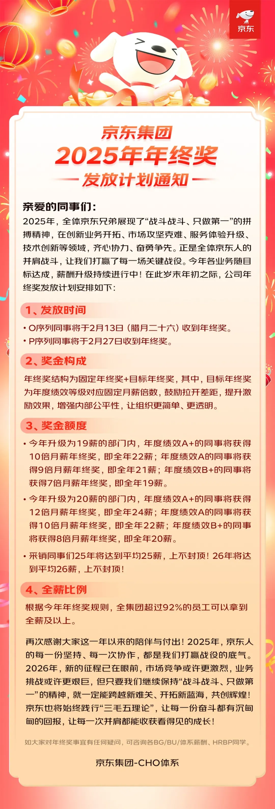

# 年终奖到账！25薪+70%涨幅

此前京东刚给全国员工发了10万盒新年巧克力，而这次年终奖最亮眼的就是覆盖面和涨幅：全集团92%员工能拿满甚至超额领，总投入同比涨超70%，堪称今年行业最大涨幅。对我们程序员来说，这种实打实的薪酬激励，远比花里胡哨的福利更有吸引力，毕竟这才是打工人最需要的安全感。

这波年终奖大涨，和京东的“20薪升级计划”直接挂钩。2024年10月京东就启动了两年期薪酬优化，目标全员20薪，推进速度超出预期：今年升级部门已实现19薪，部分核心业务线还提前达成了20薪。

具体激励规则也很清晰，不同绩效对应不同力度：升级部门里，A+绩效拿10倍月薪年终奖（全年22薪），A绩效9倍（21薪），B+绩效7倍（19薪）；提前实现20薪的部门福利更优，B+绩效就能拿8倍月薪（20薪），A+绩效12倍（24薪）。最让人羡慕的是采销团队，平均25薪且上不封顶，能看出公司对核心业务的重视。

值得一提的是京东“一线优先”原则，明确一线员工年终奖年前全额发放。而且不止年终奖，京东在员工保障上确实做得到位：入局外卖后实现全职骑手“三个100%”（签合同、交五险一金、享正式福利），还计划提供2.8万套住房，未来5年投220亿建15万套“小哥之家”，这些细节能看出企业对员工的诚意。

社交平台上，网友们都在说被京东年终奖“戳中”，称其是“打工人的强心剂”，我完全认同。了解到京东过去一年多已连续7次大范围提薪，这种“付出有回报”的企业态度，确实能让员工更有归属感。作为程序员，真心羡慕这种福利体系完善的企业。

京东一直强调让员工“老有所养、病有所医、住有所居”，从实际投入来看确实落地了。对打工人而言，不用为基本保障发愁，才能安心发挥价值。这波京东的年终奖方案，不仅让同行羡慕，也给其他企业做了个好榜样。

## 结语

我是林三心，一个待过**小型toG型外包公司、大型外包公司、小公司、潜力型创业公司、大公司**的作死型前端选手

我建了一些**前端学习群**，如果大家想进群交流前端知识，可以关注我，回复**加群**

