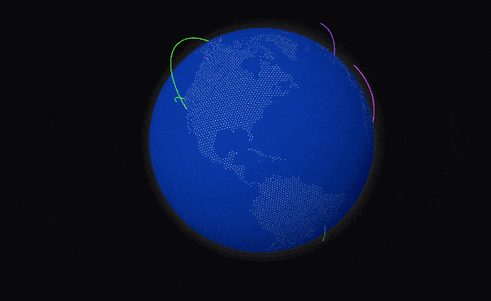
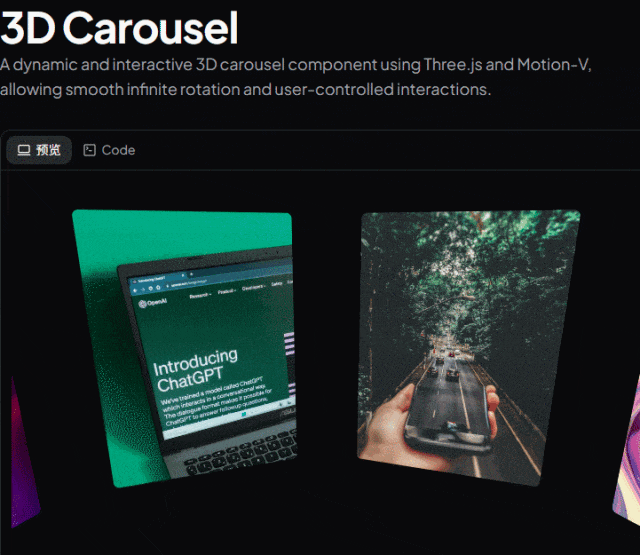
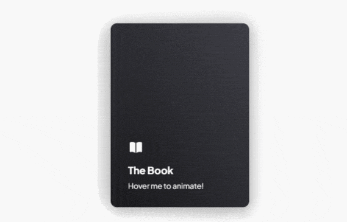
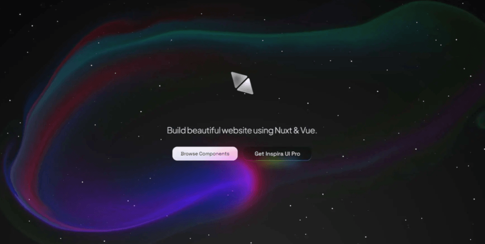

# 首个专属于 Vue3 的动效组件库！包含 120+ 个组件

## 前言

> 我建了 **5000人前端学习群**，群内分享**前端知识/Vue/React/Nodejs/全栈**，关注我，回复**加群**，即可加入~ **事件机制深度解析：从物理点击到程序触发**

InspiraUI，是一套专注于用户体验、平衡美学与功能性的界面设计方案。该项目的核心是专为 Vue3/Nuxt 生态打造的一款开源动态效果组件库

InspiraUI 将超过 120 个即用型动效组件整合为开发者的“创意资源库”，从而把复杂的动画开发从“从零手写”转化为“按需选取”。

> 官网：https://inspira-ui.com

## 原生支持 Vue3，性能卓越

基于 Vue 3.4+ 的 defineModel 与 watchEffect 等新特性重构，直接降低 30% 的响应式开销；组件支持按需引入与 Tree Shaking，结合“懒加载 + 预渲染”优化，使首屏加载速度提升 35%。同时为 Nuxt3 提供专门优化，可通过 `nuxt-inspira-ui` 插件实现组件自动注册，集成效率成倍提高。



## 动态效果体系：涵盖微交互至 3D 沉浸

内置 20+ 基础微交互动画（如悬停、加载、状态反馈），并包含多种“视觉冲击力强”的特效组件：

- 界面动效：类似苹果官网的滚动过渡、按钮流光渐变、表单输入反馈动画
- 场景特效：粒子背景、可交互的 3D 地球旋转、液态 LOGO 动画
- 进阶交互：3D 卡片翻转、设备模拟器动态演示、光标跟随效果  
  所有动效基于 motion-v 与 gsap 实现，支持自定义动画曲线，并在支持 WebGPU 的浏览器中实现 3D 渲染帧率提升 2–3 倍。



**3\. 基于 Tailwind，定制轻松**  
底层采用 Tailwind CSS V4 构建，支持通过原子类快速调整样式；可通过 `theme.config.js` 一键自定义色彩、字体等设计主题，并轻松切换浅色/深色模式。无需改动源码即可贴合品牌风格，对设计师与开发者协作十分友好。


---

## 快速开始

**步骤1：准备环境**

```
# 创建 Vue3 项目
npm create vite@latest my-vue-app -- --template vue-ts
npm install

# 安装 Tailwind CSS（组件库依赖）
npm install -D tailwindcss postcss autoprefixer
npx tailwindcss init -p
```
**步骤2：安装 Inspira UI**

```
# 核心依赖
npm install -D @inspira-ui/plugins clsx tailwind-merge

# 动画与工具依赖
npm install @vueuse/core @vueuse/motion
```
**步骤3：实现 3D 书本动效**

```
<template>
  <div class="grid place-content-center p-10">
    <Book>
      <BookHeader>
        <Icon
          name="heroicons:book-open-solid"
          size="24"
        />
      </BookHeader>
      <BookTitle>
        <h1>The Book</h1>
      </BookTitle>
      <BookDescription>
        <p>Hover me to animate!</p>
      </BookDescription>
    </Book>
  </div>
</template>
```


**或使用：**

```
pnpm dlx shadcn-vue@latest add "https://registry.inspira-ui.com/book.json"
```
## 结语

我是林三心，一个待过**小型toG型外包公司、大型外包公司、小公司、潜力型创业公司、大公司**的作死型前端选手

我建了一些**前端学习群**，如果大家想进群交流前端知识，可以关注我，回复**加群**




