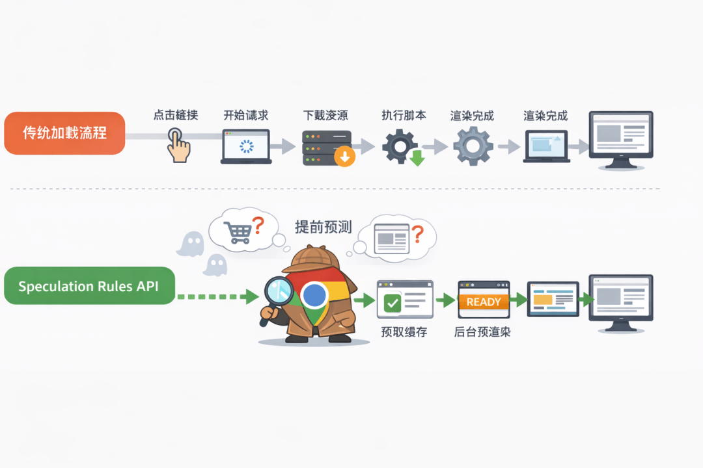
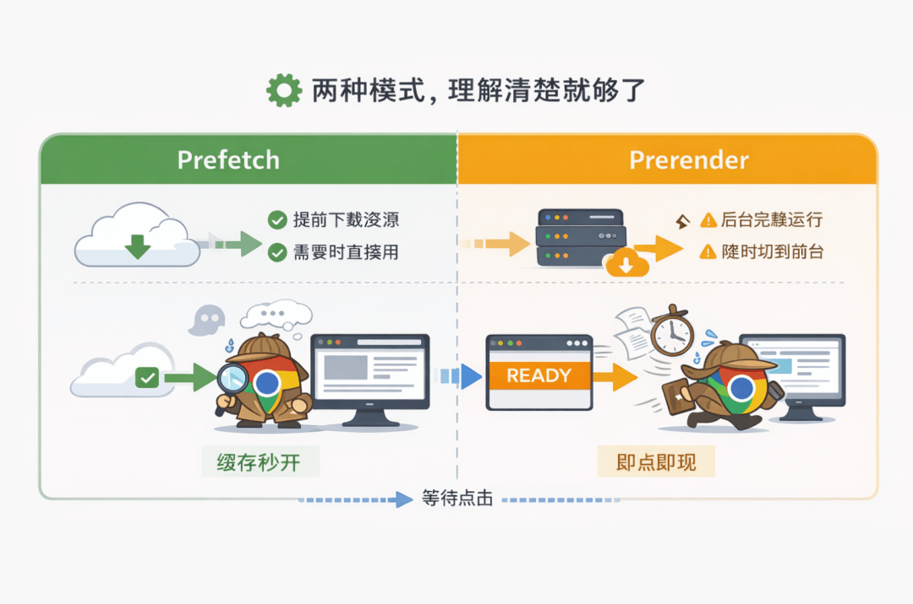

# Chrome 新 API：仅 6 行 HTML！页面秒开！

如果你也厌倦了页面里无穷无尽的 **loading** 动画，那这个东西你真的可以看一眼。


最近 **Chrome** 内置了一个新能力：**Speculation Rules API**。

不需要`框架`、不需要 `JS`，甚至不需要你改现有业务逻辑，只要写几行声明式 `HTML`，就能明显改善页面跳转时的体验。

## 🔑 核心：让浏览器提前做判断

我们平时的页面跳转流程都很熟悉：



用户`点击链接` → `浏览器开始请求` → `下载资源` → `执行脚本` → `页面渲染完成`

**Speculation Rules API** 并没有改变这件事本身，它只是把这条链路**往前挪了一点点**。

当浏览器判断用户**“很可能”**会点某个链接时，它不会等到点击真的发生，而是提前开始准备。

等用户真正点下去的时候，页面要么已经在**缓存**里了，要么干脆已经在后台跑完了。

## 🚀 6 行代码，直接生效

**Speculation Rules API** 的使用方式，比你想象中简单得多。

你只需要把下面这段代码放进页面的 `<head>`：

```
<script type="speculationrules">
{
  "prerender": [{ "source": "document", "eagerness": "moderate" }]
}
</script>
```
加完之后，浏览器会**自动扫描**当前页面里的所有链接。

当用户`悬停`或`聚焦`到某个链接时，后台就会**开始预渲染**对应的页面。

在很多页面跳转场景下，点击之后几乎是**“秒切”**，你甚至会怀疑是不是哪里少了一个 **loading**。

## ⚙️ 两种模式，理解清楚就够了

这个 **API** 本质上只有两种用法。



  

- 第一种是 **prefetch**：

浏览器会提前把目标页面的 `HTML`、`JS`、`CSS` 下载下来放进缓存，但不会执行页面逻辑。

这种方式`资源消耗很低`，几乎没有副作用，适合用来给整站做兜底。

- 第二种是 **prerender**：

浏览器会在后台完整加载并运行页面，脚本会执行，请求也会发出。

等你真正点击时，只是把已经运行好的页面切到前台。

也正因为这样，**prerender 的体验最好，但使用时要更谨慎一些**。

## 🎯 实际落地时，可以按三步来

第一步，**先广撒网，用 prefetch 打底**:

对站内同域链接启用 `prefetch`，网络开销很小，但能明显减少首次跳转的等待时间，基本没有风险。

第二步，**只对高价值路径用 prerender**:

比如商品页到结算页、文章到下一篇，这类用户高度确定会点的路径，`prerender` 的收益会非常明显。

第三步，**跨域场景别忘了配响应头**:

如果目标页面在其他域名下，需要返回`Supports-Loading-Mode: credentialed-prerender`，否则浏览器不会生效。

## 🕹️ eagerness 不用纠结，选对就行

触发时机一共就三档：

- **eager**：链接一进入可视区就开始
- **moderate**：悬停或聚焦时开始（默认，也是最均衡的）
- **conservative**：鼠标按下才开始，最省资源

大多数场景下，直接用 **moderate** 就够了，不需要刻意调。

## ⚠️ 关于 Vue / React 单页应用，必须说清楚

**Speculation Rules API** 针对的是**浏览器级的页面导航**，也就是加载新的 **HTML** 文档。

而 `Vue`、`React` 的单页应用，内部路由切换本质是前端状态变化，并不会触发真正的文档加载。

所以它**并不能直接加速 SPA 内部路由跳转**。

但如果你的项目里存在`多入口页面`，或者会从 `SPA` 跳转到其他页面、其他系统，那这些“**真实的页面跳转**”场景依然非常适合使用这个 **API**。

## 🛡️ 使用时需要注意的几个点

如果页面一加载就会`写数据库`、`发消息`，或者对业务状态有影响，那就不适合用 `prerender`，只用 `prefetch` 会更安全。

对于强依赖登录态的页面，也建议提前做好`权限判断`，避免后台预渲染直接命中 `401`。

如果你有`埋点`或 `PV` 统计，记得区分预渲染和真实访问，可以通过监听 `prerenderingchange` 事件来处理。

是否生效，可以直接在 **Chrome DevTools** 的 **Preloading 面板**里查看，一眼就能确认。

## 🎖️ 写在最后

**Speculation Rules API** 做的事情其实并不复杂：

**把等待时间，从「用户点击之后」，提前到「浏览器空闲的时候」。**

它不是万能解法，但在合适的页面跳转场景下，确实能用极低的成本，换来非常直观的体验提升。

下次产品再跟你说要不要加 **loading**，你至少多了一个更优雅的选择。

  

---

  


- 我是 ssh，工作 6 年+，阿里云、字节跳动 Web infra 一线拼杀出来的资深前端工程师 + 面试官，非常熟悉大厂的面试套路，Vue、React 以及前端工程化领域深入浅出的文章帮助无数人进入了大厂。
- 欢迎`长按图片加 ssh 为好友`，我会第一时间和你分享前端行业趋势，学习途径等等。2025 陪你一起度过！
- 
- 关注公众号，发送消息：
  
  指南，获取高级前端、算法**学习路线**，是我自己一路走来的实践。
  
  简历，获取大厂**简历编写指南**，是我看了上百份简历后总结的心血。
  
  面经，获取大厂**面试题**，集结社区优质面经，助你攀登高峰

因为微信公众号修改规则，如果不标星或点在看，你可能会收不到我公众号文章的推送，请大家将本**公众号星标**，看完文章后记得**点下赞**或者**在看**，谢谢各位！
