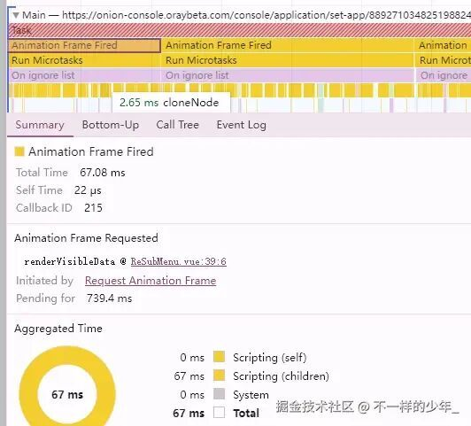
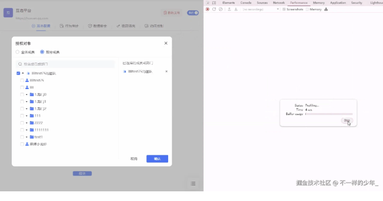
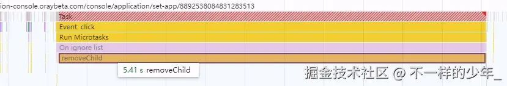

# 救火：一场递归树的性能突围战！

点击上方 程序员成长指北，关注公众号

回复1，加入高级Node交流群

## 前言：

> 上周，负责核心业务组件的同事老王突然请假（据说去相亲了），留下一堆代码和风中凌乱的我。
> 
> 结果前脚刚走，后脚核心客户就炸锅了：“你们这个系统怎么回事？我每次要给员工赋个权，浏览器就直接卡死！打开弹窗挺快，一点开部门就未响应，关掉弹窗还要卡半天！”
> 
> 看着客户发来的 **十几秒卡顿录屏**，和老板投来的“和善”目光，我只能硬着头皮接下了这个“锅”。
> 
> 本文记录了我是如何从吐槽同事代码，到深度排查，最终通过**深度优化**解决这个 **几千个节点递归组件性能灾难**的全过程。

**省流版**

- **现象**：展开树卡 10s+，关闭弹窗再卡 5s
- **根因**：递归组件全量挂载 + rAF 分帧渲染在多组件实例并发下失效 + 高成本 height变化动画
- **方案**：懒加载可见节点 + 以“藏”代“删”（opacity/v-show）+ 合成层优化 (transform: scaleY)

**看完你会**

- 用 Performance 找到 Long Task 的“底层元凶”
- 改造递归树的渲染/销毁策略，显著降低每帧工作量
- 量化优化前后效果，复用到自己的列表/树场景

## 一、 客户现场还原（案发经过）

授权弹窗虽然实现了秒开，但一旦点击展开根节点，瞬间卡死，足足卡顿数秒后才渲染出子节点。

### 业务背景

客户正在使用我们的 **“企业级权限管理系统”** 。

出问题的组件是一个核心的 **组织架构选择器（TreeSelect）** ，它被嵌入在一个高频使用的 **“授权弹窗”** 中。

- **高频场景**：管理员需要频繁地给不同的员工或部门分配权限。
- **操作路径**：点击“可见范围” → 弹出授权弹窗 → 在树形组件中找到对应部门/人员 → 勾选 → 确定/关闭。

### **数据规模**

该客户是大型企业，全量组织架构节点约为 **2700 个**（包含多级部门和人员）。这个数量级在 ToB 业务中其实不算特别大，但足以压垮未经优化的代码。

### **故障现象**

1. **打开弹窗（快）** ：点击授权按钮，弹窗秒出（老王用了分帧渲染进行首屏优化，这点挺好）。
2. **寻找部门（卡死）** ：管理员试图展开根部门去寻找下级单位，点击小三角的瞬间，界面失去响应，**Long Task 持续 10s+** 。管理员以为死机了，疯狂点击，结果还是没反应。
3. **关闭/取消（卡死）** ：好不容易选完了，点击“确定”或“关闭”弹窗，界面再次假死 **4-5s**，才能关掉弹窗。

## 二、 深度侦查：谁在谋杀主线程？

> **工程化思考：线上监控能发现吗？**
> 
> Sentry 或其它性能监控能抓到这个问题吗？
> 
> 线上监控通常只能告诉你 **“页面卡了”**（监控到 `Long Task` 或 `INP` 指标飙升），但很多时候难告诉你具体的 **“为什么卡”**。 要确诊是 JS 逻辑阻塞，还是 CSS 动画引发的 \*\*Reflow (重排)\*\*，必须依赖本地 Chrome DevTools 的 **Performance 面板** 进行“CT 扫描”。

> **💡 小贴士：如何使用 Performance？**打开 F12 开发者工具 -> 切换到 **Performance** 面板 -> 点击左上角“圆点”开始录制 -> 在页面操作复现卡顿 -> 点击 Stop 停止，即可生成分析报告。

我在本地 Mock 了 2700 条左右的数据，模拟了“打开 -> 展开 -> 关闭”的全流程，打开 Chrome **Performance** 一看，好家伙，红得跟过年一样。

### 第一步：看“心电图” (Performance 面板)



image.png

**现象**：

> 很多人看到 Performance 密密麻麻的图表就头晕，其实诀窍就一句话：**从上往下看**。
> 
> 1. **看顶部**（Main 线程）：**红色**的色块代表 **Long Task**（长任务），是导致页面卡顿的直接元凶。
> 2. **看中间**（调用栈）：像倒置的火焰一样，**越宽**代表耗时越久，**越往下**代表函数调用越深。
> 3. **找凶手**：顺着红条往下找，最底下的那个“宽条条”，通常就是罪魁祸首。

**颜色图例（快速看懂图）**

- 红色斜纹：Long Task，主线程连续超 50ms
- 黄色：JavaScript 执行（事件、定时器、requestAnimationFrame）
- 紫色：样式与布局（Recalculate Style、Layout）
- 绿色：绘制与合成（Paint、Composite）
- 看到“Animation Frame Fired + Run Microtasks”连续出现，通常是每帧都在做很多 JS，并在帧内清空 Promise/nextTick，导致超预算

**回到本案分析**：

1. **顶部报警**：最显眼的是一条红色斜纹带，说明主线程一直处于阻塞状态。
2. **中间密集**：顺着红色区域往下看，全是密密麻麻的黄色小条，提示 `Animation Frame Fired`（动画帧`requestAnimationFrame`触发）。
3. **底部实锤**：继续顺着调用栈 **从上往下** 找，能看到频繁的 `cloneNode`（克隆节点）调用。这说明核心耗时在 DOM 操作，浏览器在不断创建新元素。

**结论**：核心耗时在 DOM 操作，浏览器在疯狂加班造 DOM。`cloneNode` 就像是在复印文件，这说明代码在**没完没了地制造新的页面元素**，而且是一刻不停地在造，直接把主线程干趴下了。

### 第二步：顺藤摸瓜 (找代码)


image.png

**线索**： Performance 面板明确指出了凶手是 `ReSubMenu.vue` 里的 `renderVisibleData` 函数。

**代码长这样**：

```
// 这是一个分帧渲染函数
function renderVisibleData(data, index = 0) {
  // 1. 先渲染一小部分（比如 5 个）
  visibleChildrenData.value.push(...data.slice(index, index + 5))

  // 2. 如果还有数据没渲染完，申请下一帧接着干
  if (还剩有数据) {
    requestAnimationFrame(() => {
      renderVisibleData(data, index + 5) // <--- 案发地点！
    })
  }
}
```
**原本的算盘**： 写这段代码的初衷是好的——**“分帧渲染”**。 为了防止某一层级下有几千个菜单项把页面卡死，特意用了 `requestAnimationFrame`，意思是：“浏览器大哥，您别急，咱们每帧只画 5 个，慢慢来。”

### 第三步：真相大白 (逻辑漏洞)

**问题出在哪？**看似优雅的“慢慢来”，忽略了一个致命的前提：**递归组件的叠加效应**。

我们的树形组件结构大概是这样的（典型的无限套娃）：

- 入口 (AuthorizedMenu.vue)
- TreeSelect (外层容器)
  
  ```
  *   ReSubMenu (递归的开始)
  
          *   SubMenu (动画/折叠)
  
                  *   MenuItem (节点项)
      *   ReSubMenu (子节点 -&gt; 套娃开始)
  ```

这就意味着，如果你的树数据有 5 层深，组件就会自己把自己嵌套 5 层。

我又看了一眼负责展开收起菜单动画的父组件 `SubMenu.vue`：

```
<!-- 这里只用了 CSS 控制高度来折叠，没有用 v-if -->
<div class="subItem" :style="{ height: ... }">
  <slot></slot>
</div>

```
**案情还原**：

1. **看不见的“大军”**： 虽然界面上菜单是收起的，但因为没加 `v-if` 控制，**整棵树 2000 多个节点其实都在后台悄悄挂载了**。这就好比你只点了一盘花生米，后厨却把满汉全席都备好了。
2. **分帧策略失效**： 老王的“分帧渲染”本意是好的：“大家别急，排好队，一帧画 5 个。” 但因为是递归组件，**几百个组件实例是同时启动的**。
3. **菜市场效应**：
  
  ```
  *   第一层组件喊：“浏览器老师，麻烦帮我画 5 个！”
  ```

- 第二层组件也喊：“我也要画 5 个！”
- 第 N 层组件齐声喊：“还有我！还有我！”

**结果**：浏览器瞬间懵了。虽然每个人只请求画 5 个，但这几百个组件同时请求，瞬间就堆积了成千上万个 `cloneNode` 任务。这就好比几百只鸭子同时在叫，主线程直接被**高并发的 DOM 操作**给冲垮了。

## 三、 紧急救援：学会“偷懒”

吐槽归吐槽，Bug 还是得修。解决办法就是三个字：**懒加载**。

### 核心逻辑

看不见的菜单，坚决不渲染！ 只有当用户点击“展开”按钮那一刻，我才开始去渲染子菜单。

### 代码改动

把原来的“一上来就渲染”改成“盯着开关看”：

```
// ReSubMenu.vue

// 只有当 isExpand (展开状态) 变成 true 时，才开始干活
watch(
() => props.data.isExpand,
  val => {
    if (val) {
      // 只有展开时，且之前没渲染过，才启动分帧渲染
      if (visibleChildrenData.value.length === 0) {
        renderVisibleData(props.data?.children)
      }
    } else {
       visibleChildrenData.value = []
    }
  },
  { immediate: true }
)
```
### 关闭弹窗卡死

  



  

关闭弹窗慢问题排查.gif

客户之前反馈“关闭弹窗也卡”，是因为同事老王的代码让组件一开始加载了几千个节点，内存中就堆积了几千个复杂的组件实例。

点击关闭弹窗的那一刻，主线程被 GC（垃圾回收）和 Vue组件的卸载任务（`beforeUnmount` / `unmounted`等）瞬间挤爆。

**截图证据**：

大家看这张截图，关闭弹窗的一瞬间，`removeChild` 操作竟然耗时 **5.14s**！这意味着浏览器主线程被这个巨大的“拆迁工程”彻底堵死，用户只能对着屏幕发呆。

## 四、 进阶治理策略

单纯的懒加载解决了“初始化”问题，但为了达到极致体验，我们还引入了其他维度的优化。

### 1\. 渲染层：用 ScaleY 替代 Height 动画

**排查**：

- 我看了下 CSS，菜单的展开/收起是用 `transition: height` 做的“窗帘”效果。
- 每一级菜单都是改高度 `height`（收起为 0，展开为节点内容高度）。
- `height` 是布局属性，动它就会触发 `Reflow`（重排），浏览器需要把受影响的布局链路重新算一遍。
- 递归树会层层传导：你点开一层会牵动下面整段子树一起算，链路很长，低端机分分钟卡住

**展开节点卡顿现象图：**


展开菜单卡顿.gif

**优化**： 改为使用 CSS3 的 `transform: scaleY`，同样可以达到丝滑展开的效果。

**简单理解 使用ScaleY实现展开动画效果的原理**：

- **变的是什么？**`scaleY` 改变的是元素在 **Y 轴（竖向）** 的缩放比例。
- **怎么变？** 从 `0`（压扁成一条线，完全看不见）过渡到 `1`（拉伸回原本的高度）。
- **为什么像展开？** 配合 `transform-origin: top`（固定顶部），就像把卷帘门从上往下拉下来一样，视觉上就是完美的“展开”效果。

**深度原理**：`transform` 属性不会触发 Reflow，只会触发 \*\*Composite (合成)\*\*，这个过程完全由 GPU 处理，不占用主线程 CPU 资源。

> **浏览器渲染三兄弟**
> 
> - **Reflow (重排)**：牵一发而动全身。修改 `height`、`width` 时，浏览器要重新计算所有元素位置，**开销最大**。
> - **Repaint (重绘)**：换汤不换药。修改 `color`、`background` 时，不影响位置，只重画样子，**开销中等**。
> - **Composite (合成)**：**VIP 绿色通道**。修改 `transform`、`opacity` 时，浏览器直接把图层交给 GPU 处理，**跳过**布局和绘制，**开销最小**！

```
/* 优化前：卡顿源头 */
.subItem {
transition: height 0.3s ease-in-out;
}

/* 优化后：丝滑无比 */
.subItem {
  transform-origin: top; /* 确保从顶部开始展开 */
  transition: transform 0.3s cubic-bezier(0.645, 0.045, 0.355, 1);
}

.subItem.expanded {
transform: scaleY(1);
}

.subItem.collapsed {
transform: scaleY(0);
}

```
效果： 动画流畅、交互响应即时。（GIF图压缩严重，请自动脑补德芙广告的丝滑质感）


节点展开动画优化.gif

> **⚠️ 避坑指南：关于 `will-change:`** 
> 
> 有同学可能会问：“为什么不加 `will-change: transform`，开启gpu加速？”
> 
> - 少量元素时可以考虑；大规模递归树千万别全局加。
> - 参考 MDN：不到不得已不要使用；仅在确有必要时短时添加，过度使用会导致内存占用增加与性能下降。
> - 文档：developer.mozilla.org/en-US/docs/…\[1\]
> - 建议：如需使用，按需、短时、少量元素，并在动画结束后移除。

### 2\. 销毁层：以“藏”代“删”

**痛点**： 即使用户只是临时关闭弹窗，下次还要再开，原来的逻辑也是直接 `v-if="false"` 销毁整个组件树。这就导致了那 5 秒的 `removeChild` 卡顿。

**优化**： 对于这种巨型组件，关闭弹窗时**不要销毁它**，而是把它“藏起来”。

**代码改动**： 将弹窗的显隐控制从 `v-if` 改为 `v-show`，或者使用透明度方案：

> **v-if 、 Opacity、  v-show**的区别
> 
> - **v-if**：真正的条件渲染。切换时，组件及其内部所有的事件监听器和子组件都会被**销毁和重建**。对于 2500 个节点的树，这意味着成千上万次的 DOM 插入/删除操作。
> - **v-show**：简单的 CSS 切换（display: none）。组件实例始终保留，开销极小。
> - **Opacity (透明)**：`opacity: 0`。DOM 保留，配合 GPU 加速仅触发合成 (Composite)，**切换成本最低**（本案最终方案）。

```
/* 只是看不见，但 DOM 还在，避免了昂贵的卸载过程 */
.dialog-hidden {
  opacity: 0;
  pointer-events: none; /* 确保点不到 */
  z-index: -1;
}

```
**效果**： 关闭弹窗时，耗时从 **5s** 瞬间变为 **0ms**（只是改了个 CSS 属性）。下次再打开时，因为 DOM 都在，直接恢复透明度即可，实现了真正的“秒开”。

### 3\. 交互层：手风琴模式（Accordion）

> **🤔 什么是手风琴效果？**
> 
> 简单来说，就是 **同一级只有一个节点展开**。 就像手风琴的风箱，拉开这一折，那一折自然合上。比如财务部和研发部是兄弟节点，当你点击展开“财务部”的子节点，之前点开的“研发部”会自动收起。

我们先来看优化后的效果图：


手风琴效果.gif

**痛点**： ToB 系统的用户有时操作很“野”，他们可能会把所有部门一层层全部点开。 如果不加限制，随着用户不断展开，页面上的 DOM 节点数量依然会无限制增长，最终再次拖慢浏览器。

**优化**： 为组件增加 `accordion`（手风琴）模式配置。**原理**：开启后，同级节点同时只能展开一个。当你展开“财务部”时，之前展开的“研发部”会自动收起。

**代码示例**：

```
// 伪代码：手风琴逻辑
function onNodeExpand(node) {
  if (accordionMode) {
    // 兄弟节点，统统收起！
    siblings.forEach(sib => {
      if (sib !== node) sib.isExpand = false
    })
  }
  node.isExpand = true
}

```
这从**交互设计**层面对 DOM 峰值设定了上限：不管怎么点，同级只保留一个展开项，页面同时存在的 DOM 数始终处于低位且可控。

## 番外篇：如果数据量再大 10 倍怎么办？

虽然这次 2000多条数据搞定了，但肯定有小伙伴会问：“如果有 **2万多条** 甚至更多怎么办？”

这时候，单纯的懒加载也不够用了，因为 DOM 节点的总数依然可能突破浏览器极限。我们需要引入核武器——\*\*虚拟树 (Virtual Tree)\*\*。

简单来说，就是**只渲染你屏幕里看得到的那些节点**。 不管树有几万层，屏幕就那么高（比如 800px），我只渲染这几十个节点，其他的用个空 `div` 撑开高度把滚动条骗过去就行。

**思路也很直白**：

1. **拍平**：把树拆成一个大的一维数组。
2. **计算**：算算当前滚动条在什么位置，对应数组里的哪几条数据。
3. **渲染**：只把这几条画出来，绝对定位到正确的地方。

**那为什么这次没用？**还是那句老话：**ROI（投入产出比）**。

手写虚拟树要处理动态高度、复选框联动等难点，头发都要掉一把；引入现成的库又会增加包体积。 对于 几千条数据，现在的方案已经够用了，再上虚拟树就是“大炮打蚊子”，没必要增加维护成本。

**技术选型没有银弹，只有最适合当下的方案。**

## 五、 优化结果与客户反馈

效果图：

  


  

优化后结果.gif

我们将优化后的补丁发给客户验证：

1. **打开弹窗**：保持秒开。
2. **寻找部门（展开）**：从 **十几秒卡死** 变为 **即时响应**。
3. **完成授权（关闭）**：从 **5s 卡死** 变为 **0 延迟**。

Performance 面板再次查看，那条心电图终于平稳了，只有零星的几个小波峰，代表正常的渲染任务。

客户反馈：“终于顺畅了，这才是专业系统该有的样子。”（老板终于露出了满意的微笑）

## 六、 总结：一点心里话

这次“救火”经历其实挺典型的。

刚接手时，看着那密密麻麻的代码和满屏的红色 Long Task，心里确实有点发怵。但静下心来，用 Performance 面板这把“手术刀”切下去，病灶其实很清晰：**无节制的 DOM 操作** 和 **昂贵的重排开销**。

回顾一下咱们这趟“排雷”之旅：

1. **排查靠证据**：Performance 面板诚不欺我，一眼就看到了 `cloneNode` 和 `Recalculate Style` 在疯狂作案。
2. **手段要精准**：
- **懒加载**：别贪多，用多少拿多少，把几千个节点的并发压力拆解到每一次点击中。
- **合成层优化**：能用 GPU 解决的动画，坚决不麻烦 CPU，`scaleY` 和 `opacity` 真是好东西。
- **策略先行**：有时候技术手段到了瓶颈，换个交互思路（比如手风琴模式），问题就迎刃而解了。

其实做性能优化，最忌讳的就是“凭感觉瞎猜”。这次虽然没用上高大上的虚拟列表（Virtual List），但对于当前的数据量级，这套组合拳不仅成本最低，效果也最好。

最后，老王回来后，我必须得请他吃顿好的——毕竟没有他这代码，我也没机会写这篇几千字的复盘文章，更没机会在掘金骗大家的赞（手动狗头）。

> 作者：不一样的少年\_
> 
> 链接：https://juejin.cn/post/7589093895327531017

Node 社群
