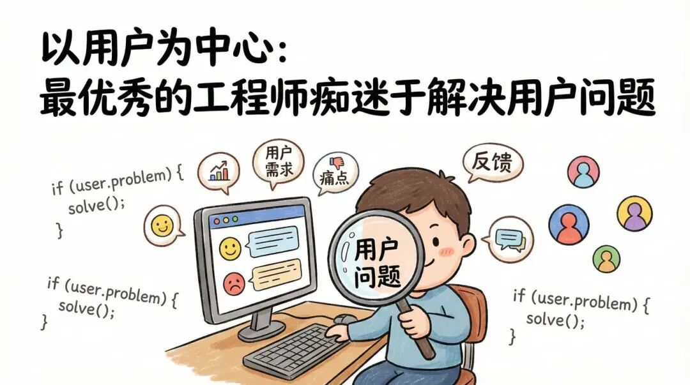
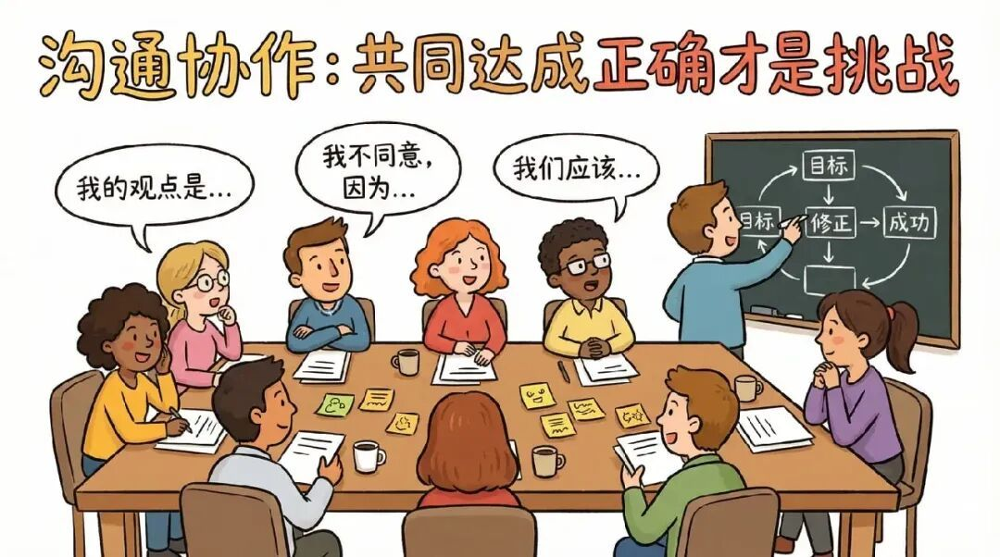
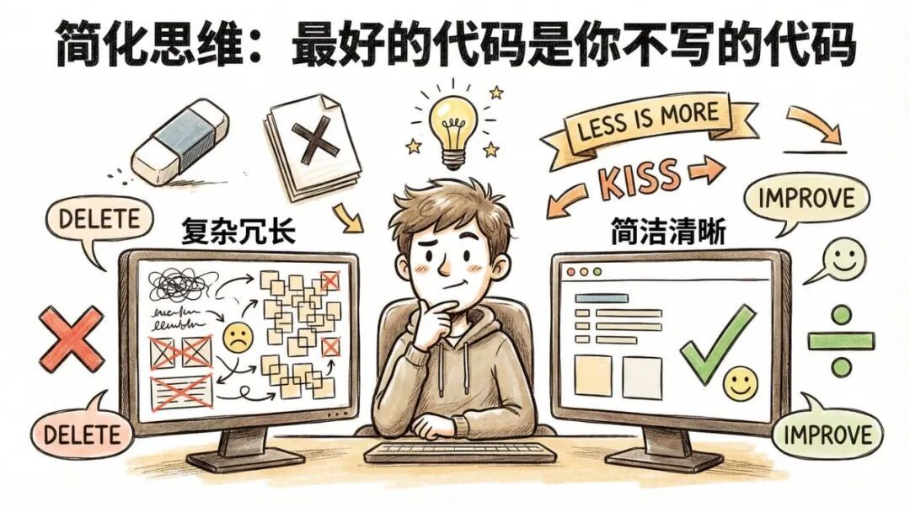

# 写给前端同学的 21 条职场教训

很多人以为在大厂工作，就是不停地写代码、解决技术难题。

**但事实是：真正成功的工程师并不是那些代码写得最好的人，而是那些解决了代码以外事情的人。**

本篇和你分享 21 条职场教训。

这些教训，有的能让你少走几个月的弯路，有的则需要数年才能完全领悟。

它们都与具体的技术无关，因为技术变化太快，根本无关紧要。

但这些教训，项目换了一个又一个，团队换了一批又一批，始终在重复上演。

希望能帮助到你：

## 1\. 最优秀的工程师都痴迷于解决用户问题

很多人容易爱上一项新技术，然后到处找地方用它。

我干过，你肯定也干过。

但真正创造最大价值的工程师是反过来的：

**他们专注于深入理解用户问题，并让解决方案从这种理解中自然而然地涌现。**

以用户为中心意味着花时间处理支持工单，与用户沟通，观察用户遇到的困难，不断追问“为什么”，直到找到问题的症结所在。

**真正理解问题的工程师往往会发现，优雅的解决方案比任何人预想的都要简单。**

工程师如果一开始就想着如何解决问题，往往会为了寻找理由而人为地增加复杂性。

## 2\. 正确很容易，共同达成正确才是真正的挑战

即使你在技术上胜券在握，最终也可能输掉项目。

我曾亲眼目睹一些才华横溢的工程师，自诩为房间里最聪明的人，但总是默默地积攒怨气。最终表现为“莫名其妙的执行问题”和“莫名其妙的阻力”。

**关键不在于证明自己正确，而在于参与讨论以达成对问题的共识。**

为他人创造发言空间，并对自己确信的观点保持怀疑。

## 3\. 行动优先，先做，再做对，再做好

追求完美会让人停滞不前。

我曾经见过工程师花几周讨论一个从没建过的东西的理想架构。

但完美的方案很少从思考中产生，它都是从与现实的碰撞中产生。

先做出来，再做对，再做得更好。

把丑陋的原型放到用户面前，写出乱糟糟的技术文档初稿，发布那个让你有点尴尬的 MVP。

从真实反馈中学到的内容，哪怕只有一周，也远比一个月的理论辩论多得多。

## 4\. 代码清晰远比炫技重要

我知道你想要写出酷炫的代码，那可以证明自己很牛逼。

但项目往往不止你一个人，以后还有其他同事要维护。

优化时要考虑他们的理解能力，而不是你的代码是否优美。

## 5\. 谨慎选择新技术

新技术就像贷款，你要用 bug、招聘困难和认知负担来还。

关键不在于“永远不要创新”，而在于“只在因创新可以带来独特报酬的领域进行创新”。其他的一切还是应该回归平庸。

## 6\. 你的代码不会替你说话，但人会

刚开始工作时，我相信是金子总会发光。

但我错了。

代码静静地躺在仓库里。你的领导在会议上提到你，或者没提。同事推荐你参与项目，或者推荐了别人。

在大公司，决策是在你没被邀请的会议上做出的，用的是你没写的总结，由只有五分钟时间和十二件事要处理的人做出的。

如果你不在场时没人能清楚说出你的价值，那你的价值就等于可有可无。

这不是让你鼓吹自己，而是告诉你：**你需要让你的价值被所有人看到。**

## 7\. 最好的代码是你根本不用写的代码

工程师文化崇拜创造。

没有人会因为删除代码而获得晋升，即使删除代码往往比添加代码更能改进系统。

**因为你不写的每一行代码，都意味着你永远不必调试、维护或解释。**

在动工之前，先仔细思考一下：“如果我们不做这件事会发生什么？” 有时答案是“没什么坏处”，那就是你的解决方案。

问题不是工程师不会写代码，而是我们太会写了，以至于忘了问：该不该写？

## 8\. 大规模时，连你的 bug 都有用户

用户多的时候，连你的 bug 都会有用户，这产生了一个职业级洞察：

你不能把兼容性工作当“维护”，把新功能当“真正的工作”。兼容性就是产品。

所以把你的“废弃”做成“迁移”，带上时间、工具和同理心。

## 9\. 慢实际上是因为不协调

项目进展缓慢时，人们的第一反应往往是责怪执行：员工不够努力、技术不成熟、工程师人手不足。

但通常来说，这些都不是真正的问题所在。

在大公司，团队是并发执行的基本单位，但随着团队数量的增加，协调成本呈几何级增长。

大多数效率低下实际上源于目标不一致——人们在做错误的事情，或者以不兼容的方式做正确的事情。

所以高级工程师花更多时间澄清方向、接口和优先级，而不是“写代码更快”，那些才是真正的瓶颈所在。

## 10\. 专注你能控制的，忽略你无法控制的

在大公司，无数的变数都超出你的掌控——组织架构调整、管理决策、市场变化、产品转型等等。

过度关注这些因素只会让你焦虑不安，却又无能为力。

所以高效的工程师，会锁定自己的影响圈。你控制不了是否会重组，但你能控制工作质量、如何应对、学到什么。

**这并非被动接受，而是策略性关注。**

**把精力浪费在无法改变的事情上，就等于浪费了原本花在可以改变的事情上的精力。**

## 11\. 抽象并不能消除复杂性

每一次抽象都是一种赌博，赌你不需要理解下面是什么。

有时候你会赢，但总会有漏洞，一旦出现漏洞，你就需要清晰地知道你站在什么上面。

**所以高级工程师即使技术栈越来越高，也要持续学习“更底层”的东西。**

## 12\. 写作让表达更清晰，以教带学是最快的学习方式

写作能带来更清晰的表达。

当我向别人解释一个概念——在文档里、演讲中、代码评审评论里、甚至和 AI 聊天，我都会发现自己理解上的不足。

所以如果你觉得自己懂了什么，试着简单地解释它。卡住的地方，就是你理解肤浅的地方。

## 13\. 注重粘合性工作

粘合性工作——例如写文档、帮新人上手、跨团队协调、流程优化——至关重要。

但如果你总是无意识地做这些，反而可能会拖慢技术成长，把自己累垮。

陷阱在于把它当“乐于助人”的活动，而不是当作有边界的、刻意的、可见的影响力。

尝试给它设时限，轮换做，把它变成产出物：文档、模板、自动化。

让它作为“影响力”被看见，而不是作为“性格特点”。

## 14\. 如果你赢得每一场辩论，你很可能是在积累无声的阻力

当人们不再和你争，不是因为你说服了他们，而是因为他们放弃了。

但他们会在执行中表达分歧，而不是在会议上。

所以真正的共识需要更长时间。你得真正理解别人的观点，吸收反馈，有时候需要你当众改变主意。

短期“我是对的”的快感，远不如长期和心甘情愿的合作者一起建设的现实来得珍贵。

## 15\. 当衡量标准变成目标时，它就停止了衡量

你暴露给管理层的每个指标，最终都会被博弈。

不是因为恶意，而是因为人会优化被度量的东西。

追如果你追踪代码行数，你会得到更多的代码行数。如果你追踪开发速度，你会得到过高的估算值。

高手的做法是：对每个指标请求都提供一对指标。一个用于衡量速度，一个用于衡量质量或风险。然后，坚持解读趋势，而不是盲目追求阈值。

**目标是洞察，而非监控。**

## 16\. 承认自己不知道的事情比假装自己知道更能带来安全感

资深工程师说“我不知道”并不是示弱——他们是在鼓励大家坦诚面对。

当领导者承认自己的不确定性时，就等于在暗示其他人也可以这样做。如果不这样的话，就会形成一种人人假装理解、问题被掩盖直到爆发的文化。

我见过团队里最资深的人从不承认自己不明白，我也见过由此造成的后果。问题不被问出来，假设不被挑战，初级工程师保持沉默因为他们以为别人都懂。

## 17\. 你的人脉关系比你拥有的任何一份工作都更长久

职业生涯早期，我专注于工作本身，忽视了人脉经营。回头看，这是个错误。

那些注重人脉关系的同事，在接下来的几十年里都受益匪浅。他们最先了解机会，更快地建立人脉，获得职位推荐，和多年来建立信任的人一起创业。

你的工作不会永远持续下去，但你的人脉网络却会一直存在。

以好奇心和慷慨的态度去拓展人脉，而不是抱着功利主义的心态。

当需要向前迈进的时候，往往是人际关系打开了这扇门。

## 18\. 大多数绩效的提升来自于减少工作量

当系统变慢时，人们的第一反应往往是加东西：加缓存、并行处理、使用更智能的算法。

有时候这样做是对的。

但我发现，通过询问“我们计算了哪些不必要的东西？”往往能带来更多性能提升。

**删除不必要的工作几乎总是比更快地完成必要的工作更有成效。最快的代码是永远不会运行的代码。**

所以在进行优化之前，先问问自己这项工作是否真的应该存在。

## 19\. 流程存在的目的是为了减少不确定性，而不是为了留下书面记录

最好的流程是让协调更容易、让失败成本更低。

最差的流程是官僚主义——它的存在不是为了帮忙，而是为了出事时推卸责任。

如果你无法解释一个个流程如何降低风险或提高清晰度，那么它很可能只是增加了额外开销。

如果人们花在记录工作上的时间比做工作的时间还多，那就说明出了大问题。

## 20\. 最终，时间会比金钱更有价值

刚开始工作的时候，你用时间换钱——这没问题。

但到了某个阶段，情况就完全不同了。你会开始意识到，时间才是不可再生资源。

我见过一些高级工程师为了晋升而累垮自己，只为了多拿几个百分点的薪酬。有些人确实升职了，但事后大多数人都在反思，自己放弃的一切是否值得。

答案不是“别努力工作”，而是“知道你在交易什么，并深思熟虑地进行交易”。

## 21\. 没有捷径，但有复利

专业技能源于刻意练习——略微超越现有水平，然后不断反思，不断重复。年复一年，没有捷径可走。

但令人欣慰的是：学习的进步在于创造新的选择，而不仅仅是积累新的知识。

写作——不是为了吸引眼球，而是为了清晰表达。构建可复用的基础模型。将过往的经验总结成行动指南。

所以如果工程师把职业生涯看作是复利投资，而不是彩票，那么他最终往往会取得更大的成就。

## 22\. 最后

21 条听起来很多，但它们可以归结为几个核心点：**保持好奇，保持谦逊，记住工作始终是关于人的——你的用户、你的队友。**

工程师的职业生涯足够长，可以犯很多错误。我最钦佩的工程师，不是那些什么都做对的人——而是那些从错误中学习、分享发现、并坚持不懈的人。

本篇整理自《21 Lessons From 14 Years at Google》，希望能帮助到你。

  

  

  

---

  

- 我是 ssh，工作 6 年+，阿里云、字节跳动 Web infra 一线拼杀出来的资深前端工程师 + 面试官，非常熟悉大厂的面试套路，Vue、React 以及前端工程化领域深入浅出的文章帮助无数人进入了大厂。
- 欢迎`长按图片加 ssh 为好友`，我会第一时间和你分享前端行业趋势，学习途径等等。2025 陪你一起度过！
- 
- 关注公众号，发送消息：
  
  指南，获取高级前端、算法**学习路线**，是我自己一路走来的实践。
  
  简历，获取大厂**简历编写指南**，是我看了上百份简历后总结的心血。
  
  面经，获取大厂**面试题**，集结社区优质面经，助你攀登高峰

因为微信公众号修改规则，如果不标星或点在看，你可能会收不到我公众号文章的推送，请大家将本**公众号星标**，看完文章后记得**点下赞**或者**在看**，谢谢各位！
