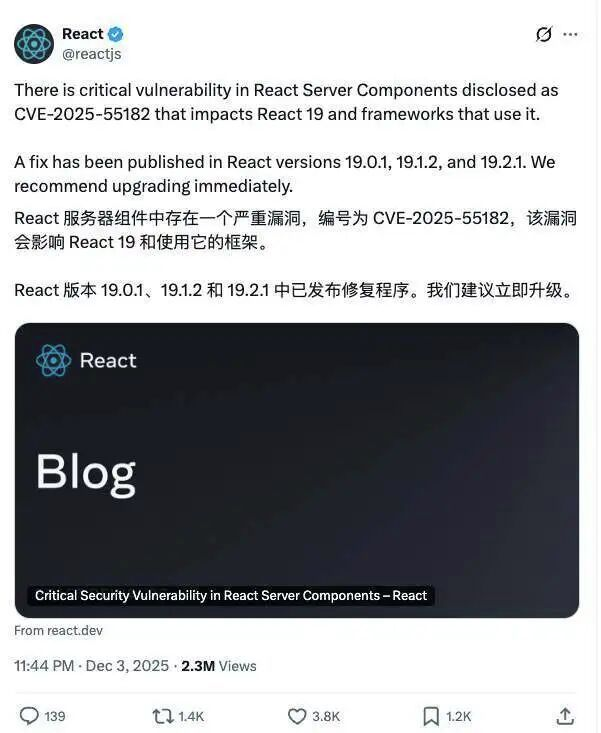
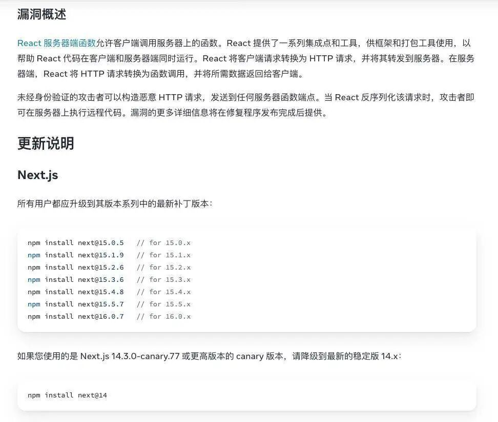
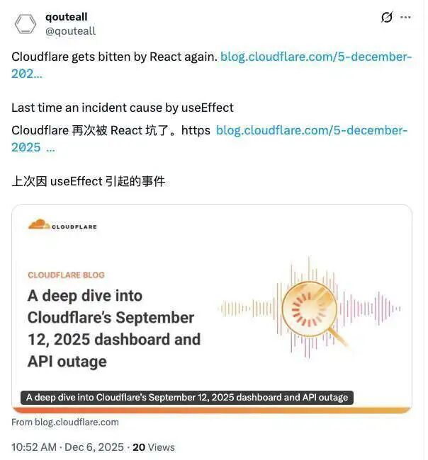
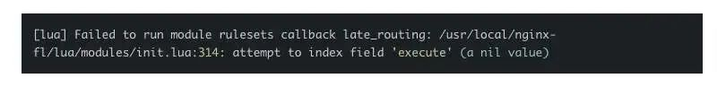
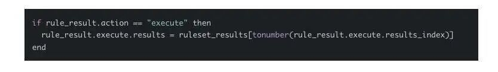
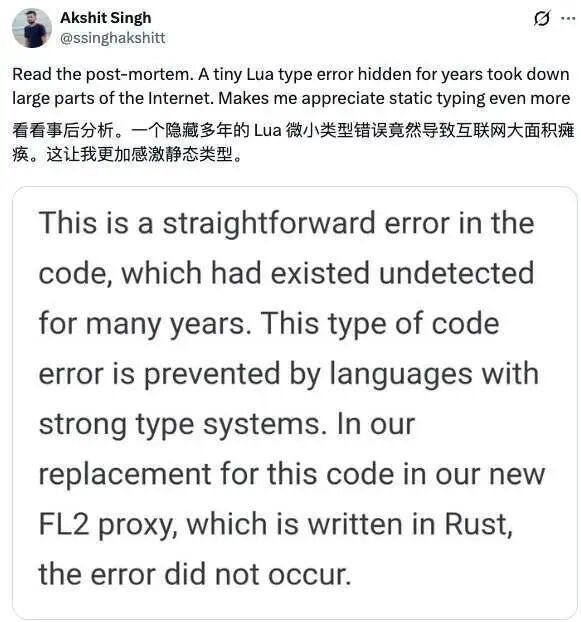

# Cloudflare被React坑了！两周内二次“翻车”：沉睡15年的老代码一招KO全球互联网，安全升级反酿史诗级宕机

作者 | Tina

短短 25 分钟，Cloudflare 全球 28% 的流量全线报错。没有黑客，没有攻击，却引发了堪比网络战的级别事故。

更糟的是——这是它两周内的第二次大规模宕机。

根据 Cloudflare 公开说明，本次故障并非源于网络攻击或恶意行为，而是一起由内部安全加固操作意外引发的链式技术事故。起点是近期披露的一项行业级安全漏洞：React Server Components 相关的严重问题（CVE-2025-55182）。

为帮助使用 React / Next.js 的客户抵御潜在攻击，Cloudflare 开始调整其 Web 应用防火墙（WAF）的请求体解析逻辑。

在正常情况下，Cloudflare 的代理会将 HTTP 请求体内容缓存在内存中，以便 WAF 对请求进行检测和拦截。故障发生前，该缓冲区的默认大小为 128KB。为更好适配 Next.js 默认允许的 1MB 请求体上限，并提升对恶意载荷的检测覆盖率，Cloudflare 通过渐进式发布系统，将缓冲区上限从 128KB 提升至 1MB。这一步骤本身运行平稳，未直接导致故障。

问题出现在随后的“第二个动作”上：在发布过程中，Cloudflare 发现内部 WAF 测试工具暂不支持更大的缓冲区。由于该工具仅用于内部测试，且不会影响真实客户流量，工程团队决定短期内直接关闭这一测试功能。

这一变更并非通过渐进式机制发布，而是通过 Cloudflare 的全局配置系统在数秒内传播至全球服务器集群。该全局系统在 11 月 18 日事故后已进入审查阶段，但尚未完成改造。

正是这一全局配置变更，在旧版本 FL1 代理上触发了一个长期潜伏的 bug，从而出现以下 Lua 异常：

运行时错误解析

Cloudflare 的 rulesets 系统由一组规则组成，每个进入系统的请求都会触发这些规则。规则由两部分构成：

- 一个**过滤器**（filter），用于选择流量
- 一个**动作**（action），对流量施加影响

常见 action 包括 “block”、“log”、“skip”等。另外还有 “execute”，用于触发对另一组规则的执行。

Cloudflare 的内部日志和测试系统正是通过 “execute” 来预评估新规则：顶层规则集会调用一个包含测试规则的子规则集，这也是此次 Cloudflare 希望临时关闭的部分。

为快速关闭异常规则，Cloudflare 在 rulesets 中引入了 killswitch 子系统，依托前述全局配置系统，可以紧急停用某条规则。过去，Cloudflare 多次利用这一机制缓解故障，形成了明确的标准操作流程。

然而，官方披露称，此前从未对 action 为 “execute” 的规则使用过 killswitch。当 killswitch 作用于此类规则时，执行路径出现了预料之外的情况：引擎按照设想跳过了该规则的 execute 动作，没有继续执行其指向的子规则集，但后续汇总规则执行结果的代码逻辑仍然假定 `rule_result.execute` 对象一定存在。相关代码大致如下：

在规则被 killswitch 跳过的情况下，`rule_result.execute` 实际上为 nil，对该字段继续取值即触发 Lua 运行时错误：

> attempt to index field 'execute' (a nil value)

一旦触发异常，FL1 代理直接向客户端返回 HTTP 500 错误。这也是为何受影响网站在事故期间几乎所有请求都出现 500 的原因。

需要指出的是，这段问题 Lua 代码仅存在于旧版 FL1 代理。Lua 早在 **1993 年发布**，到 **2008 年已是成熟的轻量级语言**，Cloudflare 成立于 2009 年、2010 年上线后，在其网络堆栈中大量采用 Lua。

Cloudflare 表示，在其新一代 FL2 代理中，这部分逻辑已用 Rust 等强类型语言重写，可以在编译阶段防止类似空指针类错误，因此本次故障并未波及 FL2 代理承载的流量。

从影响范围看，并非所有 Cloudflare 客户都受到波及。官方披露，本次事故仅影响同时满足两个条件的站点：一是其流量仍由旧版 FL1 代理承载；二是启用了 Cloudflare 的托管规则集（Cloudflare Managed Ruleset）。处于上述配置之下的网站，其正常请求在事故期间基本都会返回 HTTP 500，仅极少数测试端点（例如 `/cdn-cgi/trace`）例外。采用其他配置的客户，以及由中国大陆网络提供服务的客户，并未受到影响。

这起事件与 11 月 18 日发生的那起可用性事故在模式上具有高度相似性：两次都源起于为客户缓解安全问题而进行的配置或代码变更；变更通过全局系统快速传播至整个网络；最终在某一旧链路或边缘逻辑上触发错误，造成广泛服务中断。Cloudflare 在此前事故之后曾向客户承诺，将改造其配置发布和回滚机制，避免“单点变更引发全网级连锁反应”。但从这次结果来看，关键工程改造尚未完成，即遭遇新的考验。

针对这两起事故，Cloudflare 已将一系列韧性工程项目列为全公司优先级，包括：

其一，强化发布与版本控制体系。未来不仅软件发布需携带严格的健康检查、灰度控制和快速回滚机制，所有用于安全响应与配置的关键数据，也需纳入同样的发布管控流程，限制“爆炸半径”。

其二，精简并强化所谓“break-glass” 应急机制，确保在更多故障场景下，内部运维团队仍能通过可靠通道执行关键操作，这一原则同样适用于客户使用的控制面接口。

其三，在数据平面全面推广 “fail-open” 容错策略：当配置文件损坏或参数越界时，系统应优先记录错误并回退到已知安全状态，或以「不打分但放行流量」的方式继续转发请求，而非简单地直接返回错误。部分服务未来还将为客户提供在特定场景下选择 fail-open 或 fail-close 的配置选项，并通过防漂移机制确保策略持续生效。

Cloudflare 表示，将在近期公布更为详尽的韧性工程进展报告。在此之前，公司已冻结所有网络层面的变更操作，以降低在改造完成前再次出现类似全网级事故的风险。

今日好文推荐

[全球前端岗位招聘需求断崖下降 9.89%，前端的未来究竟在哪里？](https://mp.weixin.qq.com/s?__biz=MzUxMzcxMzE5Ng==&mid=2247526386&idx=1&sn=e67f786252a6b088d62c6994a014a8a2&scene=21#wechat_redirect)

[完整前端代码突然公开？苹果把App Store“老底”都揭了，开发者社区炸锅！](https://mp.weixin.qq.com/s?__biz=MzUxMzcxMzE5Ng==&mid=2247526357&idx=1&sn=6ef10df8180a60a78224c93566659990&scene=21#wechat_redirect)

[小鹏IRON“脱皮证非人”、字节豪掷800多亿，人形机器人竞争太激烈啦！](https://mp.weixin.qq.com/s?__biz=MjM5MDE0Mjc4MA==&mid=2651262597&idx=1&sn=a0c6cc96270d8cda5a59d5d034a50a7c&scene=21#wechat_redirect)

[黄仁勋、李飞飞、Yann LeCun等六位AI顶级大佬最新对话：AI到底有没有泡沫？](https://mp.weixin.qq.com/s?__biz=MjM5MDE0Mjc4MA==&mid=2651262532&idx=1&sn=50244267d5cfc148383e7be37512cc3a&scene=21#wechat_redirect)

会议预告

12 月 19～20 日，AICon 2025 年度收官站在北京举办。现已开启 9 折优惠。

两天时间，聊最热的 Agent、上下文工程、AI 产品创新等等话题，与头部企业与创新团队的专家深度交流落地经验与思考。2025 年最后一场，不容错过。

