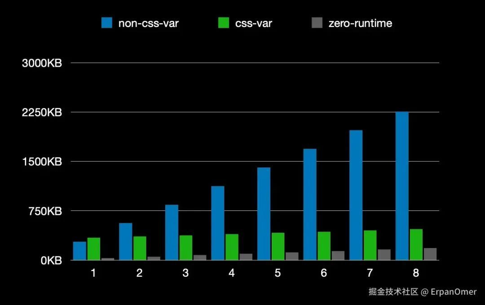
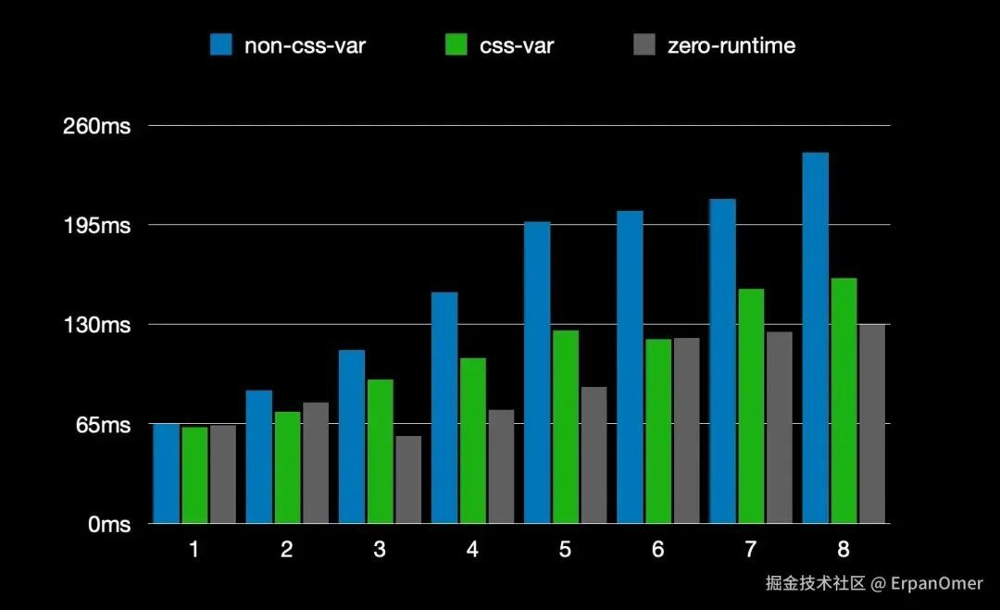
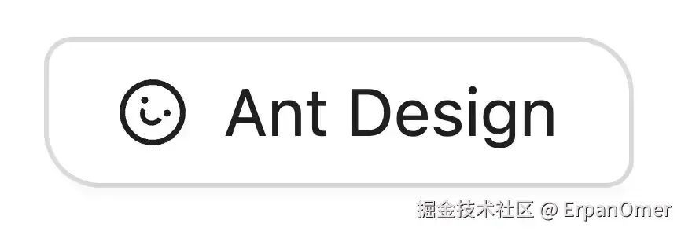
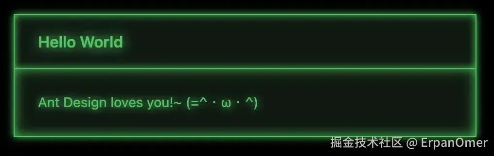
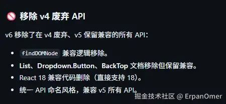

# Ant Design 6.0 来了！这一次它终于想通了什么？

点击上方 程序员成长指北，关注公众号

回复1，加入高级Node交流群

大家好😁。

还记得我之前那篇吐槽《当 Ant Design 成了你最大的技术债\[1\]》的文章吗😂？在那篇文章里，我痛斥了 Antd 的黑盒样式、难以覆盖的 `!important` 地狱，以及臃肿的 CSS-in-JS 运行时性能。

当时有很多朋友在评论区说：**国内做 B 端，离不开它**。

前天，Ant Design 6.0 正式发布了。带着审视（甚至是一点点找茬🤔）的心态，我仔细翻阅了 Release Note\[2\] 和源码。

看完之后，我沉默了片刻，然后想说一句：**这一次，Ant Design 好像真的听懂了我们的骂声。它正在试图撕掉笨重的标签，向现代前端开发范式（Tailwind、Headless）发起一次自我更新。**

今天，我就以一个老用户的视角，来聊聊 Antd 6.0 到底改了什么，以及作为技术组长，我怎么看待这次升级🤷‍♂️。

#### **告别运行时，拥抱 CSS Variables**

在 v5 版本，Antd 引入了 CSS-in-JS。虽然它解决了按需加载的问题，但带来的运行时性能损耗和样式插入延迟，一直是性能敏感型项目的噩梦😭。

**v6 做了一个极其正确的决定：默认采用纯 CSS Variables模式，并且支持零运行时（Zero Runtime）。**

这意味着什么？

**性能大翻身**：浏览器原生支持 CSS 变量，不再需要 JS 去计算和插入样式。根据官方的对比图，Zero Runtime 模式下的性能表现是最佳的。这也意味着，我们那臃肿的 JS Bundle 终于可以瘦身了。



image.png



image.png

**主题切换秒变**：以前切换暗色模式，可能需要 JS 重新计算一堆 Token。现在？只需要改变根节点的几个 CSS 变量值，浏览器瞬间完成渲染。

**拥抱 React 19**：这次升级开启了 React Compiler 支持，并且彻底移除了对 React 16/17 的兼容代码，轻装上阵。

这才是 2025 年组件库该有的样子。CSS 的事情，就该让 CSS 去做，JS 别管太宽🤔。

#### **全量组件语义化**

这是我最兴奋的一点😁。

以前我们想改一个 `Modal` 的样式，得去浏览器里扒 `ant-modal-content`、`ant-modal-header` 这种类名，然后写一堆高权重的 CSS 去覆盖。

**v6 完成了所有组件的 DOM 语义化改造。**

它引入了 `classNames` 和 `styles` 属性（这就很有 Headless UI 的味道了🤔），允许你精准地把样式注入到组件的内部结构中。

比如，你想做一个俏皮风格的按钮，或者一个极客风的卡片，你不再需要写恶心的 CSS Selector，而是可以直接这样写：

```
// 简直是 Tailwind 玩家的福音
<Button
  classNames={{
    root: 'rounded-tr-xl rounded-bl-xl', // 直接写 Tailwind 类名！
    icon: 'rotate-30',
  }}
  icon={<SmileOutlined />}
>
  Ant Design
</Button>
```


image.png

**极客风卡片样式和效果**

```
<Card
  title="Hello World"
  classNames={{
    root: "bg-green-300/10 text-green-500 border-green-500 rounded-none [box-shadow:0_0_8px_theme(colors.green.500)]",
    header: "rounded-none border-green-500 [box-shadow:inset_0_0_8px_theme(colors.green.500)]",
    title:
      "text-green-500 [text-shadow:0_0_12px_theme(colors.green.400)] overflow-visible",
      body: "rounded-none [text-shadow:0_0_8px_theme(colors.green.400)] [box-shadow:inset_0_0_12px_theme(colors.green.500)]"
  }}
>
  Ant Design loves you!~ (=^・ω・^)
</Card>
```


image.png

Antd 终于意识到，它不能只做写死的积木，它得提供接口。这对于追求 UI 个性化的团队来说，绝对是史诗级利好👍👍👍。

#### **IE 走好，不送**


Suggestion.gif

Antd 6.0 做了一个非常硬气的决定：**彻底移除对 IE 的支持。**

同时，React 的最低版本要求提升到了 \*\*React 18!\*\*。

这可能对一些维护古董项目的团队是坏消息，但对于整个前端生态来说，这是大快人心的。我们终于不需要为了那 1% 的 IE 用户，去背负沉重的 polyfill 和 hack 代码了。

#### **Ant Design X 2.0**

除了一些基础库的升级，这次还有一个重磅消息：\*\*Ant Design X 2.0 同步发布\[3\]\*\*。

现在哪个 B 端产品不加点 AI 功能？Chat 界面、流式输出、提示词输入... 这些东西要是自己从头写，非常费劲。

Ant Design X 就是专门解决这个问题的。它不仅仅是 UI，更包含了一套面向 AI 场景的交互逻辑。

前端的战场正在从 CRUD 系统转向 AI 交互界面。Antd 这一步棋，走得很稳👍。

#### **升级建议：要不要冲？🤔**

作为技术组长，我不建议盲目升级，但我建议你**认真评估**。

**如果你是 v5 用户：直接冲！** 官方承诺是平滑迁移，无需 codemod，直接升级即可。你能立刻获得性能提升和 CSS 变量的红利。

**如果你是 v4 用户**：v6 移除了 v4 的废弃 API。这依然是一次断崖式的升级，成本较高。建议先升级到 v5 过渡，或者在新项目中直接使用 v6。



image.png

**如果你还在维护 IE 项目**：留在 v5 吧，v5 进入了 1 年的维护周期，足够你养老了😖。

Ant Design 已经 10 岁了🫅。

在一个技术栈迭代快如闪电的时代，一个库能活 10 年，并且还能在第 10 年做出 v6 这样推倒重来式的革新，是值得赞扬的👍👍👍。

虽然我依然推崇 Tailwind + Headless UI 的灵活性，但 Ant Design 6.0 让我看到了重型组件库的另一种可能性——**它在努力变轻，努力变开放，努力适应 AI 时代。**

也许，它不再是我最大的技术债，而重新变成了那个可以信赖的老伙计😁。

**你们怎么看这次 Antd 6.0 的升级？**

> 作者：ErpanOmer
> 
> 链接：https://juejin.cn/post/7575810396202287138

Node 社群
