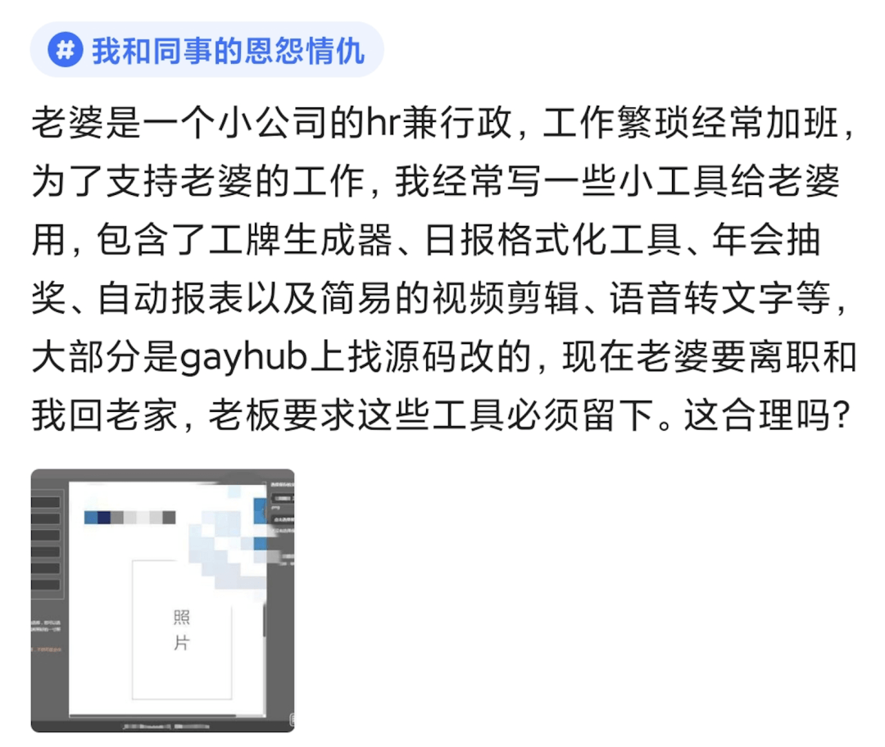

# “老婆在小公司，工作繁琐常加班，我常写些小工具给她用。老婆提离职，老板却要求必须留下工具，这合理么？”

> 转自：程序员的那些事

？？？

私以为这肯定不合理呀。

1、这些小工具是“我”在私人时间开发的，即便是基于开源项目，那它们的所有权归属于我，和“公司”没关系。（毕竟“我”又不是公司员工，也没拿公司一分钱报酬 ）

2、这些小工具是“我”为了帮“老婆”减轻负担才开发的，是小两口之间的支持，并不是公司的工作产出，老板的要求属于强人所难。

想留下也行，价格给到位再说。不过看发帖人的描述，“老板”大概是想白嫖了。还是尽早拜拜得了。 
