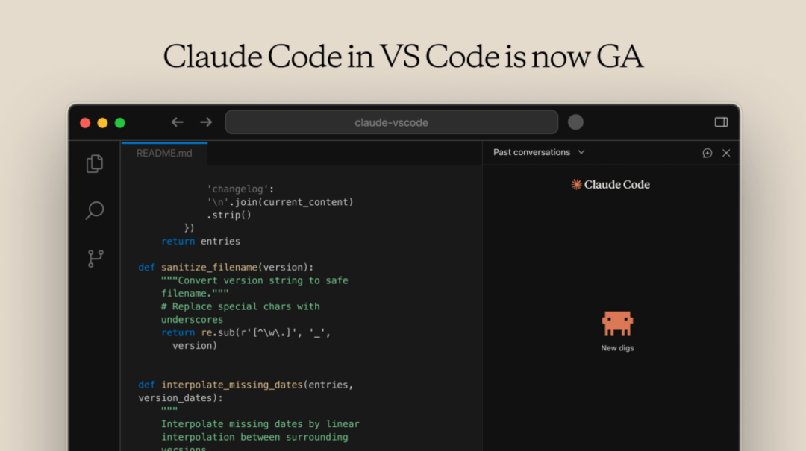
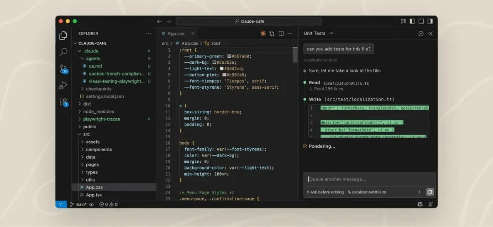

# VS Code 正式集成 Claude Code 插件，前端开发效率大提升！

Anthropic 官宣，Claude Code 专属 VS Code 扩展正式全量发布。该扩展为 Claude Code 提供原生可视化界面，无缝嵌入编辑器，是官方推荐的 IDE 调用方式。

功能上，用户可手动审阅或自动采纳AI代码优化建议。支持@语法关联文件特定行，回溯对话历史，多标签页可便捷管理并行对话。

权限支持 Normal、Plan、Auto-accept 三种模式，通过 claudeCode.initialPermissionMode 配置初始状态，平衡便捷与安全。

扩展可与CLI深度联动，终端内即可调用命令，与~/.claude/settings.json 共享配置及对话记录。支持 claude --resume 续会、/ide 对接外部终端，拓展使用场景。

## Claude Code for VS Code 功能特性

- **全量AI模型支持**：适配 Pro/Max/Team/Enterprise 订阅及按需付费，可调用Anthropic最新Claude模型。
- **智能协同开发**：获用户授权后，可遍历代码仓库、读写代码、执行终端命令，高效配合开发。
- **轻量化交互界面**：全新设计简化操作入口，新手与资深开发者均可快速上手。
- **深度编辑器融合**：识别选中内容，在编辑器内直接生成修改建议，无需切换窗口。
- **强化Agent能力**：支持 subagent、自定义斜杠命令等进阶功能，部分配置需通过CLI完成。

**下载地址：**

下载地址：https://marketplace.visualstudio.com/items?itemName=anthropic.claude-code

使用文档：https://code.claude.com/docs/en/vs-code

## 结语

我是林三心，一个待过**小型toG型外包公司、大型外包公司、小公司、潜力型创业公司、大公司**的作死型前端选手

我建了一些**前端学习群**，如果大家想进群交流前端知识，可以关注我，回复**加群**

