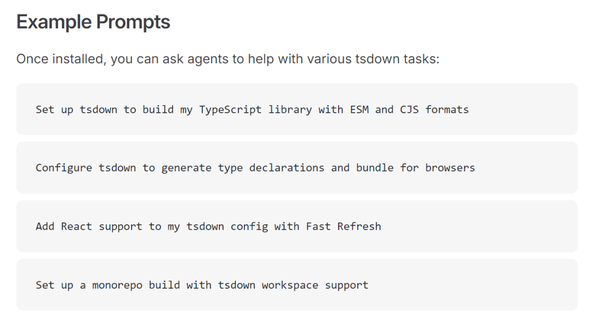

# Typescript 最强打包工具，正式发布 AI 版本！更快更顺滑！

tsdown 为 AI 编码助手提供官方 Skills，助力其在协助你开发 TypeScript 类库时，精准掌握 tsdown 的配置方式、核心特性与最佳实践。


## 安装步骤

为你的 AI 编码助手安装 tsdown 技能包，执行以下命令即可：

```
npx skills add rolldown/tsdown
```
该技能包的源码可参考此地址。

## 示例指令

安装完成后，你可直接向 AI 编码助手下达指令，让其协助完成各类 tsdown 相关开发任务，示例如下：

- Set up tsdown to build my TypeScript library with ESM and CJS formats
- Configure tsdown to generate type declarations and bundle for browsers
- Add React support to my tsdown config with Fast Refresh
- Set up a monorepo build with tsdown workspace support



> 文档地址：https://tsdown.dev/guide/skills

## 技能包核心能力

本 tsdown 技能包为 AI 编码助手赋能以下核心知识点，覆盖开发全场景：

1. 配置文件的格式规范、各类配置项说明及工作区的使用方法
2. 入口文件配置、输出格式选型与类型声明文件的生成方案
3. 项目依赖的管理策略与自动外部化处理逻辑
4. 主流前端框架适配支持（React、Vue、Solid、Svelte）
5. 插件、钩子函数的使用方式及程序化 API 的调用方法
6. 命令行工具（CLI）的所有指令及实际使用规范

### tsdown 是什么&核心用途

tsdown 是 **Rolldown 生态下专为前端打造的 TypeScript 类库构建工具**，轻量高效，全程围绕 TS 类库开发做了专属优化，是前端开发 TS 类库的专属构建方案。

核心用途：

1. 一键构建 ESM/CJS 等主流模块化产物，还能打包适配浏览器的产物；
2. 自动生成 TS 类型声明文件（.d.ts），省去手动配置类型构建的步骤；
3. 内置依赖自动外部化、React/Vue/Solid 等框架适配，无需复杂额外配置；
4. 支持 monorepo 工作区、React Fast Refresh 等特性，适配单包/多包 TS 库开发；
5. 提供简洁的 CLI 和可编程 API，配置灵活，大幅降低 TS 类库的构建成本。

### tsdown 基本使用方法

#### 1\. 项目内安装（核心，推荐局部安装）

在 TypeScript 库项目中执行命令，完成 tsdown 安装：

```
# npm
npm install tsdown -D
# yarn/pnpm
yarn add tsdown -D
pnpm add tsdown -D
```
#### 2\. 初始化配置（一键生成，无需手写）

执行初始化命令，自动生成 tsdown 专属配置文件 `tsdown.config.ts`（含基础配置项，可直接修改）：

```
npx tsdown init
```
#### 3\. 核心 CLI 命令（日常开发够用）

```
# 生产构建：生成 ESM/CJS 产物+类型声明，默认打包至 dist 目录
npx tsdown build
# 开发模式：热更新+实时构建，适配 React Fast Refresh 等特性
npx tsdown dev
# 查看所有命令/配置帮助
npx tsdown --help
```
#### 4\. 极简配置示例（tsdown.config.ts）

初始化后的配置可按需精简，以下是最常用的基础配置，满足大部分 TS 库开发需求：

```
import { defineConfig } from 'tsdown'

export default defineConfig({
  entry: './src/index.ts', // 项目入口文件
  output: {
    format: ['esm', 'cjs'], // 输出 ESM/CJS 双格式
    dts: true, // 自动生成 .d.ts 类型声明
  },
  external: ['react', 'vue'], // 手动指定外部依赖（也可依赖自动外部化）
})
```
## 结语

我是林三心，一个待过**小型toG型外包公司、大型外包公司、小公司、潜力型创业公司、大公司**的作死型前端选手

我建了一些**前端学习群**，如果大家想进群交流前端知识，可以关注我，回复**加群**


