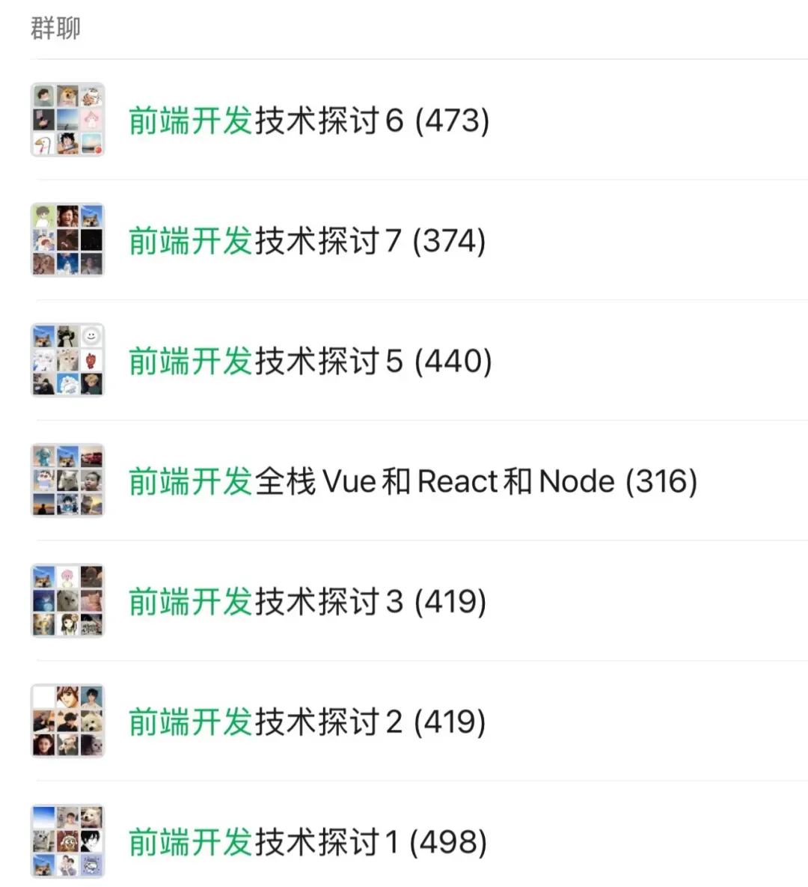

# Pinia 推倒，重做！Vue开发者有福了！

Pinia 已彻底取代Vuex成为状态管理的首选方案。但状态集中管理的便利性背后，也隐藏着用户“手滑误操作”的风险——表单内容意外清空、画布元素误删、配置参数被覆盖，这些场景都可能让用户体验大打折扣。

而pinia-undo插件的出现，正是为了解决这一痛点，给任意Pinia Store一键注入撤销/重做能力，实现状态的“时间旅行”。

## 一、pinia-undo核心特性：轻量且灵活的状态回溯工具

pinia-undo是一款开箱即用的Pinia插件，核心优势在于“零侵入、高灵活、广兼容”，仅需极少配置就能为项目赋能：

- **零侵入式集成**：无需修改原有Store的state、action逻辑，插件自动注入核心方法，不干扰现有业务代码。
- **核心能力内置**：自动为每个Store添加undo()（撤销至上一状态）、redo()（重做被撤销状态）方法，以及只读的history历史栈，同时提供canUndo、canRedo属性判断是否可执行对应操作，避免异常。
- **极致轻量化**：仅依赖1个包，gzip压缩后体积不足2KB，不会给项目带来性能负担。
- **全场景兼容**：同时支持Vue2与Vue3，适配Pinia 2.0+版本，且历史栈存储在客户端，不影响服务端渲染（SSR）。
- **高度可配置**：支持忽略指定状态字段、临时关闭历史跟踪、自定义状态序列化逻辑，适配复杂业务场景。

## 二、3分钟快速上手：从安装到实战

pinia-undo的使用门槛极低，从安装到实现撤销/重做功能，仅需4步即可完成。

### 1\. 安装依赖

使用包管理工具安装插件，同时确保项目已引入Pinia：

```
pnpm add pinia-undo
# 或 npm install pinia-undo / yarn add pinia-undo
```
### 2\. 全局注册插件

在Pinia实例创建后注册插件，一行代码即可实现全局生效，所有Store将自动获得撤销/重做能力：

```
// main.ts
import { createApp } from 'vue'
import { createPinia } from 'pinia'
import { PiniaUndo } from 'pinia-undo'
import App from './App.vue'

const app = createApp(App)
const pinia = createPinia()
pinia.use(PiniaUndo) // 注册插件
app.use(pinia).mount('#app')
```
### 3\. 定义常规Store

按照Pinia原生语法定义Store，无需额外修改，插件会自动增强Store能力：

```
// stores/counter.ts
import { defineStore } from'pinia'

exportconst useCounterStore = defineStore('counter', {
  state: () => ({
    count: 10,
    name: 'Pinia'
  }),
  actions: {
    increment() {
      this.count++
    },
    decrement() {
      this.count--
    }
  }
})
```
### 4\. 组件中调用能力

在组件中直接调用Store的undo()、redo()方法，结合canUndo、canRedo控制按钮状态，提升交互体验：

```
<script setup>
import { useCounterStore } from '@/stores/counter'
const counterStore = useCounterStore()
</script>

<template>
  <h1>当前计数：{{ counterStore.count }}</h1>
  <button @click="counterStore.increment">+1</button>
  <button @click="counterStore.decrement">-1</button>

  <div class="undo-redo" style="margin-top: 20px;">
    <button 
      @click="counterStore.undo()" 
      :disabled="!counterStore.canUndo"
    >
      ↶ 撤销
    </button>
    <button 
      @click="counterStore.redo()" 
      :disabled="!counterStore.canRedo"
    >
      ↷ 重做
    </button>
  </div>
</template>
```
提示：当处于历史栈顶或栈底时，undo()、redo()会自动执行空操作，不会抛出异常，无需额外捕获错误。

## 三、高阶玩法：适配复杂业务场景

pinia-undo提供丰富的配置选项，可根据业务需求灵活定制，解决特殊场景下的状态跟踪问题。

### 1\. 忽略敏感或无需跟踪的字段

对于loading、updatedAt等临时状态或辅助字段，可通过undo.omit配置忽略，避免冗余的历史记录：

```
// stores/form.ts
export const useFormStore = defineStore('form', {
  state: () => ({
    name: '',
    age: 0,
    loading: false // 无需跟踪的加载状态
  }),
  undo: {
    omit: ['loading'] // 忽略loading字段的状态变化
  }
})
```
### 2\. 临时关闭历史跟踪

执行批处理操作（如批量更新数据）时，若不想生成中间态历史，可临时禁用历史跟踪，操作完成后重新启用：

```
// stores/canvas.ts
exportconst useCanvasStore = defineStore('canvas', {
  state: () => ({
    elements: []
  }),
  undo: { disable: false }, // 默认开启跟踪
  actions: {
    batchAddElements(newElements) {
      // 临时关闭历史跟踪
      this.$pinia.state.value.canvas.__UNDO_DISABLE = true
      // 执行批量操作
      this.$patch((state) => {
        state.elements.push(...newElements)
      })
      // 重新开启跟踪
      this.$pinia.state.value.canvas.__UNDO_DISABLE = false
    }
  }
})
```
### 3\. 自定义状态序列化

当state中包含Map、Set、Dayjs等无法通过JSON直接序列化的对象时，可自定义serializer配置，适配复杂数据类型：

```
// stores/advanced.ts
import devalue from'@nuxt/devalue'

exportconst useAdvancedStore = defineStore('advanced', {
  state: () => ({
    userInfo: new Map(),
    updateTime: newDate()
  }),
  undo: {
    serializer: {
      serialize: devalue, // 使用devalue序列化复杂对象
      deserialize: (str) =>eval(`(${str})`) // 逆向解析
    }
  }
})
```
插件GitHub地址：https://github.com/wobsoriano/pinia-undo

## 结语

我是林三心，一个待过**小型toG型外包公司、大型外包公司、小公司、潜力型创业公司、大公司**的作死型前端选手

我建了一些**前端学习群**，如果大家想进群交流前端知识，可以关注我，回复**加群**


