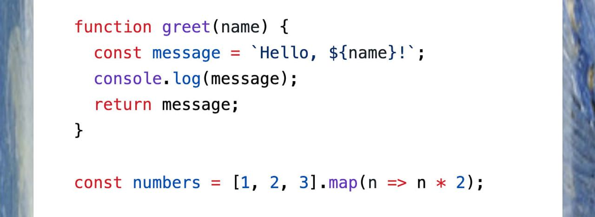
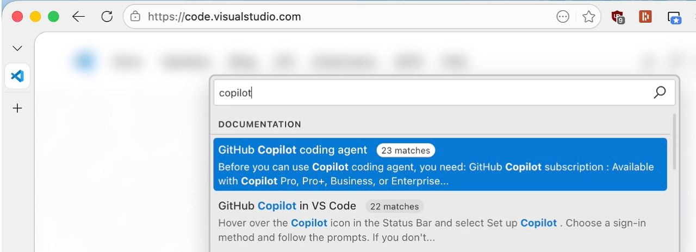

# A big week for jQuery

#​769 — January 20, 2026

[Read on the Web](https://javascriptweekly.com/issues/769)

  
- [jQuery 4.0 Released](https://blog.jquery.com/2026/01/17/jquery-4-0-0/ "blog.jquery.com") — 20 years on from its original release, the ever-popular ([in terms of actual usage](https://w3techs.com/technologies/details/js-jquery)) library reaches 4.0 with a migration to ES modules (compatible with modern build tools) along with dropping support for IE 10 and older. With jQuery being a popular guest in our newsletters in the early years, it’s fantastic to see it pop back for a quick visit. **_\--- Timmy Willison_**

> 💡 If you're using jQuery, you'll find [jQuery Migrate](https://github.com/jquery/jquery-migrate/), an official tool to help you upgrade, useful. jQuery in 2026 is a somewhat legacy choice, though, and [you might not need jQuery](https://youmightnotneedjquery.com/) at all..

  
- [Add Excel-like Spreadsheet Functionality to Your JavaScript Apps](https://developer.mescius.com/spreadjs?utm_source=CooperPress&utm_medium=JavaScript-Weekly&utm_campaign=SpreadJS-JS-Weekly-Primary-Sponsor-Jan-2026 "developer.mescius.com") — SpreadJS is the industry-leading JavaScript spreadsheet for adding advanced spreadsheet features to your enterprise apps. Build finance, analysis, budget, and other apps. Excel I/O, 500+ calc functions, tables, charts, and more. [View demos now](https://developer.mescius.com/spreadjs?utm_source=CooperPress&utm_medium=JavaScript-Weekly&utm_campaign=SpreadJS-JS-Weekly-Primary-Sponsor-Jan-2026). **_\--- SpreadJS from MESCIUS inc sponsor_**
  
- [Astro is Joining Cloudflare](https://blog.cloudflare.com/astro-joins-cloudflare/ "blog.cloudflare.com") — Big news in the Web framework space as the team behind [the popular Astro framework](https://astro.build/) (_[the beta of v6.0](https://astro.build/blog/astro-6-beta/) is now available_) is headed to Cloudflare. Few major frameworks are now _not_ under the wing of a larger entity. **_\--- Schott and Irvine-Broque_**

**IN BRIEF:**

- 🕒 [Temporal Playground](https://temporal-playground.vercel.app/) is an online sandbox for playing around with the [Temporal API.](https://developer.mozilla.org/en-US/docs/Web/JavaScript/Reference/Global_Objects/Temporal)
- Svelte has released patches for [five vulnerabilities affecting the Svelte ecosystem.](https://svelte.dev/blog/cves-affecting-the-svelte-ecosystem)
- 🤖 Ryan Dahl, creator of both Node.js and Deno, [says on _X_](https://x.com/rough__sea/status/2013280952370573666) that _"the era of humans writing code is over"_ and _"That's not to say SWEs don't have work to do, but writing syntax directly is not it."_ I hope not, but these are interesting times!

**RELEASES:**

- [Electron 40.0](https://www.electronjs.org/blog/electron-40-0) – The popular cross-platform desktop app framework upgrades to Chromium 144, V8 14.4, and Node 24.11.1.
- [Node.js v25.4.0 (Current)](https://nodejs.org/en/blog/release/v25.4.0) – `require(esm)` is now marked as stable.
- [React Native Windows 0.81](https://devblogs.microsoft.com/react-native/%f0%9f%9a%80react-native-windows-v0-81-is-here/), [Aurelia 2 RC](https://aurelia.io/blog/2026/1/14/aurelia-2-release-candidate/), [Deno 2.6.5](https://github.com/denoland/deno/releases/tag/v2.6.5)

## 📖  Articles and Videos

  
- [ASCII Characters Are Not Pixels: A Deep Dive Into ASCII Rendering](https://alexharri.com/blog/ascii-rendering "alexharri.com") — Alex digs _deep_ into getting ASCII-based graphics rendering just right with JavaScript, complete with examples of the algorithms used and numerous demos. The neatest technical blog post I’ve seen so far this year. **_\--- Alex Harri_**
  
- [JavaScript Now a First-Class Citizen in Aspire](https://devblogs.microsoft.com/aspire/aspire-for-javascript-developers/ "devblogs.microsoft.com") — [Aspire](https://aspire.dev/) is a Microsoft framework for orchestrating the deployment of distributed apps. Originally just for .NET, [Aspire 13](https://aspire.dev/whats-new/aspire-13/) now makes JavaScript a first-class citizen, so you can run Vite and full-stack JS apps with service discovery, telemetry, and production-ready containers. **_\--- Microsoft_**
  
- [Breakpoints and `console.log` Is the Past, Time Travel Is the Future](https://wallabyjs.com/?utm_source=cooperpress&utm_medium=javascriptweekly&utm_content=javascriptweekly "wallabyjs.com") — 15x faster JavaScript debugging than with breakpoints and console.log, supports Vitest, jest, Karma, Jasmine, and more. **_\--- Wallaby Team sponsor_**
  
- [Introducing the `<geolocation>` Element](https://developer.chrome.com/blog/geolocation-html-element "developer.chrome.com") — Chrome 144 introduces a new `<geolocation>` element for requesting user location data, moving away from a JavaScript-triggered prompt. **_\--- Viana, Le, Steiner_**
  

- 📄 [Bootstrapping Bun](https://walters.app/blog/bootstrapping-bun) – _“My journey running the build system for Bun … without relying on any of its usual binary dependencies — namely itself.”_ **_\--- Bradley Walters_**
- 📄 [Building a Scroll-Driven Dual-Wave Text Animation with GSAP](https://tympanus.net/codrops/2026/01/15/building-a-scroll-driven-dual-wave-text-animation-with-gsap/) **_\--- Valentin Descombes_**
- 📄 [How the Electron Team Improved Window Resize Behavior](https://www.electronjs.org/blog/tech-talk-window-resize-behavior) **_\--- Niklas Wenzel_**
- 📄 [How to Learn to Build Apps in 2026](https://medium.com/effortless-programming/how-to-learn-to-build-apps-in-2025-2293d340886b) **_\--- Eric Elliott_**

## 🛠 Code & Tools

  
- [Starry Night 3.9: GitHub-Like Syntax Highlighting](https://github.com/wooorm/starry-night "github.com") — GitHub’s own syntax highlighter isn’t open source, but this library is a powerful alternative that tries to get as close as it can, with support for hundreds of languages. I’ve [put a basic Web demo here](https://peterc.org/misc/starrydemo.html) to show off how to use it on the Web. **_\--- Titus Wormer_**
  
- [Extension.js 3: Browser Extension Development Framework](https://extension.js.org/ "extension.js.org") — Create cross-browser extensions without manual build configuration and develop, build, and preview across browsers with a unified workflow. [GitHub repo.](https://github.com/extension-js/extension.js) **_\--- Cezar Augusto et al._**
  
- [Easily Add Image Editing to your Web App](https://pqina.nl/pintura/?ref=cooperpress "pqina.nl") — Import `pintura`, give it an image, and instantly get features like cropping, rotating, and annotation. [Try for free today](https://pqina.nl/pintura/?ref=cooperpress). **_\--- Pintura sponsor_**
  
- [React Aria: Adobe's World-Class React Components](https://react-aria.adobe.com/ "react-aria.adobe.com") — React Aria has a fantastic new site and all-new documentation that really sells the entire experience, complete with interactive CSS and Tailwind examples to get started quickly. **_\--- Adobe_**
  
- [localspace: Modern localForage-Compatible Storage Toolkit](https://github.com/unadlib/localspace "github.com") — [localForage](https://github.com/localForage/localForage) is/was a popular storage library that wrapped various browser storage APIs with a simple, `localStorage`\-like API. It hasn’t been updated for years, though, and _“localspace exists to bridge that gap”_. **_\--- Michael Lin_**
- ⭐ [p5.js v2.2](https://github.com/processing/p5.js/releases/tag/v2.2.0) – The powerful JavaScript visual/creative coding toolkit now includes WebGPU mode as a core feature ([explained well here](https://www.davepagurek.com/blog/p5-webgpu/) and [here](https://github.com/processing/p5.js/blob/dev-2.0/contributor_docs/webgpu.md)).
- 🎥 [Mediabunny 1.29.0](https://github.com/Vanilagy/mediabunny/releases/tag/v1.29.0) – The TypeScript media toolkit adds support for reading and writing MPEG Transport Stream (.ts) files. [Demo site.](https://mediabunny.dev/examples)
- [Prettier 3.8](https://prettier.io/blog/2026/01/14/3.8.0) – The opinionated code formatter adds full support for [Angular 21.1](https://angular.love/angular-21-1-key-features-and-improvements) which was released last week.
- [LogTape 2.0](https://logtape.org/) – Simple logging library for all major JS runtimes. [Changelog.](https://github.com/dahlia/logtape/blob/main/CHANGES.md#version-200)
- ☎︎ [vue-tel-input 9.6](https://github.com/iamstevendao/vue-tel-input) – Telephone number input for Vue. ([Demo.](https://iamstevendao.com/vue-tel-input/))
- [d3-3d 2.0](https://github.com/Niekes/d3-3d) – D3-powered visualizations, but projected into 3D.
- [Convert 6.0](https://github.com/jonahsnider/convert) – Small, fast library for type-safe unit conversions.
- [SuperDiff 4.0](https://github.com/DoneDeal0/superdiff/releases/tag/v4.0.0) – Rich readable diffs for arrays and objects.
- [Jasmine 6.0](https://github.com/jasmine/jasmine/blob/main/release_notes/6.0.0.md) – Long-standing JavaScript BDD framework.

📰 Classifieds

🔑 [Add API key auth to any JS backend](https://go.clerk.com/kSddWIi). Clerk handles generation, hashing, scopes, and instant revocation. [Free during public beta](https://go.clerk.com/kSddWIi).

---

Notion, Dropbox and LaunchDarkly have switched to [Meticulous](https://www.meticulous.ai?utm_source=jsweekly&utm_medium=newsletter&utm_campaign=26q1&utm_content=classified) for frontend tests that provide near-exhaustive coverage with zero developer effort. [Find out why](https://www.meticulous.ai?utm_source=jsweekly&utm_medium=newsletter&utm_campaign=26q1&utm_content=classified).

---

🛠️ Auth0 for AI Agents provides a foundation for developers to build AI agents without compromising security or innovation. [Start building](https://auth0.com/signup?onboard_app=auth_for_aa&ocid=701KZ000000cXXxYAM_aPA4z0000008OZeGAM?utm_source=cooperpress&utm_campaign=amer_namer_usa_all_ciam_dev_dg_plg_auth0_native_cooperpress_native_aud_jan_2026_placements_utm2&utm_medium=cpc&utm_id=aNKWR000002m8zp4AA).

## 📢  Elsewhere in the ecosystem

Some other interesting tidbits in the broader landscape:

- 🔎 The VS Code team has put together a fascinating blog post about [how they implemented a new, fast client-side docs search system](https://code.visualstudio.com/blogs/2026/01/15/docfind) for the VS Code site using Rust and WebAssembly. You can use their [docfind engine](https://github.com/microsoft/docfind) for yourself too, and [there's a live demo here](https://microsoft.github.io/docfind/) showing off how fast it is over an index of 50,000 news articles.
- 📊 _HTTP Archive_ has released its [latest _Web Almanac_ for 2025](https://almanac.httparchive.org/en/2025/) packed with raw stats, trends, and observations about the state of the Web over the past year, covering areas like [WebAssembly](https://almanac.httparchive.org/en/2025/webassembly), [performance](https://almanac.httparchive.org/en/2025/performance), and ever-increasing [page weight](https://almanac.httparchive.org/en/2025/page-weight).
- A developer makes [a prediction that Microsoft will eventually discontinue Windows](https://gamesbymason.com/blog/2026/microsoft/) in favor of a Windows-themed Linux distribution.
- Things are [not looking good for the MySQL project.](https://optimizedbyotto.com/post/reasons-to-stop-using-mysql/)
- [The State of WebAssembly in 2025 and 2026.](https://platform.uno/blog/the-state-of-webassembly-2025-2026/)
