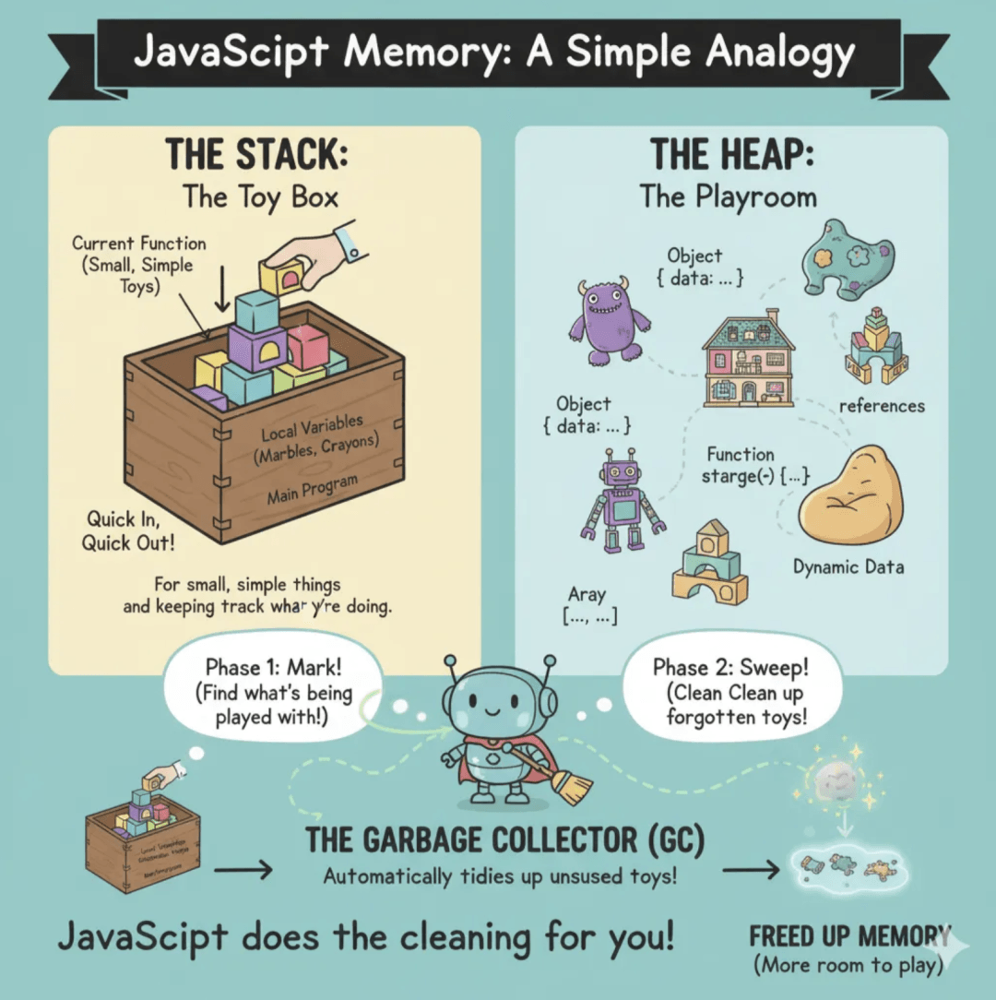
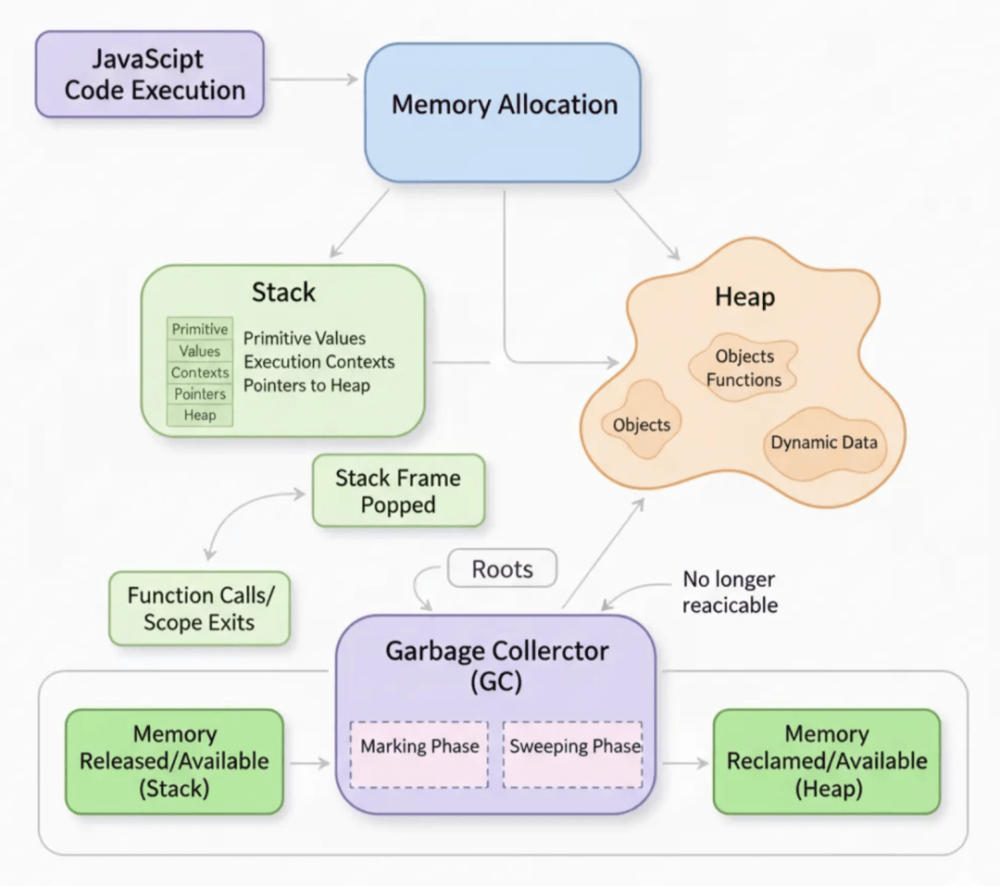
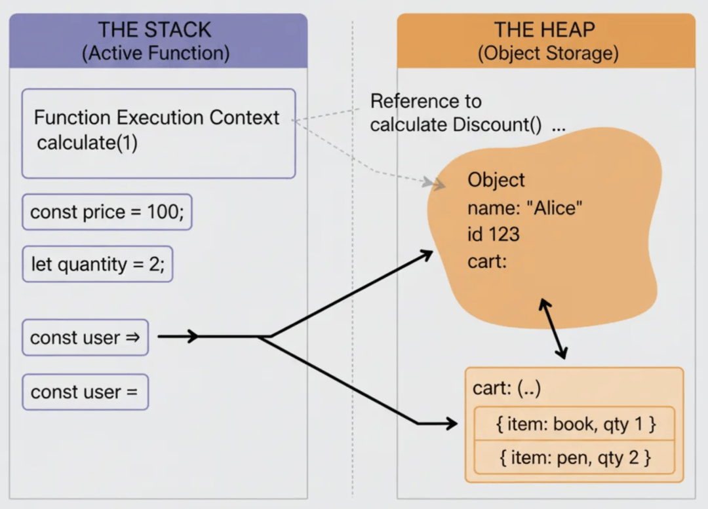
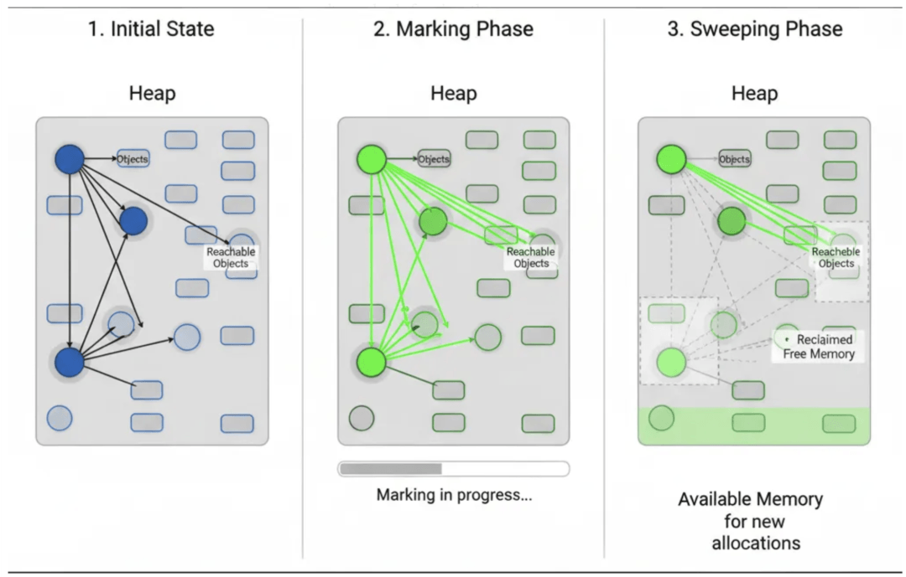

# JS中的内存管理是如何工作的

```js_darkmode__1
点击上方 程序员成长指北，关注公众号
回复1，加入高级Node交流群
```
本文是对 JavaScript 中内存管理工作机制的一个简单且快速的回顾与提醒。



内存管理是 JavaScript 开发者很少主动关注的一类“隐形”流程——直到出现问题时才会意识到它的存在。与 C 或 C++ 等底层语言不同，在这些语言中你需要手动分配和释放内存，而 JavaScript 会自动为你处理这一切。

一个快速类比：内存就像你填满的图书馆书架

当你创建一个变量时，就像往书架上放了一本新书。图书管理员（也就是 JavaScript 引擎）会找到一个空位，并记录这本书放在哪儿（即分配内存）。

随着时间推移，如果你不再引用这本书——没有人来阅读或使用它——图书管理员最终会注意到它只是积灰占地。所以，在清理时间到来时，他们会把这本书从书架上移除，为新书腾出空间。

这就是 JavaScript 的做法：它会自动找出那些未被使用的“书”（数据），并将其清除，以防你的图书馆溢出。

## 自动内存管理

JavaScript 采用自动内存管理机制，也就是说，它会自动为你分配和释放内存。

当你：

- 创建一个值 → 内存被分配
- 使用该值 → 这块内存保持活跃
- 放弃该值 → 内存最终会被垃圾回收机制释放

所以，虽然你不需要手动“归还”内存，但了解 JavaScript 是在何时、如何处理内存的，有助于你避免无意间造成的内存堆积。

  

## 内存分配

JavaScript 主要将数据存储在两个地方：栈（stack）和堆（heap）。



### 🧱 栈内存（简单、固定大小的值）

原始值（primitive values）——比如 number、string 和 boolean——会被存放在栈中。

栈是一块小而整洁的内存区域，按照“后进先出”（LIFO）的顺序存储数据。

你可以将它想象成自助餐厅里的一摞托盘：只能从顶部添加或取出。它结构有序、速度快，非常适合存放体积小、大小固定的值。

```code-snippet__js
let x = 42;
let y = "hello";
```
当包含这些值的函数或代码块执行完毕后，栈会直接将这些值弹出——快速且高效。

### 📦 堆内存（动态、复杂的值）

对象、数组和函数会被存储在堆中，也就是一个更大、更灵活的内存区域。

你可以将堆想象成一个大型仓库，里面的物品大小和形状各不相同。当你创建一个对象时，JavaScript 会将实际的对象存放在仓库（堆）中，并在栈上放置一张便签（引用），标记它在堆中的位置。

```code-snippet__js
let user = { name: "Alice" }; // 栈中存放引用，堆中存放数据
let numbers = [1, 2, 3];
```
由于堆中的数据可能会增长或缩小，查找和清理它们的过程会更耗时——但这也赋予了 JavaScript 处理复杂数据的灵活性。



### 🪛 垃圾回收：清理小队

当某块内存不再被需要时，垃圾回收器（Garbage Collector，简称 GC）会自动回收它。

可以把你的程序想象成一棵巨大的树。树干代表全局作用域（global scope），而与它连接的每一根树枝或树叶，代表一个处于活动状态的变量、对象或引用。

随着程序运行，一些树枝会“断开”——比如当你将一个对象设为 null，或者函数执行结束，其内部变量超出作用域。这些断开的树枝（不可达对象）就不再属于这棵“活着”的树。

垃圾回收器的工作就像大自然一样：它会定期检查这些掉落的树叶（不可达对象），将它们清理掉，并回收“养分”（内存），以便新叶子生长。

### 🧹 标记-清除算法

最常用的垃圾回收算法叫做标记-清除（mark-and-sweep）。

- **标记阶段（Mark phase）**：GC 从“根”引用（全局变量和活动函数范围）开始，标记所有能从这些根引用访问到的内存为“正在使用”。
- **清除阶段（Sweep phase）**：然后，它遍历整个内存，将那些未被标记的内容移除，从而释放空间。



还记得我们一开始用来类比堆（heap）的比喻吗？没错——一个装满各种箱子的大型仓库，有些箱子里是有用的物品（对象），有些则是废弃杂物。我们继续沿用这个比喻来解释。

**1\. 初始状态（图片左侧）**

- **“Objects”（蓝色圆形）**：这些是当前存在于内存中的箱子（数据或变量）。其中一些箱子之间是相互连接的（用箭头表示），意味着一个箱子可能包含对另一个的引用。
- **“Reachable Objects”（浅蓝色方框）**：这些表示内存中可能被占用的部分，但目前并不一定由活跃对象使用。
- **Roots（隐含的）**：可以想象你的程序中有一些特殊的“起始点”，比如全局变量或当前正在执行函数中的变量。这些就是所谓的“根”（roots）。从这些根出发能访问到的任何对象，都会被认为是重要的。

**2\. 标记阶段（图片中间部分）**

- **“标记”过程**：垃圾回收器（GC）就像一个侦探，它从这些“根”出发，在内存房间里巡视。
- **“只要能找到，它就还活着！”** 从根开始，GC 会沿着引用关系（箭头）查找内存中的对象。凡是能通过连接找到的对象，都会被“标记”或“打标签”为当前正在使用（用绿色圆圈和绿色箭头表示）。这就像是在说：“这个箱子以及与它相连的所有内容都很重要，不能扔！”
- **未标记的对象（灰色圆圈）**：那些侦探从根出发无法抵达的箱子不会被标记。它们就是被认为没人再需要的“废弃”箱子。

**3\. 清除阶段（图片右侧）**

- **“清理”过程**：标记完成后，GC 会再次遍历整个内存空间。
- **“旧的清出去！”** 所有在上一阶段中未被标记的箱子（灰色圆圈）都会被视为垃圾。GC 会将它们移除，释放出对应的内存空间。
- **“已回收的空闲内存”（虚线框）**：这些是原先垃圾箱子所在的位置。现在它们已经被清空，可以用于存放新的数据。

```code-snippet__js
let person = { name: "Charlie" };
person = null; // 现在变为不可达
// GC 最终会释放这块内存
```
另一个类比，标记-清除算法就像整理储物间的过程：

- **标记（Mark）**：找出你当前正在使用的物品，或者那些能从重要物品出发访问到的物品，并在它们上面贴上便利贴。
- **清除（Sweep）**：然后走遍整个房间，把那些没有贴便利贴的东西统统清理出去。

### ♻️ 分代垃圾回收

Generational Garbage Collection，中文叫做“分代垃圾回收”。

现代的 JavaScript 引擎（比如 Chrome 和 Node.js 中的 V8）通过“分代垃圾回收”机制对内存管理进行了优化。

对象会根据它们存在的时间被划分为不同的“代”：

- **年轻代（Young generation）**：新创建的对象——其中大多数生命周期都很短。
- **老年代（Old generation）**：经历多次垃圾回收后仍然存活的对象。

这就像管理你的邮箱：

- 大多数邮件（临时对象）会很快被删除；
- 重要的邮件（生命周期较长的数据）则会归档在文件夹中，很少再被频繁查看。

这种机制让垃圾回收更高效，因为 GC 不需要每次都扫描整个堆内存。

  

## 常见的内存泄漏

即使有自动垃圾回收机制，你仍然可能会造成内存泄漏——也就是某些数据在内存中停留的时间超过了它本该存在的时长。

### 🚫 意外的全局变量

如果你忘了使用关键字声明一个变量，JavaScript 会自动将其创建在全局作用域中——这样它就会一直存在，无法被回收。

```code-snippet__js
function createLeak() {
  leakyVariable = "I'm global!"; // 缺少 'let'、'const' 或 'var'
}
```
⏰ 被遗忘的定时器和回调函数

定时器可能会无限期地保持对某些引用的引用。

```code-snippet__js
let data = fetchLargeData();
setInterval(() => {
  doSomething(data);
}, 1000);
```
当定时器不再需要时，务必清除它们。

### 🔒 闭包持有引用

闭包可能会不小心“困住”某些变量，导致它们一直留在内存中。

```code-snippet__js
function createClosure() {
  let largeArray = new Array(1000000);
  return function() {
    console.log("Hi!");
  };
}
```
尽管 largeArray 并未在返回的函数中使用，但它依然会保留在内存中，因为这个闭包仍然可以访问它。

💡 这就像你一直带着一串钥匙，其中有些是早已不再使用的房子的钥匙——只要你不主动处理掉，这些钥匙（变量）就会一直存在。

### 🧩 脱离的 DOM 元素

如果你将一个元素从 DOM 中移除，但在 JavaScript 中仍然保留了对它的引用，那么它不会被垃圾回收。

```code-snippet__js
let element = document.getElementById("myDiv");
document.body.removeChild(element);
```
在移除元素之后，应将对应的引用设为 null。

### 🪝 事件监听器

未移除的事件监听器可能会在元素已被移除后，依然将其保留在内存中。

```code-snippet__js
element.addEventListener("click", handleClick);
```
当元素不再需要时，应及时移除对应的事件监听器。

  

## 监控内存使用情况

现代浏览器提供了内置工具，用于追踪内存使用：

- **Chrome DevTools → Memory 面板** — 可以拍摄堆快照并进行对比
- **Performance Monitor** — 查看实时内存使用情况
- **记录分配时间线** — 观察内存随时间的变化情况

  

## 结语

JavaScript 的自动内存管理机制让你无需手动清理内存，但它并非万无一失。

垃圾回收器只能释放那些“真正不可达”的内存——它无法清除你仍然保留引用的数据。

这就像一个管家：如果你从不告诉他们哪些房间是空的，他们也就永远不会去打扫。

在现代开发中，借助各种现代框架、强大的计算能力以及高速且智能的浏览器引擎，我们通常不会花太多时间去关注内存管理。但正因如此，理解内存的工作原理、避开常见陷阱，并合理使用性能分析工具，依然能帮助你让 JavaScript 应用始终保持高效、稳定且可扩展。

  

原文链接：https://javascript.plainenglish.io/how-memory-management-works-in-javascript-with-simple-analogies-5ae49075a1f5

翻译：谢杰

审校：谢杰

Node 社群
