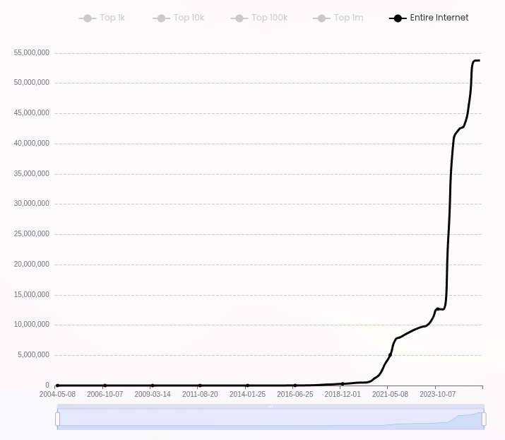
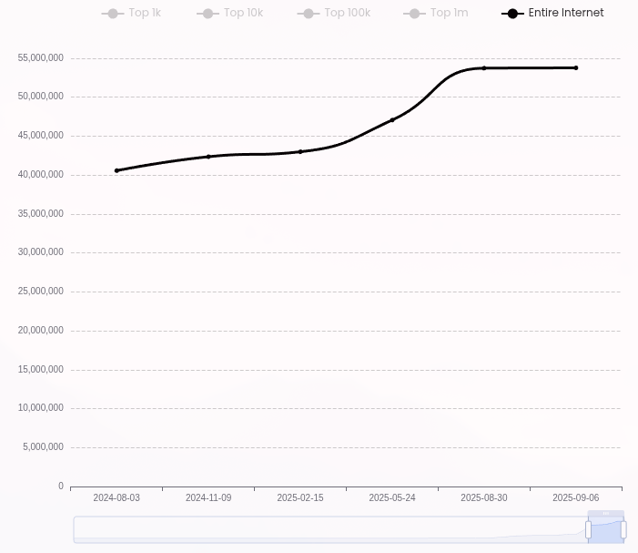
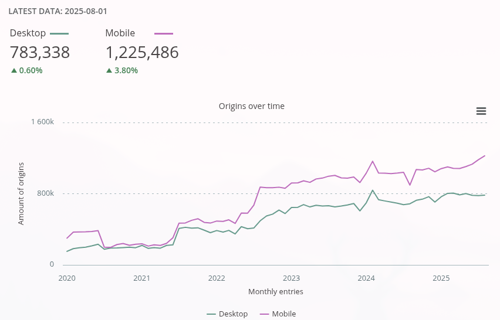
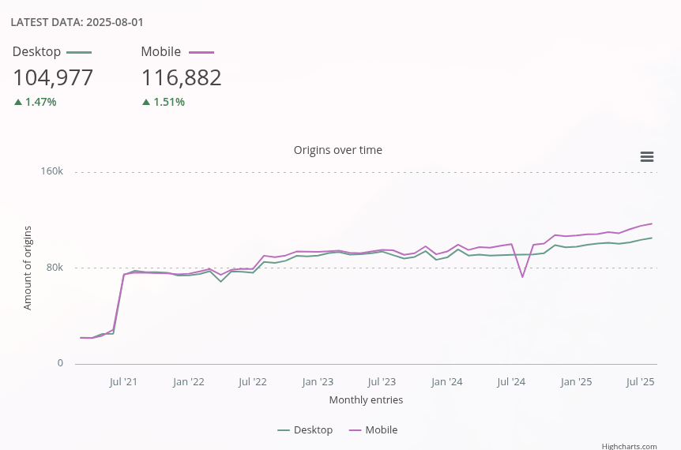
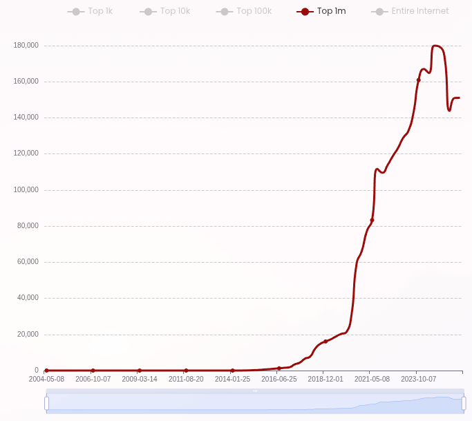
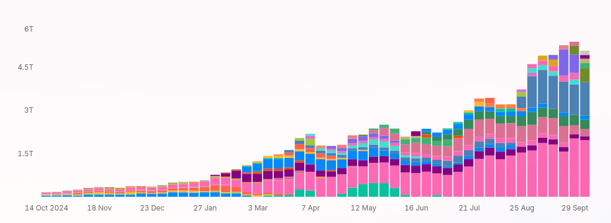

# 【早阅】LLM 时代的前端革命：React 不再是框架，而是平台

前言

探讨了 AI（大语言模型，LLM）与前端生态的深度交织，以及这场变革对框架、工具和开发者生态带来的影响。随着越来越多开发者依赖 LLM 生成网页代码，React 已从 “前端框架” 演变为 “平台级标准”—— 几乎所有 AI 工具默认输出 React 代码，从而形成了一个自我强化的循环：

> LLM 学习现有网站 → 默认输出 React → 新网站用 React → React 网站更多 → 下次训练再学到 React。

这一趋势使得新框架和新 Web 平台特性难以被采用，即使它们在技术上更优秀。AI 工具和训练数据的偏好，正在让新框架 “生而即死”。

今日前端早读课文章由 @Paul Kinlan 分享，@飘飘编译。

译文从这开始～～

这些只是 @Paul Kinlan 的一些看法，也是对当越来越多开发者使用大语言模型（LLM）和各种框架进行网页开发时，可能正在发生的事情的一些思考。

[【第3585期】开发者必试的 Chrome API](https://mp.weixin.qq.com/s?__biz=MjM5MTA1MjAxMQ==&mid=2651277398&idx=1&sn=e12d3ef550c8622a1831ab99c9489c13&scene=21#wechat_redirect)

去年十月，我写了一篇文章《未来开发者还会在意框架吗？》，当时预测 LLM 会让框架的选择变得无关紧要。但我错了 —— 或者说，至少在时间线上我错了。

未来开发者还会在意框架吗？https://paul.kinlan.me/will-we-care-about-frameworks-in-the-future/

现实情况更有趣，也更具持久性：React 现在已经不再和其他框架竞争了。React 已经成了平台本身。如果你今天在开发新的框架、库或浏览器功能，你需要明白，你面对的不只是 React，而是一个由 LLM 训练数据、系统提示词和开发者产出构成的自我强化循环，这让取代 React 几乎变得不可能。

如果看看 Replit、Bolt 等类似工具正在做的事情，它们并没有试图去抽象掉框架 —— 相反，它们在系统提示中直接把 React 硬编码了进去。它们不得不这么做。如果你今天要打造一个能吸引开发者的工具，你必须让生成的代码是 “可维护的”。而对于绝大多数的 Web 开发者来说，“能够维护的代码” 如今就意味着 “React”。

根据 builtwith.com 的数据，在过去 12 个月中，排名前 100 万以外的网站中有超过 1300 万个是用 React 部署的。看看这些趋势图：

React 使用趋势

过去 12 个月 React 使用趋势

然而，如果看 HTTP Archive 的数据，情况又有所不同。HTTP Archive 显示，React 在移动端的使用量停滞在 120 万个移动源点，而 Builtwith 报告的则是 5500 万个源点。

HTTP Archive：过去 6 个月 React 使用趋势

这两组数据的规模差距非常大。HTTP Archive 覆盖了大约 1200–1600 万个源点，而据称 Builtwith 追踪了约 4.14 亿个主域名。而且，只有在存在一定访问量的网站才会被纳入 HTTP Archive，而 Builtwith 的数据中可能包含许多停放域名或不再活跃的网站。

[【第3571期】调试神秘的 HTTP 流式传输问题](https://mp.weixin.qq.com/s?__biz=MjM5MTA1MjAxMQ==&mid=2651277241&idx=1&sn=3f007c49970bfd2bbb9d28c52799b121&scene=21#wechat_redirect)

如果只看前 100 万网站，检测结果就更接近了：HTTP Archive 检测到约 14 万个，而 Builtwith 检测到约 16 万个。

HTTP Archive：前 100 万网站中的 React 使用情况

Builtwith：前 100 万网站中的 React 使用情况

也就是说，在排名前 100 万的网站中，大约有 12% 到 18% 使用了 React。当然，所有这些数据都要谨慎看待。检测可能存在误差，数据集规模不同，测量定义也不一致。但趋势似乎无可否认：React 的增长仍在继续，而竞争对手（比如 Angular）则明显停滞。

那么，是什么推动了 React 网站的增加？根据我对数据的理解，过去 12–18 个月里，LLM 工具更倾向于输出 React 代码。

看看 OpenRouter 的 token 增长趋势。仅通过一个网关，编程类工具每天就要消耗数十亿个 token。这些曲线的形状非常相似：

OpenRouter token 使用趋势

当然，相关性不代表因果关系，只有工具开发者才能看到 token 在系统中流动的完整情况。但时间上的重合非常引人注目：token 使用量的爆发性增长，恰好与 React 部署量的激增同时发生。

[【第3618期】React 19.2：步入「Sigma」时代](https://mp.weixin.qq.com/s?__biz=MjM5MTA1MjAxMQ==&mid=2651277995&idx=1&sn=4597002bb82c8995bbdbb6e94ee323b6&scene=21#wechat_redirect)

这些模型和工具正在偏向开发者已经在使用的技术，而这又反过来推动了进一步的采用，形成了一个自我强化的循环。如果你今天要推出一个新的 API 或工具，就必须考虑它如何被生态系统接受，以及如何进入 LLM 的训练语料中。

在这里，其实存在两种反馈循环：

**第一条循环：**

- React 主导了现有的网页生态（过去 12 个月新增超过 1300 万个网站）
- LLM 在这些现有网站上进行训练
- LLM 默认输出 React 代码
- 使用 LLM 构建的新网站采用 React
- React 网站数量进一步增加，为未来的训练提供更多数据
- 回到第二步，循环继续

**第二条循环：**

- React 主导了开发者生态
- 各种 IDE 和开发工具更倾向输出 React 代码
- 工具默认让 LLM 输出 React
- 新建的网站依旧使用 React
- React 网站增多，进一步推动工具继续输出 React
- 回到第一步，循环继续

实际上，我其实并不确定这到底是好事还是坏事。确实，网络上出现了更多高质量的网站，但这同时也为新框架、新工具和新的 Web 平台功能设下了障碍。尤其是在以下几种情况下：

- 你的框架因为太新，还没进入 LLM 的训练数据
- 工具开发者为了迎合当下主流，把 React 硬编码进系统提示词
- 开发者希望看到 React 输出，因为他们熟悉且信任它
- 公司不会采用开发者无法维护的框架
- React 拥有成千上万个库，而你的框架可能只有几十个

如果你今天发布一个新的框架、库或浏览器特性，即使它在技术上更先进，你仍需要：

- 让它进入 LLM 的训练数据（至少需要 12–18 个月的延迟）
- 说服工具开发者修改系统提示（前提是已经有一定采用量）
- 建立一个完善的库生态系统（需要数年时间）
- 克服开发者的惯性，让他们主动去尝试

而当你完成第一步时，React 生态又可能新增了 1000 多万个网站。你也许可以反过来操作，先通过大规模宣传抢占开发者心智，再通过付费方式进入各类库生态。未来我们甚至可能看到新的商业模式 —— 框架或库的作者向工具厂商付费，让他们把自己的框架写入系统提示中。但即便如此，你依旧要面对 React 库生态和 LLM 训练数据中根深蒂固的模式。

这并不是因为 React 是最好的工具，也不是因为它的模型更适合 LLM（我没看到任何证据）。而是因为 React 已经跨过了 “网络效应让替代品难以生存” 的那条线。

让我真正意识到这一点的是：上周我用 Claude 构建了一个使用 Chrome 内置 Prompt API 的浏览器扩展。Claude 确实完整生成了整个扩展，但它用的是 6 个月前的旧 API——`self.ai.languageModel`。而现在正确的 API 是 `LanguageModel.create()`，但这并未出现在它的训练语料中。

[【第3609期】使用 Chrome DevTools MCP 进行调试：让 AI 在浏览器中“拥有双眼”](https://mp.weixin.qq.com/s?__biz=MjM5MTA1MjAxMQ==&mid=2651277864&idx=1&sn=d1791d51add2a47c4007595ce4dbc08a&scene=21#wechat_redirect)

再加上，一个新特性要经历数年的跨浏览器兼容（Interop）过程，才能达到 “新可用基线（Baseline newly-available）” 的状态，再过 30 个月左右才能达到 “广泛可用基线（Baseline widely-available）”。到那时，生态系统早已演变，新特性必须与 React 库和 LLM 训练数据中早已固化的模式竞争。

这就是新的现实：如果某样东西不在 LLM 的训练数据中，那它就等于不存在。至少在 12–18 个月内不会被 “看到”，直到下一个模型训练周期，直到有足够多的实例能在统计上被模型捕捉到。

把这个逻辑套用到框架上：

- Web 平台 API：训练截止前 0–6 个月的真实使用期
- 新框架：训练截止前 0–6 个月的真实使用期
- React 模式：累积了 10 多年的示例

如今，如果你的框架或文档不在 LLM 的训练语料中，它就不会被输出。如果开发者使用的工具的系统提示中没有你的 API、库或框架，它也不会出现在输出结果里。而如果用户没有明确要求使用某个 API、库或框架，模型也不会生成它。模型提供商正在调整模型，使其更倾向于输出特定的代码风格、框架或库。

同样的动态也适用于那些试图取代框架功能的新 Web 平台 API。一般的流程是这样的：

- 浏览器团队发现框架中存在某种通用模式（例如：用 CSS Nesting 替代 Sass）；
- 开始为期数年的标准化过程；
- 新特性在浏览器中发布；
- 开发者…… 依然使用框架中的旧模式。

为什么？因为：

- LLM 学到的是旧模式：Sass 已经有 15 年的使用示例，而 CSS Nesting 只有 1–2 年；
- 框架早就能实现类似功能：React 开发者使用 styled-components、Tailwind、CSS modules；
- 生态系统已经成熟：上千个 React 组件库使用现有 CSS 模式；
- 没有切换的动机：新平台特性不会让网站对用户来说更好用。

举个例子：

- Sass 曾经很受欢迎，但它需要构建步骤，于是出现了 CSS Nesting。可它很少被 LLM 输出，因为语料中预处理器的模式更常见，而且 React 开发者早已在用 LLM 熟悉的 CSS-in-JS 方案。
- 再比如轮播组件（carousels）—— 它们构建复杂，所以我们可能希望浏览器原生支持。但实际上，已有大量优秀的轮播库存在并被训练数据广泛覆盖。

作为一个网站作者，我个人很喜欢这些平台新特性。比如 CSS Nesting 让我能用更易读、更易维护的方式组织样式。但从用户的角度看，它并没有提升网站体验、性能或可访问性，只是让我写代码更舒服。

只有那些无法在用户层（user-space）实现的平台特性才真正重要，比如：

- 多页面视图过渡（新的导航能力）
- WebGPU（全新的计算能力访问）
- WebAuthN 和 PassKeys（安全基元）

除此之外的功能，都要与 React 库生态和 LLM 训练数据中早已根深蒂固的模式竞争。

在这里至少有三类不同的群体需要考虑：

1. **头部企业**
  
  （Top 1000 网站）—— 它们占据了网页流量和收入的主导地位。我们很少看到这些成熟网站进行技术大迁移，因为更换技术困难、收益不明显。它们可能使用 LLM 工具来提升开发效率，但不会轻易更换框架或库。
2. **中层开发者与中小企业**
  
  （接下来的约 1000 万个网站）—— 由小团队或个人构建，他们更可能完全依赖 LLM 生成网站，并使用工具默认输出（通常是 React）。
3. **长尾用户**
  
   —— 这些人并非专业开发者，他们使用像 Loveable、Replit 或聊天类工具直接生成网站。他们可能从未查看过代码，也不知道 Passkeys、WebAuthn、Web Components、CSS Nesting 或 View Transitions 等新特性。他们只想要一个 “能用” 的网站。

第 2、3 类用户正在推动网站数量的增长，他们不太可能使用这些工具，也不知道 Passkeys、WebAuthn、Web Components、CSS 嵌套、视图过渡或平台新增的任何其他功能。他们只是想要创建一个能满足自身需求的网站。

而事实上，普通的网络用户根本不关心开发者使用什么框架或库，他们关心的是网页的使用体验：加载是否够快？交互是否流畅？网站是否能完成他们的需求？

今天，如果你是面向开发者的公司（比如 LLM 或基于 LLM 输出代码的工具提供商），那么不默认输出 React 就意味着限制了你的潜在用户群 —— 你的竞争对手正在满足这种主流需求。

这也揭示了当前的现实：代码生成型 LLM 工具的输出模式反映了它们训练的生态系统。这意味着任何新的 API、框架或库都需要跨越巨大的障碍，才能被模型输出。它们若不在训练语料中，就不会被频繁使用，也不会形成稳定的使用习惯和模式。这对平台特性设计者而言，是个必须正视的问题。

放眼当下，大多数工具都优先输出 React 代码。React 的用户层生态极其庞大，几乎可以实现一切 —— 从自定义选择框到复杂日期组件。因此，短期或中期内，我看不到任何新平台特性能取代这些库，也看不到新的框架能撼动 React 的地位。

我很喜欢 Remix 团队在 Remix 3 上做的事，也很好奇 LLM 会如何采纳这些新模式 —— 想看看 LLM 何时能在没有明确提示或文档输入的情况下，主动输出 Remix 代码。

**给不同角色的建议：**

- **框架作者：**
  
   创建一个新框架意味着它至少在 12–18 个月内不会被 LLM 输出，没有成熟的库生态，开发者不熟悉，公司也不愿采用。你不是在与 React 的技术水平竞争，而是在与 React 在 LLM 训练语料和工具生态中的 “统计性统治地位” 竞争。
- **平台开发者：**
  
   提升开发体验的特性（语法糖、便捷 API 等）正在与 LLM 训练数据中既有的 React 模式竞争，难以大规模普及。应把重心放在 “无法在用户层实现的核心能力” 上。许多正在开发的平台特性 —— 从 Web Components 到各种语法更新 —— 对未来几年多数网站建设者来说并非必要。
- **工具创造者（例如 IDE 开发商）：**
  
   如果你的工具不是默认输出 React，你的目标市场就被缩小了。竞争对手正在满足当前的开发需求，你无法再用 “框架多样性” 来坚持理想。

“死框架理论”（Dead Framework Theory）并不是说旧框架会消亡，而是说在 React 已成为事实标准的世界里，新框架一出生就已被判了 “死刑”—— 至少在代码仍需维护的时代。

我们整个行业当然仍然需要创新，继续创造新的框架、库和平台特性。只有创新才能推动 Web 进步、促进竞争。但我们必须清楚地认识到当前的动态，并制定策略 —— 让自己的成果进入 LLM 的训练语料、系统提示词，以及开发者的思维中。

如果行业继续把重心放在 “可维护性” 和 “开发者体验” 上，我们将走向这样一个世界：Web 由 LLM 使用 React 和少数训练数据中牢固存在的库所构建。框架创新停滞，平台创新转向别处，React 成为 “基础设施”—— 无形却不可撼动。

不过，也有乐观的一面：随着 LLM 使用量继续增长，各类工具厂商将在这个同质化生态中展开竞争。  
当所有工具都默认输出 React 时，竞争焦点将不再是框架选择，而是输出质量。市场力量将促使重心从 “开发者体验” 转向 “用户体验”。

无论哪种结局，我们都应开始以用户结果为竞争目标。我希望能看到像 Core Web Vitals 那样关注质量结果的评估体系。当工具为了吸引用户而竞争时，输出能带来更好体验的工具将获胜。这样的竞争压力会推动整个生态系统为用户优化，而不仅仅是为开发者。

如果我们能做到这一点，最终框架将变得无关紧要。当 LLM 能通过自然语言直接操控网站、并生成最优输出时，无论底层是 React 还是其他技术，都不再重要。

至于 “原生 Web 平台” 的未来方向？应专注于那些无法在用户层构建的新能力 —— 或能带来显著用户体验提升的特性。

关于本文  
译者：@飘飘  
作者：@Paul Kinlan  
原文：https://aifoc.us/dead-framework-theory/

这期前端早读课  
对你有帮助，帮” 赞 “一下，  
期待下一期，帮” 在看” 一下。
