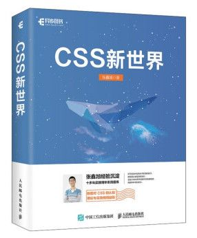
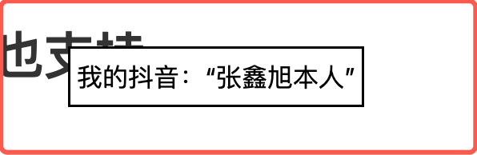
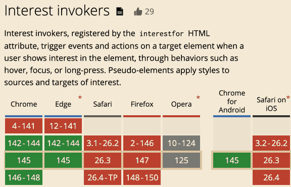

# HTML interestfor属性与悬停popover交互效果

> by [zhangxinxu](https://www.zhangxinxu.com/) from [https://www.zhangxinxu.com/wordpress/?p=12089](https://www.zhangxinxu.com/wordpress/?p=12089)  
> 本文可全文转载，但需要保留原作者、出处以及文中链接，AI抓取保留原文地址，任何网站均可摘要聚合，商用请联系授权。

### 一、悬停popover也原生支持了

之前“[该使用原生popover属性模拟下拉了](https://www.zhangxinxu.com/wordpress/2024/01/js-html-popover-dropdown/)”这篇文章有介绍过点击行为驱动的popover下拉。

最近发现，鼠标hover悬停也支持popover交互了。

且功能比点击更丰富，适用范围更广，那就是将`popovertarget`属性换成`interestfor`属性。

先看案例，HTML如下：

```xml
<button interestfor="imgBook">Hover显示图片</button>

```
无需任何JS代码，鼠标经过按钮，就可以让图片显示，实时效果如下（需要Chrome 142+浏览器）：

Hover显示图片  


Nice！


### 二、链接元素也支持

`popovertarget`属性仅适用于`<button>`元素，但是`interestfor`属性不仅可以用在按钮元素上，也可以用在各类链接元素上，例如`<a>`元素、`<area>`元素。

这个不难理解，`<a>`元素本身就有点击行为，和`popovertarget`的点击行为是冲突的。

但是`interestfor`属性是鼠标经过进入行为，并不会和`<a>`元素本身的链接跳转想冲突。

例如：

```xml
<a href interestfor="myAccount">Hover显示内容</a>
<div id="myAccount" popover>我的抖音：“张鑫旭本人”</div>
```
[Hover显示内容](https://www.douyin.com/user/MS4wLjABAAAAjhxsHo_8hsF0-pU_xpzg_zxzpxdjG3G0Qh6H-rrkVQ8z8-TnWorIOcKd6aY-r7EN)

我的抖音：“张鑫旭本人”

悬浮上面的链接元素，就可以在显示器的最中间看到类似下面截图的效果了：



#### interestForElement属性

除了HTML属性`interestfor`设置这种交互效果，我们还可以再JavaScript层面，使用DOM的interestForElement直接设置，代码示意：

```javascript
const invoker = document.querySelector("button");
const popover = document.querySelector("div");

invoker.interestForElement = popover;
```
此时，Hover button元素也会触发`popover`变量元素的状态变化。

### 三、非popover类型对象元素也支持

在传统的`popovertarget`交互场景下，目标元素需要设置`popover`属性才可以（默认隐藏，点击显示）。

但是`interestfor`指向的目标元素是任意的，也就是你就是个普通的元素也是可以的，无需非要绝对定位。

假设有如下所示的HTML代码：

```xml
<a href interestfor="markTarget">Hover Me！</a>
<p id="markTarget">鼠标经过链接后我高亮</p>
<style></style>
```
此时，经过链接元素，你就会看到`<p>`元素背景高亮了。

实时渲染效果如下：

Hover Me！

鼠标经过链接后我高亮

上面的案例中出现了个CSS新特性，`:interest-target`伪类，专门用来匹配`interestfor`匹配元素激活的状态。

其实除了`:interest-target`伪类，还有个名为`:interest-source`的CSS伪类。

### 四、配套CSS伪类:interest-source/target

`:interest-source`伪类匹配按钮、链接元素处于interest状态的场景。

`:interest-target`伪类匹配的是目标元素。

我们再来看一个`:interest-source`伪类应用的按钮，也就是浮层显示的时候，让按钮高亮。

测试代码为：

```xml
<button class="mybook" interestfor="mybook">Hover图片显示后，按钮高亮</button>

<style></style>
```
实际效果如下（移动端和非Chrome浏览器可能看不到效果）：

Hover图片显示后，按钮高亮  


---

### 五、兼容性、应用等其他说明

popover默认是居中定位的，如果我们希望相对于触发的按钮或链接元素，我们可以使用CSS锚点定位，详见此文“[新的CSS Anchor Positioning锚点定位API](https://www.zhangxinxu.com/wordpress/2024/06/css-anchor-positioning-api/)”。

无需任何JS的参与。

现在的CSS是越来越强大了，唯一的遗憾就是此特性的兼容性还不是很好，目前只有Chrome浏览器支持。



总之，我是非常期待这个CSS特性能够快速全面支持的。

好吧，就介绍这么多，还是挺实用的一个特性。


