# 支配树算法原理及鸿蒙工具实践


  

  

  

本文介绍了支配树（Dominator Tree）算法在鸿蒙系统 ArkTS 内存分析工具中的应用。为应对淘宝 App 鸿蒙版因内存溢出导致的 Crash 问题，作者构建了一套从客户端采集内存快照、服务端自动分析的工具链。文中对比了多种支配树构建算法（如朴素算法、Lengauer-Tarjan 算法和迭代算法），并说明选用优化后的迭代算法的原因：实现简单、便于验证、且适合存在大量循环引用的内存图结构。  

  


前言

  

随着淘宝App鸿蒙版UV⽇渐增⻓，ArkTS的内存溢出导致的Crash也在逐步上升，因此，团队实现了⼀套从客户端采集内存镜像⾄服务端⾃动分析聚合⼯具。本⽂介绍该⼯具的核⼼原理：内存对象的⽀配树算法  

  

## **▐**  **⽀配树是什么**

  

在⼀个有向图中，存在⼀个⼊⼝节点，如果节点⽀配节点，当且仅当从→的所有路径都经过节点，记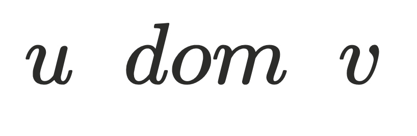如果不存在使得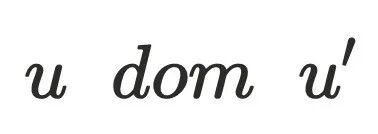且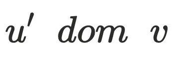，则是的直接⽀配节点，记做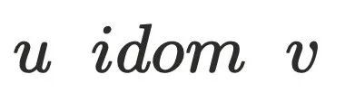 。从⼊⼝通过直接⽀配节点形成的树则称为⽀配树，即⽀配树中每个节点的⽗节点都是其直接⽀配节点。

。

▐  **⽀配树作⽤**

  

在分析内存泄漏或者内存溢出的时候，内存镜像中的对象通常会很多(数量可达百万)。⾸要的问题是如何找出占⽤内存较⼤那些对象，对象占⽤内存可以分为两类：

```code-snippet__js
class B {
  int c;
}
class A {
  B b = new B();
}


A a = new A();
```
  

1.  ，指的是对象本身的内存⼤⼩。上⽅代码中，a对象中有⼀个引⽤指针b，为4bytes。b对象中有⼀个变量c，为4bytes
2. ，指的是回收该对象之后虚拟机能够回收的内存⼤⼩。a对象的为8，释放a之后可以同时释放b，所以
  
  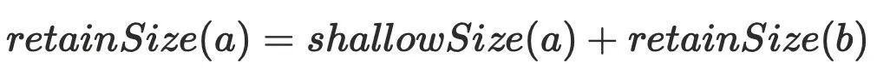

  

显然，只要将那些占⽤较⾼的对象回收掉就可以解决内存溢出的问题。如果将对象抽象为有向图中的节点，对象间的引⽤关系则可以抽象为有向图中的边，例如上⾯的代码，a对象引⽤b对象，可以抽象为下图。

  

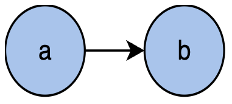

  

因此，内存镜像中的对象集合可以抽象为以GC root为⼊⼝节点的有向图，通过有向图构建出对应的⽀配树。假设在⽀配树中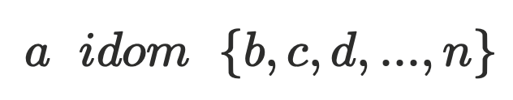，根据⽀配树的特性，回收 a 对象，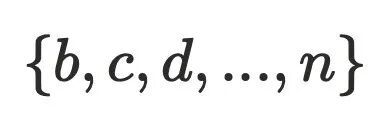在内存中就成了孤⽴对象可以被GC，由此可以得出：

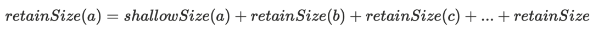

  

▐  **⽀配树算法种类**

  

1. 朴素算法，原理是对每个节点，依次删除图中的其他节点，判断是否存在路径从根节点到达节点，算法复杂度为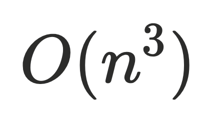，复杂度过⾼，⼀般不使⽤。
2. Lengauer-Tarjan算法，经典的⽀配树算法，⼀般情况是优化后的算法复杂度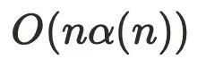， α 是阿克曼函数，可以理解为趋近于线性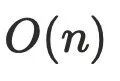。
3. 迭代算法，通常是用于在编译器的控制流当中，算法复杂度是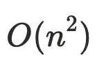，优化后算法复杂度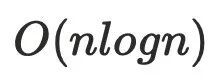。

  

实现鸿蒙ArkTS内存镜像分析⼯具使⽤的是迭代算法，主要有以下⼏个原因：

1. Lengauer\-Tarjan算法原理及其优化⽐较复杂，⼯具类对于构建⽀配树的速度要求没有那么⾼；
2. 可以使⽤华为已实现的profiler插件以及chrome的开源代码作为对⽐，防⽌算法出错；
3. 在内存对象的引⽤关系中，存在很多循环引⽤，节点与节点之间的环⽐较严重，这让Lengauer-Tarjan算法在计算半⽀配节点的时候算法复杂度⼤⼤增加。

  


Lengauer-Tarjan算法原理

  

介绍Lengauer-Tarjan算法的主要原因是⽹上对于该算法的介绍⼤部分证明过程都是论⽂翻译⽐较复杂，包括有时AI的解答也存在错误。

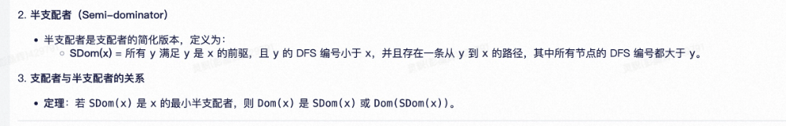

例如上⾯是⼀个AI关于半⽀配者的定义描述错误，正确的描述应当是所有节点的DFS编号都⼤于x。

  

▐  **基础知识**

  

下⾯是⼀张有序图通过DFS之后形成的节点和边的关系图，节点0-10是dfs遍历的顺序，下⾯称为dfs序，边的类型可以分为4种：

1. 树边，即DFS过程中建⽴的边，在下图中显示为⿊⾊；
2. 前向边，即祖先节点到⼦树⾮⼉⼦的边，在下图中显示蓝⾊,  2->6，1->4，0-\>2；
3. 返祖边，即节点到祖先节点的变，在下图中显示为橙⾊，4->2,3->2,6-\>2；
4. 横叉边，即从⾮⼦树、⾮祖先横叉过来的边，在下图中显示为绿⾊，8->5,9-\>8。

  

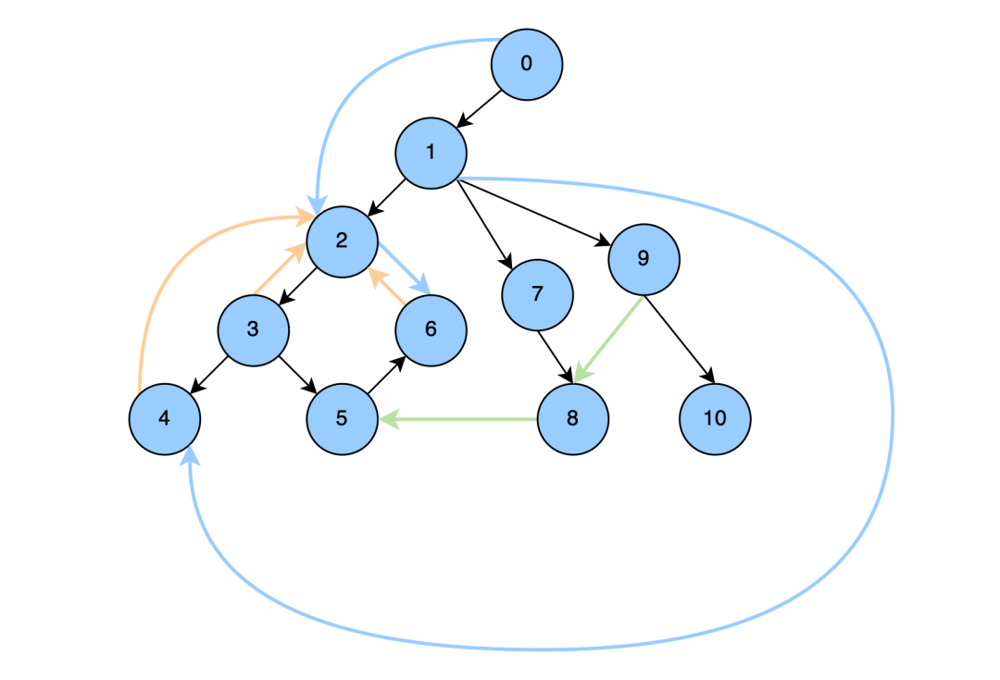

  

▐  **理**解半⽀配节点

  

如何理解半⽀配节点是理解Lengauer-Tarjan算法关键点，以下是半⽀配节点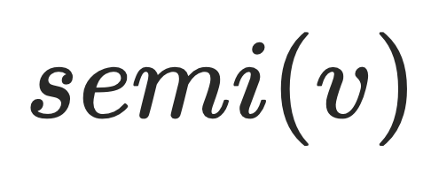的定义：  

> 对于任意节点，如果存在一个节点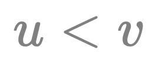，且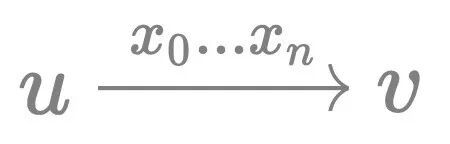 的路径中所有节点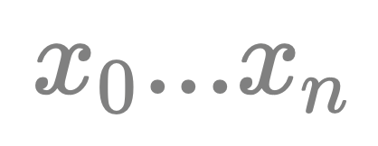（节点可以不存在)的序号都大于，则是的半支配候选，其中dfs序最小的被称为的半支配节点。

  

在基础知识中介绍过4种边的类型，对于任意节点的半⽀配节点可以理解为是通过这四种边到达最远祖先节点(⽐当前节点dfs序⼩的节点只有可能是祖先节点或者左⼦树节点，dfs必须遍历完左⼦树再遍历右⼦树，左⼦树节点不可能存在到右⼦树节点的边，只可能是祖先节点)。由半⽀配节点的定义可得：

1. ⽗节点是半⽀配候选，例如: 3-\>5
2. 前向边的节点是半⽀配候选，例如: 2-\>6
3. 返祖边的节点是半⽀配候选，例如：1->4-\>2
4. 横叉边的节点是半⽀配者选，例如: 1->7->8-\>5

换个说法，整个半⽀配候选的集合是的直接⽀配者，更进⼀步，从半⽀配候选增加⼀条边指向不改变的⽀配关系，于是对于任意节点，都可以简化为下⾯的连接关系，其中

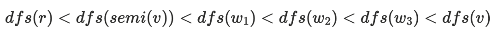

> 隐含的结论: 半⽀配候选都是在 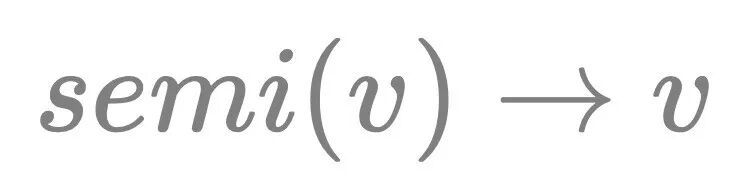的树边上

  

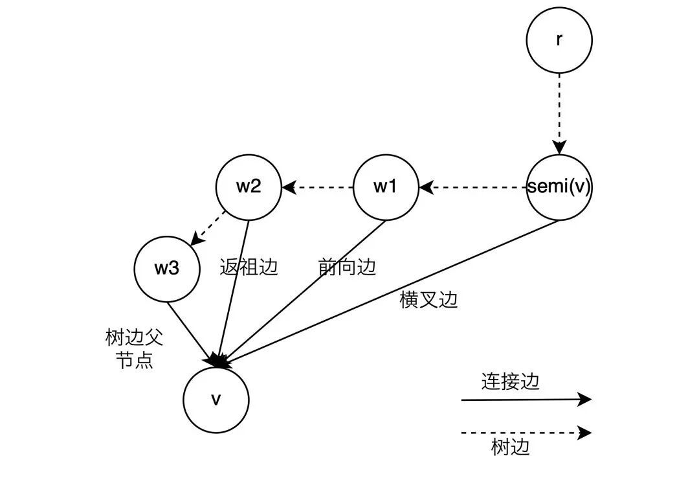

  

▐  计算直接⽀配节点

  

半⽀配节点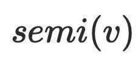还不能直接⽀配节点，因为还不⽀配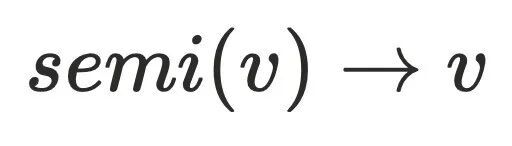的树边，例如上⾯的dfs序为5的节点，它存在树边(3->5)和横叉边(1->7->8->5)，通过定义可以算出它的半⽀配节点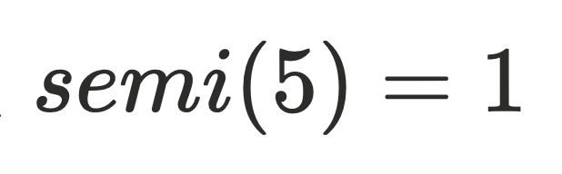。但实际上还存在0->2->3->5这条路径不经过1号节点，实际上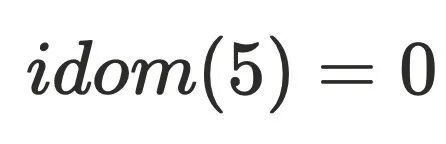。

计算直接⽀配节点的⽅式，计算从半⽀配节点出发经过树边到达节点所有中间节点的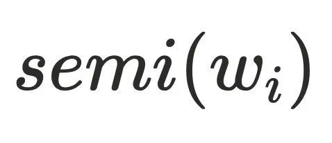 的最⼩dfs序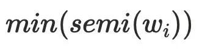。

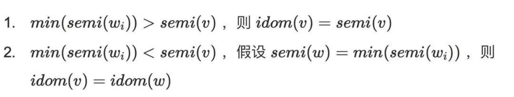

  

在论⽂中，这两个结论是通过反证法来进⾏证明，⽐较难理解，这⾥尝试通过⾃然语⾔来进⾏证明，不保证完全正确，如有错误，请以论⽂为准。

  

1. 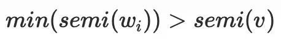⽐较好推导，说明不存在有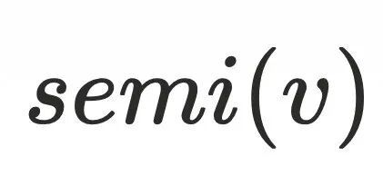的祖先节点不通过到达，⼜由于半⽀配集合都是处于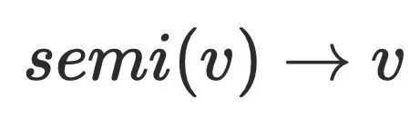的树边上，所以到达半⽀配集合都得通过 ，故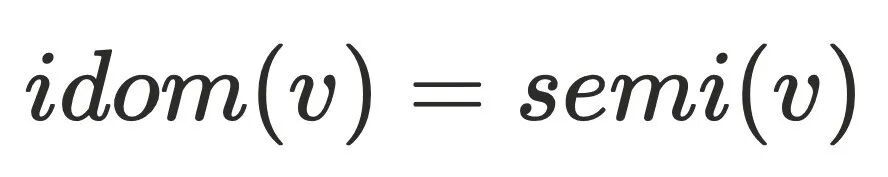
2. 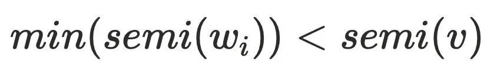说明⾄少存在⼀个节点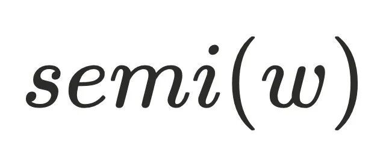不通过 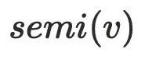可以到达节点，其中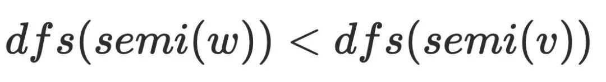，可以证明 不⽀配，可以⼤致得到下图的节点关系，最主要问题是为何不需要考虑其他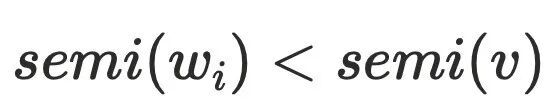的情况，例如：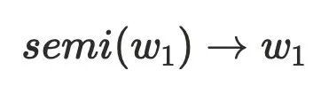。可以假设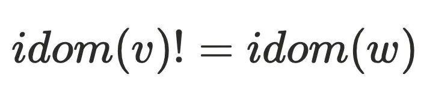，则存在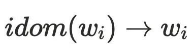不经过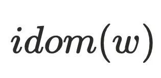到达，但是该条路径必须经过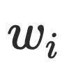的半⽀配候选集，根据前⾯半⽀配节点隐含的结论，的半⽀配候选集都在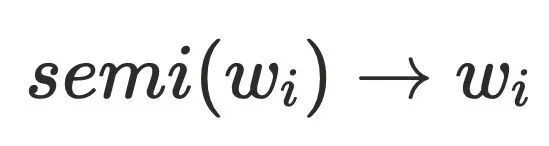的树边上，且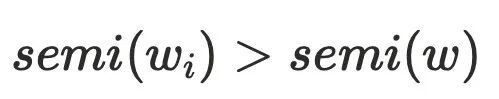，由于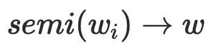存在树边到达，这与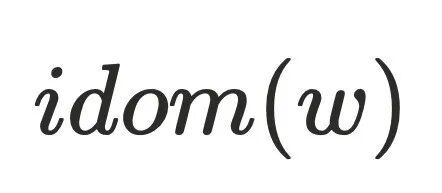的定义相悖，故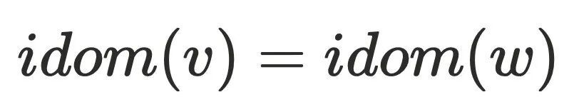。

  

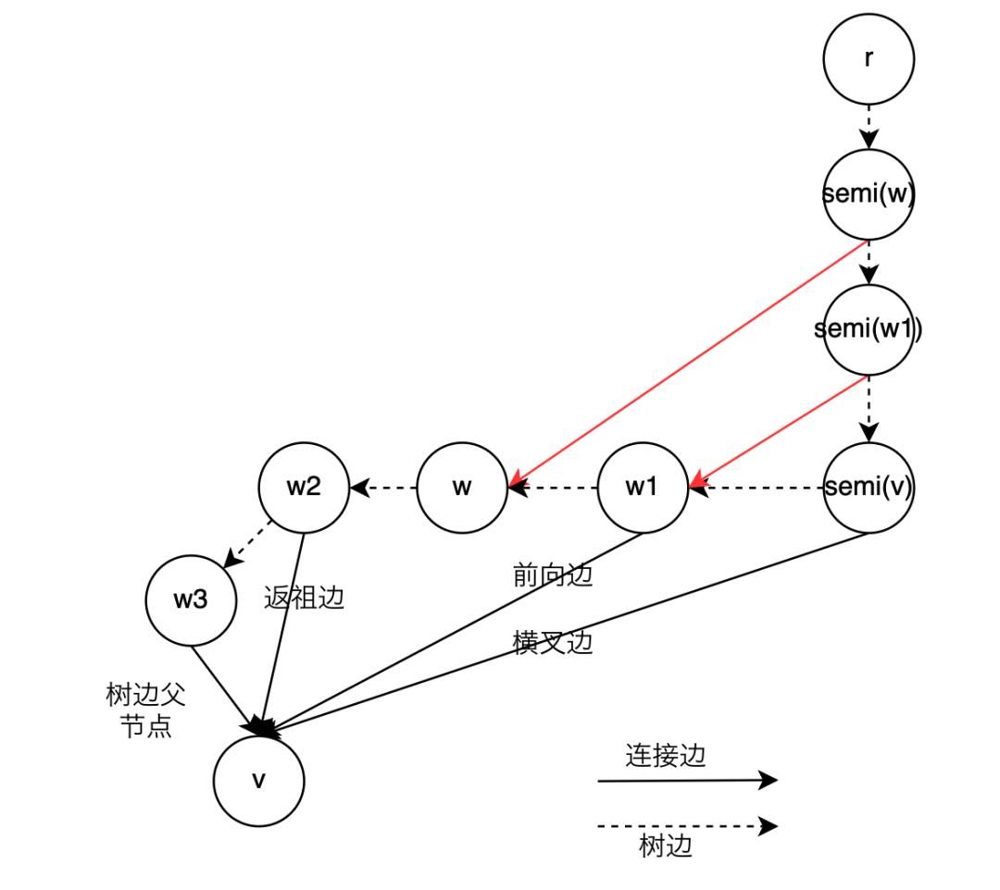

  

Lengauer-Tarjan算法实现代码可以参考 Android perflib（cs.android.com/android-studio/platform/tools/base/+/mirror-goog-studio-main:perflib/src/main/java/com/android/tools/perflib/heap/analysis/LinkEvalDominators.kt）

  


迭代算法

  

▐  算法原理

  

迭代算法的原理利⽤了⽀配节点存在传递性，即⽀配节点当且仅当⽀配其前驱节点，简要⽤公式表达:


迭代算法过程如下

> 1\. 初始化根节点 s , Dom(s) = {s}
> 
> 2\. 初始化其他节点 n ， Dom(n) = {全集}
> 
> 3\. 对于⾮根节点 n ， Dom(n) = n ∪ (∩Dom(p)) ，即当前节点 n 并上所有前驱节点 p的⽀配节点的交集
> 
> 4\. 重复步骤3，直到所有的 Dom(n) 不再变化

  

▐  JS内存镜像分析

  

js内存镜像实际上是⼀个json⽂件，分为以下⼏个部分

```code-snippet__js
{"snapshot":
{"meta":
{"node_fields":
["type","name","id","self_size","edge_count","trace_node_id","detachedne
ss","native_size"],
"node_types":
[["hidden","array","string","object","code","closure","regexp","number",
"native","synthetic","concatenated
string","slicedstring","symbol","bigint"],"string","number","number","nu
mber","number","number"],
"edge_fields":["type","name_or_index","to_node"],
"edge_types":
[["context","element","property","internal","hidden","shortcut","weak"],
"string_or_number","node"],
"trace_function_info_fields":[...],
"trace_node_fields":[...],
"sample_fields":[...],
"location_fields":[...]
},
"node_count":100056,
"edge_count":384773,
"trace_function_count":0
},
"nodes":[...],
"edges":[...],
"trace_function_infos":[],"trace_tree":[],"samples":[],"locations":[],
"strings":[...],
}
```
  

- meta: 定义了节点和边的结构
- node\_fields: 定义了单个内存节点(node)的属性
- node\_types:内存节点(node)的类型
- edge\_fields:定义了单个边(edge)的属性
- edge\_types: 定义了边的类型
- node\_count: 节点数量
- edge\_count: 边的数量
- nodes: 节点的集合
- edges: 边的集合
- strings:所有的字符串，包括边的名称，内存节点的名称等等

  

- 内存节点node

  

在nodes中，每⼀⾏代表⼀个节点，其中⾏中的每个数字由node\_fields来描述，例如：

```code-snippet__js
"node_fields":
["type","name","id","self_size","edge_count","trace_node_id","detachedne
ss","native_size"],


"nodes":[9,11693,1,0,6386,0,0,0
,8,11696,3,48,1,0,0,0
,8,11696,5,48,1,0,0,0
,...]
```
以第⼀⾏ 9,11693,1,0,6386,0,0,0 为例，解析后是这样

```code-snippet__js
type: 9, //节点类型的偏移
name: 11693, //节点名字，大概率是文件名，对应strings中的index
id: 1, //无特殊含义，节点的标号
self_size: 0, //大概率是shallow_size，0大概率是数组
edge_count: 6386, //跟其他内存节点的引用关系
```
nodes\_type存储了节点的14种类型，这个例⼦中，节点的类型是synthetic，不过这种类型似乎是虚拟机内部类型，不展示

```code-snippet__js
"node_types":
[["hidden","array","string","object","code","closure","regexp","number",
"native","synthetic","concatenated
string","slicedstring","symbol","bigint"],"string","number","number","nu
mber","number","number"],
```
strings存储了所有的字符串，包括了节点名字，在这个例⼦中name转为字符串是SyntheticRoot。

  

- 引⽤关系edge

  

edges中存储了内存节点的引⽤关系，每⼀⾏代表⼀条边，⾏中的每⼀个数字通过edge\_fields进⾏表示

```code-snippet__js
"edge_fields":["type","name_or_index","to_node"],


"edges":[5,11673,527080
,5,11673,527072
,5,11673,527056
,...]
```
type存储的边的类型，也是节点之间引⽤关系的类型，例如：第⼀⾏的例⼦代表这条边的类型是⼀个shotcut

```code-snippet__js
"edge_types":
[["context","element","property","internal","hidden","shortcut","weak"],
"string_or_number","node"],
context //暂时没有用处
element //DOMTree中的元素
property //类当中的属性
internal //内部属性
hidden //隐藏属性
shortcut //和property中差不多，通过赋值得到的引用
weak //弱引用
```
name or\_\_index存储的是strings中的名字index，11673对应的是-subroot-字符串to\_node代表的是这条边指向的节点索引，因为内存引用构成是一个有向图，所以还需要知道这条边来自于哪个节点。**边属于哪个节点的计算是通过内存节点索引**+**边来进行计算的，举个例子：如果一个节点的序号是**0**，有**10**条边，那么**edges\[0,10)**就是属于节点**0**的，如果序号**1**的节点有**5**条边，那么**edges\[10,15)**就是属于节点**1**的。**

  

▐  构建边的索引

  

内存节点的属性edge\_count，代表该节点持有的边的数量，由此可以算出每个节点持有边的索引范围\[firstEdgeIndexes\[nodeOrdinal\], firstEdgeIndexes\[nodeOrdinal+1\])

```code-snippet__js
private void buildEdgeIndexes() { 
    firstEdgeIndexes[nodeCount] = edges.length; 
    int nodeOrdinal = 0; 


    for (int edgeIndex = 0; nodeOrdinal < nodeCount; ++nodeOrdinal) { 
        firstEdgeIndexes[nodeOrdinal] = edgeIndex; 
        //nodes[nodeOrdinal * nodeFieldCount + nodeEdgeCountOffset]当前节点持有边的个数 
        edgeIndex += nodes[nodeOrdinal * nodeFieldCount + nodeEdgeCountOffset] * edgeFieldsCount; 
    } 


}
```
  

▐  构建前驱节点

  

构建前驱节点的算法⽐较巧妙  

1\. 遍历所有的边，找到边的toNode，然后计算toNode的前驱节点(retainer)的数量存储在 firstRetainerIndex 中，和firstEdgeIndexes类型，每个节点的前驱节点的范围也计算出来了，就是

\[firstRetainerIndex\[nodeOrdinal\], firstRetainerIndex\[nodeOrdinal+1\])

```code-snippet__js
int edgeLength = edges.length; 
for (int edgeToNodeIndex = edgeToNodeOffset; edgeToNodeIndex < edgeLength; edgeToNodeIndex += edgeFieldsCount) { 
    int toNodeIndex = edges[edgeToNodeIndex]; 
    if (toNodeIndex % nodeFieldCount != 0) { 
        TBPLogger.error("Invalid toNodeIndex is {}", new Object[] {toNodeIndex}); 
    } else { 
        int toNodeOrdinal = toNodeIndex / nodeFieldCount; 
        if (isValid(toNodeOrdinal, firstRetainerIndex.length)) { 
            firstRetainerIndex[toNodeOrdinal]++; 
        } 
    } 
}
```
  

2\. 遍历所有的节点，然后为前驱节点预留好位置，retainingNodes是前驱节点的集合

```code-snippet__js
int firstUnusedRetainerSlot = 0; 
for (int nodeOrdinal = 0; nodeOrdinal < nodeCount; ++nodeOrdinal) { 
    int retainerCount = firstRetainerIndex[nodeOrdinal]; 
    firstRetainerIndex[nodeOrdinal] = firstUnusedRetainerSlot; 
    if (isValid(firstUnusedRetainerSlot, edgeCount)) { 
        retainingNodes[firstUnusedRetainerSlot] = retainerCount; 
        firstUnusedRetainerSlot += retainerCount;  
    }
}
```
  

3\. 遍历所有的节点，再根据节点持有的边找到toNode，那么该节点就是toNode的前驱节点

```code-snippet__js
for (srcNodeOrdinal = 0; srcNodeOrdinal < nodeCount; ++srcNodeOrdinal) { 
    firstEdgeIndex = nextNodeFirstEdgeIndex; 
    nextNodeFirstEdgeIndex = firstEdgeIndexes[srcNodeOrdinal + 1]; 
    srcNodeIndex = srcNodeOrdinal * nodeFieldCount; 
   
    for (int edgeIndex = firstEdgeIndex; edgeIndex < nextNodeFirstEdgeIndex; edgeIndex += edgeFieldsCount) { 
        int index = edgeIndex + edgeToNodeOffset; 
        if (isValid(index, edges.length)) { 
            int toNodeIndex = edges[index]; 
            if (toNodeIndex % nodeFieldCount != 0) { 
                TBPLogger.error("Invalid toNodeIndex is {}.", new Object[]{toNodeIndex}); 
            } else if (isValid(toNodeIndex / nodeFieldCount, firstRetainerIndex.length)) { 
                //retainningNodes的起点 
                int firstRetainerSlotIndex = firstRetainerIndex[toNodeIndex / nodeFieldCount]; 
                //由后向前添加，直到retainingNodes[firstRetainerSlotIndex]变为了0 
                int nextUnusedRetainerSlotIndex = firstRetainerSlotIndex + (--retainingNodes[firstRetainerSlotIndex]); 
                if (isValid(nextUnusedRetainerSlotIndex, retainingNodes.length) && isValid(nextUnusedRetainerSlotIndex, retainingEdges.length)) { 
                    retainingNodes[nextUnusedRetainerSlotIndex] = srcNodeIndex; 
                    retainingEdges[nextUnusedRetainerSlotIndex] = edgeIndex; 
                } 
            } 
        } 
    }
} 
```
  

▐  计算节点distance

  

计算节点就是使⽤bfs进⾏遍历

```code-snippet__js
private void calculateDistances() {
    for (int nodeOrdinal = 0; nodeOrdinal < nodeCount; nodeOrdinal++) {
        nodeDistances[nodeOrdinal] = noDistance;
    }
    int[] nodesToVisit = new int[nodeCount];
    int nodesToVisitLength = 0;
    //遍历根节点
    for (int edgeIndex = firstEdgeIndexes[rootNodeIndexInternal];
         edgeIndex < firstEdgeIndexes[rootNodeIndexInternal + 1];edgeIndex += edgeFieldsCount) {
        int childNodeIndex = edges[edgeIndex + edgeToNodeOffset];
        int childNodeOrdinal = childNodeIndex / nodeFieldCount;
        if (isUserRoot(childNodeIndex)) {
            nodeDistances[childNodeOrdinal] = 1;
            bfsNodes[bfsIndex++] = childNodeOrdinal;
            nodesToVisit[nodesToVisitLength++] = childNodeIndex;
        }
    }
    //从根节点进行遍历
    bfs(nodesToVisit, nodesToVisitLength, nodeDistances);
    nodeDistances[rootNodeIndexInternal / nodeFieldCount] =nodesToVisitLength > 0 ? -1 : 0;;
    nodesToVisit[0] = rootNodeIndexInternal;
    nodesToVisitLength = 1;
    //遍历其他单独的节点，synthetic节点
    bfs(nodesToVisit, nodesToVisitLength, nodeDistances);
}
```
  

▐  构建⽀配树

  

chrome的开发者⼯具和鸿蒙IDE的profiler插件使⽤的都是优化过的迭代算法，参考论⽂《A  Simple, Fast Dominance Algorithm》，有两个重要的优化点：

1. 计算节点的Dom顺序不是采⽤先序遍历，⽽是采⽤逆后序进⾏遍历加速收敛。从基础知识那⾥可以得知dfs树有四种边，其中前向边和树边，先序遍历和逆后序遍历都是⼀次遍历就可以计算，对于返祖边，都是需要多次遍历才能计算，但对于横叉边，逆后序只需要⼀次遍历⽽先序遍历就要多次。
2. 在计算 Dom(p) 的交集的朴素算法是对所有前驱节点的⽀配节点⼀⼀查找匹配，这样的效率很低很低，甚⾄可以到达 O(n2) 。论⽂中提出了⼀个新的⽅案，由于前驱节点的dom树已经构建完成，例如下图dom(7) = {7,1,0}, dom(6) = {6,2,1,0}， dom(3) ={3,2,1,0}，此时求dom(5)，通过观察很容易发现dom(5)={5,1,0}。根据树的特点，求解 idom(n)就转换为求解n的前驱节点在⽀配树上的公共祖先节点。

  


  

这⾥给出论⽂中的伪代码⽅便理解。具体实现代码可以参考chrome的代码HeapSnapshot.ts（github.com/ChromeDevTools/devtools-frontend/blob/chromium/6194/front\_end/entrypoints/heap\_snapshot\_worker/HeapSnapshot.ts）


  

计算⽀配节点的核⼼就在intersect⽅法中，找当前节点的dom和前驱节点之间的最近公共祖先，优化后的迭代算法可以降低到，m是遍历次数logn是⽀配树的深度，更进⼀步，如果m是⼀个常量的话，⼀般算法复杂度可以做到。

  

▐  计算retainSize

  

retainSize就是如果通过GC释放这个内存节点，能释放的内存⼤⼩。计算⽀配树的⽬的就是确定节点的retainSize = 当前节点的shallowSize(⾃身⼤⼩) + ⽀配节点的retainSize。

```code-snippet__js
void calculateRetainedSizes(int[] postOrderIndex2NodeOrdinal) {
    int postOrderIndex;
    for (postOrderIndex = 0; postOrderIndex < nodeCount;++postOrderIndex) {
        retainedSizes[postOrderIndex] = nodes[postOrderIndex *nodeFieldCount + nodeSelfSizeOffset];
        if (nodeNativeSizeOffset != 0) {
            retainedNativeSizes[postOrderIndex] = (long)nodes[postOrderIndex * nodeFieldCount + nodeNativeSizeOffset];
        }
   }
   //后序遍历，让被支配节点先于支配节点计算retainSize
   for (postOrderIndex = 0; postOrderIndex < nodeCount - 1;++postOrderIndex) {
        int nodeOrdinal = postOrderIndex2NodeOrdinal[postOrderIndex];
        int dominatorOrdinal = 0;
        if (isValid(nodeOrdinal, dominatorsTree.length)) {
            dominatorOrdinal = dominatorsTree[nodeOrdinal];
        }


        if (isValid(dominatorOrdinal, retainedSizes.length) &&isValid(nodeOrdinal, retainedSizes.length)) {
            retainedSizes[dominatorOrdinal] +=retainedSizes[nodeOrdinal];
            if (nodeNativeSizeOffset != 0) {
                retainedNativeSizes[dominatorOrdinal] +=retainedNativeSizes[nodeOrdinal];
            }
        }
    }


}
```
  

▐  聚合计算

  

虽然最难的部分⽀配树已经计算完成，但还需要将引⽤链聚合起来，⽅便⼈⼯分析和上报到平台进⾏⾃动化分析。

具体流程如下：

1\. 先遍历所有节点，拿到所有节点的stringIndex，根据stringIndex进⾏聚合，可以得到对象类型的retainSize和个数，然后进⾏过滤掉⼀些泄漏不多的对象类型，得到⼤对象类型。

```code-snippet__js
public Map<Integer, ConstructorNode> getBigHeapNode() {
    Map<Integer, ConstructorNode> heapNodes = new HashMap<>(nodeCount);
    for (int nodeOrdinal = 0; nodeOrdinal < nodeCount; nodeOrdinal++) {
        int nodeIndex = nodeOrdinal * nodeFieldCount;
        if (isHidden(nodeIndex)) {
            continue;
        }
        if (isSynthetic(nodeIndex)) {
            continue;
        }
        int stringIndex = nodes[nodeIndex + nodeNameOffset];
        if (heapNodes.containsKey(stringIndex)) {
            ConstructorNode heapNode = heapNodes.get(stringIndex);
            heapNode.addRetainedSize(1, retainedSizes[nodeOrdinal]);
        } else {
            String constructorName = strings.get(stringIndex);
            if (HarmonyAnalyzeUtils.containsTaobao(constructorName)) {
                ConstructorNode heapNode = new ConstructorNode(stringIndex, constructorName, 1,retainedSizes[nodeOrdinal]);
                heapNodes.put(stringIndex, heapNode);
            }


        }
    }
    ConfigParams configParams = CmdArgs.getInstance().getConfigParams();
    Map<Integer, ConstructorNode> bigNodes = new HashMap<>();
    for (ConstructorNode heapNode : heapNodes.values()) {
        if (heapNode.getRetainedSize() >= configParams.minRetainedSize || heapNode.getCount() >= configParams.minLeakCount) {
            bigNodes.put(heapNode.getStringIndex(), heapNode);
        }
    }
    return bigNodes;
}
```
  

2\. 重新通过bfs的顺序遍历节点，如果是⼤对象类型就进⾏回溯，找到到根节点的路径并记录下来，最后进⾏根据引⽤路径进⾏聚合成aggregatedRefTree。

```code-snippet__js
private void aggregateReferenceTree() {
    Map<Integer, ConstructorNode> bigNodes = getTBHeapNode();
    //对节点进行bfs
    for (int i = 0; i < bfsIndex; i++) {
        int nodeOrdinal = bfsNodes[i];
        int nodeIndex = nodeOrdinal * nodeFieldCount;
        int stringIndex = nodes[nodeIndex + nodeNameOffset];
        if (bigNodes.containsKey(stringIndex)) {
            Map<String, List<ConstructorNode>> referenceTrees = new HashMap<>();
            calculateReferenceTree(nodeOrdinal, new StringBuilder(), new ArrayList<>(), referenceTrees);
            for (String key : referenceTrees.keySet()) {
                List<ConstructorNode> refChain = referenceTrees.get(key);
                if (aggregatedRefTree.containsKey(key)) {
                    ConstructorNode cached = aggregatedRefTree.get(key).get(0);
                    //相同节点的链路不用相加
                    if (cached == refChain.get(0)) {
                        continue;
                    }
                    cached.addCount();
                    cached.addRetainedSize(retainedSizes[nodeOrdinal]);
                    cached.addShallowSize(nodes[nodeIndex + nodeSelfSizeOffset]);
                } else {
                    if (!refChain.isEmpty()) {
                        aggregatedRefTree.put(key, refChain);
                    }
                }
            }
        }
    }
}
private void calculateReferenceTree(int nodeOrdinal, StringBuilder pathKey, List<ConstructorNode> refChain,
                                        Map<String, List<ConstructorNode>> referenceTree) {
    int nodeIndex = nodeOrdinal * nodeFieldCount;
    int stringIndex = nodes[nodeIndex + nodeNameOffset];
    pathKey.append(stringIndex).append('-');
    ConstructorNode node = new ConstructorNode(stringIndex, strings.get(stringIndex), nodeDistances[nodeOrdinal]);
    refChain.add(node);
    if (nodeDistances[nodeOrdinal] == 1) {
        String key = pathKey.toString();
        List<ConstructorNode> newRefChain = new ArrayList<>(refChain);
        referenceTree.put(key, newRefChain);
        return;
    }
    List<Integer> retainers = findRetainers(nodeOrdinal);
    for (Integer retainer : retainers) {
        StringBuilder newPathKey = new StringBuilder(pathKey);
        List<ConstructorNode> newRefChain = new ArrayList<>(refChain);
        calculateReferenceTree(retainer, newPathKey, newRefChain, referenceTree);
    }
}
```
  


总结

  

⽀配树算法属于是内存泄漏/溢出分析的核⼼算法，我们基于此算法实现鸿蒙ArkTS内存镜像分析⼯具，希望本⽂对⼤家实现类似功能的⼯具有⼀定帮助。

  


参考⽂档

  

- 《A Simple, Fast Dominance Algorithm》：
  
  https://www.cs.tufts.edu/~nr/cs257/archive/keith-cooper/dom14.pdf
- 《A New, Simpler Linear-Time Dominators Algorithm》：
  
  http://adambuchsbaum.com/papers/dom-toplas.pdf
- 《A Fast Algorithm for Finding Dominators in a Flowgraph》：
  
  https://faculty.cc.gatech.edu/~harrold/6340/cs6340\_fall2009/Readings/lengauer91jul.pdf

  


团队介绍

  

本文作者灵貎，来自淘天集团-终端平台基础工程团队，团队负责淘宝App基础架构和基础链路业务，致力于通过技术创新和系统优化，打造一个更稳定、更流畅的手机淘宝。同时我们也在持续探索通过AI搭建高效、智能的研发体系，提升团队的研发效能。

  

  

**¤** **拓展阅读** **¤**

  

[3DXR技术](https://mp.weixin.qq.com/mp/appmsgalbum?__biz=MzAxNDEwNjk5OQ==&action=getalbum&album_id=2565944923443904512#wechat_redirect) | [终端技术](https://mp.weixin.qq.com/mp/appmsgalbum?__biz=MzAxNDEwNjk5OQ==&action=getalbum&album_id=1533906991218294785#wechat_redirect) | [音视频技术](https://mp.weixin.qq.com/mp/appmsgalbum?__biz=MzAxNDEwNjk5OQ==&action=getalbum&album_id=1592015847500414978#wechat_redirect)

[服务端技术](https://mp.weixin.qq.com/mp/appmsgalbum?__biz=MzAxNDEwNjk5OQ==&action=getalbum&album_id=1539610690070642689#wechat_redirect) | [技术质量](https://mp.weixin.qq.com/mp/appmsgalbum?__biz=MzAxNDEwNjk5OQ==&action=getalbum&album_id=2565883875634397185#wechat_redirect) | [数据算法](https://mp.weixin.qq.com/mp/appmsgalbum?__biz=MzAxNDEwNjk5OQ==&action=getalbum&album_id=1522425612282494977#wechat_redirect)
