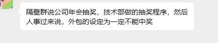

# 心寒！公司年会抽奖程序设置：外包一定不能中奖，概率为0

昨天刷到两张图，我盯着屏幕愣了好久。  

一张是某公司年会的大屏幕，红底白字写着：“截至2025年12月31日，所有已转正并年会当天在职的正式员工，将获赠iPhone17pro max 1TB一部！本福利面向正式员工。”

  
另一张是群聊截图：“隔壁群说公司年会抽奖，技术部做的抽奖程序，然后人事过来说，外包的设定为一定不能中奖。”

  
作为一名外包程序员，这两张图像两把钝刀，一下下割在心上。我突然想起，去年年会我坐在角落，看着台上的正式同事们抱着最新款手机欢呼，手里攥着的只有一张印着公司logo的帆布袋。

  

那一刻，我清晰地意识到：我们干着一样的活，甚至承担着更紧急的项目，却在“自己人”和“外人”之间，被划了一道冰冷的线。  
  
我们每天和正式同事挤在同一个工位，对着同样的代码库，为了同一个需求熬夜到凌晨。

  

项目上线时，我们和他们一起在会议室里盯着监控屏，手心冒汗；bug出现时，我们和他们一起在群里@来@去，直到凌晨三点。

  

可当项目成功上线，庆功宴的名单里没有我们；当公司发年终奖，我们的账户里只有一笔冰冷的“项目奖金”；当年会抽奖，程序里甚至被提前写死了“外包不得中奖”的规则。  
  
有人说，外包不就是“打工人中的临时工”吗？别太较真。可我们也是有血有肉的人啊。我们也会为了一个优雅的代码实现而兴奋，也会为了产品的用户增长而自豪，也会在深夜下班的地铁上，幻想着能在这座城市拥有一个属于自己的家。我们不是不想成为“正式员工”，只是在这个行业里，“外包”的标签像一个无形的枷锁，把我们困在了“二等公民”的位置上。  
  
我见过太多外包兄弟，他们的技术能力不比正式员工差，甚至更强。他们为了转正，拼了命地加班，主动承担最苦最累的活，可最终等来的，往往是一句“名额有限”或者“明年再说”。我们就像公司里的“候鸟”，项目来了，我们飞来；项目结束了，我们飞走。我们没有归属感，没有安全感，甚至连最基本的尊重都得不到。  
  
去年，我所在的项目组因为业务调整，整个外包团队被集体清退。我们在一天之内收拾好自己的工位，连一句“再见”都没来得及说。

  

而那些正式同事，只是平静地看着我们离开，仿佛我们从来没有存在过。那一刻，我突然明白：在资本的眼里，我们只是可替换的“人力资源”，而不是有温度的“同事”。  
  
我写这篇文章，我只是想告诉所有和我一样的外包兄弟：我们的价值，不应该被一张劳动合同定义。我们的努力，不应该被一句“外包”否定。我们可以选择更有尊严的工作方式，可以选择更有温度的团队。  
  
也许我们暂时无法改变这个行业的规则，但我们可以改变自己。

  

我们可以不断提升自己的技术能力，让自己变得不可替代；我们可以主动选择那些尊重外包员工的公司，拒绝成为“二等公民”；我们可以团结起来，为自己争取应有的权益。  
  
最后，我想对所有的公司说一句：请尊重每一个为你创造价值的人，无论他是正式员工还是外包员工。因为，没有他们的付出，就没有你的成功。
