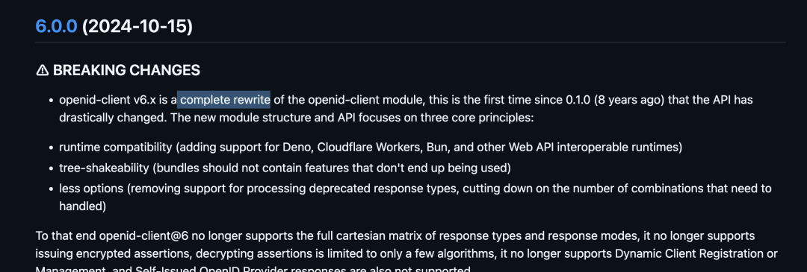

# 【第3660期】别再为覆盖率而写测试：真正可靠的单元测试应该这样做

前言

单元测试到底是保障质量的利器，还是形式主义的负担？很多团队追求高覆盖率，却忽视了真正的目标 —— 提升发布信心与行为正确性。本文结合真实项目经验，探讨如何测试 “行为” 而非 “实现”，为何应模拟系统边界而非内部细节，以及内存数据库与 HTTP 录制在实践中的价值。看完你或许会重新思考：你的测试，真的让你敢在周五晚上发布吗？今日前端早读课文章由 @Elio Capella Sánchez 分享，@飘飘编译。

译文从这开始～～

在我第一份软件工程师工作中，我参与的项目逐渐失控。和很多项目一样，新的使用场景不断被添加，却没有进行适当的重构。随着用户增多，我们被大量支持工单淹没，系统似乎处处出问题。很明显，我们必须提升质量，于是开始补充单元测试。

当时的技术负责人强制要求高测试覆盖率。但现实是：在代码已经完成之后再去写高质量的单元测试，非常困难。你很容易为了追求覆盖率而 “刷指标”，覆盖率成了好看的数字，却忽略了更重要的目标 —— 提升发布信心和保障系统行为的正确性。

[【第3597期】Google Chrome DevTools MCP：AI 代理现在可以在浏览器中调试、测试和修复代码](https://mp.weixin.qq.com/s?__biz=MjM5MTA1MjAxMQ==&mid=2651277543&idx=1&sn=18b092f538b688e06ee1bd09c05cf064&scene=21#wechat_redirect)

#### 一、测试行为，而不是函数

不要简单地在 `tests/` 目录里照搬 `src/` 目录结构。你应该不断问自己：如果我重构内部逻辑，测试代码是否可以完全不改？如果答案是否定的，那说明你测试的是实现细节，而不是对外行为。你测试的是代码结构，而不是功能表现。这种情况在给已有项目 “补测试” 时非常常见 —— 为了提高行覆盖率，而不是验证业务逻辑是否正确。

```
 /* cart.js */
 export function applyDiscount(subtotal) {
   return subtotal > 100 ? subtotal * 0.9 : subtotal;
 }

 export function calculateTotal(items) {
   let total = items.reduce((sum, item) => sum + item.price, 0);
   return applyDiscount(total);
 }

 /* cart.test.js */
 import * as cart from "./cart.js";

 // ❌ Tests the internal function
 it('should apply a 10% discount for orders over 100', () => {
   expect(cart.applyDiscount(110)).toBe(99);
 });

 // ✅ Better, test the discount behaviour is applied when calculating the cart total
 it('should calculate total with discount for high value carts', () => {
   const items = [{ price: 50 }, { price: 60 }];
   expect(cart.calculateTotal(items)).toBe(99);
 });
```
通过测试对外暴露的接口，你就不需要为了测试而导出 applyDiscount 这个内部函数。不要仅仅为了写测试而修改访问权限。

#### 二、模拟系统边界，而不是内部实现

在实际开发中，我们常常会把代码拆分成多个技术层，例如 controllers、views、stores 等。你可能会想对每一层都进行 mock，然后分别测试。但这同样会让测试紧密耦合于实现细节。

[【第3625期】写 TypeScript 不等于安全：边界设计才是关键](https://mp.weixin.qq.com/s?__biz=MjM5MTA1MjAxMQ==&mid=2651278175&idx=1&sn=2da60babc2929aa6137423c66bf21839&scene=21#wechat_redirect)

如果你在为浏览器应用写单元测试，建议只 mock API（网络请求），并通过模拟用户的 UI 操作来测试行为。这样代码更少，测试的可信度却更高。

```
 /* useUsers.js */
 import { useState, useEffect } from 'react';

 export const useUsers = () => {
   const [users, setUsers] = useState([]);

   useEffect(() => {
     fetch('/api/users')
       .then(res => res.json())
       .then(data => setUsers(data));
   }, []);

   return { users };
 };

 /* UserList.jsx */
 import React from 'react';
 import { useUsers } from './useUsers';

 export const UserList = () => {
   const { users } = useUsers();

   if (users.length === 0) return <div>Loading...</div>;

   return (
     <ul>
       {users.map(user => <li key={user.id}>{user.name}</li>)}
     </ul>
   );
 };

 /* UserList.test.jsx */
 import { render, screen } from '@testing-library/react';
 import { UserList } from './UserList';
 import * as userHook from './useUsers';

 // ❌ Mocking the Internals
 jest.spyOn(userHook, 'useUsers').mockReturnValue({
   users: [{ id: 1, name: 'Alice' }]
 });

 test('renders users', () => {
   render(<UserList />);
   expect(screen.getByText('Alice')).toBeInTheDocument();
 });

 // ✅ Mock the edges (HTTP request)
 global.fetch = jest.fn(() =>
   Promise.resolve({
     json: () => Promise.resolve([{ id: 1, name: 'Alice' }]),
   })
 );

 test('renders users', async () => {
   render(<UserList />);

   expect(screen.getByText('Loading...')).toBeInTheDocument();

   await waitFor(() => {
     expect(screen.getByText('Alice')).toBeInTheDocument();
   });

   expect(global.fetch).toHaveBeenCalledWith('/api/users');
 });
```
如果将来你把这个 hook 替换为 React Query、将 hook 内联进组件，或者升级 React 版本，都不需要修改这条测试。测试不再脆弱，这会让后续重构更加安心。一个测试同时覆盖了两个文件，你需要写的测试也会更少。

什么是 “系统边界”？在这个例子中，对于浏览器应用来说，一端是接收用户输入，另一端是发送和接收 HTTP 请求。任何第三方服务（例如使用 Stripe 做支付）、时间相关逻辑、随机数、文件读写等 I/O 操作，也都属于系统边界。

#### 三、务实优先于教条：使用内存数据库

后端应用中，很大一部分工作其实就是在数据库之上再封装一层逻辑。如果过于教条，你可能会把数据库也当作系统边界，然后决定：那也应该 mock 掉！

[【第1795期】SWR：最具潜力的 React Hooks 数据请求库](https://mp.weixin.qq.com/s?__biz=MjM5MTA1MjAxMQ==&mid=2651234968&idx=1&sn=2278072532f3b070878ad7246d2d95a4&scene=21#wechat_redirect)

但不妨更务实一点：我能不能启动一个内存数据库，在几毫秒内跑完上千条测试？可以。这样会不会引入不稳定性？不会。虽然仍然有 “网络请求”，但都是在同一台机器内部进行，没有延迟、没有丢包、也不会出现真正的网络错误。

```
 /* app.js */
 const express = require('express');
 const mongoose = require('mongoose');

 const UserSchema = new mongoose.Schema({
   email: { type: String, required: true, unique: true },
 });
 const User = mongoose.model('User', UserSchema);

 const app = express();
 app.use(express.json());

 app.post('/signup', async (req, res) => {
   try {
     const { email } = req.body;
     const user = await User.create({ email });
     res.status(201).json({ id: user._id, email: user.email });
   } catch (error) {
     if (error.code === 11000) {
       return res.status(409).json({ error: 'User already exists' });
     }
     res.status(500).json({ error: 'Internal Server Error' });
   }
 });

 module.exports = app;

 /* app.test.js */
 // ❌ Mocking Mongoose
 const request = require('supertest');
 const mongoose = require('mongoose');

 jest.mock('mongoose', () => {
   const mUser = {
     create: jest.fn(),
   };
   return {
     Schema: jest.fn(),
     model: jest.fn(() => mUser),
     connect: jest.fn(),
   };
 });

 const app = require('./app');

 describe('POST /signup (Mocked)', () => {
   test('should return 201', async () => {
     const MockedUser = mongoose.model('User');
     MockedUser.create.mockResolvedValueOnce({ email: 'test@example.com' });
     await request(app)
       .post('/signup')
       .send({ email: 'test@example.com' })
       .expect(201);
   });
 });

 // ✅ In-memory database to verify the E2E behaviour
 const assert = require('assert');
 const request = require('supertest');
 const mongoose = require('mongoose');
 const { MongoMemoryServer } = require('mongodb-memory-server');
 const app = require('./app');

 let mongoServer;

 beforeAll(async () => {
   mongoServer = await MongoMemoryServer.create();
   await mongoose.connect(mongoServer.getUri());
 });

 afterAll(async () => {
   await mongoose.disconnect();
   await mongoServer.stop();
 });

 afterEach(async () => {
   await mongoose.connection.db.dropDatabase();
 });

 describe('POST /signup', () => {
   test('should create a user and return 201', async () => {
     await request(app)
       .post('/signup')
       .send({ email: 'leader@example.com' })
       .expect(201);

     const userInDb = await mongoose.model('User')
       .findOne({ email: 'leader@example.com' });
     assert(userInDb);
   });

   test('should return 409 if user already exists', async () => {
     await mongoose.model('User').create({ email: 'leader@example.com' });

     await request(app)
       .post('/signup')
       .send({ email: 'leader@example.com' })
       .expect(409);
   });
 });
```
根据我的经验，与其 mock 数据库客户端、再去断言调用了哪些查询语句，不如使用内存数据库。它既运行高效，又能显著提升发布时的信心。

当然，很多工程师看到这里可能会反驳，说我提倡的是集成测试，而不是单元测试。

我更倾向于把自动化测试看成一个光谱：一端是运行飞快、非常稳定，但信心有限的测试；另一端是运行缓慢、偶尔不稳定，但信心很高的测试。只要你能在不明显增加耗时或不稳定性的前提下提升测试信心，那就值得去做。

#### 四、正确地进行 HTTP Mock

只要条件允许，我更喜欢 mock I/O 调用，而不是简单地 stub 掉某个第三方库。

[【第2933期】使用 ChatGPT 和 json-server 快速实现 mock API](https://mp.weixin.qq.com/s?__biz=MjM5MTA1MjAxMQ==&mid=2651262433&idx=1&sn=b009525fa4ff68415d49b9538add34a0&scene=21#wechat_redirect)

在 Filestage 实现 SSO 认证时，我使用了 OpenId Client 这个 npm 包。为了让测试尽可能有信心，在代码调通之后，我用 Nock 记录了相关的 HTTP 请求，并把这些录制下来的响应作为自动化测试的固定数据（fixture）。在其他语言中也有类似工具，例如 Ruby 里的 VCR。

```
 /* fixtures.js: created automatically when recording */
 exports.jwks = function () {
   return nock("https://filestage-test-idp.eu.auth0.com")
     .get("/.well-known/jwks.json")
     .reply(200, {
       keys: [
         {
           kty: "RSA",
           use: "sig",
           /* ... */
         }
       ]
     });
 };

 /* sso.test.js */
 describe("finishLogin", function () {
   it("should return user and state from response", async function () {
     fixtures.jwks();
     fixtures.backchannel.token();
     assert.deepEqual(
       await ssoService.finishLogin(
         sso.connection,
         fixtures.backchannel.response,
         {},
       ),
       {
         state: {
           iframeSupport: false,
         },
         user: {
           email: "test-idp-openid@filestage.io",
           fullName: "Test IDP OpenId",
           id: "auth0|6620da84985864790ec52d49",
           picture:
             "https://s.gravatar.com/avatar/8e539f47059edf49f18f82096f51edf7?s=480&r=pg&d=https%3A%2F%2Fcdn.auth0.com%2Favatars%2Fte.png",
         },
       },
     );
   });
 });
```
这种方式后来带来了巨大回报。因为在 JavaScript 生态中，库的 API 被彻底重写、导致所有旧代码失效的情况并不少见：



OpenId client 的破坏性更新

正是因为测试体系足够可靠，我才能放心地借助 AI agent，用相对 “暴力” 的方式完成对新版本库的升级。

#### 五、为什么我不喜欢 Jest + jsdom 这套组合

别误会，Jest 有很多做得很好的地方：并行测试、模块 mock，以及熟悉易用的 API。但 React 生态强力推动使用 jsdom 来进行测试：

在 create react app 工具中，Jest + jsdom 依然是推荐方案

整个行业也跟着采用了这一做法，性能问题随之而来。

在使用 React 之前，我们用的是 Angular 1.x，当时的测试方式是通过 Karma 在真实浏览器中运行测试。这意味着你可以访问浏览器的所有真实 API，甚至还能在多个浏览器中执行测试以验证兼容性。

但当我们开始在 Jest 中逐步扩展测试规模时，我发现有些组件测试竟然需要运行好几秒。而我们那套拥有 2000 多个测试的 Angular 项目，总共只需要 30 秒就能跑完。这是我在测试领域经历过的最大一次倒退。直到今天，我仍然后悔当初的选择。好在现在开始出现一些替代方案，比如 Vitest 最新推出的浏览器模式。

#### 六、支持 100% 覆盖率的理由

测试一直是个非常有争议的话题。有些工程师讨厌测试，觉得它只是繁琐的额外工作；也有人离不开测试。

我属于后者。我依赖测试来验证自己的判断、防止已经修复的 bug 再次出现，同时也能帮助我写出更低耦合的代码。

我非常支持测试，并且喜欢强制要求 100% 覆盖率。当然，我也承认覆盖率本身是一个 “虚荣指标”，可能会诱导人写一些没有价值的测试。我看到了这一点。但另一方面，它也会促使大家删除那些没有必要的分支或冗余代码，从而避免为它们编写测试。

自从我们在团队中引入这一习惯后，许多原本对测试持怀疑态度的人，在补测试的过程中反而发现了新的 bug，态度也随之改变。确实，我们写过不少无用的测试，但这也是宝贵的学习过程，如今测试质量已经明显提升。

#### 七、总结

测试行为，而不是实现细节。避免写那种和代码目录结构一一对应的测试。尽量从测试开始写代码，这会简单得多。如果你想更深入地研究，可以了解一下 TDD（测试驱动开发）。

你能否在重构时保持信心？那就 mock 系统的边界，而不是内部层次；使用 HTTP fixtures；使用内存数据库；在浏览器中运行测试，而不是去模拟浏览器。如果每次重命名函数或移动文件，测试就全部报错，那说明它们测试的是代码结构，而不是行为。

终极检验标准：你敢在周五傍晚发布吗？

如果你的测试体系能让你在周五下午 5 点安心上线，那你就构建了真正有价值的东西。

关于本文  
译文：@飘飘  
作者：@Elio Capella Sánchez  
原文：https://eliocapella.com/blog/writing-good-unit-tests/

这期前端早读课  
对你有帮助，帮” 赞 “一下，  
期待下一期，帮” 在看” 一下。
