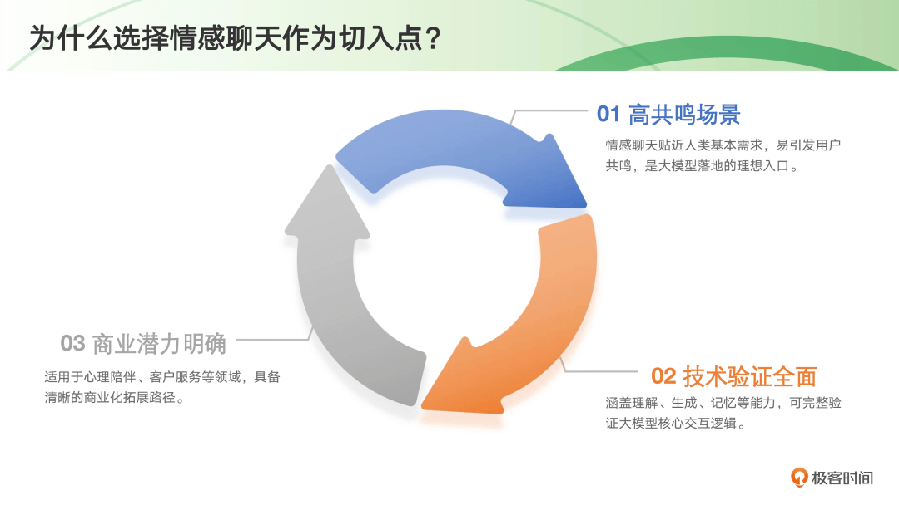
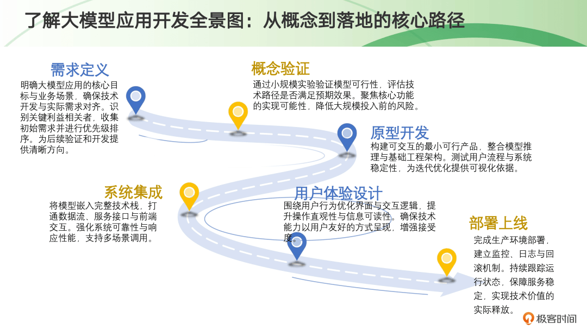
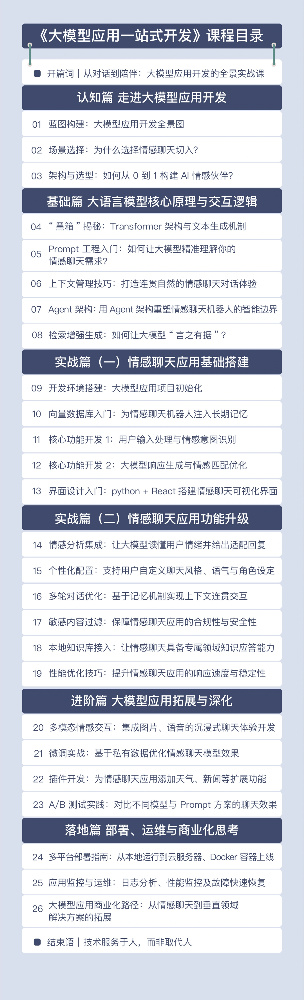
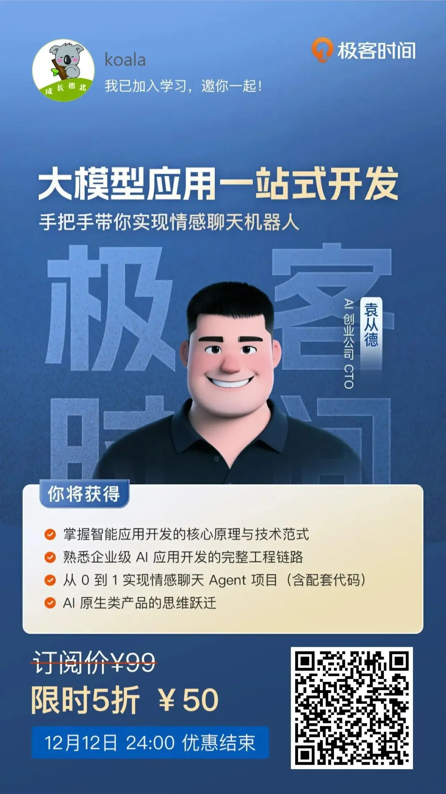

# 学了那么多 AI，却还是不会落地？

### 过去一年，我至少参加了 7 场线下大模型沙龙、加了 11 个技术交流群、收藏了 200+ GitHub 项目，却还停留在“换了个更聪明的搜索引擎”阶段——问点问题、写点代码片段、调个API。

经常出现的情况是，我Prompt 写了改，改了写，循环无数遍，模型回答却依旧时好时坏；想让它回答企业内部知识，却发现它给我凭空编造；构建了一个 RAG 系统，检索结果明明相关，生成的答案却驴唇不对马嘴....

  

转折在我参与的一次线下沙龙闭门复盘会，会上我认识了袁从德老师。作为 AI 创业公司 CTO，他带领团队从零打磨过多个千万级用户的情感交互产品，在大模型 Prompt 工程调优、多模态交互设计、商业化闭环验证上踩过坑也挖到过金矿。

  

不同于纯学术派老师的 “纸上谈兵”，袁老师的核心就是 “解决实际问题”。他不会跟你死磕复杂的数学推导，而是把晦涩的技术原理转化为 “能听懂、能复用” 的实战方法，带着你一步步把技术落地成可交付的“有温度、懂业务、能落地”的智能产品。

  

正如他在极客时间开设的《大模型应用一站式开发》课程，从理论到实践，从架构到部署，从技术到伦理，从 0 到 1 构建真正意义上的 AI 原生产品。他很清楚：一个“能用”的 AI 应用，和一个“好用、有人用”的情感聊天机器人，差距到底在哪。

扫码「免费」试读

双十二 5 折特惠，仅需 ¥50

粉丝福利：购买后记得来找我领取 ¥18 红包 ❤️

  

一开始我也问过袁老师，我说，你为什么选择“情感聊天”作为课程的主线？在无数大模型应用场景中，医疗、金融、教育、法律、客服……哪一个不比聊天更具商业价值？

  

袁老师说，因为“情感”是最接近人性的入口，而“聊天”是最自然的交互方式。

  

  

在所有 AI 应用中，情感陪伴看似轻，实则重。这门课，不教零散技巧，而是给你一套“从思维到上线”的完整体系。

  

知道袁老师开课，我第一时间就报名了，学完立马就安利给了团队。为什么我这么迫不及待？因为这门课确实抓住了咱们开发者的痛点，它有四大亮点特别打动我：

  

1. 路线清晰，一站通关：课程设计像一本精心编写的“开发指南”，从需求架构、技术选型，到项目初始化、核心功能实现，再到进阶的多模态能力和最终部署上线，带你层层递进，稳稳跑完全程，彻底掌握大模型应用的开发全链路。
  
    
2. 不止于Demo，生产级可用：很多课只讲到“代码跑通”，但这门课从架构设计之初，就融入了安全合规、性能监控和弹性扩展等硬核要求，确保你做出来的东西，是真正能扛住线上环境的。
  
    
3. 学完就能用，源码级交付：你将亲手完成一个叫“心语”的情感聊天 AI 项目，配套全部源码，11大核心功能逐一实现，拿过去就能运行、就能二次开发。
  
    
4. 经验可复用，场景广拓展：在这里学到的不仅是做一个聊天机器人，更是一套通用的架构思维和产品方法论。无论是教育、医疗、企服还是社交娱乐，你都能把这套经验轻松迁移过去，快速切入新赛道。
  
    

  

当然，理论再精彩，如果不能落地，也只是空中楼阁。这个课程真的能得到一个可跑通、可迭代、可商用的项目代码与思维框架，手把手带你从 0 到 1 完成项目的工程化落地，一步步带你解锁AI产品的诸多功能实现（情感识别、意图识别、长期记忆、RAG 知识库、多模态交互、上下文理解等），同时也让你把生产部署和优化迭代等配套环节也能稳稳拿下。

  

当你能设计出一个让用户愿意倾诉心声的 AI，你就已经具备了构建任何智能服务系统的能力。具体课程信息可以看目录：

  

  

写在最后

  

当你开启这门课的时候，你已经站在了时代的潮头。

  

你将学会的，不仅是如何调用一个 API、搭建一个界面、部署一个服务。你将掌握的，是一种全新的创造范式——用语言塑造智能，用数据训练共情，用系统承载关系。

  

你亲手打造的“心语”机器人，或许只是一个简单的聊天程序。但它的每一次回应，都凝聚着你对人性的理解；它的每一次记忆，都承载着你对关系的思考；它的每一次行动，都体现着你对责任的担当。

  

当代码开始“共情”，真正的智能时代，才刚刚开始！

  

  

扫码「免费」试读

双十二 5 折特惠，仅需 ¥50

粉丝福利：购买后记得来找我领取 ¥18 红包 ❤️
