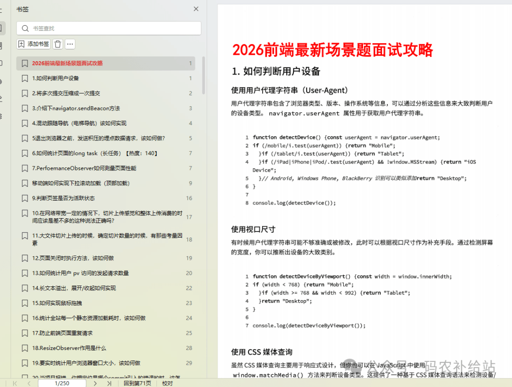
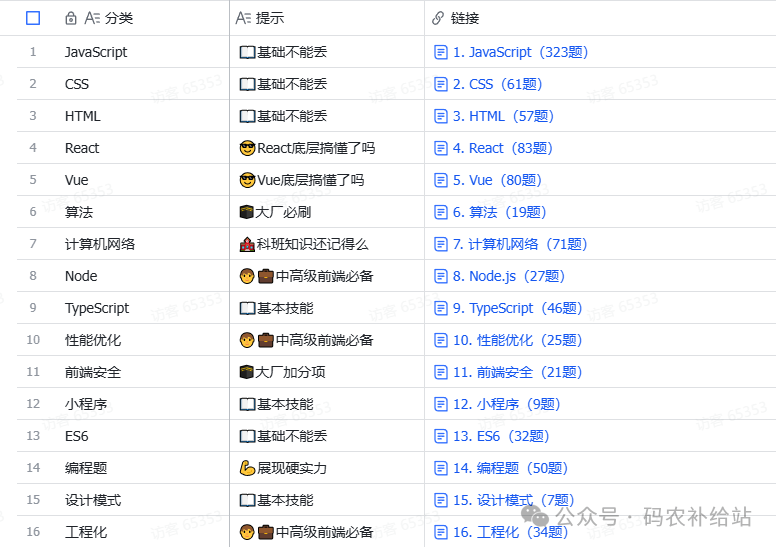

# web前端230道场景题，背完你的offer就炸了

Vue 还是 React？TypeScript 类型编程到底有多深？Webpack 优化和 Vite 凭什么那么快？

前端面试的准备，就像在拼一张复杂且不断变化的拼图。**HTML/CSS 的底层基础、JavaScript 的核心机制、TypeScript 的类型体操、框架的源码原理、计算机网络的具体应用、构建工具的工作流差异**——每一块都不能少。

我整理了数百份真实大厂面经，将这张“拼图”清晰地呈现在你面前。

1

2026前端最新场景题

2

前端重点面试题汇总

  

## **覆盖所有核心考点：**

- **JavaScript & TypeScript 的深度追问**
- 从 Event Loop 到原型链，从 V8 引擎到内存泄漏。
- `type` 和 `interface` 的深度区别？如何用泛型设计一个灵活的函数？类型编程如何应对复杂场景？
- **Vue & React 的原理与实战**
- **Vue 3:** 响应式原理（Proxy vs. defineProperty）、Composition API 设计思想、Diff 算法优化。
- **React:** Hooks 底层实现（为什么不能在条件语句中使用？）、Fiber 架构与并发模式、状态管理的最佳实践。
- **工程化：Webpack 与 Vite 的深入对比**
- Webpack 的打包流程、Loader 与 Plugin 的本质区别、常用的优化配置。
- Vite 为什么在开发环境下更快？Esbuild 扮演了什么角色？它与 Webpack 在生产环境构建上有何异同？
- **不容忽视的基石：HTML/CSS 与计算机网络**
- HTML 语义化、CSS 布局（Flex/Grid）、BFC、层叠上下文。
- HTTP/1.1 到 HTTP/2/3 的演进、HTTPS 的握手过程、缓存策略、跨域解决方案的底层原理。

**我们提供的，不只是问题与答案。** 每道题都附带**详细的解析、考察点的剖析、以及相关知识的延伸阅读**，旨在帮你建立清晰的知识链路，而不是死记硬背。

**如果你也厌倦了碎片化的搜寻，希望用系统性的准备来应对下一次挑战，那么这里应该能帮到你。**

****注：文中的前端场景面试题汇总PDF已经打包完毕，转发关注扫下方海报领取****

