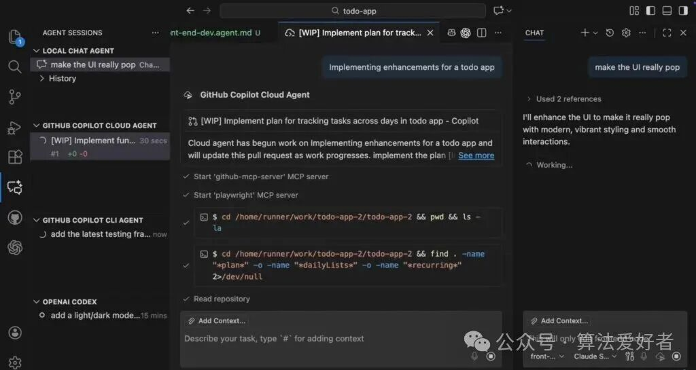
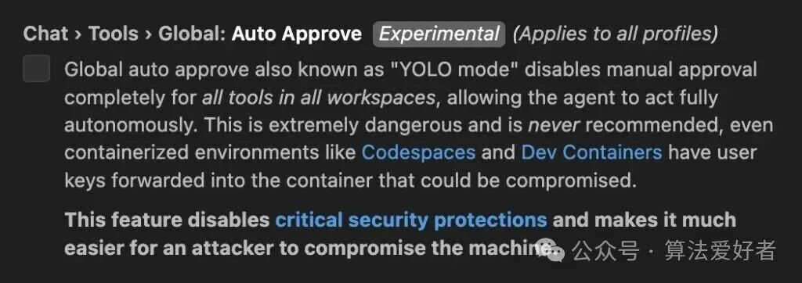
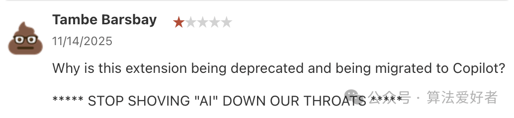

# VS Code 重磅更新：新增智能体管理功能，但是下架免费代码补全工具。网友：微软你倒是说清楚

微软对当下最受欢迎的程序员编辑器 VS Code 进行了一次大版本更新。

## 一、 智能体功能成主角，Agent HQ 概念引争议

此次更新的核心亮点集中在智能体辅助编程领域，不仅上线了智能体管理中心（Agent HQ）及十项智能体相关新功能，还同步带来了 TypeScript 7 的预览版本，同时宣布停用老牌免费代码补全工具 IntelliCode，转而主推付费订阅制的 GitHub Copilot。

智能体辅助编程是当前 AI 开发赛道的绝对热点。就在近期，智能体人工智能基金会（Agentic AI Foundation）刚刚成立，VS Code 的一众竞品也动作频频，谷歌的 Antigravity、JetBrains 的 Air 等工具都已相继开启预览测试。

为了不被竞争对手甩开，VS Code 此次更新重点强化了智能体能力，支持多个后台智能体同时运行，并推出 Agent HQ 作为统一管理入口。但令人费解的是，尽管更新日志将“VS Code 内置 Agent HQ”列为首个新特性，后续内容却再也没提及这个概念。

微软在 GitHub 的一篇帖子中解释道，Agent HQ 并非一个具体功能，而是一个长远发展方向，核心目标是将多家厂商的智能体无缝整合到开发者的编程工作流中。

作为 Agent HQ 体验的重要组成部分，VS Code 的智能体会话视图目前默认处于关闭状态

官方演示视频曾展示过这项功能——多个后台智能体可以同时在本地和云端协同工作。有趣的是，本周早些时候官方发布的 Agent HQ 介绍视频，实际演示的就是智能体会话视图的预览功能。尽管演示者对这个视图赞不绝口，但最新版本却选择默认关闭它，原因是智能体会话功能现已全面整合到聊天模块中。

更新日志指出：“如果用户仍想使用独立视图，可以通过配置项 `chat.agentSessionsViewLocation` 重新启用”，同时也明确表示，“在未来的版本中，我们计划彻底移除这个独立视图”。

抛开概念混淆的争议不谈，此次更新落地的十项智能体新功能确实看点十足，包括聊天窗口关闭时保持智能体活跃、智能体会话从本地迁移至云端、自定义后台智能体、运行自定义子智能体，以及在企业组织内共享智能体等，全方位提升了智能体的实用性和灵活性。

## 二、 智能体暗藏安全隐患，YOLO 模式引质疑

AI 智能体确实能显著提升开发效率，但随之而来的安全风险也不容忽视。一方面，智能体面临提示词注入攻击的威胁，恶意指令一旦被执行，可能会导致敏感信息泄露或系统被入侵；另一方面，生成式 AI 本身的不稳定性也可能引发意外故障——此前谷歌的 Antigravity 就曾发生过误删整个硬盘分区的严重事故，给开发者敲响了警钟。

值得注意的是，VS Code 此次更新还暗藏一个颇具争议的设置：YOLO 模式。这个名字取自“人生苦短，及时行乐”的英文缩写，功能则是对所有工作区的所有工具取消人工审批流程。该选项默认处于关闭状态，其描述信息也明确警示：“此功能会关闭关键安全防护，大幅增加设备被攻击者入侵的风险”。

既然存在如此大的风险，为什么微软还要开发这个功能？不少开发者质疑，这个选项的存在本身就是一个安全漏洞，从侧面反映出微软的两难处境：既要在白热化的 AI 智能体赛道上抢占先机，又要兼顾基本的安全常识，二者之间的平衡着实难以把控。

## 三、 TypeScript 7 开启预览，性能升级肉眼可见

除了智能体相关功能，此次更新还为开发者带来了一个重磅福利——TypeScript 7 的预览支持。作为即将发布的大版本，TypeScript 7 采用 Go 语言全新编写了编译器和语言服务，旨在实现原生代码级别的高性能表现。

微软首席产品经理丹尼尔·罗森瓦瑟表示，TypeScript 7 的开发进度已经相当成熟，非常推荐开发者尝试这个原生预览版本。“它能显著缩短加载时间、降低内存占用，让编辑器的响应速度变得更加流畅”，罗森瓦瑟补充道。

此次 VS Code 更新增加了一个实验性选项，用于启用 TypeScript 7。不过开发者需要先安装并配置好 TypeScript Go，之后它就能为 TypeScript 和 JavaScript 提供语言功能支持。

开发团队还透露了一个小细节：VS Code 的构建脚本现已全部迁移到 TypeScript 语言。此前这些脚本是 TypeScript 和 JavaScript 混合编写的，这一转变得益于 Node.js 22.18 及更高版本对 TypeScript 的原生支持，也体现出 TypeScript 作为一门编程语言，正逐渐实现让开发者“无感使用”的目标，生态发展日趋成熟。

## 四、 IntelliCode 正式下线，免费功能被付费服务取代

此次更新最让开发者不满的，当属老牌免费工具 IntelliCode 的停用。

这款工具曾为 Python、JavaScript、TypeScript、Java、C# 等多种主流语言提供基于本地模型的 AI 代码补全功能，凭借免费、高效的特点积累了超过 6000 万用户，开发者评价一直居高不下。

根据更新公告，后续 VS Code 的语言服务器仍会提供基础的代码补全、语法高亮等功能，但如果开发者还想使用 AI 辅助补全功能，就只能转向 GitHub Copilot。这款付费工具每月仅提供 2000 次免费补全额度，超出后需要订阅付费才能继续使用。

有用户质疑：“为什么要停用这个插件，转而强制迁移到 Copilot？”

 答案其实显而易见：订阅付费模式能为微软带来更多钱钱。

这再次印证了一个事实：尽管 VS Code 是开源软件，且提供了大量免费功能，但它终究是微软旗下产品，其更新迭代始终绕不开母公司的商业目标。

按照微软的更新计划，VS Code 本月将暂停月度更新节奏，此次新版本很可能是 2026 年 2 月前的最后一次重大更新。

（参考：DevClass，本文经由 AI 大模型翻译+优化）

\- EOF -

推荐阅读  点击标题可跳转

1、[JavaScript还能这样写？！ES2025新语法让代码优雅到极致](https://mp.weixin.qq.com/s?__biz=MzAxODE2MjM1MA==&mid=2651623535&idx=1&sn=5af68161cc72150298ed4a84ac721bcc&scene=21#wechat_redirect)

2、[小扎忍痛！亲口宣告了元宇宙的死亡](https://mp.weixin.qq.com/s?__biz=MzAxODE2MjM1MA==&mid=2651623523&idx=1&sn=2fb040c113419defed12f9e12c97b98d&scene=21#wechat_redirect)

3、[2024最新VSCode实用插件推荐，开发效率遥遥领先！超全面，快收藏~](https://mp.weixin.qq.com/s?__biz=MzAxODE2MjM1MA==&mid=2651621328&idx=1&sn=c378a2cc94005cac756a74e3861a2178&scene=21#wechat_redirect)
