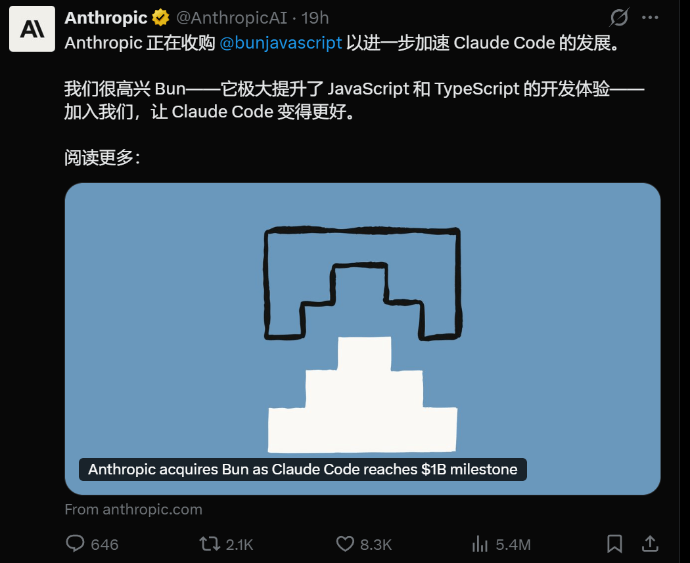
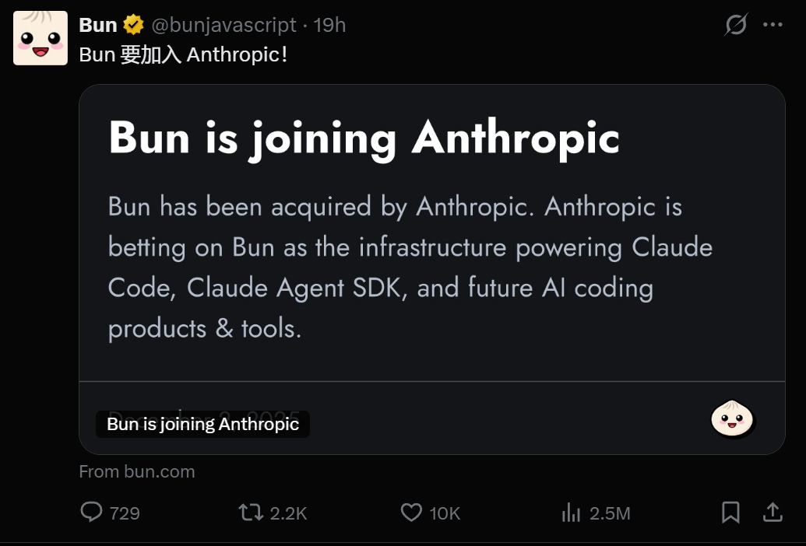
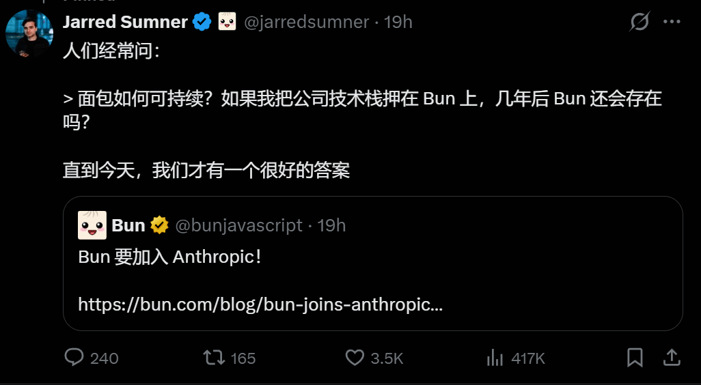

# Nodejs 运行时被收购！半年营收十亿美元

## 前言

> 我建了 **5000人前端学习群**，群内分享**前端知识/Vue/React/Nodejs/全栈**，关注我，回复**加群**，即可加入~ **事件机制深度解析：从物理点击到程序触发**

**Anthropic 收购 Bun：为 AI 编程时代重塑 JavaScript 运行时**

今天，AI 与前端领域迎来重磅消息：Anthropic 正式宣布收购高性能 JavaScript 运行时 Bun。此前已有征兆——其 AI 编程工具 Claude Code 刚用 Bun 重写了原生安装程序。

**Claude Code：半年收入突破 10 亿美元** 

与此同时，Anthropic 披露了一项惊人数据：Claude Code 公开测试仅 6 个月，年度经常性收入（ARR）已突破 **10 亿美元**。Netflix、Spotify 等巨头均已将其纳入开发流程，增长曲线近乎垂直。

**为何收购 Bun？给 AI 一个更快的“身体”？**

对于前端开发者来说，Bun 并不陌生。这个由 Jarred Sumner 在 2021 年创立的项目，凭借“比 Node.js 快几倍”的性能一战成名。它是一个“全家桶”：既是运行时（Runtime），也是包管理器（Package Manager），还是打包工具（Bundler）和测试运行器（Test Runner）。 但 Anthropic 买下它，绝不仅仅是因为它跑得快。

AI 生成代码速度极快，但执行环境可能成为瓶颈。Anthropic 收购 Bun，不仅因其性能远超 Node.js，更在于：

1. **极致性能**：匹配 AI 秒级编码，避免时间浪费在安装依赖或启动服务上。
2. **单文件分发**：基于 Bun 构建的原生安装程序，让 AI 工具部署更简单、更独立。
3. **掌控基础设施**：Bun 已成为 Claude Code 的底层依赖，掌握它意味着掌控 AI 编程的“运行根基”。

**创始人的选择：跳过挣扎，直奔未来**

Bun 创始人 Jarred Sumner 透露，尽管项目增长健康、资金充足，但他意识到软件开发范式正在被 AI 彻底改变。在与 Claude Code 团队深度交流后，他决定加入 Anthropic，让 Bun 站到变革的最中心。“与其苦苦寻找商业模式，不如专注打造最好的 JavaScript 工具。”

**对开发者意味着什么？** 官方明确承诺：

- Bun **继续保持开源**（MIT 协议）。
- 核心团队不变，继续专注性能与兼容性。
- 在 Anthropic 的资源支持下，Bun 将更专注于技术突破，无需为生存担忧。

**简言之，这不仅是收购，更是 AI 时代编程基础设施的一次关键对齐。**

## 结语

我是林三心，一个待过**小型toG型外包公司、大型外包公司、小公司、潜力型创业公司、大公司**的作死型前端选手

我建了一些**前端学习群**，如果大家想进群交流前端知识，可以关注我，回复**加群**

