# 库克告别苹果，“九子夺嫡”争夺CEO大战开始了

### 

> 转自：新智元

##### **【导读】苹果高层大地震！65岁的库克开始手抖，低调的他意图引退，而留下来的，是「库克内阁」的激烈宫斗，最新进展是M系列芯片之父请辞，库克欲设立CTO留下他。iPod之父也开始造势自己是最适合接任苹果CEO的那个人。**

2025 年的加州库比蒂诺，阳光依旧毫不吝啬地洒在 Apple Park 巨大的曲面玻璃上。

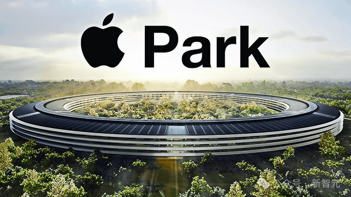

这座造价 50 亿美元、被乔布斯视作生平最后一件作品的环形建筑，宛如一艘停泊在地球表面的外星飞船，象征着一种近乎神性的完美秩序。

在这里，包装盒的设计都拥有专利，每一棵树的种植位置都经过精确计算，空气中弥漫着一种对「控制」的极致迷恋。

然而，在这个被视为科技界「梵蒂冈」的圣地内部，一种不易察觉却致命的动荡正在蔓延。

那些曾将苹果工牌视为职业生涯最高勋章的顶尖工程师、设计师和架构师，正在成群结队地寻找「救生舱」。

他们并不是因为这里待遇微薄而离开，也不是因为厌倦了加州的阳光。

他们离开，是因为感觉这艘飞船虽然依旧航行平稳，但似乎已经偏离了通往未来的航线。

他们驱车向北，穿过 280 号州际公路，涌向了 Meta 位于门洛帕克的园区，或是旧金山那个充斥着极客与理想主义的 OpenAI 总部。

这是一场关乎信仰的迁徙。

根据彭博社、华尔街日报等多方信源的交叉印证，苹果正在经历自 1997 年乔布斯回归以来最严重的人才流失潮。

从定义了 iPhone 触感的设计师，到掌控着全球数亿台设备算力命脉的芯片造物主，再到试图在生成式 AI 浪潮中突围的算法专家，离职名单上的每一个名字，都足以让竞争对手的猎头在深夜兴奋得失眠。

如果说过去二十年，硅谷的人才引力场中心在库比蒂诺，那么现在，这个引力场正在发生剧烈的磁极翻转。

这是科技历史车轮转向时发出的刺耳摩擦声。

**第一章：设计灵魂的「北伐」**

**当完美主义遭遇生成式混沌**

在苹果，设计团队（Industrial Design & Human Interface）不仅仅是一个部门，它是这家公司的灵魂，是凌驾于工程和财务之上的最高意志。

然而，这个曾经铁板一块的精英俱乐部，如今却成了人才流失的重灾区。

**1.1 艾伦·戴的转身，与Meta的豪赌**

艾伦·戴（Alan Dye），这个名字对于外界可能稍显陌生，但在苹果内部，他是乔纳森·伊夫（Jony Ive）离职后，维持苹果软件优雅与人性化的守门人。

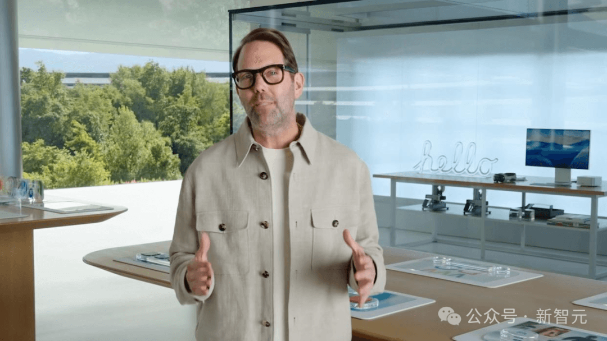

作为人机界面设计副总裁，他主导了 iOS、watchOS 以及那个令人惊叹却又充满争议的 Vision Pro 的界面设计。

他在苹果度过了 19 年的岁月，早已将这种极简主义的审美刻入了骨髓。

但就在 2025 年末，艾伦·戴决定离开。

他的下一站，是 Meta。

这一跳槽在硅谷引发的震动，不亚于当年安东尼·莱万多夫斯基从谷歌跳槽到 Uber。

为什么是 Meta？

在很多苹果精英眼中，Meta 曾是粗糙、甚至略带一点「邪恶」的数据公司的代名词。

但现实是，扎克伯格正在用一种近乎疯狂的投入，将 Meta 变成新的硬件创新实验室。

随同艾伦·戴一同前往的，还有他的副手、同样在苹果设计团队中举足轻重的比利·索伦蒂诺（Billy Sorrentino）。

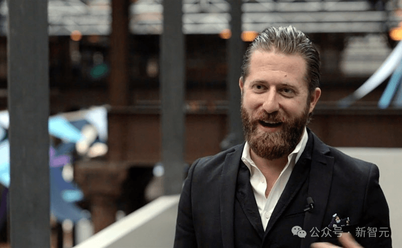

而在他们之前，Meta 已经挖走了大量苹果的设计骨干。

这场设计人才的迁徙，揭示了两种设计哲学的碰撞。

- **苹果模式：**追求的是**确定性的完美**。每一个圆角、每一个动画帧率、每一个阴影的深度，都是被精心设计和控制的。设计师是上帝，用户是在上帝构建的伊甸园里漫步。
- **Meta/****AI****模式：**追求的是**生成式的可能性**。在 AI 时代，界面不再是静态的，而是流动的、生成的。设计师不再是控制每一个像素，而是设计一套规则，让 AI 去生成界面。

对于像艾伦·戴这样的顶级设计师来说，Vision Pro 虽然精美，但它依然是在旧范式下的巅峰之作——它依然是一块屏幕（虚拟屏幕）。

而 Meta 的 Orion 原型机和扎克伯格对「具身智能」的愿景，虽然粗糙，却提供了一块更狂野、更少束缚的画布。

他们厌倦了在 0.1 毫米的倒角上打磨数年，他们渴望去定义下一个十年的交互语言——那个或许连屏幕都不需要的未来。

**1.2 薪酬的暴力美学**

当然，情怀之外，Meta 的「钞能力」也是无法忽视的因素。

据内部消息透露，为了挖角苹果的顶级 AI 和设计人才，Meta 开出了令人咋舌的薪酬包。

有些核心架构师的转会费加上长期股票激励（RSU），年均价值甚至高达 2500 万美元。

这种薪酬结构反映了扎克伯格的战时心态。

他在内部备忘录中曾引用「爱国者导弹」的比喻，而在人才争夺上，他显然是在用核武器。

相比之下，苹果虽然待遇优厚，但其薪酬体系相对僵化，且随着股价在高位盘整，RSU 的增长想象力已不如处于 AI 爆发前夜的 Meta 或 OpenAI。

**第二章：「造物主」的动摇**

**芯片帝国的隐忧**

如果说设计师的离开是失去了「面子」，那么约翰尼·斯鲁吉（Johny Srouji）的动摇，则可能让苹果失去「里子」。

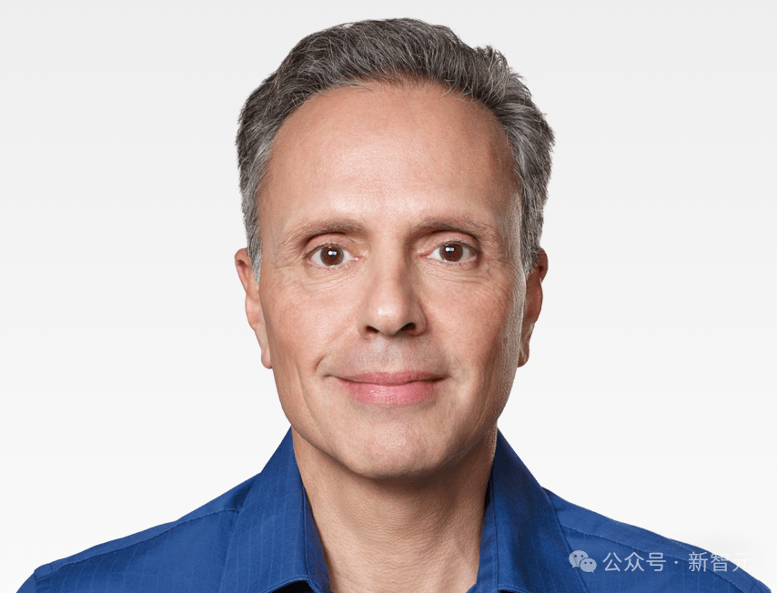

**2.1 沉默的基石**

在苹果现有的高管团队中，没有任何一个人的不可替代性像斯鲁吉这样高。

作为硬件技术高级副总裁，他是一张沉默的王牌。

从 2008 年加入苹果开始，他一手搭建了 Apple Silicon 团队，从 A4 芯片的牛刀小试，到 A 系列芯片在移动端的独孤求败，再到 M 系列芯片让 Mac 浴火重生，彻底摆脱 Intel 的掣肘，斯鲁吉是苹果万亿市值的护城河挖掘者。

正是因为有了斯鲁吉的芯片，苹果才能在功耗和性能之间找到那个不可思议的平衡点，才能让 MacBook Air 在不插电的情况下剪辑 8K 视频。

他是硬件世界的「造物主」。

**2.2 「除了 CEO，我无处可去」**

然而，2025 年底的寒风吹进了斯鲁吉的办公室。

彭博社爆出猛料：斯鲁吉已告知蒂姆·库克（Tim Cook），他正在「认真考虑」离开苹果。

这并不是一次普通的退休预告。

坊间传闻，斯鲁吉的态度甚至带有某种决绝的意味。

虽然「Make me CEO or I quit」这样的说法可能带有戏剧夸张成分，但它精准地击中了问题的核心：在苹果现有的权力结构中，技术官僚的天花板已经触顶。

接班人计划似乎更倾向于硬件工程主管约翰·特努斯（John Ternus）或运营出身的高管，这符合库克一贯的「稳健」风格。

对于斯鲁吉这样一位在技术领域拥有绝对权威的领袖来说，如果无法触及最高权杖，而无论是英特尔、OpenAI 还是其他渴望自研芯片的巨头，又愿意提供一片完全属于他的新领地，离开便成了一个理性的选项。

**2.3 失去斯鲁吉的「蝴蝶效应」**

斯鲁吉若真的离职，其破坏力将是核弹级的，且具有滞后性：

- **技术断层：**芯片研发周期长达 3-5 年。明年的 iPhone 18 可能不会受影响，但 2028 年的 2nm 甚至 1nm 芯片规划谁来拍板？
- **人才雪崩：**芯片设计是一个高度依赖「将才」的领域。斯鲁吉的威望维系着一支由以色列海法、德克萨斯奥斯汀和硅谷精英组成的庞大军团。一旦主帅离营，这支军团极易被高通、英伟达或微软以高薪拆解。
- **资本动荡：**华尔街之所以给苹果高估值，很大程度上是相信其硬件性能的绝对领先。一旦这一信念动摇，苹果的溢价能力将大打折扣。

**第三章：AI 的迷途**

**从「Siri 之死」到「OpenAI 之魅」**

在硅谷，有两种离职：一种是功成身退，一种是力不从心。

约翰·詹南德雷亚（John Giannandrea）的黯然离场，无疑属于后者。

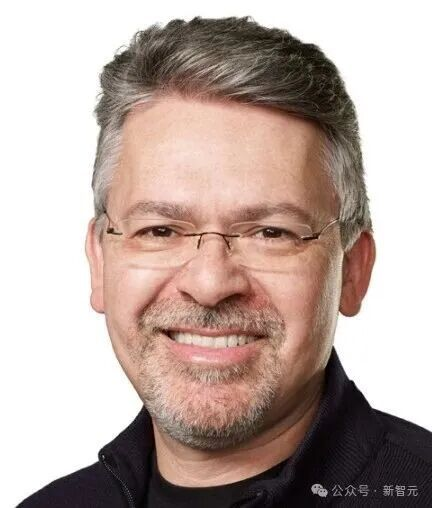

**3.1 失去的七年**

2018 年，当詹南德雷亚从谷歌带着「AI 统帅」的光环加入苹果时，外界曾寄予厚望，认为他能拯救那个只会讲冷笑话、经常听不懂人话的 Siri。

然而，七年过去了，Siri 依然步履蹒跚，甚至在 ChatGPT 横空出世后显得更加像一个上个时代的古董。

2025 年 12 月，苹果宣布詹南德雷亚将卸任 AI/ML 战略高级副总裁，并在 2026 年春季退休。

接替他的是来自微软和谷歌的前高管 Amar Subramanya。

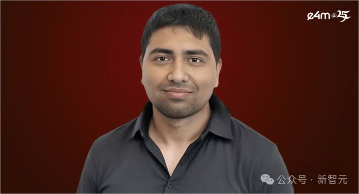

这是苹果变相承认其第一阶段 AI 战略的全面溃败。

**3.2 文化的囚徒：隐私之上的代价**

为什么谷歌的 AI 负责人在苹果会「水土不服」？

核心矛盾在于**文化**。

AI 的进步，尤其是大模型时代的进步，依赖于极度开放的学术交流、开源社区的协作和大规模的数据吞吐。

OpenAI 的成功正是建立在某种「公开的疯狂」之上。

但在苹果，**保密是最高信仰，也是一种行政命令**。

- **学术孤岛：****苹果的研究员被禁止在 NeurIPS、ICML 等顶级会议上随意发表论文，这导致他们在学术圈「失声」。**对于顶级科学家来说，无法发表论文就意味着在学术界死亡。这使得苹果难以招募到那些最有野心的博士生。
- **算力乞丐：**令人难以置信的是，曾有报道指出，苹果内部的 AI 团队甚至需要去「乞求」计算资源。苹果的数据中心架构长期以来是为 iCloud 存储和服务设计的，而不是为大模型训练这种吞吐量极大的任务设计的。当 Meta 在囤积几十万块 H100 显卡时，苹果的工程师还在为 GPU 配额发愁。
- **Siri 的技术债：**詹南德雷亚花费了大量时间去修补 Siri 陈旧、基于规则的底层代码，试图在旧地基上盖摩天大楼，而不是像 OpenAI 那样推倒重来，直接构建基于 Transformer 的生成式架构。

**3.3 人才流向 OpenAI：信仰的改宗**

与此同时，OpenAI 成为了苹果 AI 人才的最大收割机。

据统计，仅在一个月内，就有数十名苹果工程师加入了 OpenAI 的硬件和模型团队。

这其中，最引人注目的是庞若鸣，他曾是苹果基础模型团队的负责人。

他的离开，直接导致了苹果大模型研发进度的停滞。

而像 Tom Gunter、Frank Chu 这样的核心骨干，也纷纷转投 Meta 或 OpenAI。

这种流动，像是一种「信仰的改宗」。

在这个 AI 定义未来的时代，工程师们更愿意去一个将 AI 视为核心产品、视为「神」的地方，而不是一个将 AI 视为「让 iPhone 拍照更好看」的辅助功能部门。

## 第四章：幽灵复仇——乔纳森·伊夫的影子帝国

苹果的人才流失不仅仅是分散的，还有一个有组织的「接收端」，那就是前首席设计官乔纳森·伊夫（Jony Ive）与 OpenAI CEO 奥特曼的联手。

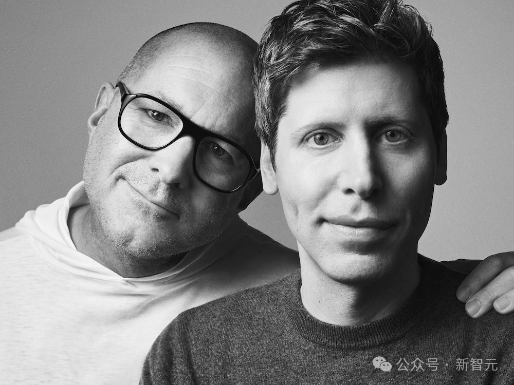

**4.1 「旧爱」的召唤**

虽然伊夫已经离开苹果多年，但他在苹果设计团队中的精神图腾地位依然稳固。

现在，他正在通过与 OpenAI 的合作，重新召集旧部。

据《纽约时报》等媒体报道，伊夫的独立设计公司 LoveFrom 正在与 OpenAI 深度合作，开发一款被称为「AI 时代的 iPhone」的硬件设备。

为了这个项目，伊夫不仅带走了他在苹果的老搭档 Tang Tan（前 iPhone 产品设计副总裁），还开始系统性地挖角苹果的硬件工程团队。

**4.2 降维打击**

这一动作对苹果构成了双重打击。

**一方面，人才被抽取。**

伊夫带走的不是写代码的软件工程师，而是那些最懂得如何将复杂的硅芯片、散热模组和电池封装进极简玻璃铝合金外壳里的**顶级硬件工匠**。这是苹果最引以为傲、也最难复制的资产。

**另一方面，路线图被截杀。**

苹果也在研发 AI 硬件（如智能眼镜、带屏幕的 HomePod、甚至是桌面机器人）。但伊夫和奥特曼的联盟，意味着市场上将出现一个既拥有 ChatGPT 大脑，又拥有苹果级审美和工艺的新物种。

对于那些在苹果内部感到憋屈的硬件工程师来说，去 OpenAI 造一个「没有屏幕、完全语音交互、甚至能理解情感」的新设备，听起来比每年给 iPhone 挪动摄像头的位置、把边框再缩窄 0.5 毫米要有趣得多。

  

**第五章：金手铐的断裂**

**与强制返岗的反噬**

除了宏大的愿景和技术路线之争，推倒多米诺骨牌的还有更现实的因素：办公政策与薪酬结构。

**5.1 强制返岗（RTO）的傲慢**

库克一直坚信「Serendipity」（意外之喜）来自于面对面的交流，因此苹果是硅谷巨头中对 RTO（Return to Office）政策执行最坚决、最不妥协的公司之一。

苹果要求员工每周至少三天（通常是周一、周二、周四）必须在办公室。

然而，对于习惯了远程工作的 AI 研究员和软件工程师来说，强制回到库比蒂诺打卡不仅是一种通勤的折磨（湾区的交通已成噩梦），更是一种不被信任的信号。

一位已离职的苹果高级机器学习工程师在 Blind 上吐槽：「我在家里能用 12 小时专注训练模型，但在 Apple Park，我得花 2 小时通勤，然后在开放式办公区里戴着降噪耳机假装自己不在场。这不仅是效率问题，更是尊严问题。」

相比之下，很多初创公司和甚至像 Airbnb、Atlassian 这样的公司提供了「随处工作」的选项。即便是执行 RTO 的 Meta，其文化也相对灵活。

当一名资深的 ML 工程师发现他可以在太浩湖（Lake Tahoe，macOS 26 因此得名）的别墅里为 OpenAI 写代码，而不必在 101 公路上堵车时，离职信就已经在酝酿中了。

**5.2 股价的引力失效**

长期以来，苹果的 RSU（受限股票单位）被称为硅谷的「金手铐」。

但随着苹果市值突破 3.5 万亿美元，其增长空间在很多员工眼中已经见顶。

「如果你在 2010 年加入苹果，你是在坐火箭；如果你在 2025 年加入，你是在坐游轮。」

相比之下，OpenAI、SpaceX 或者是被 AI 重新点燃的 Meta，其潜在的期权增值倍数要大得多。

OpenAI 的估值在短短几年内从几十亿飙升至千亿美金，这种指数级的财富效应，对于渴望财务自由的年轻一代天才来说，比苹果稳健但缓慢的增长要诱人得多。

  

**第六章：反向操作**

**苹果的法律堡垒与防御**

当然，苹果并没有坐以待毙。

在这场人才战争中，库克展现了他作为顶级战术家的一面：在技术防线吃紧时，通过法律手段加固城墙。

**6.1 詹妮弗·纽斯特德的加盟：以毒攻毒**

就在苹果人才外流最严重的时刻，库克完成了一次漂亮的「反挖角」。

苹果宣布聘请 Meta 的首席法务官詹妮弗·纽斯特德（Jennifer Newstead）担任下一任总法律顾问，接替即将退休的凯瑟琳·亚当斯（Katherine Adams）。

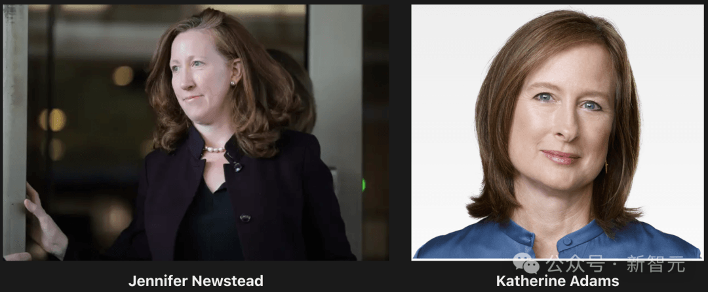

这是一次极具战略意义、甚至带有某种黑色幽默的任命。

纽斯特德在 Meta 的最大战绩，就是刚刚帮助公司在 FTC（联邦贸易委员会）的反垄断诉讼中取得了标志性的胜利，保住了 Instagram 和 WhatsApp 不被拆分。

她被誉为华盛顿最强硬的法律斗士之一，拥有前国务院法律顾问和《爱国者法案》起草者的深厚背景。

**6.2 生存之战优先**

此刻的苹果，正面临着美国司法部（DOJ）发起的史无前例的反垄断诉讼，指控其非法垄断智能手机市场，并试图拆解苹果的「围墙花园」。

在欧盟，苹果的 App Store 商业模式也已被《数字市场法案》（DMA）打得千疮百孔。

苹果挖来纽斯特德，潜台词非常明确：**我们可能在** **AI****上暂时落后，但在生存之战（反垄断）上，我们必须赢。**

只要保住了 App Store 的控制权和 iPhone 的生态壁垒，苹果就有足够的现金流去通过收购或研发慢慢追赶 AI。

这显示了库克作为运营大师的务实：在创新受阻时，优先确保护城河不被监管攻破。

  

**第七章：王座的交接**

**约翰·特努斯与库克的黄昏**

所有的人事动荡，最终都指向了一个核心问题：**权力的更迭**。

**7.1 库克时代的内阁解散**

2025 年至 2026 年，苹果的核心管理层迎来了一次彻底的换血。

这或许是整个「库克内阁」的谢幕：

- **凯瑟琳·亚当斯（Katherine Adams）：**总法律顾问，退休。

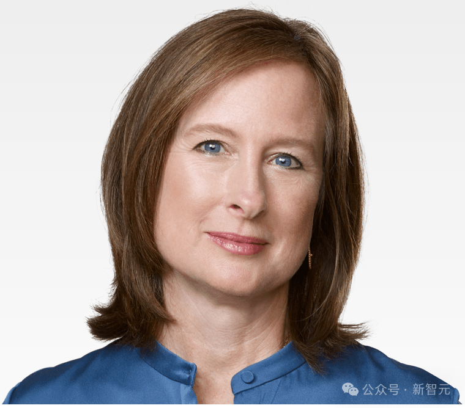

- **丽莎·杰克逊（Lisa Jackson）：**曾任奥巴马政府环保署署长，负责环境与政策的高级副总裁，退休。

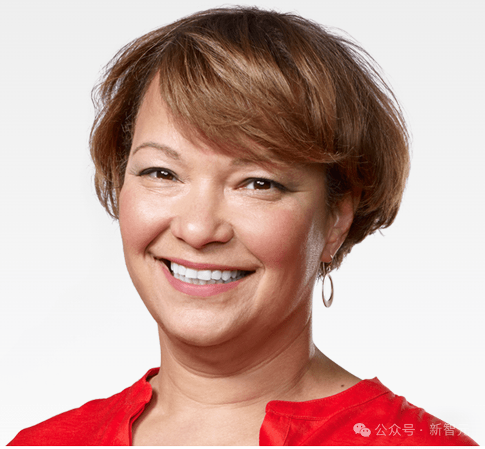

- **杰夫·威廉姆斯（Jeff Williams）：**首席运营官，曾经最像库克的接班人，如今已年过六旬，虽然未完全离开，但其角色正在边缘化，权力正在下放。

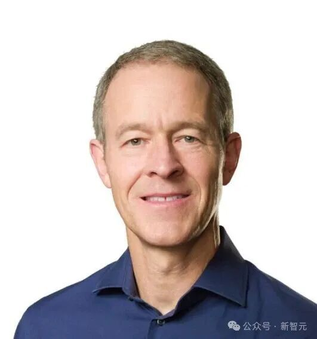

- **菲尔·席勒（Phil Schiller）：**App Store 的掌门人，虽然挂着「Apple Fellow」的头衔，但其实际影响力正在减弱。

这一连串的名字加在一起，意味着维持了苹果过去十年「超级稳定」局面的权力架构正在解体。

**7.2 约翰·特努斯：被选中的「好孩子」**

在所有可能的继任者中，硬件工程高级副总裁约翰·特努斯（John Ternus）成为了领跑者。

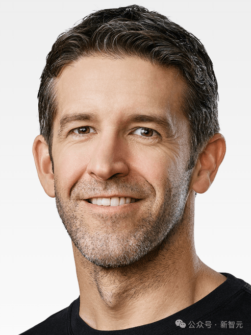

根据 Polymarket 的预测，他接班库克的概率高达 55%。

特努斯现年 50 岁，年轻、英俊、极度理智。

他在苹果内部以善于合作、情绪稳定、注重细节著称。

有一个广为流传的故事是：早年为了检查 iMac 显示器背后的螺丝纹路，他曾在深夜拿着放大镜与供应商争执，因为供应商做了 25 道纹路，而苹果设计的是 35 道。

这种对细节的偏执深受库克赏识。

但问题在于，特努斯太像库克了。

他是一位完美的执行者，却鲜有展现出乔布斯式的对产品的狂热直觉。

有人批评他过于规避风险，导致硬件团队缺乏大胆的创新项目。

如果特努斯接班，他面临的将是一个地狱难度的开局：

- **内部：**如何压服像克雷格·费德里吉（Craig Federighi，软件主管）这样资历更深的大佬？如何留住斯鲁吉这样的技术大拿？

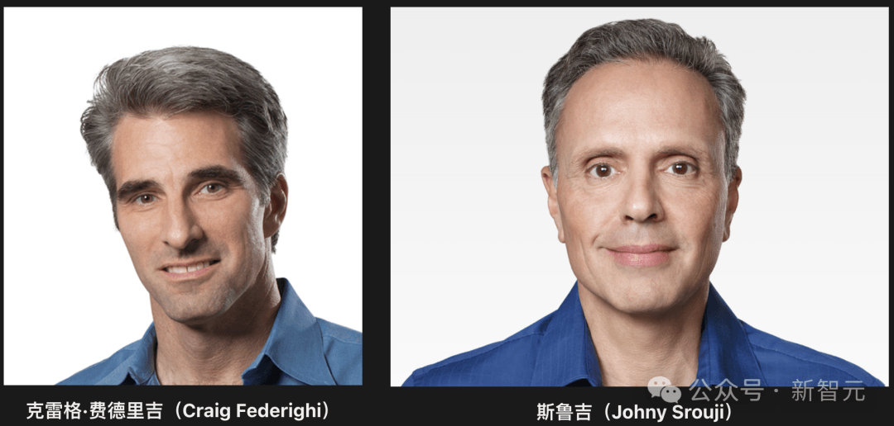

- **外部：**如何在 AI 时代重塑苹果？
- **舆论：**外界期待的是另一个乔布斯，但苹果给出的似乎是另一个库克。

**7.3 库克颤抖的手，与时代的余晖**

甚至连铁人一般的蒂姆·库克，也显露出了岁月的痕迹。

虽然他依然保持着凌晨 4 点起床的习惯，但近期在公开场合，细心的人们发现他的手部出现了轻微的震颤。

这或许是生理性的，也或许是巨大的精神压力所致。

库克无疑是伟大的。

他将苹果的市值翻了数倍，打造了无可匹敌的供应链。

但他毕竟是上一个时代的赢家。当他在白宫将24K金底座的康宁玻璃纪念盘送给特朗普时，他依然在用旧世界的逻辑（制造业、关税、贸易保护）来维护苹果的利益。

而此时，OpenAI 的奥特曼正在用算力外交和 AGI 愿景改写世界的规则。

  

**结语**

站在 2025 年的尾声回望，苹果依然是这个星球上最赚钱的公司。

Apple Park 的访客中心依然会人满为患。

但在这座完美的围城之下，暗流已经涌动成河。

几十名高管和工程师的离职，或许意味着硅谷创新范式的转移。

Meta 正在用黑客精神重塑社交与硬件的边界，OpenAI 正在用纯粹的算力暴力美学定义智能的未来。

而苹果，这家曾经代表着「Think Different」的公司，此刻似乎变得过于相同——相同的迭代节奏，相同的管理架构，以及越来越相同的谨慎。

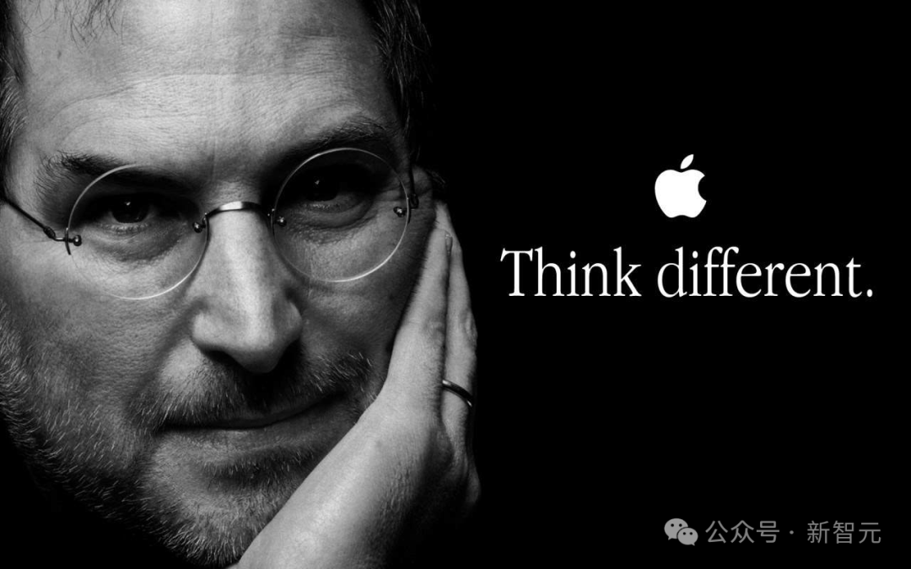

人才的流动，永远是产业兴衰最诚实的风向标。

当那些最聪明的大脑开始认为「另一个地方」更酷时，仅仅靠高薪、完美的办公大楼和免费的食堂是留不住他们的。

因为对于这些创造者来说，他们不仅想要一份工作，他们想要的是——参与未来。

对于库克和被选中的特努斯来说，最大的挑战，或许在于能否重新点燃那团曾让无数工程师彻夜不眠的理想主义之火。

否则，正如海明威在《太阳照常升起》中所言：「**太阳照常升起，但不再照耀同样的帝国。**」

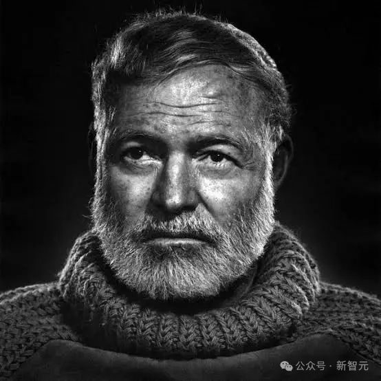

海明威

参考资料：  

https://www.theinformation.com/articles/silicon-valley-buzzing-apple-ceo-succession

https://www.bloomberg.com/news/articles/2025-12-06/apple-rocked-by-executive-departures-with-johny-srouji-at-risk-of-leaving-next

推荐阅读  点击标题可跳转

1、[Cloudflare 被 React 坑了！两周内二次“翻车”](https://mp.weixin.qq.com/s?__biz=MzAxODE2MjM1MA==&mid=2651623475&idx=2&sn=502e8eea994a373f9f92d76582df70a2&scene=21#wechat_redirect)

2、[就因为package.json里少了个^号，我们公司赔了客户十万块](https://mp.weixin.qq.com/s?__biz=MzAxODE2MjM1MA==&mid=2651623475&idx=1&sn=99580c15cf25db76918e9e3142848f33&scene=21#wechat_redirect)

3、[马斯克又夸微信：“中国之外不存在这种国民级软件”。网友神吐槽：“几乎每个 APP 都有你说的功能，就问吊不吊”](https://mp.weixin.qq.com/s?__biz=MzAxODE2MjM1MA==&mid=2651623449&idx=1&sn=6ed4bdab4d0b06164636b230f3cb9b96&scene=21#wechat_redirect)
