# AI+时代工程师的空间在哪儿——从范式演进看技术机会

  

  

  

本文探讨了AI时代工程师的核心价值与技术机会，指出随着大语言模型（LLM）从GPT-1演进至Agent智能体阶段，工程师的关键角色已从“调用模型”转向“深度挖掘模型潜力”的系统性工程实践。作者通过四阶段范式演进梳理技术脉络指出模型决定智能下限，而工程师对业务场景的拆解能力、系统架构设计能力（流程编排/工具抽象/记忆机制/评测体系）才是决定产品体验上限的关键——AI工程师正从“炼丹师”进化为“系统架构师”与“场景定义者”。  

  

前言

  

随着⼤语⾔模型（LLM）从 GPT\-1 进化到如今的 Agent 智能体时代，我们往往容易陷⼊⼀个误区：认为 AI 应⽤效果的上限完全取决于基座模型的能⼒，⼯程师能做的只是“调⽤”和“等待”。然⽽，回顾 LLM 的发展史，我们会发现⼯程师始终在其中扮演着点⽯成⾦的⻆⾊。⽆论是通过思维链（CoT）激发模型的深度推理，还是利⽤ ReAct 框架让模型“⻓出⼿脚”，亦或是通过架构设计解决幻觉与记忆问题，这些突破本质上都是⼯程设计对模型潜⼒的深度挖掘。

  

模型决定了下限，⽽⼯程师和对场景的理解决定了上限。本⽂档旨在为团队梳理 LLM 技术的演进脉络。我们希望⼤家看到：在基座模型⽇益强⼤的今天，构建系统的能⼒——包括对业务场景的拆解、流程编排、⼯具抽象以及评测体系的搭建——才是决定产品最终体验的关键变量。

  

除了等待模型变强，我们⼿中对场景的深刻理解和⼯程利器，完全可以让80分的模型在特定领域发挥出 95 分甚⾄超乎预期的效果。

  

第⼀阶段：基座模型的范式确⽴(TheFoundation)

  

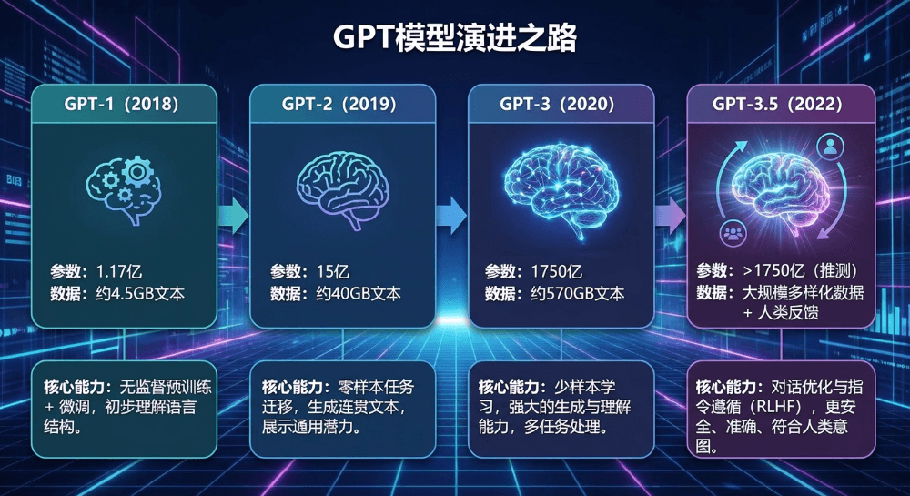

  

▐  **1**. GPT-1: 范式的确⽴ 2018

  

论⽂：Improving Language Understanding by Generative Pre-Training (2018)

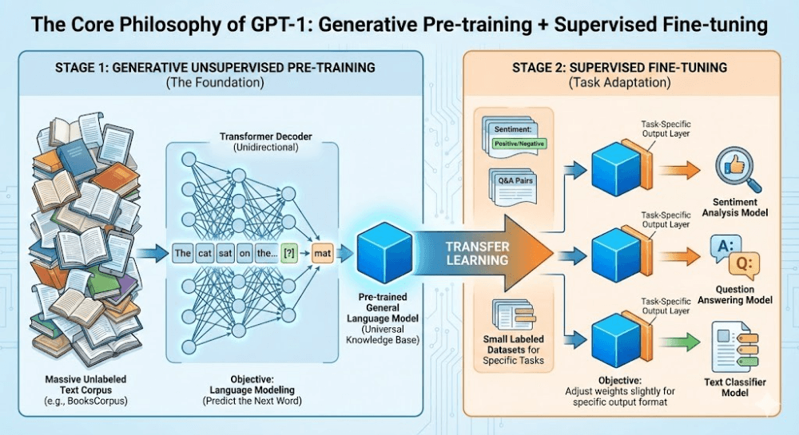

  

- 核⼼思想：先预训练，再微调 (Pre-training + Fine-tuning)

在 GPT-1 之前，做不同任务通常需要设计不同的模型结构（翻译⽤⼀种，分类⽤⼀种）。GPT-1 提出：能不能先⽤海量⽆标注⽂本训练⼀个“通⽤的语⾔理解模型”，然后针对特定任务只需微调（Fine-tune）⼀下？

- 基本原理：
- 架构：12 层 Transformer Decoder（1.17 亿参数）。
- 第⼀阶段（⽆监督预训练）：在 BooksCorpus（书籍数据）上训练模型预测下⼀个词。让模型学会语法、句法和世界知识。
- 第⼆阶段（有监督微调）：在特定任务（如情感分析、问答）的有标注数据上，调整模型参数，使其适应特定任务。
- 影响：
- 结束了“⼀种任务⼀个模型”的时代。
- 确⽴了 “预训练 + 微调” 这⼀统治 NLP 领域多年的⼯业标准范式。
- 证明了 Transformer 结构在⻓⽂本依赖上优于 RNN/LSTM。

  

▐  **2**. GPT\-2: ⾛向通⽤与零样本

  

论⽂： Language Models are Unsupervised Multitask Learners (2019)

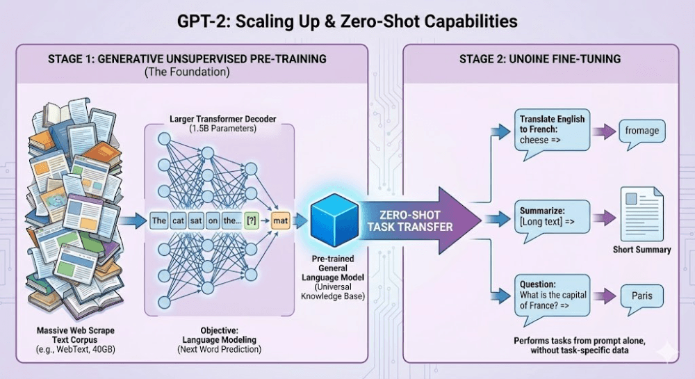

  

- 核⼼思想：零样本学习 (Zero-shot Learning)

OpenAI 发现，只要模型够⼤、数据够多，模型似乎不需要“微调”就能做任务。他们提出了 “所有的 NLP 任务本质上都是预测下⼀个词” 的理念。

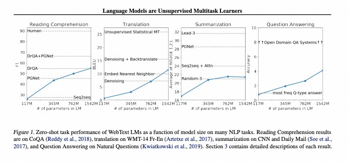

- 基本原理：
- 架构：结构没变，但规模扩⼤了 10 倍（15 亿参数）。
- 数据：使⽤了⾼质量的 WebText（Reddit ⾼赞链接⽹⻚），数据量和多样性⼤增。
- 机制：去掉了“微调”步骤。直接给模型输⼊提示（Prompt），看它能不能直接输出答案。
- 翻译任务输⼊："English: Hello, French: " -> 模型预测 "Bonjour"
- 摘要任务输⼊："\[⻓⽂章\] TL;DR:" -> 模型预测摘要
- 影响：
- 证明了“⼤⼒出奇迹”：单纯增加模型参数和数据量，就能显著提升性能。
- 展示了模型在没有⻅过某个任务的数据时，也能凭借通⽤知识解决问题的潜⼒（Zero-shot）。
- 因⽣成假新闻能⼒太强，OpenAI 最初推迟了发布，引发了关于 AI 安全的⼴泛讨论。

  

▐  **3**. GPT-3: 暴⼒美学与涌现

  

论⽂： Language Models are Few-Shot Learners (2020)

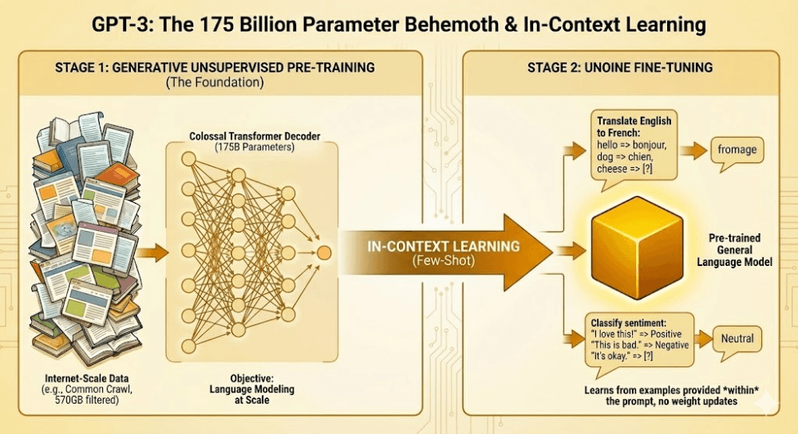

  

- 核⼼思想：上下⽂学习 (In-context Learning / Few-Shot)

GPT-3 彻底放弃了“微调模型参数”。它的核⼼理念是：不要改动模型参数，⽽是通过“提示⼯程”让模型学会任务。 给它⼏个例⼦（Few-shot），它就能瞬间学会规律。

- 基本原理：
- 架构：依然是 Transformer Decoder，但规模扩⼤了100倍（1750亿参数）。
- 数据：⼏乎吞噬了整个互联⽹（Common Crawl）。
- 机制：
- 不更新权重：在使⽤时，不进⾏任何梯度下降。
- Prompt 引导：⽤户在输⼊中提供⼏个“问题\-答案”的例⼦，模型通过读取上下⽂（In-context），利⽤其强⼤的模式匹配能⼒⽣成后续内容。
- 影响：
- 能⼒的“涌现” (Emergence)：当参数量突破 1000 亿⼤关，模型突然具备了以前⼩模型完全没有的能⼒（如复杂的逻辑推理、代码⽣成）。
- Prompt Engineering 的诞⽣：催⽣了全新的交互⽅式，⼈们开始研究如何⽤⾃然语⾔“指挥”模型。
- 商业化 API：证明了通⽤⼤模型可以作为⼀个底座（Infrastructure），⽀撑起⽆数下游应⽤，开启了⽣成式 AI 的商业浪潮。

  

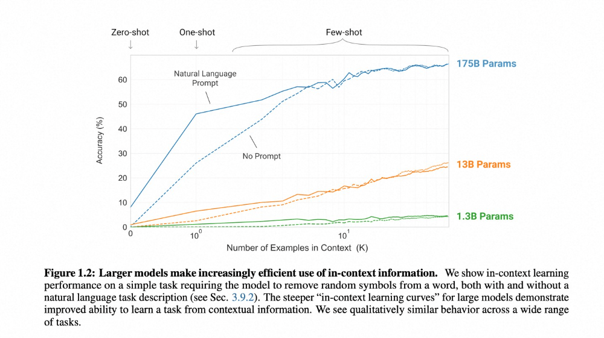

  

▐  **4**. GPT-3.5 (InstructGPT): 通过 RLHF 与⼈类意图对⻬

  

论⽂：《Training language models to follow instructions with human feedback》（2022）

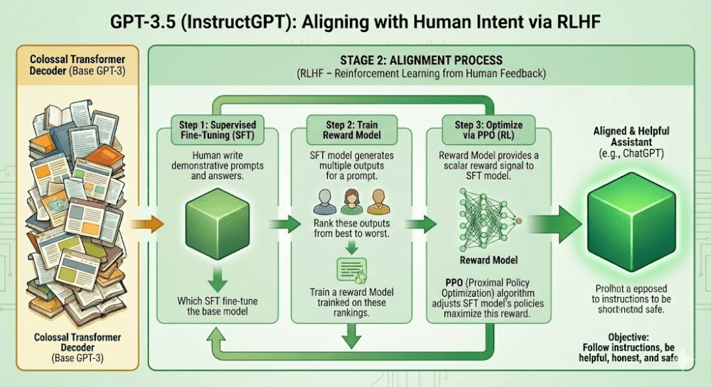

  

GPT\-3（2020年）虽然强⼤，但它本质上是⼀个“⽂本补全机”。你给它⼀个问题，它可能会补全另⼀个问题，或者⽣成不相关的废话，因为它只是在预测“下⼀个词”，并不理解⽤户的意图。

GPT-3.5 的核⼼思想可以总结为两个字：对⻬ (Alignment)。

即：将模型的优化⽬标，从“预测下⼀个词的概率最⼤化”，调整为“符合⼈类意图和价值观”。

  

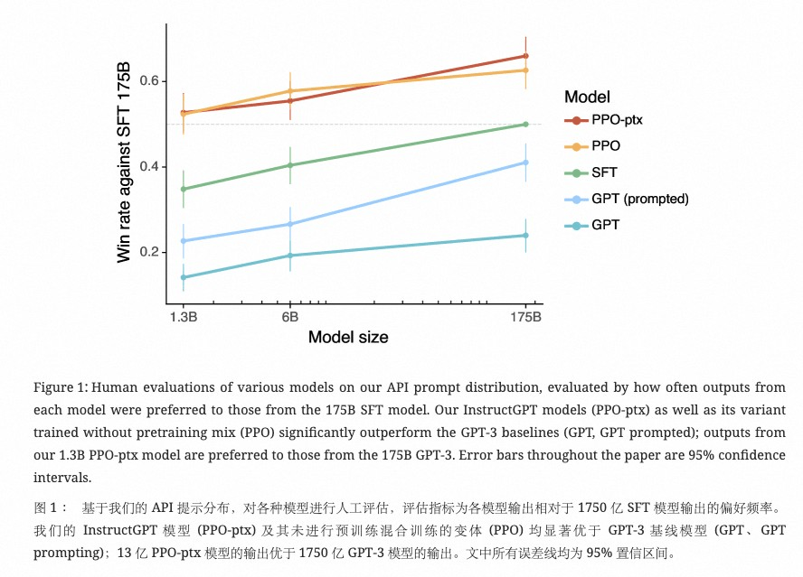

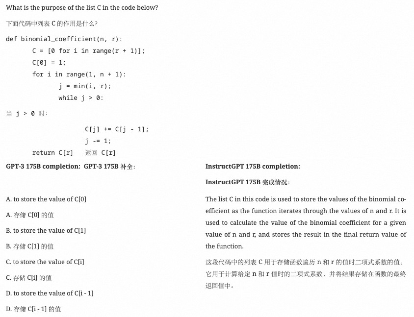

  

为了实现这⼀点，GPT-3.5 (InstructGPT) 采⽤了著名的 RLHF 三阶段训练法：

第⼀阶段：有监督微调 (SFT - Supervised Fine-Tuning)

- 做法：雇佣⼈类标注员，针对各种问题写出⾼质量的“标准答案”。
- ⽬的：让模型先学会“怎么像⼈⼀样回答问题”，学会对话的格式和基本逻辑。这是教会模型“依葫芦画瓢”。

第⼆阶段：训练奖励模型 (RM - Reward Model)

- 做法：让模型针对同⼀个问题⽣成多个不同的回答（A, B, C, D）。然后让⼈类标注员对这些回答进⾏排名（例如：D > A > C > B），⽽不是直接打分。
- ⽬的：训练⼀个新的⼩模型（奖励模型），让它学习⼈类的偏好。这个奖励模型的作⽤是充当“判卷⽼师”，它能⾃动判断哪个回答更好。

第三阶段：近端策略优化 (PPO - Proximal Policy Optimization)

- 做法：这是⼀个强化学习过程。让主模型⽣成回答，奖励模型给出分数（Reward）。如果分数⾼，就通过 PPO 算法更新参数，⿎励模型多⽣成这类回答；反之则惩罚。
- ⽬的：利⽤机器（奖励模型）来⼤规模训练机器（主模型），从⽽实现⼤规模的⾃我进化，使其回答越来越符合⼈类偏好。

  

第⼆阶段：推理能⼒—⽤计算换智能 (Inference Engineering)

  

▐  **1.** COT 开⼭之作

  

论⽂：《Chain-of-Thought Prompting Elicits Reasoning in Large Language Models》（2022）

提出了⼀种简单⽽⾼效的提示（Prompting）⽅法，称为思维链（Chain-of-Thought, CoT）提示。它能显著提⾼⼤型语⾔模型（LLM）在复杂推理任务上的表现。

  

- 核⼼思想：什么是思维链 (CoT)？

  

传统的提示⽅法通常是给模型⼀个问题，并期望它直接给出答案（例如：问题 \->  答案）。

⽽思维链 (CoT) 提示则是通过在提示中（即“上下⽂学习”或“少样本学习”中）给模型展示⼀些包含“推理步骤”的示例。它不只是给出“问题”和“答案”，⽽是展示了从“问题”到“答案”的中间思考过程。

  

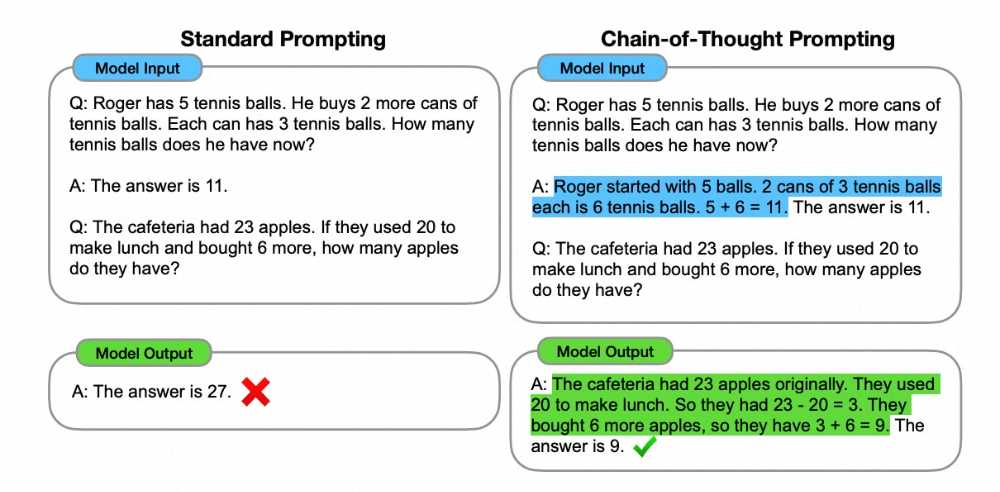

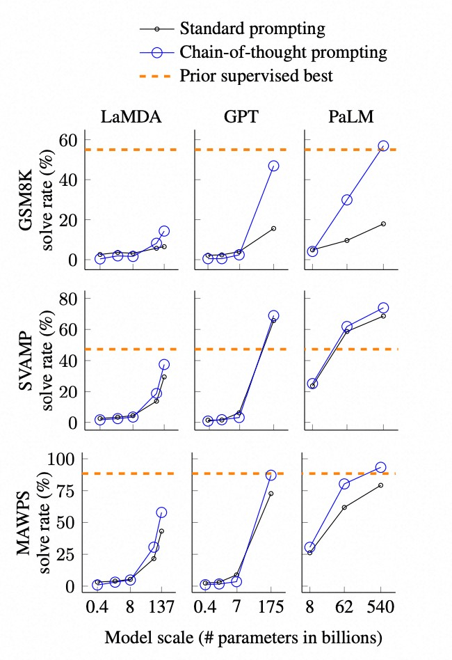

  

- 主要发现与贡献

  

1\. 显著提升复杂推理能⼒：

CoT在需要多步骤思考的任务上表现尤其出⾊，包括：

- 算术推理：（例如应⽤题，如论⽂中使⽤的 GSM8K 数据集）
- 常识推理：（例如需要理解因果或逻辑关系的任务）
- 符号推理：（例如字⺟或符号的变换）

2\. 推理能⼒是“涌现”的 (Emergent Property)：

这是论⽂最重要的发现之⼀。CoT 的神奇效果只在⾜够⼤的模型（例如参数量 \> 100B）上才会显现。对于较⼩的模型，使⽤ CoT 提示的效果并不好，甚⾄可能⽐标准提示更 差。这表明复杂的推理能⼒是模型规模扩⼤到⼀定程度后“涌现”出来的特性。

3\. 提供了解释性和可调试性：

通过让模型输出其推理步骤，研究⼈员可以（在⼀定程度上）“看到”模型的“思考”过程。如果模型给出了错误的答案，⼈们可以检查它的思维链，定位到是哪⼀步推理出了错，这为调试和改进模型提供了可能。

4\. ⽅法简单通⽤：

CoT不需要对模型进⾏额外的微调（Fine-tuning）或修改模型结构。它只是⼀种巧妙的“提示⼯程”技巧，仅通过设计⼏个示例就能“解锁”模型已有的潜⼒。

  

▐  **2**. Zero-Shot CoT

  

论⽂：《Large Language Models are Zero-Shot Reasoners》（2022）

这篇⽂章的核⼼思想源⾃ 2022 年由东京⼤学和 Google Research 联合发表的著名论⽂《Large Language Models are Zero-Shot Reasoners》（⼤型语⾔模型是零样本推理者）。

这篇论⽂在 AI 领域引起了巨⼤的轰动，因为它发现了⼀个极其简单却极其强⼤的“咒语”——只需在提示词中加上⼀句 “Let's think step by step”（让我们⼀步步思考），就能解锁⼤模型的复杂逻辑推理能⼒。例如，使⽤⼤规模 InstructGPT 模型（text-davinci-002）将 MultiArith 的准确率从 17.7%提⾼到 78.7%，将 GSM8K 的准确率从10.4%提⾼到40.7%，并且使⽤另⼀个现成的540B 参数 PaLM 模型也获得了类似的改进幅度。

以下是其核⼼思想、⼯作原理及深远影响的详细解读：

  

- 核⼼思想：零样本思维链 (Zero-Shot CoT)

  

在此之前，业界普遍认为，要让 LLM 处理复杂的数学或逻辑问题，必须使⽤ “少样本思维链” (Few-Shot CoT)，即在提问时先给模型看⼏个“问题+详细推理过程+答案”的例⼦，让模型“照猫画⻁”。

但这篇论⽂提出了 Zero-Shot CoT，其核⼼观点是：

> ⼤模型本身就通过预训练具备了内隐的推理能⼒，不需要外部示例（Zero-Shot），只需要⽤特定的提示词去“唤醒”它。

  

核⼼机制

模型并⾮不会推理，⽽是平时习惯了“直觉式”回答（System 1 思维）。通过加上“Let's think step by step”，我们强制模型进⼊“分析式”模式（System 2 思维），将⼀个复杂问题拆解为多个中间步骤，从⽽⼤幅提⾼准确率。

  

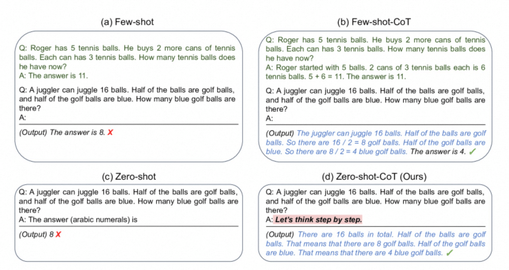

  

- 带来的深远影响

  

这篇论⽂的影响⼒不仅在于技术本身，更在于它改变了⼈们对⼤模型的认知：

1\. 极⼤地降低了提示⼯程 (Prompt Engineering) 的⻔槛

- 以前： 你需要为每个任务精⼼编写⾼质量的“思维链示例”（Few-Shot），这很难且耗时。
- 现在：普通⽤户只需加⼀句“请⼀步步思考”，就能获得专家级的推理效果。这⼀发现让⼤众⽤户也能轻松利⽤ LLM 解决复杂问题。

2\. 揭示了模型的“涌现能⼒” (Emergent Abilities)

它证明了推理能⼒不是通过“微调”或“看例⼦”学来的，⽽是模型在海量数据预训练中已经内化的能⼒。这改变了研究界的⽅向：与其教模型怎么做，不如研究如何更好地引导出它已有的能⼒。

3\. 性能的巨⼤⻜跃

在论⽂的测试中（如 GSM8K 数学数据集），仅凭这⼀句提示词，GPT-3 的准确率就从17.7% 飙升到了78.7%。这种⽆需训练就能带来的巨⼤提升是前所未有的。

4\. 催⽣了后续的⾃动化技术

既然⼀句通⽤的话都能起效，那么是否还有更好的提示词？这启发了后来的 Auto-CoT（⾃动⽣成思维链）和 Prompt Optimization（如 OPRO）的研究，即让 AI ⾃⼰去寻找“更好的咒语”。

  

- 总结

  

《Large Language Models are Zero-Shot Reasoners》的核⼼贡献在于打破了“模型需要教（示例）才能推理”的迷思。它告诉我们，⼤模型潜藏着巨⼤的智慧，有时候你只需要⼀把简单的钥匙——“Let's think step by step”——就能打开它。

  

▐  3. 提升稳定性：⾃洽性 (The Stabilizer)

  

论⽂：《Self-Consistency Improves Chain of Thought Reasoning in Language Models》 (Google, 2022)

- 核⼼思想：LLM像⼈⼀样，有时候会“脑抽”算错。与其让模型只回答⼀次（Greedy Decoding），不如让它回答 10 次，然后取出现次数最多的那个答案（Majority Vote）。
- 直觉：就像做数学题，如果你算三次得出的结果都是 42，那⼤概率就是对的；如果三次结果都不⼀样，那⼤概率错了。
- ⾃洽性利⽤了这样⼀个直觉：⼀个复杂的推理问题通常存在多种不同的思维⽅式，最终都能得出唯⼀的正确答案。我们⼴泛的实证评估表明，⾃洽性显著提⾼了思维链提示在各种流⾏的算术和常识推理基准测试中的性能，包括 GSM8K (+17.9%)、SVAMP (+11.0%)、 AQuA (+12.2%)、StrategyQA (+6.4%) 和 ARC-challenge (+3.9%)。

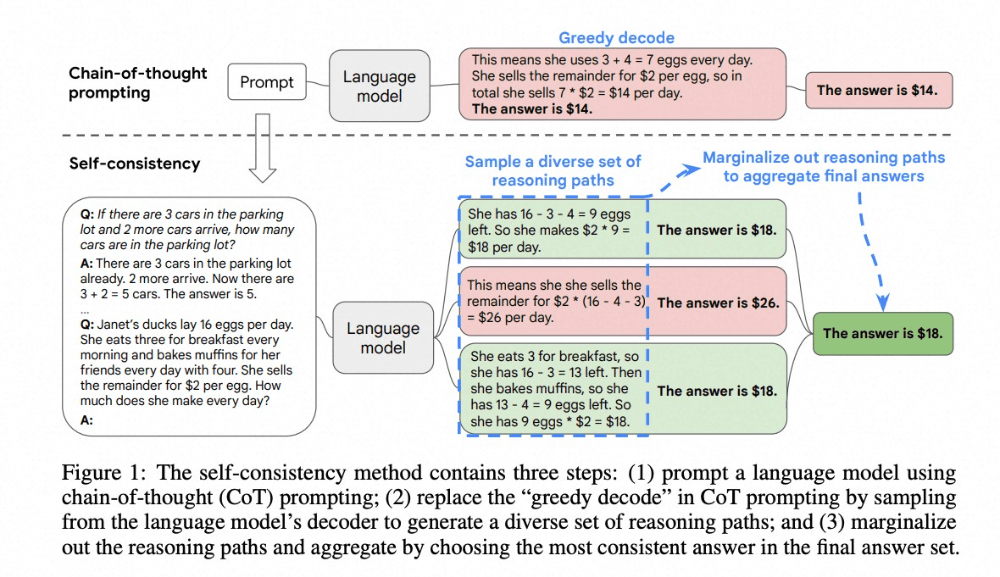

  

- 直觉与原理 (Intuition)

  

为什么这样做有效？论⽂基于⼀个⾮常朴素但强⼤的直觉：

- 正确答案的“殊途同归”： 复杂的推理问题（如数学题）通常有多种正确的解题思路，但它们都会指向同⼀个正确答案。
- 错误答案的“发散性”：如果模型推理错了，它出错的⽅式通常是随机的、发散的。很难有多条独⽴的推理路径同时“巧合”地得出同⼀个错误的答案。

因此，如果我们让模型“多想⼏次”，正确答案往往会形成⼀个聚类（Cluster），⽽错误答案则会零散分布。通过边缘化（Marginalize out）推理路径（即忽略具体的推理过程，只看结果），我们可以显著提⾼鲁棒性。

  

- 主要影响与贡献 (Key Impacts)

  

这篇论⽂对后续 LLM 的发展产⽣了深远影响：

A. 确⽴了“推理时计算换智能”的范式 (Inference-time Compute)：

这是最重要的影响之⼀。它证明了不需要重新训练模型，仅仅通过增加推理阶段的计算量（⽣成多次 + 统计），就能⼤幅提升模型的性能。这为后来的 OpenAI o1 等通过强化推理过程来提升智能的模型奠定了理论基础。

B. 显著提升了数学和逻辑推理能⼒：

在当时，Self-Consistency 在 GSM8K（⼩学数学）、Code Contest（代码⽣成）等基准测试上取得了 State-of-the-Art (SOTA) 的成绩。它证明了模型有时并不是“不会做”，⽽是单次⽣成太容易“⻢⻁”。

C. 改变了解码策略 (Decoding Strategy)：

在此之前，⼈们主要关注 Prompt Engineering（提示词⼯程）。这篇论⽂让研究者意识到，解码策略（如何从模型概率分布中选取⽂本）对于复杂任务同样⾄关重要。它不仅限于贪婪搜索（Greedy Search）或集束搜索（Beam Search）。

D. 启发了后续的⾼级推理架构：

Self-Consistency 可以被视为⼀种简单的“集成学习”（Ensemble）。这⼀思想启发了后续更复杂的推理结构，例如：

- Tree of Thoughts (ToT)：进⼀步将推理步骤拆解并在树结构中搜索。
- Graph of Thoughts (GoT)：将推理过程建模为图⽹络。
- Reflexion：让模型⾃我反思。

  

▐  **4**. 慢思考：思维树 (The Planner)

  

论文：《Tree of Thoughts: Deliberate Problem Solving with Large Language Models》 (Princeton & Google DeepMind, 2023)

它的核⼼在于将⼈类的“系统2”（System2）思维——即慢速、深思熟虑、有计划的思考——引⼊到 LLM 的⽣成过程中。ToT 显著提升了语⾔模型在三个需要复杂规划或搜索的新任务（24 点游戏、创意写作和迷你填字游戏）上的问题解决能⼒。例如，在“24 游戏”中， GPT-4 使⽤思维导图提示仅解决了 4% 的任务，⽽我们的⽅法成功率达到了 74%。

  

- 核⼼思想 (Core Idea)

  

ToT 的本质是将“问题解决”过程建模为在⼀棵思维树（Tree of Thoughts）上的搜索过程。⼀句话总结：ToT 让 LLM 能够像下棋⼀样，“⾛⼀步看三步”，在做决定前探索多种可能性，并能⾃我纠错。

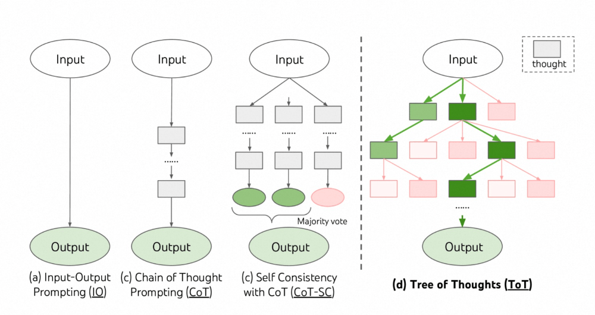

  

核⼼思想：从“链”到“树”

为了理解 ToT，我们必须先看它要解决的问题：

- 思维链 (Chain-of-Thought, CoT) 的局限性：CoT 是⼀种“贪婪”的⽅法。它⼀步⼀步地⽣成思考过程 (A → B → C)。如果B步⾛错了或不是最优的，模型就⽆法回头，只能“硬着头⽪”继续下去，导致最终失败。
- ToT 的解决⽅案：ToT 框架将复杂问题分解为⼀个搜索问题，这个搜索是在⼀个由“思想”（thoughts）组成的树中进⾏的。

  

这个框架主要由以下⼏个关键步骤组成：

1. 思想分解 (Decomposition)：⾸先，把问题分解成多个思考步骤。这和 CoT 类似，但 ToT 将每⼀步视为树的⼀个“节点”。
2. 思想⽣成 (Generation)：在树的当前节点（例如，第⼀步），ToT 不会只⽣成 ⼀个 想法，⽽是让 LLM ⽣成 多个(k个) 不同的、可能的“下⼀步”。这就像树的节点“分叉”了。
  
  例⼦：在“24点游戏”中，第⼀步可能是 (A) "6x4=24" 或 (B) "8x3=24" 或 (C)"12+12"...
3. 状态评估 (Evaluation)：这是 ToT 的灵魂。系统必须评估刚刚⽣成的这些“分⽀”哪个更有前途。它让 LLM 充当 “评估者”，对每个分⽀（部分解决⽅案）进⾏打分或给出判断（例如：“有希望”、“⽆效”、“太复杂”）。
  
  例⼦：LLM 评估 (A) "6x4=24" 是⼀个好路径，但 (C) "12+12" 在当前数字下⽆法实现，于是判定为“⽆效”。
4. 搜索与回溯 (Search & Backtracking)：系统根据“评估”结果，决定下⼀步要探索哪条分⽀。它可以使⽤经典的搜索算法（如⼴度优先搜索 BFS 或深度优先搜索 DFS）。
- 剪枝 (Pruning)：如果⼀个分⽀被评估为“⽆效”或“希望渺茫”，系统就“剪掉”这个分⽀，不再投⼊计算资源。
- 回溯 (Backtracking)：如果⼀个分⽀⾛到了死胡同，系统可以“回溯”到上⼀个节点，去探索之前未被选择的、第⼆有希望的分⽀。

⼀句话总结：ToT = LLM (作为⽣成器+评估器) + 经典搜索算法 (如BFS/DFS)。  

  

- 主要影响与意义

  

ToT的影响⼒远远超出了它在论⽂中展示的任务（如24点游戏、创意写作）：

1. AI 智能体 (Agent) 的基⽯：ToT 是“AI 智能体”概念的关键⾥程碑。它提供了⼀个具体的、可执⾏的框架，让 LLM 具备了规划 (Plan)、⾏动 (Act)、评估 (Evaluate) 和反思 (Reflect) 的能⼒。⼏乎所有后来的复杂 AI 智能体（如 AutoGPT, MetaGPT 等）都或多或少借鉴了这种“⽣成\-评估\-搜索”的循环。
2. 从“提示⼯程”到“智能体⼯程”：它标志着⼀个范式的转变。在 CoT 时代，我们关⼼如何写出最好的 提示 (Prompt) 来引导模型。在 ToT 时代，我们关⼼如何设计最好的 系统框架 (Framework)，让 LLM 在这个框架内⾃主地搜索、评估和迭代。LLM 变成了系统中的⼀个可调⽤组件（例如⼀个“思考者”或“评估者”）。
3. “⾃我反思”能⼒的引⼊：ToT 最⼤的贡献之⼀是让 LLM 评估⾃⼰的（或同伴的）输出。这种“启发式评估”能⼒被证明是解锁 LLM 更⾼智能的关键。模型不再只是⼀个“⽣成器”，它还是⼀个“批评家”。
4. 克服“贪婪”解码的根本缺陷：⼏乎所有的 LLM 在⽣成⽂本时都是“⾃回归”的，即⼀个词⼀个词地往外蹦，不能撤回。这是⼀种“贪婪”的本地最优。ToT框架通过在“思想”的层⾯上引⼊搜索和回溯，从系统层⾯绕过了这个根本限制，使其能够进⾏更全局、更深思熟虑的规划。
5. 可解释性增强： ToT 的输出不仅是最终答案，还是⼀棵完整的思维树。我们可以清晰地看到模型尝试了哪些路径、为什么放弃了某些路径，提供了更好的推理透明度。

  

▐  过程奖励：过程监督 (The Verifier)

  

论⽂：《Let's Verify Step by Step》 (OpenAI, 2023)

这篇论⽂的核⼼思想可以总结为⼀句话：在训练 AI 解决复杂问题（如数学题）时，对每⼀个推理步骤进⾏奖励（过程监督），效果远好于仅对最终答案进⾏奖励（结果监督）。

以下是该论⽂的核⼼思想、⽅法论及其深远影响的详细解析。

  

- 核⼼思想：过程监督 vs. 结果监督

  

论⽂主要对⽐了两种训练奖励模型（Reward Model）的⽅法，⽤于提升模型在复杂数学推理任务（MATH 数据集）上的表现：

- 结果监督 (Outcome Supervision - ORM):
- 机制：只有当模型输出完整个解题过程后，才检查最终答案是否正确。
- 问题：容易出现“歪打正着”的情况（Hallucination with correct answer），即推理过程全是错的，但碰巧蒙对了答案。模型⽆法学习为什么是对的。
- 过程监督 (Process Supervision - PRM):
- 机制：针对模型⽣成的每⼀个推理步骤（Step-by-step）进⾏评估。
- ⽅法：⼈类标注员会对每⼀个步骤打标签：
- Positive (+): 步骤正确且合理。
- Negative (-): 步骤错误或不合理。
- Neutral (0): 模糊或⽆法判断（通常在测试时被视为错误）。
- 结论：过程监督显著优于结果监督。 使⽤过程奖励模型（PRM）训练出来的 AI，在 MATH 数据集上的准确率达到了 78%，远超当时的 SOTA（State-of-the-Art）。

  

- 关键⽅法论

  

为了证明这⼀观点，OpenAI在论⽂中采⽤了⼏个关键技术⼿段：

- PRM800K 数据集：
  
  为了训练过程奖励模型，OpenAI 发布了包含 80 万个⼈⼯标注的“步骤级”标签的数据集。这是当时最⼤规模的精细化推理数据集。

- 主动学习 (Active Learning)：
  
  为了提⾼标注效率，他们没有随机标注，⽽是专⻔让模型⽣成那些“容易让奖励模型混淆”的错题（Convincing wrong-answer solutions），然后让⼈类去纠正。这种针对性标注极⼤地提升了训练效率。
- Best-of-N 搜索：
  
  在推理阶段，模型⽣成 N 个解决⽅案，然后利⽤训练好的 PRM（过程奖励模型） 给每个⽅案的每⼀步打分，最终选出得分最⾼的那个路径作为最终答案。

  

- 核⼼理论贡献：负对⻬税 (Negative Alignment Tax)

  

这是论⽂中最具哲学意义的发现。

- 传统观点（对⻬税）：业界通常认为，让 AI 变得“更安全、更可解释”（即对⻬），往往会牺牲模型的能⼒（Performance），这被称为“对⻬税”。
- 本论⽂发现（负对⻬税）：过程监督不仅让模型更可解释（⼈类可以看到它每⼀步是怎么想的，且每⼀步都符合⼈类逻辑），同时也更强（解题正确率更⾼）。
- 意义：这意味着安全/对⻬与能⼒提升并不冲突，反⽽是相辅相成的。想要模型更聪明，就得教它像⼈类⼀样⼀步步正确地思考。

  

- 带来的影响

  

这篇论⽂对 AI领域产⽣了巨⼤的连锁反应，尤其是在“推理模型”的发展路线上：

1. 奠定了 OpenAI o1 (Strawberry) 的基础
  
  业界普遍认为，OpenAI 后来发布的 o1 模型（具有强⼤推理能⼒的模型），其核⼼技术路线正是基于这篇论⽂的进⼀步扩展。o1 的“思维链”（Chain of Thought）之所以能如此⻓且准确，正是因为模型学会了在内部通过类似 PRM 的机制进⾏⾃我验证和纠错。
2. 改变了“思维链” (CoT) 的研究⽅向
  
  在此之前，思维链（Chain of Thought）主要靠 Prompt 诱导（"Let's think step by step"）。此⽂之后，研究重⼼转向了 Training-based CoT，即通过训练专⻔的 Verifier（验证器）来监督推理过程，催⽣了后来的 "Tree of Thoughts" (思维树) 等搜索算法。
3. 解决了“奖励⿊箱”问题
  
  它证明了对于⻓逻辑链条任务（数学、代码、法律推理），仅仅给⼀个最终的 Reward 是不够的。必须引⼊细粒度的反馈（Dense Feedback）。这成为了现在训练垂直领域（如编程 Agent）的标准范式。
4. 数据集 PRM800K 成为⾏业基准
  
  该数据集的开源极⼤促进了开源社区在“过程奖励模型”上的研究，使得⾮ OpenAI 的研究者也能训练⾃⼰的 Verifier。

  

- 总结

  

《Let’s Verify Step by Step》 的核⼼影响在于它打破了“结果导向”的训练迷思，证明了“过程正确”才是通往“结果正确”和“超级智能”的必经之路。它不仅是技术上的胜利，更是 AI 对⻬（Alignment）研究的⼀次重⼤胜利。

  

第三阶段：Agent 架构——知⾏合⼀ (System Engineering)

  

▐  **1.** 知⾏合⼀：ReAct (The Agent)

  

论⽂：《ReAct: Synergizing Reasoning and Acting in Language Models》 (Princeton & Google, 2022)

简单来说，ReAct 提出了⼀个能够让⼤模型“⼀边思考，⼀边⼲活”的框架，解决了此前模型要么“只会空想（容易产⽣幻觉）”，要么“只会蛮⼲（缺乏规划）”的问题。

  

本⽂探索了如何以交错的⽅式利⽤ LLM ⽣成推理轨迹和特定任务的⾏动，从⽽增强⼆者之间的协同作⽤：推理轨迹有助于模型⽣成、跟踪和更新⾏动计划，并处理异常情况；⽽⾏动则允许模型与外部来源（例如知识库或环境）进⾏交互并从中获取额外信息。我们将此⽅法（命名为 ReAct ）应⽤于⼀系列不同的语⾔和决策任务，结果表明，除了提升⼈类可解释性和可信度之外，该⽅法还优于⽬前最先进的基线模型。具体⽽⾔，在问答（HotpotQA）和事实验证（Fever）任务中， ReAct 通过与简单的维基百科 API 交互，克服了思维链推理中普遍存在的幻觉和错误传播问题，并⽣成了⽐没有推理轨迹的基线模型更易于解释的、更接近⼈类的任务解决轨迹。此外， 在两个交互式决策基准测试（ ALFWorld 和 WebShop）中， ReAct 仅需⼀到两个上下⽂示例提示，其绝对成功率分别⽐模仿学习和强化学习⽅法⾼出 34%和 10%。

  

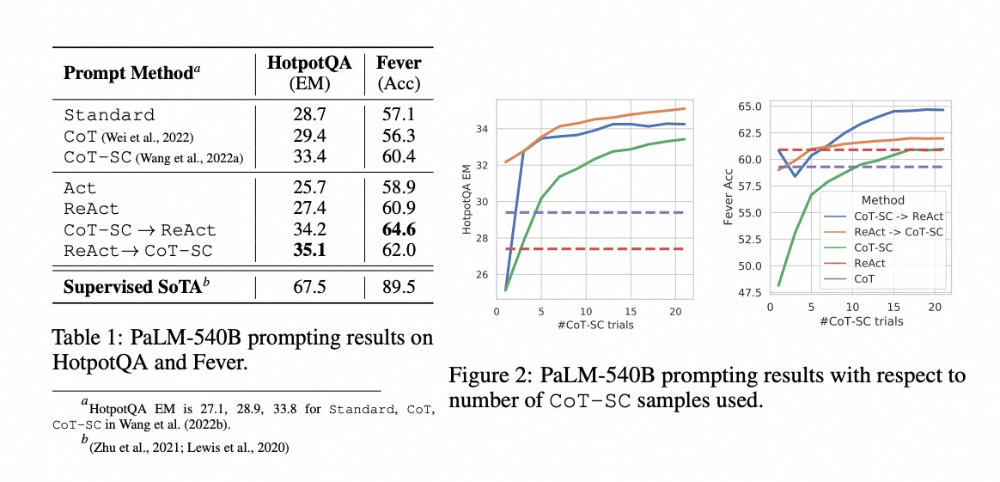

  

- 核⼼思想：思考与⾏动的“双螺旋”

  

在 ReAct 之前，LLM 主要有两种⽤法：

- 纯推理 (Reasoning Only)：像 CoT 那样，模型在内部进⾏逻辑推演。缺点是它⽆法获取外部新信息，容易产⽣幻觉（胡说⼋道）。
- 纯⾏动 (Acting Only)：模型直接根据指令调⽤⼯具（如 WebGPT）。缺点是模型缺乏规划，不知道为什么要调⽤这个⼯具，容易迷失⽅向。

ReAct 的核⼼思想是将“推理”(Reasoning) 和“⾏动”(Acting) 交织在⼀起（Interleaved），形成⼀个循环。

  

⼯作流程：  

ReAct 要求模型遵循⼀个特定的 思考 (Thought) -> 行动 (Action) -> 观察 (Observation) 的循环模式：

Thought（思考）：模型⾸先⽤⾃然语⾔分析当前的情况，制定计划。  

例⼦：“我想知道 2024 年奥运会的主办城市是谁，所以我应该先搜索⼀下。”

 Action（⾏动）：基于思考，模型⽣成⼀个具体的指令来调⽤外部⼯具（API）。  

例⼦：Search\["2024 Olympics host city"\]

Observation（观察）：外部环境（如搜索引擎）返回结果给模型。

例⼦：“搜索结果显示：巴黎被选为 2024 年夏季奥运会主办城市。”

Next Thought（再思考）：模型结合新的观察结果，更新⾃⼰的知识，进⾏下⼀步推理。例⼦：“好的，现在我知道是巴黎了。接下来我需要查⼀下从北京去巴黎的机票价格……”

  

- 为什么它这么重要？（主要贡献）

  

- 解决了“幻觉”问题（Grounding）：纯 CoT 经常会⼀本正经地胡说⼋道，因为它的知识仅限于训练数据。ReAct 允许模型通过 Action 获取外部真实的、最新的信息（Observation），从⽽⽤事实⽀撑推理，⼤⼤减少了幻觉。
- 解决了“盲⽬⾏动”问题：如果模型只知道调 API 却不思考，遇到报错就会卡死。ReAct 通过 Thought 步骤，让模型在⾏动前进⾏规划，在⾏动失败后（通过观察错误信息）进⾏调整和纠错。
- 可解释性 (Interpretability)：ReAct 的轨迹⾮常清晰。⼈类可以确切地看到模型是“怎么想的”（Thought），以及它根据想法“做了什么”（Action）。这对于调试 Agent ⾄关重要。

  

- 带来的巨⼤影响

  

ReAct 的影响是⾏业标准级的，它定义了现代 AI Agent 的基本范式：

- LangChain 的基⽯：如果你⽤过 LangChain 框架，你会发现其核⼼的Agent 模块默认就是基于 ReAct 模式实现的。它让开发者能极快地构建出能联⽹、能查库的 AI 助⼿。  
- 确⽴了 Agent 的标准交互格式：现在⼏乎所有的 Agent 框架（AutoGPT, BabyAGI 等）在底层都在模仿这种 思考-行动-观察 的循环。它证明了 LLM 不仅仅是⼀个⽂本⽣成器，更是⼀个决策控制器 (Controller)。
- 连接了 LLM 与外部世界：CoT 让 LLM 拥有了⼤脑，ReAct 则给 LLM 装上了⼿脚（Tools）和眼睛（Observations），真正打通了“数字⼤脑”与“真实世界⼯具”之间的壁垒。

⼀句话总结：ReAct 是“知⾏合⼀”在 LLM 上的实现，它让 AI 既能像哲学家⼀样思考(Reason)，⼜能像⼯程师⼀样查资料、调⼯具(Act)，从⽽解决现实世界的复杂问题。

  

▐  **2**. Reflexion:⾃我反思与语⾔强化学习

  

论⽂：Reflexion: Language Agents with Verbal Reinforcement Learning（2023）

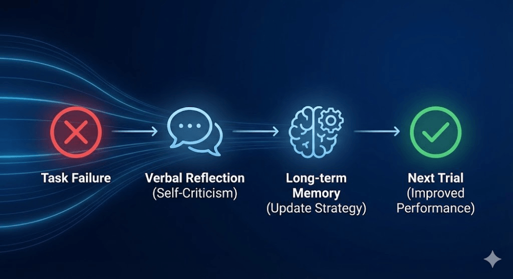

  

我们提出了⼀种名为 Reflexion 的新型框架，它并⾮通过更新权重，⽽是通过语⾔反馈来强化语⾔智能体。具体来说，Reflexion 智能体会对任务反馈信号进⾏⼝头反思，并将反思⽂本保存在情景记忆缓冲区中，从⽽在后续试验中做出更优的决策。Reflexion 具有⾜够的灵活 性，可以整合各种类型（标量值或⾃由语⾔）和来源（外部或内部模拟）的反馈信号，并在各种任务（序列决策、编码、语⾔推理）中都取得了⽐基线智能体显著的改进。例如， Reflexion 在 HumanEval 编码基准测试中达到了 91% 的 pass@1 准确率，超越了之前最先进的 GPT\-4 的 80%。

  

- 推理

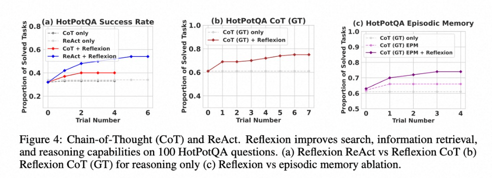

- 编程

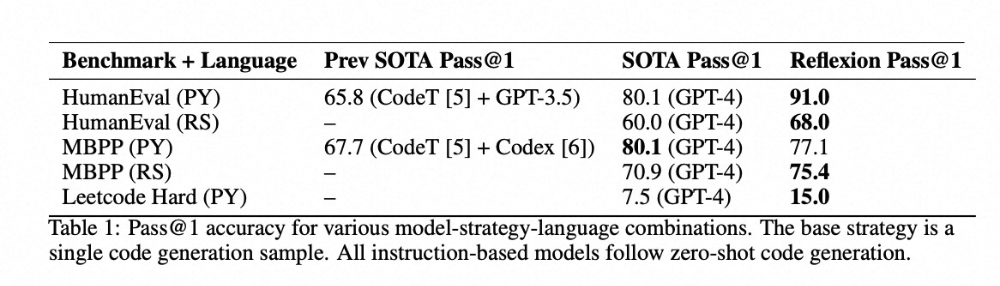

  

让 AI 智能体像⼈⼀样，通过“事后反思”来学习和改进。

它开创了⼀种不需要微调模型（Fine-tuning）就能实现⾃我迭代和进化的框架。智能体在执⾏任务失败后，会停下来“⾃我反思”，⽣成⼀段关于“哪⾥做错了、为什么错了、下次该怎么改”的⽂字，然后把这段“反思”存⼊记忆，在下⼀次尝试时作为“经验教训”来指导⾃⼰。

这个过程被作者称为“语⾔强化学习”（VerbalReinforcementLearning）。

  

- 核⼼思想：Reflexion 框架

  

传统的智能体（如 ReAct 或 CoT）在⼀次任务中通常是“⼀条路⾛到⿊”。如果它们的规划或⾏动出错了，这次任务就失败了，它们下次遇到同样问题还是会犯错。

Reflexion 改变了这⼀点，它引⼊了⼀个“反思” (Reflect) 循环：

1\. ⾏动 (Act)： 智能体（Actor）根据任务和上下⽂，⽣成⼀个⾏动轨迹（例如，⼀系列的思考和⼯具调⽤）来尝试解决问题。

2\. 评估 (Evaluate)： 系统会根据环境的反馈（例如，代码编译器的报错信息、测试⽤例的“Pass/Fail”结果）来评估这次“⾏动”是成功还是失败。

3\. 反思 (Reflect)： 这是最关键的⼀步。

- 如果任务失败了，系统会启动⼀个“反思者”(Reflector)模块（这其实就是另⼀个LLM实例）。
- “反思者”会分析失败的⾏动轨迹和环境反馈，然后⽤⾃然语⾔⽣成⼀段“⾃我反思”的笔记。
- 例如：“我上次的尝试失败了，因为我试图使⽤⼀个不存在的API。我应该先调⽤search ⼯具来查找正确的API名称。”

4\. 记忆与迭代 (Memory & Iteration)：  

- 这段“反思笔记”被储存在⼀个“⻓期记忆库”中。
- 在下⼀次尝试（Trial）解决同⼀个问题时，系统会把这段“反思笔记”作为额外的上下⽂（“这是你上次的经验教训”）⼀起放进提示（Prompt）中。

5\. 循环： 智能体（Actor）现在有了新的“经验教训”，它会⽣成⼀个（理论上）更优的⾏动计划，再次尝试，直到任务成功或达到最⼤尝试次数。

⼀句话总结：Reflexion = ⾏动 (Act) + 评估 (Evaluate) + 反思 (Reflect)，并通过“语⾔记忆”实现迭代改进。

  

- 主要影响与意义

  

Reflexion 的影响⼒巨⼤，因为它为 AI 智能体解决复杂问题提供了⼀套全新的、轻量级的“试错”和“学习”范式。

1. “语⾔强化学习” (VerRL) 的开创：传统的强化学习（RL）通过调整模型的“权重”（参数）来学习，这⾮常昂贵且缓慢。 Reflexion 提出，我们根本不需要动模型的权重，只要把“经验教训”写成⽂字（语⾔），然后让模型在下⼀次把这些⽂字“读⼀遍”，就能起到类似的学习效果。这是⼀种“⽆权重更新”的⾼效学习。
2. 显著提升复杂任务的性能：这篇论⽂最惊⼈的成果是在 HumanEval（代码⽣成基准）上的表现。通过使⽤ Reflexion框架（即允许模型在失败后“反思”并重试），它将 GPT-4 在 HumanEval 上的pass@1准确率从 80.0% 提升到了 91.0%，这是⼀个巨⼤的⻜跃。它证明了“反思”能实实在在地帮助 AI 解决它“⼀次想不明⽩”的难题。
3. 赋予智能体“试错”的能⼒：它让智能体不再是⼀个“⼀次性”的⼯具，⽽是⼀个可以迭代的“问题解决者”。在它之前，智能体失败了就是失败了；在它之后，失败成为了“下⼀次成功之⺟”，智能体可以从失败中提取价值。
4. 智能体记忆（Memory）的基⽯：Reflexion 是智能体“⻓期记忆”领域的核⼼论⽂之⼀。它具体展示了记忆如何被（通过反思）写⼊，以及如何被（通过检索）读取，从⽽形成⼀个有意义的学习闭环。

  

▐  **3**. Toolformer: ⾃主⼯具使⽤

  

论⽂：Toolformer: Language Models Can Teach Themselves to Use Tools (Timo Schick et al., Meta AI, 2023)

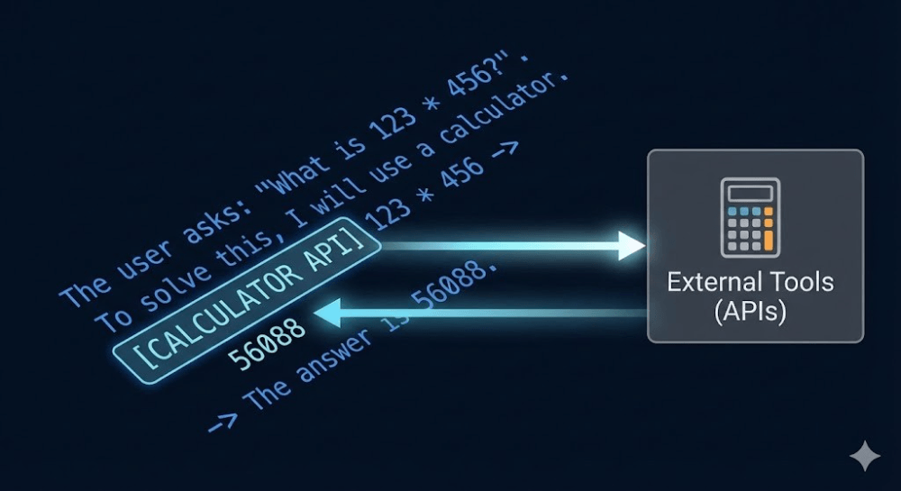

  

论⽂提出了⼀种⾃监督学习的⽅法。Toolformer 不需要⼈类⼤量标注“在哪⾥调⽤API”，⽽是让模型⾃⼰尝试在⽂本中插⼊ API 调⽤，如果调⽤结果对预测下⼀个词有帮助，它就保留这个调⽤。  

它学会了在句⼦中间⾃然地插⼊<API\_Call> 令牌。例子： 模型生成文本“匹兹堡是 \[WikiSearch(匹兹堡)\] 宾夕法尼亚州的城市。”

影响：它证明了不需要巨⼤的模型（它只⽤了 6.7B 参数的模型），只要通过巧妙的微调，⼩模型也能精准地掌握计算器、⽇历、维基百科等⼯具的使⽤。

  

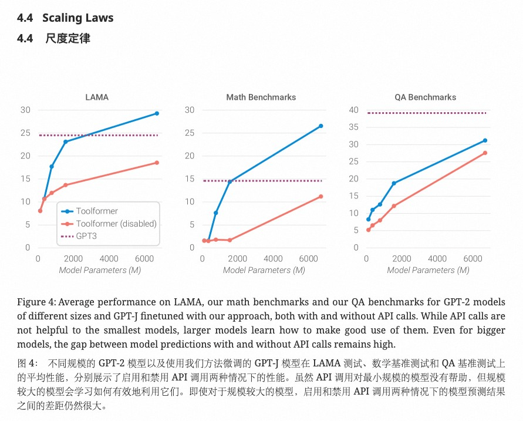

  

▐  **4**. Multi-Agent 多智能体协作

  

论⽂：CAMEL: Communicative Agents for "Mind" Exploration of Large Scale Language Model Society (2023)

CAMEL 是多智能体（Multi-Agent）系统领域的另⼀篇开⼭之作。如果说 MetaGPT 是引⼊了“公司管理流程”，那么 CAMEL 则是确⽴了智能体之间“如何通过⻆⾊扮演进⾏有效沟通”的基础理论。

它的核⼼思想和影响如下：

  

- 核⼼思想：⻆⾊扮演 (Role-Playing) 与 初始引导 (Inception Prompting)

  

在 CAMEL 之前，⼈们发现让两个 AI（⽐如两个 ChatGPT 实例）互相聊天，它们很容易陷⼊⽆限重复、互相吹捧或者偏离主题的尴尬境地。CAMEL 提出了⼀个解决这个问题的核⼼框架：⻆⾊扮演框架（Role-Playing Framework）。

Inception Prompting：这是论⽂最⼤的技术贡献。为了让两个智能体（Agent）能够⾃主地把任务进⾏下去，CAMEL 设计了⼀套精密的“初始提示词”。

  

它在对话开始前，分别给两个智能体“洗脑”：

- AI User（⽤户代理）： “你是⽤户，你的⽬标是让对⽅帮你完成任务 X。你必须不断提出具体的指令。”
- AI Assistant（助⼿代理）： “你是助⼿，你的⽬标是执⾏指令并给出解决⽅案。你必须听从⽤户的指令。”

这套机制确保了对话不会跑偏，⼀个负责发号施令，⼀个负责⼲活，形成了稳定的闭环。

任务细化器 (Task Specifier)：⼈类给出的任务通常很模糊（⽐如“做⼀个股票交易机器⼈”）。CAMEL 引⼊了⼀个专⻔的 Agent 来把这个模糊的想法变成具体的“任务描述”，然后再交给上⾯的 User 和 Assistant 去执⾏。

  

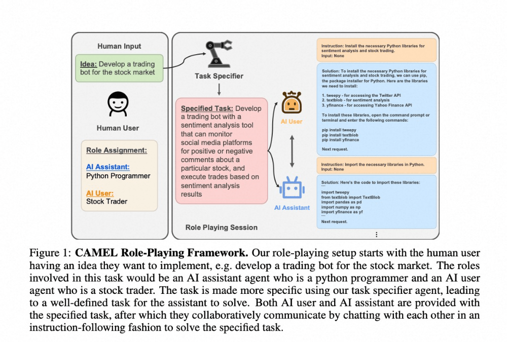

  

- 核⼼机制图解

  

CAMEL的⼯作流⾮常直观，就像是⼀场没有⼈类参与的“双⼈即兴表演”：

- Human: 给出⼀个模糊的 Idea（例如：开发⼀个贪吃蛇游戏）。
- Task Specifier Agent: 将 Idea 转化为具体的 Task（例如：使⽤ Python Pygame 库编写贪吃蛇，包含计分功能）。
- Role Assignment: 分配⻆⾊（Agent A 扮演 Python 程序员，Agent B 扮演 股票交易员）。
- Inception: 注⼊初始 Prompt，激活⻆⾊。
- Chat Loop: 两个 Agent ⾃动对话，直到任务完成。

  

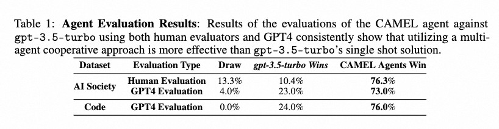

  

- 带来哪些影响 (Impact)

  

CAMEL 在学术界和⼯程界的影响⼒⾮常⼤，它是最早证明“LLM 可以通过⾃主对话解决复杂问题”的论⽂之⼀。

- 确⽴了“交际智能体”（Communicative Agents）的研究范式：它证明了不需要⼈类⼀步步 Prompt，只要设定好“⼈设”和“初始规则”，AI 之间是可以⾃主协作的。这为后来的 AutoGen、MetaGPT 等框架提供了理论基础。
- 解决了对话的“主要⽭盾”：通过区分 Instruction Giver（指令发出者） 和 Instruction Follower（指令执⾏者），CAMEL 解决了多智能体系统中常⻅的“谁该听谁的”这⼀控制权问题，避免了死循环。
- 低成本⽣成⾼质量数据（Data Generation）：论⽂题⽬中的“Mind Exploration”暗示了这⼀点。CAMEL 被⼤量⽤于合成数据。通过让 AI 互相扮演专家对话，⼈类可以极低成本地获得海量的、⾼质量的垂直领域对话数据（例如让两个 AI 扮演医⽣和患者，⽣成医疗问答数据），⽤于训练更⼩的模型。
- 启示了“社会模拟”（Social Simulation）：CAMEL 展示了 AI 能够维持“⼈设”，这启发了后来斯坦福的“AI ⼩镇”（Generative Agents）等研究，即⽤ AI 来模拟⼈类社会的交互⾏为。

  

▐  **5**. 记忆的深度：⽣成式智能体 (Generative Agents)

  

论⽂：Generative Agents: Interactive Simulacra of Human Behavior (2023)

这篇论⽂（通常被称为“斯坦福 AI ⼩镇”或“Smallville”论⽂）是 AI Agent 领域关于⻓期记忆与⼈类⾏为模拟的⾥程碑式研究。它的核⼼思想和带来的影响如下：

  

- 核⼼思想：记忆流 (Memory Stream) 与完整认知架构

  

这篇论⽂最⼤的突破在于它不仅仅是让 GPT 扮演⼀个⻆⾊对话，⽽是给 Agent设计了⼀个完整的⼤脑架构，使其具备了“⽣活”的能⼒。

  

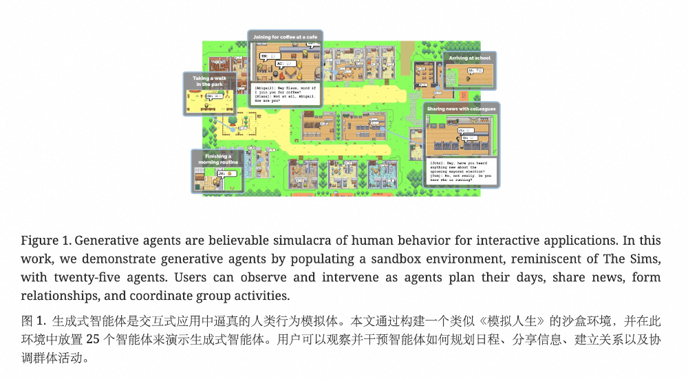

  

- 沙箱环境 (The Sandbox)：研究者在⼀个类似《模拟⼈⽣》（The Sims）的 2D像素游戏世界（Smallville）中投放了 25 个 AI Agent。这些 Agent 有各⾃的姓名、职业、性格和⼈际关系。
- 核⼼架构：记忆流 (Memory Stream)：这是论⽂的技术灵魂。为了解决 LLM 上下⽂有限的问题，作者设计了⼀个包含三个核⼼模块的架构：
- 观察与记忆 (Observation & Memory)： Agent 的所有经历（看⻅谁、说了什么、做了什么）都会被记录到⼀个巨⼤的数据库中（记忆流）。
- 反思 (Reflection)： Agent 并⾮只是机械地记录。系统会定期让 Agent “停下来思考”，从琐碎的⽇常记忆中提炼出⾼级认知。例⼦： 从“我每天都在吃⻨⽚”提炼出“我喜欢吃简单的早餐”。
- 规划 (Planning)： Agent 会根据当前的记忆和⽬标，制定详细的每⽇计划，并在执⾏过程中根据新情况动态调整。
- 检索 (Retrieval)： 当 Agent 需要⾏动时，系统会根据 相关性 (Relevance)、时效性 (Recency) 和 重要性 (Importance) 从记忆流中检索最相关的信息，作为 Prompt 喂给⼤模型。

  

- 核⼼机制图解

  

你可以想象⼀个 Agent 的⼤脑运作流程：

- 感知 (Perceive)：看⻅邻居 Alice 在花园⾥。
- 检索 (Retrieve)：调取记忆 \-> “我和 Alice 是朋友”、“Alice 昨天说她要举办派对”。
- 规划 (Plan)：决定⾛过去打招呼，并询问派对的准备情况。
- ⾏动 (Act)：执⾏对话。
- 反思 (Reflect)：更新记忆 \-> “Alice 看起来很忙，我可能需要帮她”。

  

- 带来哪些影响 (Impact)

  

这篇论⽂在  AI 和游戏界都引起了巨⼤的轰动，其影响主要体现在：

- 确⽴了 Agent 的“记忆”标准架构：它证明了简单的 RAG（检索增强⽣成）不⾜以⽀撑复杂的智能体。“观察 \-> 反思 \-> 规划” 的循环成为了后来开发⾼级 Agent（尤其是涉及⻓期互动的伴侣型 AI、NPC）的⾏业标准范式。
- 涌现式的社会⾏为 (Emergent Social Behaviors)：论⽂中最令⼈震惊的发现是，研究者并没有显式编程，但 Agent 之间⾃发地形成了社会互动。例⼦： ⼀个 Agent 发起了⼀个情⼈节派对的念头，这个消息在⼩镇中⾃动传播开来，最终其他 Agent 真的按时参加了派对，甚⾄还互送了礼物。这证明了 LLM 具备模拟⼈类社会动⼒学的能⼒。
- 游戏 NPC 的⾰命：它为未来的电⼦游戏指明了⽅向：NPC 不再是只会说⼏句固定台词的⽊偶，⽽是拥有⾃⼰⽣活轨迹、能记住玩家⾏为、并能与其他 NPC 建⽴关系的“数字⽣命”。
- 社会科学模拟的新⼯具：社会学家开始意识到，可以⽤这种 Generative Agents 来进⾏低成本的社会实验（如谣⾔传播机制、宏观经济模拟），作为⼈类实验的补充。
  
    

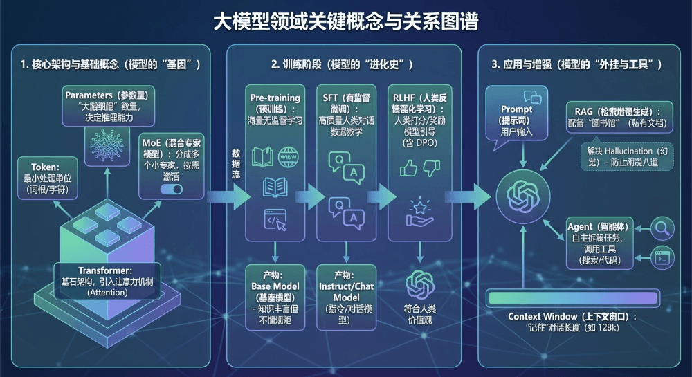

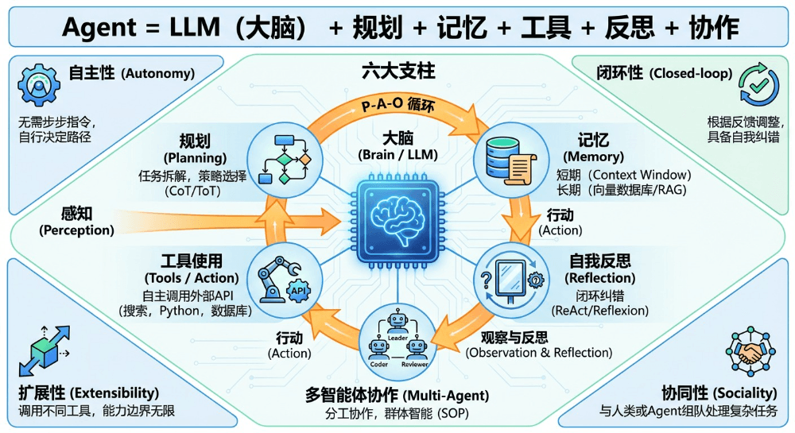

  

第四阶段：垂直领域——Code

  

▐  **1**. CodeX: ⼤模型 Code 能⼒的⾸次尝试

  

论⽂：《Evaluating Large Language Models Trained on Code》（2021）

这是⼀个基于 GPT\-3 架构并在海量公开代码（主要是 GitHub 上的 Python 代码）上进⾏微调（Fine-tuning）的模型。作者发现，虽然 GPT\-3 有⼀定的编程能⼒，但在专⻔的代码语料上微调后，其解决编程问题的能⼒显著提升。GitHub Copilot 使⽤了 Codex 的⼀个独⽴⽣产版本。在新发布的评估数据集 HumanEval 上（该数据集⽤于衡量从⽂档字符串合成程序的功能正确性），我们的模型解决了 28.8% 的问题，⽽ GPT\-3 的解决率为 0%，GPT\-J 的解决率为 11.4%。此外，我们发现，对模型进⾏重复采样是⼀种出⼈意料的有效策略，可以⽣成针对复杂提示的有效解决⽅案。使⽤这种⽅法，我们每个问题使⽤ 100 个样本解决了70.2% 的问题。

  

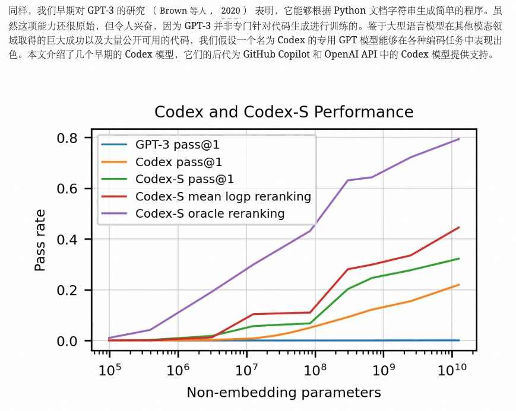

  

- 评估标准的范式转移：从“⽂本相似度”到“功能正确性”：在 Codex 之前，代码⽣成通常使⽤ NLP 领域的指标（如 BLEU 分数）来评估，即⽐较⽣成的代码和参考代码在⽂本上有多像。核⼼洞察： 论⽂指出 BLEU 在代码领域是失效的。代码可以在⽂本上完全不 同，但功能完全⼀致。因此，论⽂提出应该评估 功能正确性 (Functional Correctness)，即⽣成的代码能否通过单元测试。
- HumanEval 基准测试 (The HumanEval Benchmark)：为了通过“功能正确性”来评估模型，作者⼿⼯创建了⼀个包含 164 个⼿写编程问题的数据集，称为 HumanEval。每个问题都包含函数签名、⽂档字符串（Docstring）、参考代码和单元测试。这个数据集⾄今仍是评估代码模型能⼒的“⻩⾦标准”。
- pass@k 指标与重复采样 (Repeated Sampling)：论⽂引⼊了 pass@k 指标。作者发现， LLM ⽣成代码时往往不稳定。与其只看⽣成⼀次（pass@1）对不对，不如让模型⽣成 k个样本（例如 100 个），只要其中有⼀个能通过测试就算解决。结论： 简单的“重复采样”策略极其有效。通过⽣成多个备选⽅案并进⾏筛选，模型的实际解决率可以⼤幅提⾼。
- 证明了“代码训练”对推理能⼒的提升：虽然这篇论⽂主要关注代码⽣成，但它引发了后续⼀系列研究（如 Chain-of-Thought），研究者后来发现，在代码上训练过的模型，其逻辑推理和规划能⼒往往⽐纯⽂本模型更强。

  

▐  **2**. SWE-Bench 编程能⼒评测

  

SWE-bench（Software Engineering Benchmark）是⽬前 AI 编程领域最权威、最硬核的评测基准。如果说 HumanEval（LeetCode ⻛格的算法题）是⼩学⽣的数学考试，那么 SWE- bench 就是软件⼯程师的⼊职⾯试。它由普林斯顿⼤学和芝加哥⼤学的研究团队于 2023 年底推出，旨在解决当时评估代码模型的⼀⼤痛点：⼤模型会做算法题，但在真实的复杂项⽬中却极其笨拙。

以下是关于 SWE-bench 的详细介绍及其带来的⾏业巨变：

  

- 核⼼理念：从“写代码”到“修 Bug”

  

SWE-bench 的核⼼思想⾮常直接：真正的软件开发不是在⼀个空⽩⽂档⾥写⼀个孤⽴的函数，⽽是在⼀个巨⼤的、陌⽣的代码库中定位问题并修复它。

- 数据来源：它收集了 12 个著名的 Python 开源库（如 scikit-learn, Django, Flask, pandas 等）中的真实 GitHub Issue（缺陷报告） 和对应的 Pull Request（修复代码）。
- 任务形式：给 AI ⼀个代码库（可能包含⼏⼗万⾏代码）和⼀个 Issue 描述（⽐如“当输⼊为 X 时 pandas 报错”），要求 AI：
- 阅读源码，理解现有逻辑。
- 定位导致 Bug 的⽂件和⾏数。
- 编写修复补丁（Patch）。
- 通过测试：不仅要通过修复这个 Bug 的新测试，还不能让现有的旧测试报错
  
  （Regression Test）。

  

- 为什么它被称为“噩梦级”难度？

  

在 SWE-bench 刚发布时，当时最强的 GPT-4 在这个榜单上的解决率只有 1.7%。这直接戳破了当时“AI ⻢上要替代程序员”的泡沫。

它的难度在于：

- 超⻓上下⽂：模型需要处理数万⾏代码，必须具备极强的⻓⽂本检索和理解能⼒。
- 环境依赖：代码不能只是“⻓得像”，必须能在真实的 Docker 容器中运⾏并通过编译器检查。
- 多步推理：只要中间有⼀步⾛错（⽐如改错了⽂件，或者引⼊了新 Bug），整个任务就判为 0 分。

  

- SWE-bench 的家族版本

  

由于原始版本太难且不稳定，后来演化出了⼏个重要分⽀，你经常会看到它们：

- SWE-bench (Full): 包含 2,294 个问题。由完整测试集组成。
- SWE-bench Lite: 包含 300 个精选问题。去掉了那些极其晦涩或依赖复杂环境的问题，是⽬前最常⽤的轻量级测试版。
- SWE-bench Verified: (⽬前的主流标准) 后来 OpenAI 和原作者合作，⼈⼯筛选了 500 个确定“描述清晰、环境可复现、确实能解”的⾼质量问题。现在的“SOTA”模型（如 Claude 3.5 Sonnet, GPT-4o 等）主要都在刷这个榜。

  

- 带来的⾏业影响

  

SWE-bench 不仅仅是⼀个排⾏榜，它直接改变了 AI 编程产品的技术路线：

A. 催⽣了 "AI Agent"（智能体）架构

由于直接让模型⽣成答案（Zero-shot）效果极差，开发者开始研发 Agent 框架。

- 代表作：SWE-agent, OpenHands (原 OpenDevin), Devin。
- 原理：这些系统不再只是⽣成代码，⽽是像⼈⼀样⼯作：先写⼀个 print 调试⼀下 \->运⾏代码看报错 \-> 读取报错信息 \-> 再次修改代码 \-> 跑通测试。SWE-bench 证明了“会⾃我反思的循环⼯作流”⽐单纯的模型智商更重要。

B. 确⽴了“代码库问答”的技术标准

为了刷榜，RAG（检索增强⽣成）技术在代码领域得到了极致优化。模型学会了如何利⽤“地图”（⽂件树结构）和“搜索⼯具”（grep/find）来在百万⾏代码中快速找到关键⽚段，⽽不是试图把所有代码都塞进脑⼦⾥。

C. 成为新模型的“必考题”

现在，任何⼀个新的编程模型（如 DeepSeek-Coder, Yi-Coder, Qwen-Coder）发布，如果不敢贴出 SWE-bench 的分数，业界通常会认为它“不能实战”。

- 分数标杆（参考）： \* 早期 GPT-4: ~1.7%

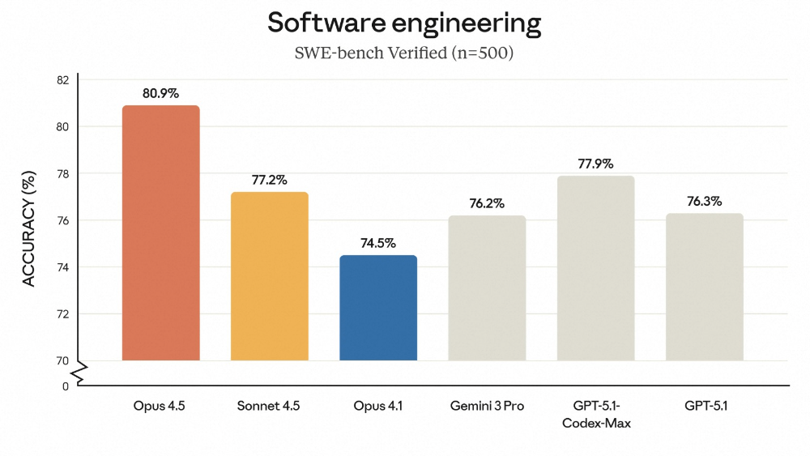

总结来说，SWE-bench 是 AI 程序员的“⾼考”。 它迫使模型⾛出舒适区（LeetCode），进⼊了充满脏代码、复杂依赖和模糊需求的真实世界。

  

▐  **3**. 多智能体协作

  

论⽂：MetaGPT: Meta Programming for A Multi-Agent Collaborative Framework (2023)

它的核⼼思想可以概括为：将⼈类社会的标准化⼯作流程（SOPs）引⼊到多智能体协作中，从⽽解决⼤模型在⻓链路复杂任务中容易“跑偏”或产⽣幻觉的问题。标准化⼯作流程（SOPs）引⼊到多智能体协作中，从⽽解决⼤模型在⻓链路复杂任务中容易“跑偏”或产⽣幻觉的问题。

以下是该⽂章的核⼼思想详解及带来的影响：

  

- 核⼼思想：SOPs + ⻆⾊扮演 (Role-Playing)

  

在 MetaGPT 之前，很多多智能体框架（如早期的 AutoGPT 或简单的 ChatDev 原型）主要依靠智能体之间⾃由对话来解决问题。这种“⾃由讨论”在⾯对复杂任务（如开发⼀个贪吃蛇游戏）时，容易导致话题发散、⽆限循环或逻辑不⼀致。

MetaGPT 提出了以下解决⽅案：

引⼊标准化作业程序（SOPs）： 就像⼈类组建公司⼀样，MetaGPT 不让智能体瞎聊，⽽是强制它们遵守严格的流程。例如： 需求分析 -> 系统设计 -> 代码编写 -> 代码审查。

  

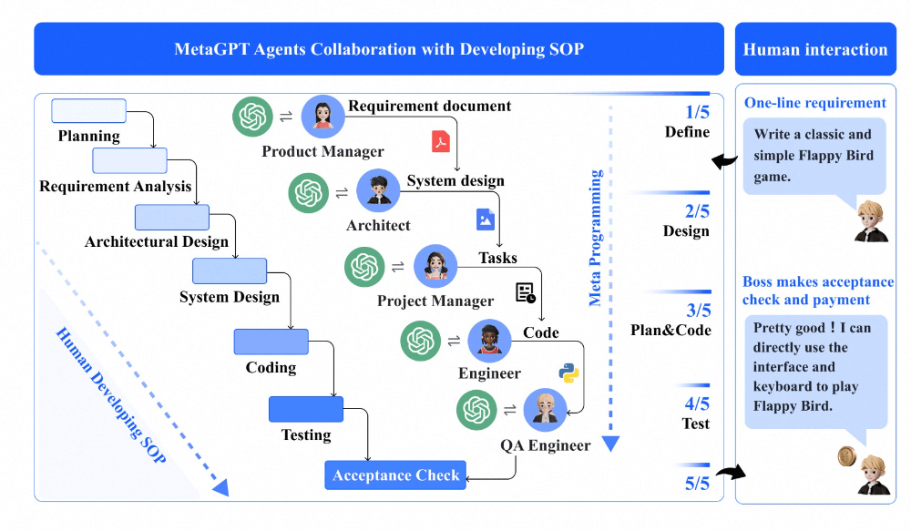

  

明确的⻆⾊分⼯（Role Specialization）： 框架内预设了 5 种核⼼⻆⾊，每个⻆⾊都有特定的 Prompt 和技能：

- Product Manager (产品经理)： 负责写 PRD（产品需求⽂档），分析⽤户需求。
- Architect (架构师)： 负责设计系统架构、接⼝和数据结构。
- Project Manager (项⽬经理)： 负责分配任务，决定开发顺序。
- Engineer (⼯程师)： 负责写代码。
- QA (测试⼯程师)： 负责运⾏代码并报错。

结构化通信与“装配线”模式： 智能体之间不再是通过⾃然语⾔“聊天”来交接⼯作，⽽是通过标准化的⽂档（如 Markdown 格式的 PRD、UML 图、API 接⼝⽂档）。上⼀个⻆⾊的输出（⽂档），直接成为下⼀个⻆⾊的输⼊。这就像⼯⼚的流⽔线（AssemblyLine），确保了信息的精确传递。

  

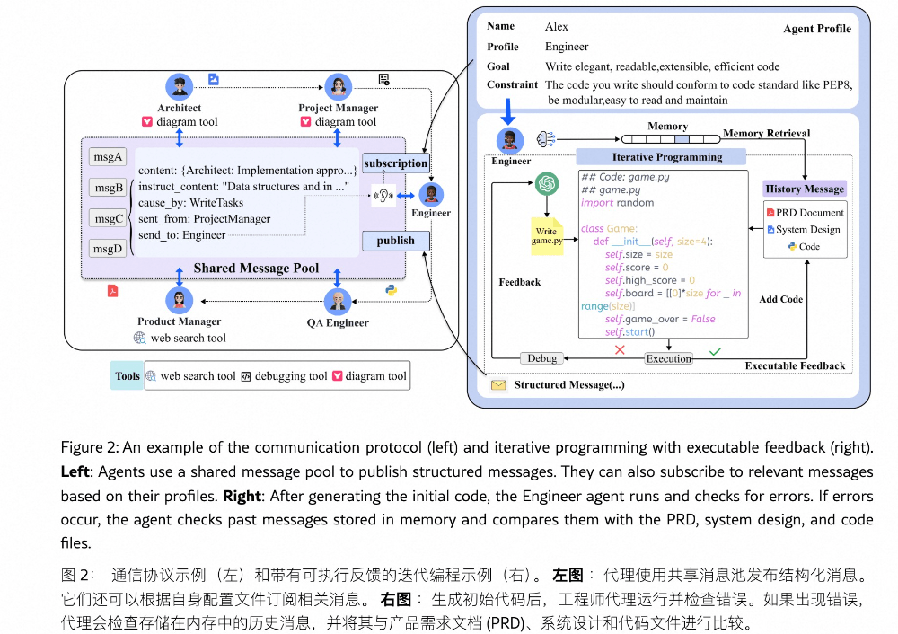

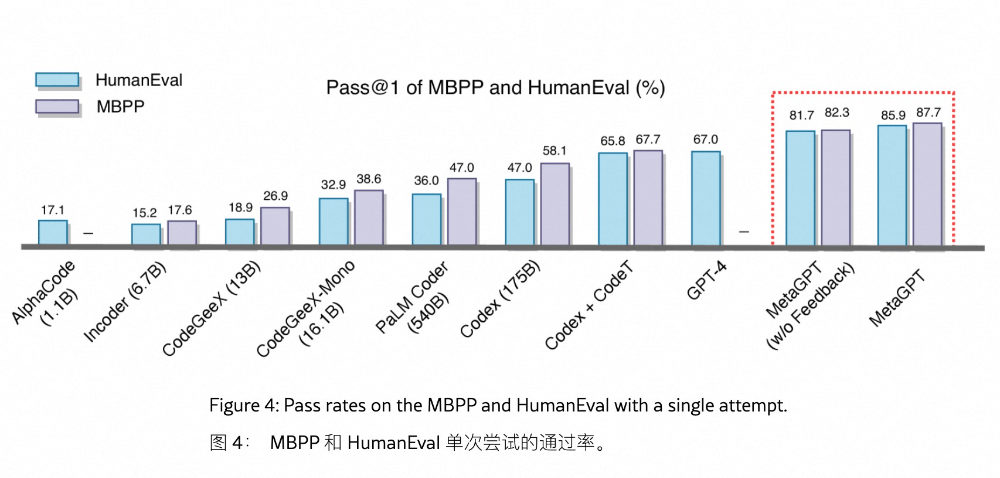

  

- 带来的影响 (Impact)

  

MetaGPT 的出现对 AI Agent 领域产⽣了深远影响，具体体现在以下⼏个⽅⾯：

- 确⽴了“流程⼯程”的重要性：它证明了在多智能体系统中，单纯提升模型能⼒（Model Capability）不如优化协作流程（Workflow/SOP）来得有效。通过约束智能体的⾏为空间，MetaGPT 能够让 GPT-3.5 级别的模型完成 GPT-4 级别模型在⽆约束状态下都很难完成的复杂软件开发任务。
- ⼤幅降低了协作中的“幻觉”：通过强制要求产出结构化⽂档（如必须先画 UML 图再写代码），MetaGPT 引⼊了“⾃我修正”和“逻辑验证”的中间环节。这种思维链（Chain of Thought）的⼯程化落地，极⼤地减少了代码⽣成的错误率。
- 重新定义了“软件⼯程”的⾃动化范式：它让开发者看到了“⼀家虚拟软件公司”的可能性。只需输⼊⼀句 Create a Flappy Bird game，系统就能⾃动产出包括需求⽂档、架构图、代码在内的整个⼯程。这启发了后来⽆数的 AI 编程⼯具（如 Devin 的部分设计思路）和开源项⽬（如 OpenDevin, ChatDev 的后续优化）。
- 开源社区的爆发：MetaGPT 开源后迅速成为 GitHub 上的爆款项⽬（Star 数万），极⼤地降低了开发者构建多智能体应⽤的⻔槛，使得普通开发者也能利⽤ Agent 框架去尝试⾃动化爬⾍、⾃动化数据分析等任务。

  

▐  **4**. 总结

  

MetaGPT 的本质是⽤“管理学”的智慧（SOP、分⼯）来约束“⼤模型”的不可控性。它告诉我们：要让 AI ⼲⼤事，不能只靠它的智商，还得靠严密的组织纪律。

  

结语：从“炼丹师”到“系统架构师”与“场景定义者”

  

当我们回顾从 GPT-1 到 Multi-Agent 的这段波澜壮阔的演进史，关于“AI ⼯程的空间在哪⼉”这个问题的答案，其实已经浮现在每⼀次范式的跃迁之中。

起初，我们以为⼯程师的空间在于“训练”——我们在参数的海洋⾥寻找收敛的彼岸；

后来，我们以为⼯程师的空间在于“提示”——我们试图⽤咒语般的 Prompt 唤醒巨⼈的沉睡；

但现在，正如 ReAct、MetaGPT 和 Generative Agents 所展示的那样，真正的⼯程师空间，在于“系统”。

  

⼤模型本身，正在变成计算机的新型 CPU。它拥有惊⼈的算⼒和通识，但它依然会有幻觉、会遗忘、会缺乏规划。⽽ AI ⼯程师的使命，不再是去打磨这颗 CPU 的晶体管（那是 OpenAI 的事），⽽是围绕这颗 CPU，去构建主板（流程编排）、硬盘（记忆系统）、⽹卡（⼯具连接）以及操作系统（多智能体协作机制）。

  

⼯程的本质，是对抗熵增，是构建秩序。⽽⼯程师的主观能动性，则是为通⽤智能注⼊“业务灵魂”。

- 当模型像顽童⼀样思维跳跃时，我们⽤ CoT 和 ToT 赋予它逻辑的轨道；
- 当模型像空想家⼀样坐⽽论道时，我们⽤ ReAct 和 Tools 赋予它⾏动的⼿脚；
- 当模型像独⾏侠⼀样⼒不从⼼时，我们⽤ MetaGPT 和 CAMEL 赋予它协作的组织；
- 当模型像过客⼀样看过即忘时，我们⽤ Generative Agents 赋予它记忆的灵魂。

  

AI ⼯程师的空间在哪⼉？

它就在模型能⼒与现实需求之间的巨⼤鸿沟⾥。

它在于将“预测下⼀个词”的概率统计，转化为“解决复杂问题”的确定性⽅案。

它在于让 60 分的模型，通过完美的系统设计，跑出 90 分的效果；让 90 分的模型，通过严密的约束，展现出 100 分的可靠。

在这个时代，我们不再仅仅是代码的编写者，我们是硅基⼤脑的⼼理学家，是数字社会的社会学家，更是新⼀代智能系统的架构师。

模型决定了智能的下限，⽽⼯程师决定了应⽤的上限。  

这，就是属于我们的⼴阔空间。

  

备注：本⽂的思想来⾃永霸，但内容是⽤ AI与个⼈整理的，部分信息可能有出⼊。

  

团队介绍

  

本文作者永霸，来自淘天集团-基础交易终端团队。一支专注于手淘APP交易域（购物车、下单、订单、物流等）业务研发和体验优化的技术团队。在丰富的业务场景下，我们通过持续的技术探索、不断的创新突破，给数亿用户提供极致可靠的交易保障、极致流畅的操作交互以及极致顺滑的购物体验。

  

  

  

**¤** **拓展阅读** **¤**

  

[3DXR技术](https://mp.weixin.qq.com/mp/appmsgalbum?__biz=MzAxNDEwNjk5OQ==&action=getalbum&album_id=2565944923443904512#wechat_redirect) | [终端技术](https://mp.weixin.qq.com/mp/appmsgalbum?__biz=MzAxNDEwNjk5OQ==&action=getalbum&album_id=1533906991218294785#wechat_redirect) | [音视频技术](https://mp.weixin.qq.com/mp/appmsgalbum?__biz=MzAxNDEwNjk5OQ==&action=getalbum&album_id=1592015847500414978#wechat_redirect)

[服务端技术](https://mp.weixin.qq.com/mp/appmsgalbum?__biz=MzAxNDEwNjk5OQ==&action=getalbum&album_id=1539610690070642689#wechat_redirect) | [技术质量](https://mp.weixin.qq.com/mp/appmsgalbum?__biz=MzAxNDEwNjk5OQ==&action=getalbum&album_id=2565883875634397185#wechat_redirect) | [数据算法](https://mp.weixin.qq.com/mp/appmsgalbum?__biz=MzAxNDEwNjk5OQ==&action=getalbum&album_id=1522425612282494977#wechat_redirect)
