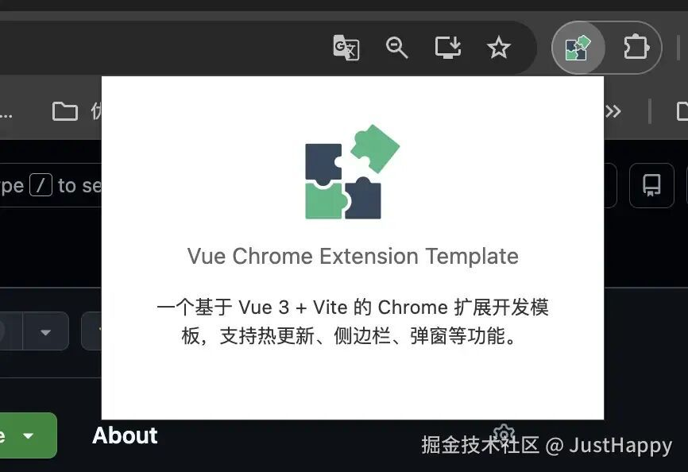
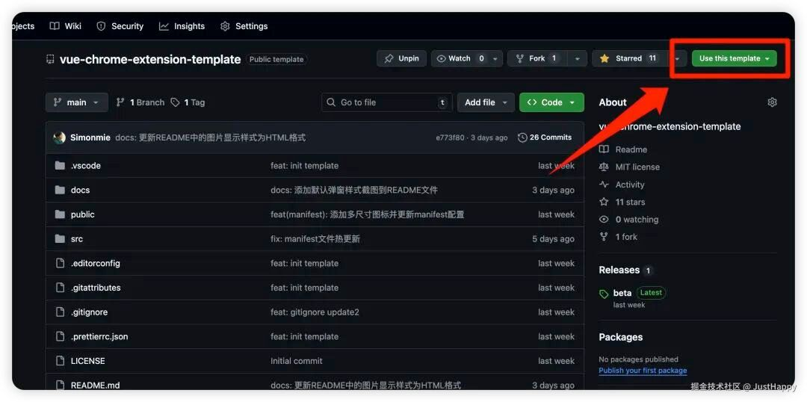
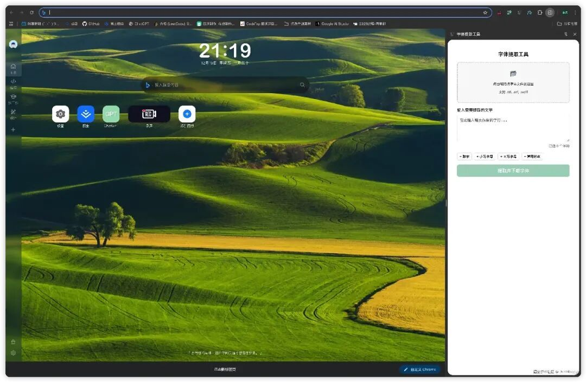

# 我写了一个超级简单的浏览器插件Vue开发模板

点击上方 程序员成长指北，关注公众号

回复1，加入高级Node交流群

> Hi!这里是JustHappy🚀🚀，一时兴起想开发一个浏览器插件，但是找来找去发现在Vue生态下好像没有一个超轻的简单的模板或者脚手架，看了一圈感觉antFu大佬的vitesse-webext还不错，但是感觉还不够轻，于是我打算手撸仿写一个简单版本

## 我想要一个什么样的模板

- 技术栈轻盈：Vue + JS 越简单越好
- 支持“热更新”：修改后立马更新视图

## 于是有了这个模板...



image.png

仓库地址是这个： github.com/Simonmie/vu…\[1\]

## 如何使用？很简单

你只需要在仓库中点击 use this template 就可以使用该模板去构建插件



image.png

## 开始开发吧！

### 安装依赖

```
npm install
```
### 模板结构

```
├── assets
├── background
│   ├── dev-hmr.js  // 开发环境下的热更新脚本
│   └── main.js  // 背景脚本
├── logic
│   └── common-setup.js  // 公共设置脚本
├── manifest.js // manifest.json 生成脚本
├── options // 选项页
│   ├── OptionsPage.vue 
│   ├── index.html
│   └── main.js
├── popup // 弹窗
│   ├── PopupComponent.vue
│   ├── index.html
│   └── main.js
├── sidepanel // 侧边栏
│   ├── SidePanel.vue
│   ├── assets
│   │   └── logo.png
│   ├── index.html
│   └── main.js
└── utils
    ├── base.js // 基础工具函数
    └── config.js // 配置文件函数

```
### 如何开发？

#### 启动热更新

```
npm run dev:ext
```
#### 安装扩展

1. 打开 Chrome 浏览器。
2. 点击浏览器菜单（通常是三个垂直点图标），选择“更多工具”>“扩展程序”。
3. 在扩展程序页面，打开“开发者模式”。
4. 点击“加载已解压的扩展程序”，选择项目根目录下的 `extension` 文件夹。

然后你就可以愉快的开始开发浏览器插件了。你几乎只需要会Vue和JS就可以开发，或者结合大模型快速生成一个插件

这是我用Gemini 3 pro结合这个模板生成的其中一个插件的效果，基本上完全可用



image.png

如果你也想尝试，这是这个插件的github仓库地址 github.com/Simonmie/Te…\[2\]

下面我们来聊聊这个框架的“热更新”原理吧....

## ”热更新“原理

有人问我：“为什么这个模板能做到类似 HMR 的体验？浏览器插件不是不能热更新吗”

答案其实很简单：

> **不是模块级热替换，而是自动重建 + 自动刷新。**

当你修改代码时：

- 构建器会重建产物
- 热更新服务会给扩展发送通知
- 前台视图刷新、后台脚本重载
- 浏览器扩展整体更新

完全不需要手动刷新窗口，不需要重新点击扩展图标。

更关键的是：整个机制非常轻，非常干净。

### 一个极小的热更新服务

模板启动后会同时启动一个本地服务，用于监听构建变化并向扩展发送消息。

这个服务通过 SSE（Server-Sent Events）工作：

- 地址类似：http://localhost:3000/extension-hmr
- 构建完成后会推送 reload 信号
- 所有页面和后台脚本都会监听它

SSE 的好处是：

- 轻量
- 无需额外依赖
- 无需轮询
- 特别稳定

你甚至可以把它理解为：一个特别简单的“更新广播器”。

### 前台页面如何刷新？

扩展里的 popup、options、sidepanel 页面都会自动注入一个监听器：

1. 通过 EventSource 连接 SSE 服务
2. 收到 reload 信号
3. `window.location.reload()`

所以改完代码保存后：

→ UI 会立即重新加载

→ 新的代码会直接生效

不用点击，不用重打开 popup 页面，连 DevTools 都不用动。

### 后台脚本如何更新？

在开发模式下，后台脚本并不会直接运行正式的 background 逻辑，而是先接入一个开发专用的脚本。

这个脚本专门负责监听 SSE：

1. 收到消息
2. `chrome.runtime.reload()`

这会让整个扩展瞬间重载：

- UI 刷新
- 脚本刷新
- 状态重置

这种方式非常适合开发场景，因为不用担心缓存、不一致、后台仍在运行等问题。

### 自动重连机制

SSE 连接如果断开，比如：

- 小断网
- 浏览器切换标签
- 系统休眠
- 构建器重启

扩展会自动重试连接。

这意味着：

你只需要改代码 → 保存 → 浏览器自动更新

不用关心底层连接是否断过、重连过。

它就是一直能用。

> 如果这对你有帮助，哈哈求个star✨，模板大概率还有很多不足，欢迎大家提交issue、pr等，或者单纯骚扰我😜

> 链接：https://juejin.cn/post/7585406229167865906
> 
> 作者：JustHappy

Node 社群

参考资料

\[1\] https://github.com/Simonmie/vue-chrome-extension-template: _https://link.juejin.cn?target=https%3A%2F%2Fgithub.com%2FSimonmie%2Fvue-chrome-extension-template_

\[2\] https://github.com/Simonmie/Text-extraction-tool: _https://link.juejin.cn?target=https%3A%2F%2Fgithub.com%2FSimonmie%2FText-extraction-tool_
