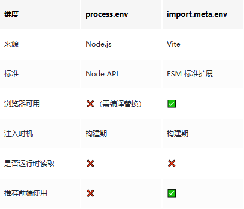
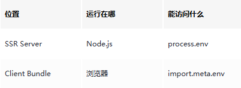

# 浅谈 import.meta.env 和 process.env 的区别

```js_darkmode__1
点击上方 程序员成长指北，关注公众号
回复1，加入高级Node交流群
```
这是一个**前端构建环境里非常核心、也非常容易混淆的问题**。下面我们从**来源、使用场景、编译时机、安全性**四个维度来谈谈 `import.meta.env` 和 `process.env` 的区别。

## 一句话结论

> **`process.env`****是 Node.js 的环境变量接口****`import.meta.env`****是 Vite（ESM）在构建期注入的前端环境变量**

## 一、`process.env` 是什么？

###  本质

- 来自 **Node.js**
- 运行时读取 **服务器 / 构建机的系统环境变量**
- 本身 **浏览器里不存在**

```
console.log(process.env.NODE_ENV);
```
### 使用场景

- Node 服务
- 构建工具（Webpack / Vite / Rollup）
- SSR（Node 端）

### 前端能不能用？

👉 **不能直接用**

浏览器里没有 `process`：

```
// 浏览器原生环境 ❌
Uncaught ReferenceError: process is not defined

```
### 为什么 Webpack 项目里能用？

因为 **Webpack 帮你“编译期替换”了**

```
process.env.NODE_ENV
// ⬇️ 构建时被替换成
"production"
```
本质是 **字符串替换**，不是运行时读取。

## 二、`import.meta.env` 是什么？

### 本质

- **Vite 提供**
- 基于 **ES Module 的****`import.meta`**
- **构建期 + 运行期可用（但值是构建期确定的）**

```
console.log(import.meta.env.MODE);
```
### 特点

- 浏览器里 **原生支持**
- 不依赖 Node 的 `process`
- 更符合现代 ESM 规范

## 三、两者核心区别对比（重点）



⚠️ **两者都不是“前端运行时读取服务器环境变量”**

## 四、Vite 中为什么不用 `process.env`？

### 因为 Vite 不再默认注入 `process`

```
// Vite 项目中 ❌
process.env.API_URL
```
会直接报错。

### 官方设计选择

- 避免 Node 全局污染
- 更贴近浏览器真实环境
- 更利于 Tree Shaking

## 五、Vite 环境变量的正确用法（非常重要）

###  必须以 `VITE_` 开头

```
# .env
VITE_API_URL=https://api.example.com
console.log(import.meta.env.VITE_API_URL);
```
❌ 否则 **不会注入到前端**

### 内置变量

```
import.meta.env.MODE        // development / production
import.meta.env.DEV         // true / false
import.meta.env.PROD        // true / false
import.meta.env.BASE_URL
```
## 六、安全性

### ⚠️ 重要警告

> **`import.meta.env`****里的变量 ≠ 私密**

它们会：

- 被 **打进 JS Bundle**
- 可在 DevTools 直接看到

### ❌ 不要这样做

```
VITE_SECRET_KEY=xxxx
```
### ✅ 正确做法

- **前端**：只放“公开配置”（API 域名、开关）
- **私密变量**：只放在 **Node / 服务端**

## 七、SSR / 全栈项目里怎么区分？

### 在 Vite + SSR（如 Nuxt / 自建 SSR）：

Node 端

```
process.env.DB_PASSWORD
```
浏览器端

```
import.meta.env.VITE_API_URL
```
**两套环境变量是刻意分开的**。

### 为什么必须分成两套？（设计原因）

#### 1️⃣ 执行环境不同（这是根因）



浏览器里 **永远不可能安全地访问服务器环境变量**。

#### 2️⃣ SSR ≠ 浏览器

很多人误解：

> “SSR 是不是浏览器代码先在 Node 跑一遍？”

❌ **不完全对**

SSR 实际是：

```
Node.js 先跑一份 → 生成 HTML
浏览器再跑一份 → hydrate
```
这两次执行：

- **环境不同**
- **变量来源不同**
- **安全级别不同**

### 在 Vite + SSR 中，变量的“真实流向”

#### 1️⃣ Node 端（SSR Server）

```
// server.ts / entry-server.ts
const dbPassword = process.env.DB_PASSWORD;
```
✔️ 真实运行时读取

✔️ 不会进 bundle

✔️ 只存在于服务器内存

#### 2️⃣ Client 端（浏览器）

```
// entry-client.ts / React/Vue 组件
const apiUrl = import.meta.env.VITE_API_URL;
```
✔️ 构建期注入

✔️ 会打进 JS

✔️ 用户可见

#### 3️⃣ 中间那条“禁止通道”

```
// ❌ 绝对禁止
process.env.DB_PASSWORD → 浏览器
```
**SSR 不会、也不允许，自动帮你“透传”环境变量**

### SSR 中最容易踩的 3 个坑（重点）

####  坑 1：在“共享代码”里直接用 `process.env`

```
// utils/config.ts（被 server + client 共用）
export const API = process.env.API_URL; // ❌

```
**问题：**

- Server OK
- Client 直接炸（或被错误替换）

✅ 正确方式：

```
export const API = import.meta.env.VITE_API_URL;
```
或者：

```
export const API =typeof window === 'undefined'
    ? process.env.INTERNAL_API
    : import.meta.env.VITE_API_URL;
```
####  坑 2：误以为 SSR 可以“顺手用数据库变量”

```
// Vue/React 组件里
console.log(process.env.DB_PASSWORD); // ❌
```
哪怕你在 SSR 模式下，这段代码：

- **最终仍会跑在浏览器**
- **会被打包**
- **是严重安全漏洞**

#### 坑 3：把“环境变量”当成“运行时配置”

```
// ❌ 想通过部署切换 API
import.meta.env.VITE_API_URL
```
🚨 这是 **构建期值**：

```
build 时确定
→ CDN 缓存
→ 所有用户共享
```
**想运行期切换？只能：**

- 接口返回配置
- HTML 注入 window.**CONFIG**
- 拉 JSON 配置文件

### SSR 项目里“正确的分层模型”（工程视角）

```
┌──────────────────────────┐
│        浏览器 Client       │
│  import.meta.env.VITE_*   │ ← 公开配置
└───────────▲──────────────┘
            │
        HTTP / HTML
            │
┌───────────┴──────────────┐
│        Node SSR Server     │
│      process.env.*        │ ← 私密配置
└───────────▲──────────────┘
            │
        内部访问
            │
┌───────────┴──────────────┐
│        DB / Redis / OSS    │
└──────────────────────────┘

```
这是一条 **单向、安全的数据流**。

---

### Nuxt / 自建 SSR 的对应关系


| **类型** | **用途** |
| --- | --- |
| runtimeConfig | Server-only |
| runtimeConfig.public | Client 可见 |
| process.env | 仅 server |


👉 Nuxt 本质也是在**帮你维护这条边界**

## 八、常见误区总结

### 误区 1

> `import.meta.env` 是运行时读取

❌ **错**，仍是构建期注入

###  误区 2

> 可以用它动态切换环境

❌ **不行**，想动态只能：

- 接口返回配置
- 或运行时请求 JSON

### 误区 3

> Vite 里还能继续用 `process.env`

❌ 除非你手动 polyfill（不推荐）

## 九、总结

- 前端（Vite）只认 `import.meta.env.VITE_*`
- 服务端（Node）只认 `process.env`
- 永远不要把秘密放进前端 env

> 链接：https://juejin.cn/post/7592062873829916722
> 
> 作者：在西安牧羊的牛油果

  

Node 社群
