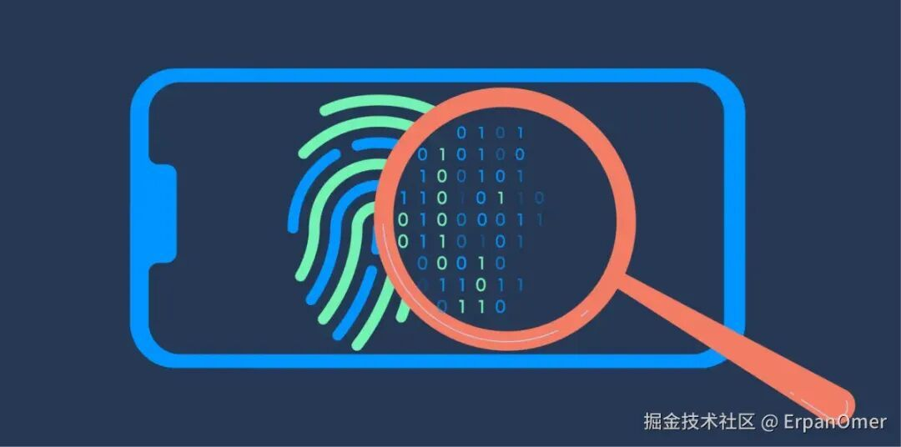
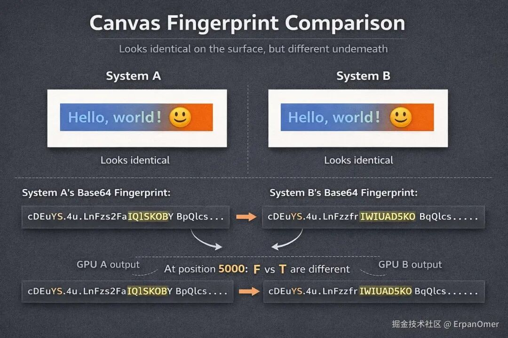
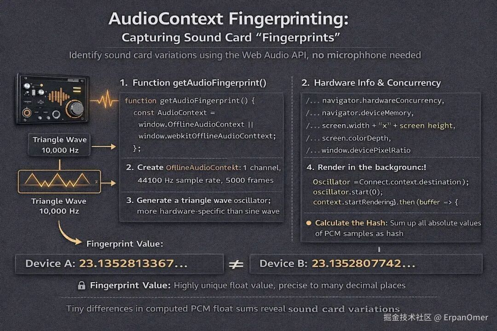
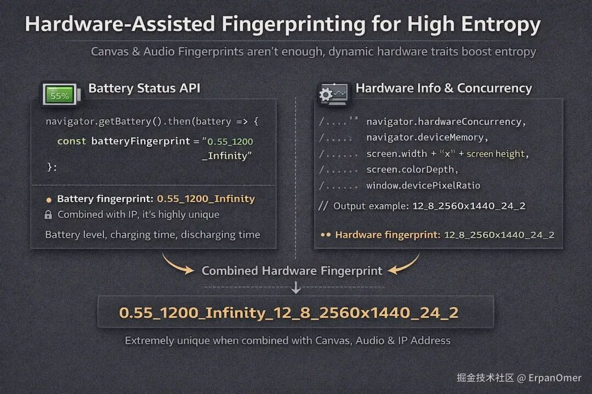

# 前端指纹技术是如何实现的？（Canvas、Audio、硬件API 核心原理解密）

```js_darkmode__1
点击上方 程序员成长指北，关注公众号
回复1，加入高级Node交流群
```


Fingerprint-KYS-01-1-1200x596.png

### 什么是设备指纹？

在讲实现之前，先纠正一个误区：设备指纹（Device Fingerprint）\[1\]不是为了知道**你是张三**，而是为了知道 **这台设备是编号 9527**。

它的核心逻辑只有一条：**利用浏览器暴露的硬件底层差异（显卡、声卡、电池、屏幕），组合出极高熵值的唯一 ID。**

就算你清空了 Cookie，换了 IP，只要你的硬件没变，这套代码算出来的 Hash 值就永远不变。

下面我们直接上代码，拆解最核心的三种实现方式。

👉 在线体验 Device Fingerprint\[2\]

### Canvas 指纹

这是目前最成熟、识别率最高的技术。

#### 实现原理

Canvas 绘图不仅仅依赖浏览器引擎，它极度依赖底层的 **GPU 绘图指令**、**操作系统图形驱动** 以及 **抗锯齿（Anti-aliasing）算法**。

当你命令浏览器**画一个红色的矩形，里面写上 Hello, world!** 时：

- NVIDIA 的显卡和 AMD 的显卡，在处理边缘像素的混合（抗锯齿）时，算法有微小的数学差异。
- Windows 和 Mac 在字体渲染（Sub-pixel rendering）上，对笔画粗细的处理不同。
- 这就导致了：**同一段 Canvas 代码，生成的图片像素数据（RGBA），在不同设备上是完全不同的。**

#### 核心代码实现方式

我们不需要画多复杂的图，关键是要**触发差异**。通常会用到：光影叠加、异形字体、emoji（检测字体库）。

```
function getCanvasFingerprint() {
    // 1. 创建一个不会挂载到 DOM 上的画布
    const canvas = document.createElement('canvas');
    const ctx = canvas.getContext('2d');
    canvas.width = 200;
    canvas.height = 50;

    // 2. 文字干扰：利用字体渲染差异
    // textBaseline 设为 top/bottom 会触发不同的垂直对齐算法
    ctx.textBaseline = "top";
    ctx.font = "14px 'Arial'";
    ctx.fillStyle = "#f60";
    ctx.fillRect(125, 1, 62, 20); // 背景块

    // 3. 叠加混合：触发 GPU 的颜色混合算法
    ctx.fillStyle = "#069";
    // 写入带特殊符号的文字，测试系统字体支持度
    ctx.fillText("Hello, world! \ud83d\ude03", 2, 15);
    
    // 再次叠加，利用 rgba 透明度触发抗锯齿差异
    ctx.fillStyle = "rgba(102, 204, 0, 0.7)";
    ctx.fillText("Hello, world! \ud83d\ude03", 4, 17);

    // 4. 导出指纹
    // toDataURL 会返回 base64 字符串
    // 同样的图像，不同显卡生成的 base64 字符串的 CRC 校验码是不同的
    const b64 = canvas.toDataURL().replace("data:image/png;base64,", "");
    
    // 5. 将超长字符串 Hash 化 (这里用简单的 hash 示例，生产环境可用 MurmurHash3)
    let bin = atob(b64);
    let crc = bin2hex(bin.slice(-16, -12)); // 取部分校验位
    return crc;
}
```
  



差异在哪？

肉眼看这两张图是一模一样的。

但如果你把两台电脑生成的 Base64 字符串拿去对比，会发现可能在第 5000 个字符处，有一个字母不一样。那就是显卡留下的签名。

### AudioContext 指纹

既然显卡有差异，声卡（Audio Stack）自然也有。

#### 原理

Audio 指纹不是录音（不需要麦克风权限）。

它是利用 Web Audio API 生成一段数学上的声音信号（正弦波、三角波），然后经过一系列处理（压缩、滤波）。

由于计算机浮点数运算的精度差异，以及底层音频处理单元（DSP）的实现不同，最终生成的**PCM 音频数据流**会有极其微小的差别。

#### 代码实现

通常使用 `OfflineAudioContext`（离线音频上下文）\[3\]，它可以在后台静默渲染音频，不需要用户听到声音，速度极快。

```
function getAudioFingerprint() {
    // 兼容性处理
    const AudioContext = window.OfflineAudioContext || window.webkitOfflineAudioContext;
    if (!AudioContext) returnnull;

    // 1. 创建离线上下文：1个声道，44100采样率，5000帧
    const context = new AudioContext(1, 5000, 44100);

    // 2. 创建振荡器 (Oscillator)
    // 三角波 (triangle) 比正弦波更容易暴露硬件处理的非线性差异
    const oscillator = context.createOscillator();
    oscillator.type = 'triangle';
    oscillator.frequency.value = 10000;

    // 3. 创建动态压缩器 (Compressor) - 核心步骤
    // 压缩器的算法在不同浏览器/硬件上实现差异很大
    const compressor = context.createDynamicsCompressor();
    compressor.threshold.value = -50;
    compressor.knee.value = 40;
    compressor.ratio.value = 12;
    compressor.reduction.value = -20;

    // 4. 连接节点：振荡器 -> 压缩器 -> 输出
    oscillator.connect(compressor);
    compressor.connect(context.destination);

    // 5. 开始渲染
    oscillator.start(0);
    context.startRendering().then(buffer => {
        // 6. 获取渲染后的 PCM 数据
        // 这是一个 Float32Array 数组
        const data = buffer.getChannelData(0);
        
        // 7. 计算 Hash
        let sum = 0;
        // 简单累加所有采样点的绝对值，作为指纹
        for (let i = 0; i < data.length; i++) {
            sum += Math.abs(data[i]);
        }
        console.log("Audio Fingerprint:", sum);
    });
}
```


image.png

不同设备跑出来的 `sum` 值，会精确到小数点后十几位，那个微小的尾数差异就是指纹。

### 电池与硬件并发

光有 Canvas 和 Audio 还不够（因为同一型号的 iPhone 可能会完全一样）。这时候需要引入**动态硬件特征**来增加熵值。

#### 电池电量 API (Battery Status API)\[4\]

_注：由于隐私争议太大，Firefox 和 Safari 已禁用，但 Chrome (部分版本) 和 Android Webview 中依然可能获取。_

这玩意的逻辑非常粗暴：

**电量百分比, 充电/放电时间** 这个组合在特定时间点是极具唯一性的。

```
// 核心代码
navigator.getBattery().then(battery => {
    const level = battery.level; // 例如 0.55
    const chargingTime = battery.chargingTime; // 例如 1200 (秒)
    const dischargingTime = battery.dischargingTime; // 例如 Infinity
    
    // 指纹因子：0.55_1200_Infinity
    // 结合 IP，能把用户锁定得死死的
    const batteryFingerprint = `${level}_${chargingTime}_${dischargingTime}`;
});
```
如果我在 1 分钟内连续请求两次，发现你的电量从 `0.42` 变成了 `0.41`，这个**变化曲线**也是一种强指纹。

#### 硬件并发数与内存

这些是 `Navigator` 对象上赤裸裸的硬件参数：

```
const hardwareInfo = [
    navigator.hardwareConcurrency, // CPU 核心数，如 12
    navigator.deviceMemory,        // 内存大小 (GB)，如 8
    screen.width + 'x' + screen.height, // 分辨率
    screen.colorDepth,             // 色彩深度，如 24
    window.devicePixelRatio        // 像素比，如 2
].join('_');

// 输出示例：12_8_2560x1440_24_2
```


image.png

虽然这些参数单看很普通，但如果你把 **CPU + 内存 + 分辨率 + Canvas指纹 + Audio指纹** 拼接在一起，全球几十亿设备中，能和你撞车的概率，几乎为零。

所谓的前端指纹技术，本质上就是**找不同**的一种方式。

开发者利用一切可以调用的 API（Canvas, Audio, WebGL, 硬件信息），强迫浏览器进行某种复杂的运算。由于硬件和驱动的细微差别，运算结果必然存在差异。

这些差异被收集起来，生成了一个字符串。

**这就是浏览器在互联网上的唯一ID**，希望对你们有帮助！

> 作者：ErpanOmer
> 
> 链接：https://juejin.cn/post/7596970073750552612

  

  

Node 社群
