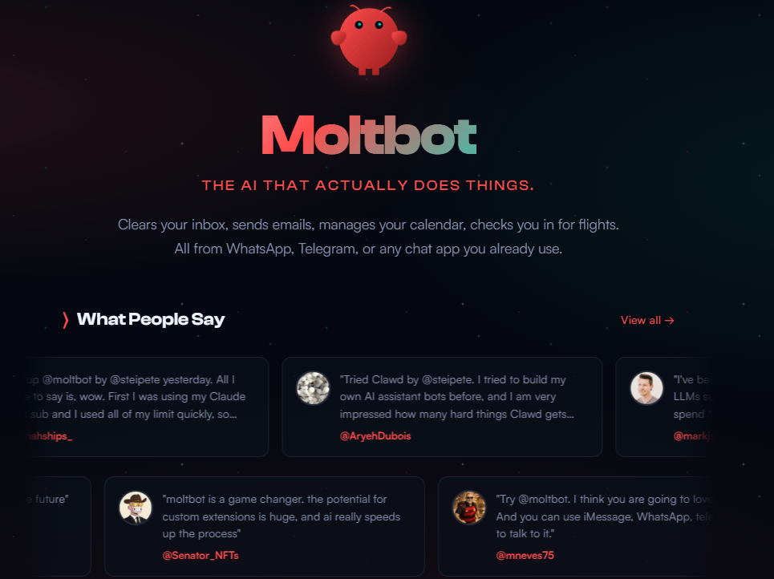
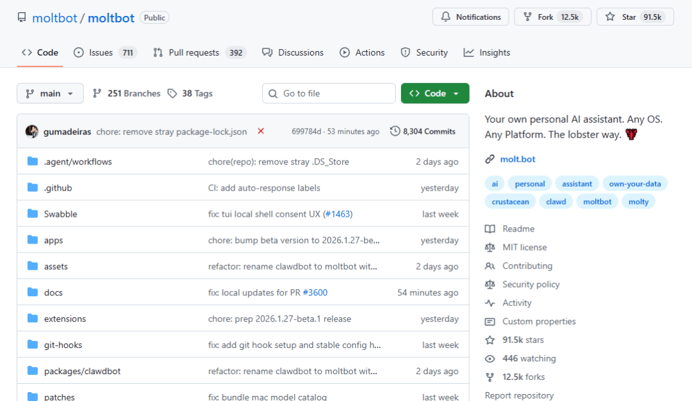
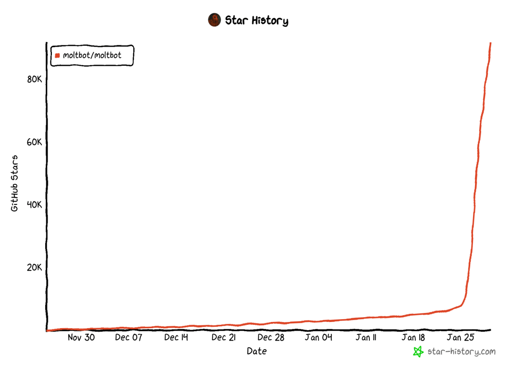
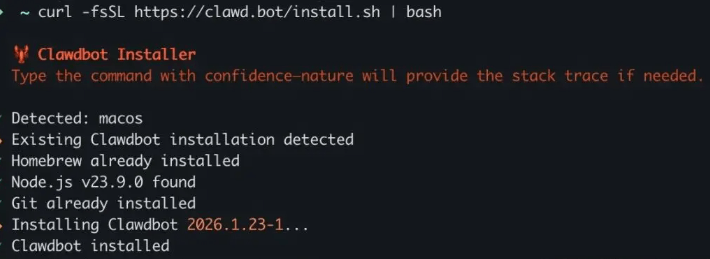
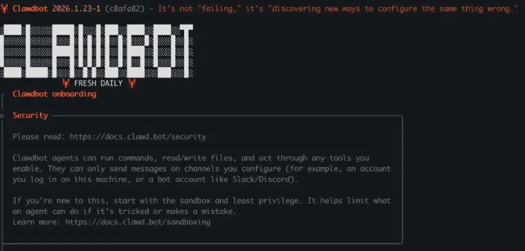
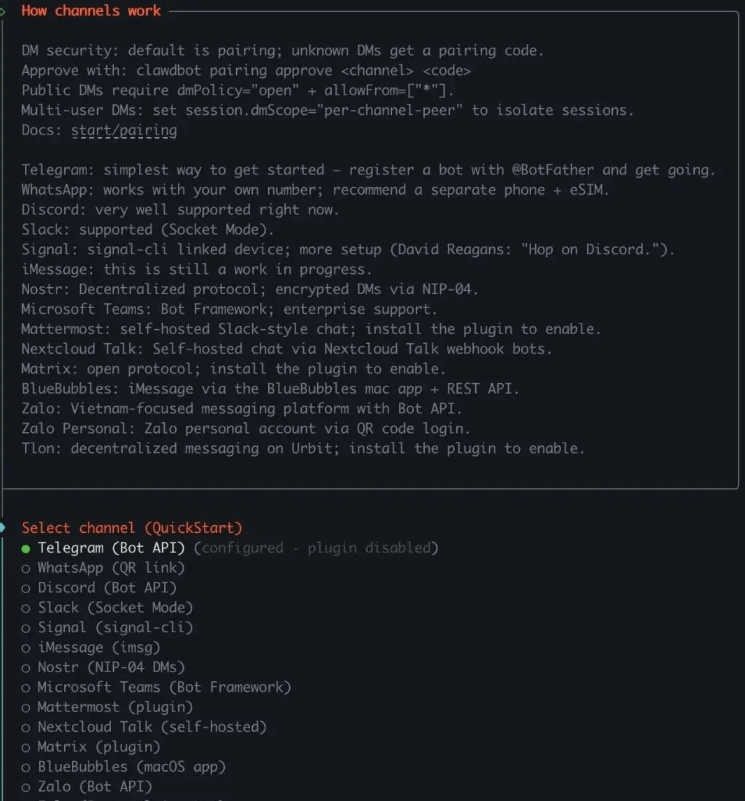

# Clawdbot 空前爆火！github 一天涨 5w+ Star！

```js_darkmode__1
点击上方 程序员成长指北，关注公众号
回复1，加入高级Node交流群
```


最近一段时间，一款名为 Clawdbot 的开源 AI 项目在技术圈与开发者社区刷屏了。 GitHub Star 数暴增， 一天涨 5w+





从 GitHub 的暴增 Star，到 Mac mini 被开发者抢着部署，这款工具为何受到如此关注？如果说 ChatGPT 是会聊天的助手，那 Clawdbot 就是 会“动手干活”的私人 AI 员工。

## 🚀 什么是 Clawdbot？

简单来说，Clawdbot 是一个自主 AI 代理（AI Agent） —— 一个不只是回答你问题，还能主动执行任务、自动化流程的智能助手。它不是运行在云端的聊天机器人，而是 部署在你控制的设备上（个人电脑、服务器、VPS 等），可以通过你熟悉的聊天应用随时“召唤”和指挥

 它的核心特点包括：

通过聊天应用交互：支持 WhatsApp、Telegram、Discord、iMessage 等，你就像跟朋友聊天一样下达指令。

长期记忆与状态保存：它能记住历史对话与上下文，不用每次重复。

主动执行任务：不仅响应你的提问，还能定时检查邮件、提醒日程、执行脚本、控制浏览器、管理文件……真正的“行动派”。

本地优先：所有数据保留在你的机器上，更好掌控隐私与安全。

## 为什么它能火？

Clawdbot 的爆火不是偶然，而是几个关键因素叠加的结果：

1）从“会说话”到“会做事”的进化

传统工具如 ChatGPT、Claude 等更多是被动对话：你问它答完就结束。Clawdbot 则更像一个 24×7 不睡觉的数字员工 —— 它会主动推送提醒，会自动执行任务，甚至可以根据提示跨多个平台开展工作流程。

举个例子：你可以在 Telegram 里发送一句话，让 Clawdbot 

✔ 抓取 Gmail 收件箱摘要 

✔ 自动归档不重要邮件

 ✔ 为重要邮件草拟回复 

✔ 安排日程提醒 

甚至在你睡觉的时候完成这些工作。

2）开源 + 自由定制

Clawdbot 完全开源，社区贡献活跃，已有大量 可复用技能模块（Skills），你可以像搭积木一样给它装功能 —— 比如自动签到、RSS 阅读、自动问答、数据抓取等。

这种自由度让开发者更愿意试水、分享体验与配置方法，从而形成病毒式传播。

🛠 本地部署让用户更安心

随着大家对 AI 隐私风险的意识提高，在本地运行且能控制所有数据的 AI 解决方案越来越吸引人。Clawdbot 正是抓住了这一点：你不需要把隐私数据上传到云端服务，一切运行在你可控的设备上。

Clawdbot 能做什么？

虽然能力强，Clawdbot 不是魔法但它确实可以：

✔ 自动化日常工作

比方说：自动整理邮件、提醒日程、总结文档、生成报告。

✔ 执行系统操作

从文件管理到浏览器自动化，甚至运行脚本命令。

✔ 多平台集成

它跨 WhatsApp、Telegram、Discord、Slack 等平台操作——你在哪里发消息，它就能执行任务。

✔ 技能扩展

通过社区技能库，你能一键安装各种自动化 “插件”，实现更复杂的 AI 工作流。

## 快速上手

如果你有一台备用机或者服务器，就按照以下步骤进行安装。Clawdbot 的整个安装流程其实非常极客友好。

### ① 一键安装

`# 推荐方式：自动脚本安装   curl -fsSL https://clawd.bot/install.sh | bash      # 或者使用 npm (如果你是 Node 开发者)   npm install -g clawdbot@latest`

此步骤会自动检查环境，并且安装最新版本。



### ② 初始化配置

安装结束后，会开始初始化配置，我们只需用方向键进行选择，空格键确认，这跟使用 Claude Code 是一样的。



选择「Yes」，同意风险提醒。

Onboard 模式选择「QuickStart」。

Model provider 根据个人情况选择。

### ③ 连接你的聊天软件

最后就是渠道选择，选择你想要连接的即时通讯工具。

然后 Skills 配置，不熟悉可以跳过，选择「Skip for now」。

后面还有一系列配置，如果不清楚的够可以先跳过~

最后启动 Gateway，基本就大功告成，可以直接在网页或APP中进行对话。

## ⚠️ 使用注意与风险

作为一个强大工具，Clawdbot 也不是完美无风险：

🔐 安全权限问题：它能读写文件、执行命令，对权限管理要非常谨慎。

📌 配置门槛较高：目前对普通用户来说，需要一些技术基础来部署和维护。

⚠️ 社区也存在风险技能：某些公共技能可能包含恶意代码，安装前要审查。

Clawdbot 的出现，是 AI 从 “会说话” 向 “会做事” 的一次有力进化。它不仅让你和 AI 的交互更自然，也真正将 AI 的“手脚”伸入到日常工作流程中。

未来这类私人 AI 代理或许会成为我们工作和生活中不可缺少的数字伙伴——当它不只是回答你的问题，而是 替你执行任务、记住细节、主动提醒安排时，AI 就真正开始改变生产力了。

Node 社群

```js_darkmode__116

我组建了一个氛围特别好的 Node.js 社群，里面有很多 Node.js小伙伴，如果你对Node.js学习感兴趣的话（后续有计划也可以），我们可以一起进行Node.js相关的交流、学习、共建。下方加 考拉 好友回复「Node」即可。   “分享、点赞、在看” 支持一波👍
```
