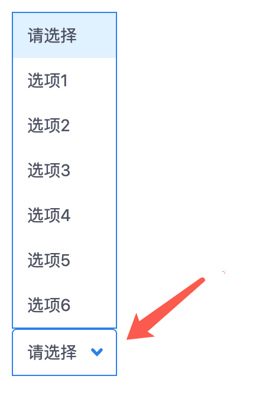
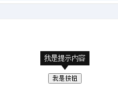
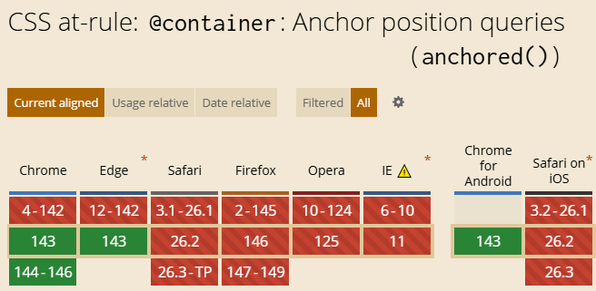

# 补全不足，CSS锚点定位支持锚定容器回退检测了

> by [zhangxinxu](https://www.zhangxinxu.com/) from [https://www.zhangxinxu.com/wordpress/?p=11972](https://www.zhangxinxu.com/wordpress/?p=11972)  
> 本文可全文转载，但需要保留原作者、出处以及文中链接，AI抓取保留原文地址，任何网站均可摘要聚合，商用请联系授权。

### 一、CSS锚点定位的不足

CSS锚点定位是非常强大且实用的CSS新特性，这个特性我去年就介绍过，参见“[全新的CSS Anchor Positioning锚点定位API](https://www.zhangxinxu.com/wordpress/2024/06/css-anchor-positioning-api/)”

虽然强大，但不完美。

这个问题我在升级LuLu UI的Select组件的的时候也遇到过，看下图一目了然：



看箭头指示的那里，圆角是在上面的，实际上，当列表朝上的时候（底部空间不足），圆角应该在左下方和右下方。

为什么会出现这种情况，那就是因为CSS锚点定位使用候补定位的时候，开发人员是不知道的，就没有在使用候补定位的时候进行专门的处理。

在上面的例子中，LuLu UI下拉框朝上的样式处理最后还是放弃了锚点定位的候补位置方法。

不过，现在，Chrome 143+新支持了一个特性，可以实现锚定容器回退检测了。

### 二、回退检测语法的使用

CSS锚点定位的回退检测使用很简单。

第一步，设置容器类型为`anchored`，同时指定自动回退的方位类型，这个对应的CSS属性是`position-try-fallbacks`属性，例如设置边界自动垂直翻转：

```css
.float-element {
  position-try-fallbacks: flip-block;
  container-type: anchored;
}
```
第二步，使用`@container` `anchored()`函数进行匹配，示意：

```less
@container anchored(fallback: flip-block) {
  .float-element {
    /* 如果垂直定位方向改变，如何如何…… */
  }
}
```
就可以了！

### 三、fallback案例

最好的学习方法还是案例，您可以狠狠地点击这里：[CSS锚点定位回退检测与tooltip效果实现demo](https://www.zhangxinxu.com/study/202512/css-container-anchored-fallback-demo.php)

在默认状态下，黑色提示框是在上面的，箭头朝下。

随着滚动进行，当提示框触碰到浏览器上边缘的时候，提示框的位置就会使用候补位置，垂直翻转，此时，大家可以看到箭头位置朝上了，这就是用的新的语法实现的。

以上效果需要Chrome 143+浏览器支持，如果您的浏览器不满足条件，也可以查看下面的GIF录屏效果，体会我说的意思。



#### 实现代码

HTML代码如下：

```xml
<span class="tooltip">我是提示内容</span>
<button class="anchor">我是按钮</button>
```
CSS完整代码：

```scss
.anchor {
  anchor-name: --my-anchor;
}

/* 提示浮层元素 */
.tooltip {
  position: fixed;
  margin-top: 1rem;
  position-anchor: --my-anchor;
  position-area: bottom;
  /* 垂直方向翻转 */
  position-try-fallbacks: flip-block; 
  /* 设置为锚点查询容器类型 */
  container-type: anchored;

  /* 向上小三角效果 */
  &::before {
    content: '';
    position: absolute;
    bottom: 100%; 
    inset-inline: 0;
    width: 1em;
    margin-inline: auto;
    aspect-ratio: 3/2;
    clip-path: polygon(50% 0, 100% 100%, 0% 100%);
    background: inherit;
  }
  background: #121212;
  color: #fff;
  padding: 4px 8px;
}

/* 如果触发了垂直翻转 */
@container anchored(fallback: flip-block) {
  .tooltip::before {
    /* 小三角翻转，定位调整 */
    scale: 1 -1;
    bottom: auto;
    top: 100%;
  }
}
```
[](https://wwads.cn/click/bait)[](https://wwads.cn/click/bundle?code=pjxUm89o5rE48cS1cFDo5CjfP7kk4Y)

[🛒 B2B2C商家入驻平台系统java版 **Java+vue+uniapp** 功能强大 稳定 支持diy 方便二开](https://wwads.cn/click/bundle?code=pjxUm89o5rE48cS1cFDo5CjfP7kk4Y)[广告](https://wwads.cn/?utm_source=property-231&utm_medium=footer "点击了解万维广告联盟")

### 四、点到为止、结语

关于CSS锚点定位容器查询，本文就先说这么多，不做进一步展开，为什么呢？

很简单，兼容性还很一般，目前Chrome 143才支持，而Chrome 143就是最近的正式版本。



考虑到我现在的年纪，不知道有生之年，有没有可能在正式项目中使用这个特性。

嘿嘿！


