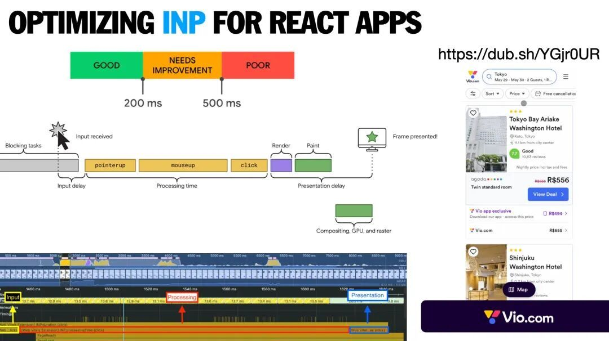
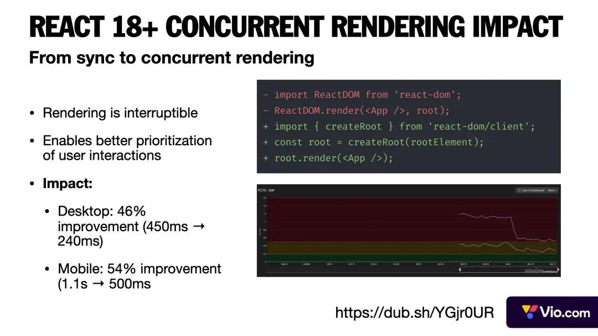
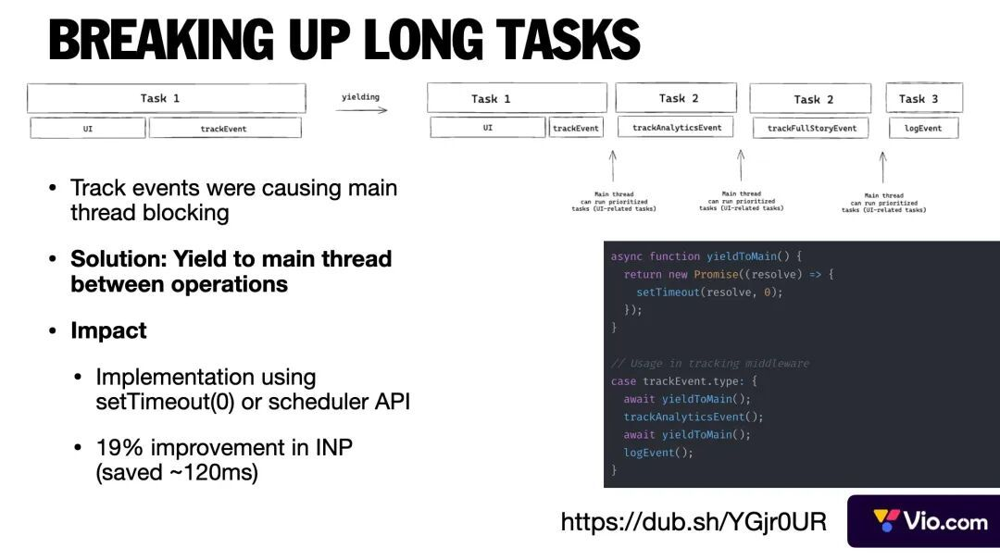
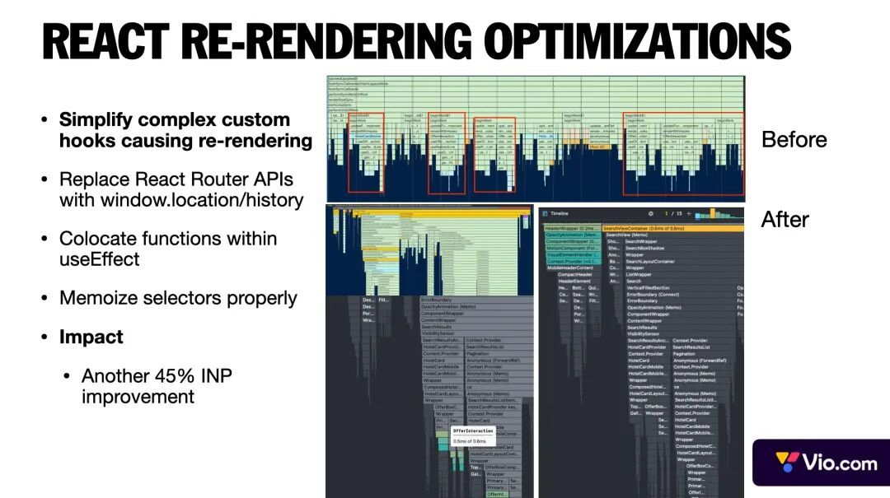
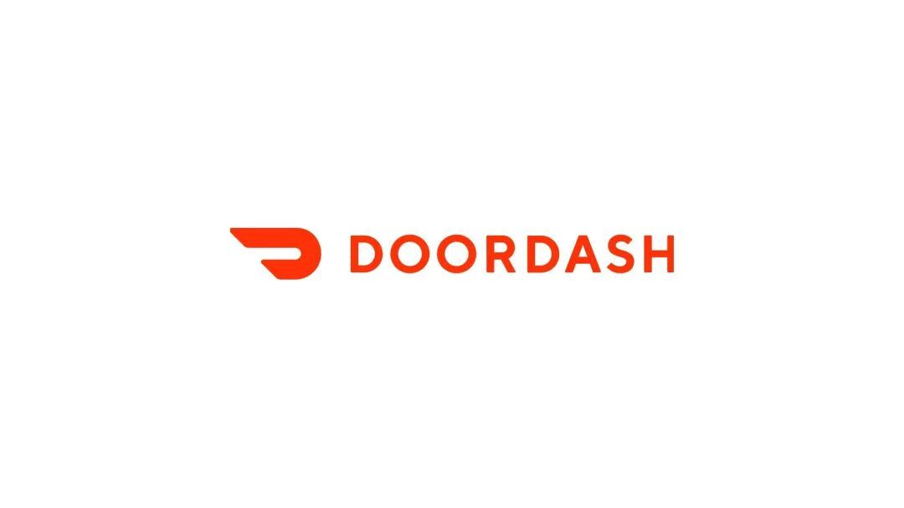
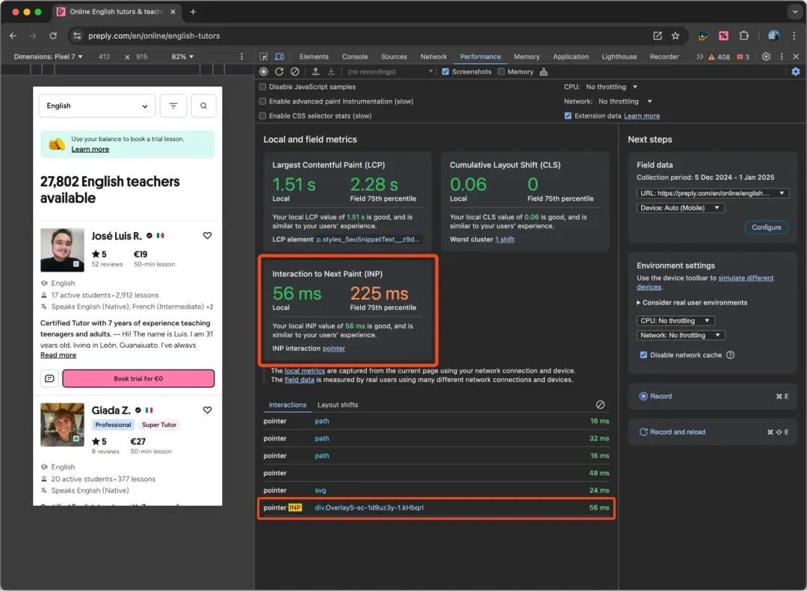
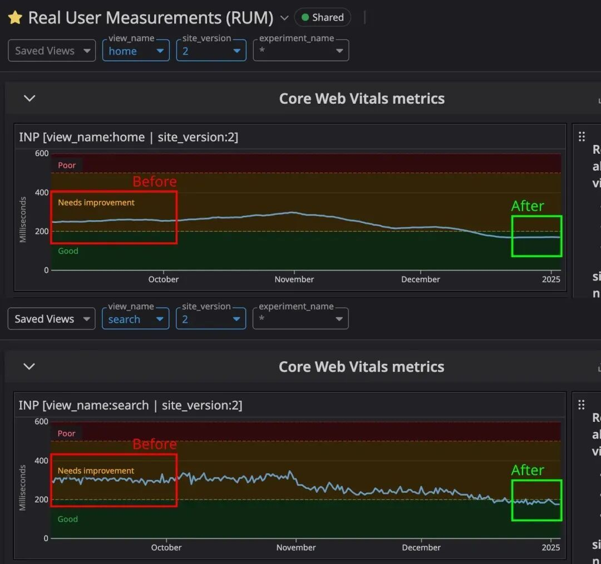
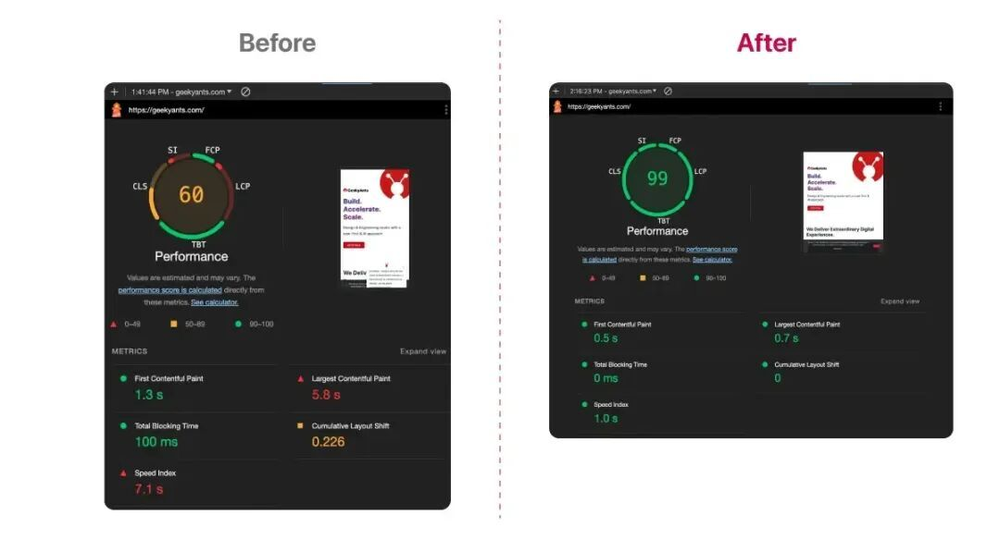

# 【第3636期】深度解读：React + Next.js打造高性能Web应用的实战经验

前言

通过多个案例研究，探讨了 React 和 Next.js 在 2022 至 2025 年期间如何推动雄心勃勃的 Web 项目取得成功。这些案例展示了团队在性能优化、服务器端与客户端渲染的平衡、缓存和状态管理策略以及开发者和用户体验改善方面的创新实践。

今日前端早读课文章由 @Addy Osmani，@Hassan Djirdeh 分享，@飘飘编译。

译文从这开始～～

#### 简介

在过去的几年里，React 和 Next.js 支撑了许多最具雄心的网页项目。在此期间，各团队不断突破性能极限（例如在核心网页指标 Core Web Vitals 中的 LCP 和新推出的 INP 指标上取得显著提升），在服务端渲染（SSR）与客户端渲染（CSR）之间找到平衡，设计出高效的缓存与状态管理方案，并同时优化了开发者体验和用户体验。

[【早阅】告别 Next.js 困惑：Tanstack Start 全栈应用开发终极指南](https://mp.weixin.qq.com/s?__biz=MjM5MTA1MjAxMQ==&mid=2651278041&idx=1&sn=169ebefd07338a741a189337aaa2fc10&scene=21#wechat_redirect)

本文将深入探讨来自不同工程团队和产品的真实案例，分析他们遇到的挑战、采用的解决方案以及取得的成果。我们会先详细介绍每个独立的案例 —— 这些案例展示了 React/Next.js 在生产环境中的高级用法 —— 最后总结出影响整个行业的核心经验与最佳实践。

#### 精选案例

- Vio：分析并优化 React 应用的 INP 性能
- DoorDash：从客户端渲染（CSR）迁移到 Next.js 服务端渲染（SSR）以提升速度与 SEO 效果
- Preply：在不使用 React Server Components 的情况下优化 INP 响应性能
- GeekyAnts：升级到 Next.js 13 与 RSC，打造 “极速” 网站
- Inngest：采用 Next.js App Router 改善开发体验并实现即时用户体验

#### Vio —— 为 React 应用分析与优化 INP


Vio 是一个全球住宿预订平台，连接旅行者与全球的酒店、度假屋及其他住宿选项。

##### 挑战

在分析 Vio 的核心网页指标（Core Web Vitals）时，团队发现 INP（Interaction to Next Paint） 分数偏低，这表明用户交互的响应时间过长。其 INP 值约为 380ms，远高于 Google 设定的 “良好” 阈值 200ms。这种延迟在初次点击交互时尤为明显。随着 INP 在 2024 年 3 月正式成为 Google 排名因素之一，提升这一指标对于用户体验与 SEO 都至关重要。

[【第3238期】了解INP](https://mp.weixin.qq.com/s?__biz=MjM5MTA1MjAxMQ==&mid=2651270287&idx=1&sn=37d3f9b97bbc055a6d4ad5b14a699cdd&scene=21#wechat_redirect)

##### 解决方案

团队通过精确的性能分析找出了造成 INP 偏高的根本原因，并采取了以下优化措施：

- 性能分析与诊断：

使用 Chrome DevTools 的 Performance 面板和 Lighthouse 工具，精确定位交互过程中的时间消耗。通过添加自定义的 User Timing 标记并分析 React 的长提交（long commits），他们发现浏览器的重排（reflow）问题严重，导致页面频繁重新渲染。

- 代码分割与懒加载：

初始加载包中包含了许多并非首屏所需的功能代码。团队通过使用 `React.lazy()` 和 `Suspense` 实现动态导入（dynamic import），减小了首屏 JavaScript 体积，让浏览器能更快进入可交互状态。

- 事件优化与防抖处理：

分析发现部分事件处理函数（如滚动和窗口大小变化）触发频率过高，占用主线程时间。通过添加防抖（debounce）延迟机制，减少了不必要的布局抖动。同时使用事件委托（event delegation）代替为每个元素单独绑定监听器，降低了性能开销。

- 状态管理优化：

应用在状态更新时会触发过多组件重新渲染。通过在关键组件上使用 `React.memo()`，并利用 `useMemo` 缓存高开销计算，减少了不必要的渲染。此外，将组件状态尽量靠近使用场景，缩小更新范围。

##### 成果

这些优化带来了显著效果：

- INP 从 380ms 降至 175ms，达到了 Google 的 “良好” 标准。
- 初始 JavaScript 体积减少 60%。
- React Profiler 显示无效渲染显著减少。
- 用户反馈界面响应更灵敏，操作体验明显提升。

这一案例证明，只要有系统化的性能分析与针对性的优化策略，就能在不改变整体架构的前提下显著提升 INP 性能。

[【第3634期】React Grab for Agents：让浏览器直接变成你的智能编码助手](https://mp.weixin.qq.com/s?__biz=MjM5MTA1MjAxMQ==&mid=2651278322&idx=1&sn=c43cce27b410fbb89591247416026b52&scene=21#wechat_redirect)

##### 更多细节



INP（Interaction to Next Paint） 是网页最新的交互性能指标，用于衡量用户交互（点击、按键、指针抬起等）后到下一次页面绘制的时间。它分为三个阶段，有助于针对性优化。Vio 是一个大型 React 应用，通过优化实现了 69% 的性能提升。



他们的第一个重大突破来自升级到 React 18。该版本引入的并发渲染（Concurrent Rendering）允许高优先级任务（如用户输入）打断渲染，从而改善响应速度。这一更新使桌面端性能提升 46%，移动端性能提升 54%。核心启示是：有时框架层面的升级带来的收益远超过局部优化。



此外，分析与埋点事件也曾造成主线程长任务。团队没有将这些操作移至 Service Worker，而是采用了更简洁的方案：在操作之间让出主线程（yield）。这打断了长任务链，使 INP 改善了 19%。关键经验：简单的 JavaScript 技巧有时能解决复杂的性能问题。



最后，团队修复了 React 渲染层面的问题，具体包括：

- 将复杂的自定义 Hook 拆分成更小的模块，减少重复渲染。
- 在可能的情况下用 `window.location` 替代 React Router 的部分 API。
- 改进 Redux 选择器（selector）的记忆化处理（memoization）。
- 这些改动再次让 INP 提升 45%。

结论：性能分析至关重要 —— 性能瓶颈往往藏在最意想不到的地方！

[【第3631期】No-Vary-Search：用一个新 HTTP 头拯救你的缓存性能！](https://mp.weixin.qq.com/s?__biz=MjM5MTA1MjAxMQ==&mid=2651278239&idx=1&sn=713d01d28d51c2f060ac516ddd8556f8&scene=21#wechat_redirect)

#### DoorDash —— 从 CSR 迁移到 Next.js SSR，全面提升速度与 SEO



DoorDash 是一个外卖与即时配送平台，将顾客与餐厅及零售商连接起来，实现餐饮与商品的按需配送服务。

##### 挑战

DoorDash 的网页前端最初是一个使用 React 构建的客户端渲染（CSR）单页应用。然而，随着项目规模扩大，它逐渐暴露出几个明显问题：

- 加载速度慢：初始加载时间长，用户在页面完全加载前会看到一片空白屏幕。
- JavaScript 包体积臃肿：随着功能增多，代码难以继续优化。
- SEO 表现差：CSR 模式下内容需等待客户端渲染完成后才能被搜索引擎读取。

这些问题导致 Google Search Console 中的核心网页指标（Core Web Vitals）表现不佳。为了改善用户体验（UX）并提升搜索排名，团队决定重点优化关键页面（首页与商家页）的加载性能。

[【第3139期】Reac状态管理比较与原理实现. Redux,Zustand,Jotai,Recoil, MobX,Valtio](https://mp.weixin.qq.com/s?__biz=MjM5MTA1MjAxMQ==&mid=2651267933&idx=1&sn=ca5be3863146a51d59656775ea9aeef3&scene=21#wechat_redirect)

##### 解决方案

团队采用渐进式迁移的方式，将页面逐步迁移到 Next.js 的服务端渲染（SSR） 架构，而不是一次性重写整个网站。这种 “逐页替换” 方案使旧版 CSR 与新版 SSR 页面可以并行运行，既能平稳过渡，又能逐步引入新特性。

核心策略包括：

**1\. SSR + 延迟 Hydration（懒加载）**

利用 Next.js 的 SSR 能力，让页面在服务器端先渲染成 HTML，从而加快首屏渲染（First Contentful Paint）。为了避免服务端渲染过重导致 首字节时间（TTFB） 延迟，团队将部分非关键组件设为懒加载。这样既减轻了服务器 CPU 压力，又能更快返回初始 HTML 内容，实现快速的 “可见加载”。

**2\. 统一 SSR 与 CSR 状态管理**

团队设计了一个自定义的 AppContext，用于在 SSR 与 CSR 环境间共享通用数据（如 cookies、URL、渲染模式等）。通过一个 `isSSR` 标识，组件能根据当前运行环境自动调整逻辑，例如：

[【第3387期】多种前端框架SSR性能大比拼](https://mp.weixin.qq.com/s?__biz=MjM5MTA1MjAxMQ==&mid=2651273325&idx=1&sn=8f87e8ccc17da059295a7aab14f5fb8a&scene=21#wechat_redirect)

- 在 SSR 环境下禁用仅限客户端的特性；
- 将分析埋点事件（analytics events）在服务器端设为 “空操作”，防止报错；
- 链接在 SSR 时渲染为 Next.js 的 `<Link>`，而在 CSR 环境中则使用 React Router 的链接组件。

这种共享机制确保同一组件可在两种渲染模式中复用，大幅简化迁移复杂度。

**3\. 路由与代码组织优化**

新页面采用 Next.js 的文件系统路由，逐步替代原有的 React Router。团队采用 “主干 — 分支 — 叶子（trunk-branch-leaf）” 策略，优先迁移和优化顶层页面（如首页、店铺页）。

此外，他们制定了明确的灰度发布与回滚机制：一次迁移一页，实时监控性能变化，一旦出现问题即可迅速回退。

##### 成果

迁移带来了显著的性能提升：

- 页面加载速度提升 12%～15%；
- 最大内容绘制时间（LCP） 首页提升 65%，商家页提升 67%；
- LCP > 4 秒的 “差评” 页面比例下降 95%（来源数据）。

这些成果让用户能更快看到页面主要内容，显著提升了体验，同时也有助于 SEO（Google 会奖励高性能网页）。

团队强调，只要实施得当，采用 Next.js SSR 能为移动端网页带来巨大的性能提升。更重要的是，他们在不进行 “大规模重构” 的前提下完成了迁移，既保持了网站稳定，又确保了开发效率。

总结：通过从笨重的 CSR 架构转向 Next.js SSR，DoorDash 不仅大幅提升了速度与用户体验，还获得了更模块化、更易维护的现代前端架构。

#### Preply —— 在不使用 React Server Components 的情况下提升 INP 响应性能


Preply 是一个在线语言学习平台，连接全球的学习者与导师。

#### 挑战

Preply 的团队发现，他们最关键的两个页面（对 SEO 与 SEM 转化率 至关重要）存在严重的性能问题，主要集中在 INP（Interaction to Next Paint） 指标上。

INP 衡量的是用户与页面交互（点击、输入等）后的响应速度，而 Preply 这两页的 INP 表现是所有核心网页指标（Core Web Vitals）中最差的，说明用户在交互后明显感受到延迟。

[【第3593期】OpenTiny NEXT 内核新生：生成式UI × MCP，重塑前端交互新范式！](https://mp.weixin.qq.com/s?__biz=MjM5MTA1MjAxMQ==&mid=2651277502&idx=1&sn=3f1b59f372ca4ba48e018b4e5e14f181&scene=21#wechat_redirect)

随着 Google 宣布将在 2024 年正式将 INP 纳入搜索排名因素，这对 Preply 构成了潜在 SEO 风险。团队根据 ROI 分析估算，如果能改善 INP，每年可能节省约 20 万美元（来自更好的广告转化率和更低的跳出率）。

然而，他们只有不到三个月的时间来交付成果，并且项目仍使用旧版 Next.js Pages Router（未采用 React Server Components 或新 App Router）。因此，他们必须在现有架构下尽可能挖掘优化空间。

##### 解决方案

Preply 成立了一个专门的 “性能突击小组”，从多个角度入手，重点减少交互期间对主线程的阻塞。

主要策略包括：

**1\. 性能分析与瓶颈排查**

工程师通过收集大量运行时数据和性能追踪记录，详细分析了用户交互后执行的所有同步 JavaScript 任务。他们逐步找出了导致 INP 变差的高耗时操作，并通过一系列底层优化来解决：

- 重构低效循环与计算密集型逻辑；
- 移除不必要的重新渲染；
- 将大型函数拆分成多个异步任务；
- 尽可能延迟非关键逻辑至首次绘制之后再执行。

**2\. 利用 React 18 的选择性 Hydration**

Preply 已经升级到 React 18，因此他们利用其并发特性（Concurrent Features）来改进 Hydration 与响应速度。例如，团队使用 `<Suspense>` 将非关键 UI 包裹起来，使这些部分的 Hydration 变为非阻塞式。

这样主线程可以在部分区域仍在加载时响应用户点击。得益于 React 18 的选择性 Hydration，重要组件能优先加载，而次要部分则在后台进行，从而显著降低输入延迟。

**3\. 使用 Transition 优化事件处理**

团队系统审查了 UI 元素上的事件处理函数。对于触发大量状态更新的交互，他们使用 React 18 的 `startTransition` API，将这些更新标记为低优先级，让 React 可以在有更高优先级任务（如新的用户输入）时暂缓更新，保持界面流畅。

此外，他们在高频触发的事件（如滚动、输入）上引入防抖（debounce）与节流（throttle），避免主线程被持续阻塞。

**4\. 代码分割与懒加载**

Preply 分析了首屏加载的代码包，找出非即时需要的部分，并通过更激进的代码分割策略减少初始 JavaScript 体积。某些组件和第三方库被改为按需加载（例如在用户交互或组件进入视窗后再加载）。他们遵循了性能优化的核心原则：

> “只在需要时加载必要内容（Load only what is necessary, when it is necessary）。”

**5\. 缓存与 CDN 优化**

虽然优化重点在前端，但团队没有忽视网络层面的性能。他们确保 CDN（使用 AWS CloudFront）对静态资源进行充分缓存，并验证关键页面的 API 响应支持缓存或预取。

此前，Preply 已通过 CloudFront 与 ElastiCache 将网络延迟从 1.5 秒降至 0.5 秒，这次也将同样的缓存策略应用到新页面接口上，以防浏览器在交互时等待缓慢的网络响应。

##### 成果

仅用几个月，Preply 就成功将关键页面的 INP 优化至 200 毫秒以内（符合 “良好” 标准）。测试用户反馈页面响应更加迅速：点击与输入几乎即时生效，从此前的明显延迟转变为流畅体验。

这些改进不仅提升了用户满意度，还带来了直接的业务收益：SEO 着陆页的转化率提升、跳出率下降，估计每年可节省约 20 万美元 成本。

更令人印象深刻的是，Preply 在未采用 React Server Components 或重构 App Router 的前提下实现了这一系列性能突破，证明老旧的 Next.js 项目依然可以通过针对性优化获得显著改善。

这次优化的核心启示是：

> 要以真实用户交互为导向，想方设法让每一次点击都 “即刻响应”。



Chrome DevTools 的 Performance 面板清晰展示了当前会话的核心网页指标，尤其是 INP 和造成延迟的最慢交互。

[【第3609期】使用 Chrome DevTools MCP 进行调试：让 AI 在浏览器中“拥有双眼”](https://mp.weixin.qq.com/s?__biz=MjM5MTA1MjAxMQ==&mid=2651277864&idx=1&sn=d1791d51add2a47c4007595ce4dbc08a&scene=21#wechat_redirect)



Preply 的内部监控数据显示：

- 首页 INP：从约 250ms 优化到 185ms；
- 搜索页 INP：从约 250ms 优化到 175ms。

#### GeekyAnts —— 升级到 Next.js 13 与 React Server Components，打造 “极速” 网站


GeekyAnts 是一家产品开发与技术咨询公司，为企业提供软件开发与咨询服务。

##### 挑战

GeekyAnts 希望显著提升公司官网的性能与用户体验。他们的落地页内容丰富（包含大量图片、媒体与文字信息），但 Lighthouse 性能得分仅在 50 分左右，明显偏低。这种加载缓慢的问题不仅影响了 SEO 排名，也降低了用户留存与互动。

经过分析，他们发现主要问题在于：

- 客户端 JavaScript 体积过大；
- 数据加载方式低效。

为彻底解决问题，团队决定采取激进的方案：从旧版 Next.js 升级到 Next.js 13，并引入全新的 React Server Components（RSC）架构。这在 2024 年仍属于前沿技术，目标是通过减少客户端计算量、加速页面渲染来实现极致性能。挑战在于：如何在迁移到全新 App Router 架构的同时，保持网站功能完整与 SEO 友好。

[【第3528期】RSC 中的导入是如何工作的](https://mp.weixin.qq.com/s?__biz=MjM5MTA1MjAxMQ==&mid=2651276679&idx=1&sn=ee205506ea2d6d1b7e2f66bf2d94f1c3&scene=21#wechat_redirect)

##### 解决方案

GeekyAnts 团队对网站进行了全面重构，基于 Next.js 13 的 App Router 与 React Server Components 重新搭建。

整个过程包括以下关键步骤：

**1\. 采用 React Server Components（RSC）**

通过 RSC，他们将大量 UI 渲染工作转移到了服务器端。所有不需要交互的组件都被改造成 服务端组件（Server Component），这些部分的 HTML 在服务器请求时生成并直接返回浏览器，无需在客户端再运行 React。

这种方式显著减少了浏览器端的 JavaScript 体积与计算开销，使页面响应速度大幅提升。团队指出，借助 RSC，React 组件树可以 “选择性渲染”—— 只有真正需要在客户端运行的部分才会成为 Client Component，其余部分完全由服务器生成，从而降低主线程执行负担，让页面更快进入可交互状态。

**2\. 将数据获取逻辑迁移到服务端**

在旧架构中，一些页面数据仍在客户端或低效的 API 调用中获取。Next.js 13 的 App Router 鼓励使用 异步组件或服务端数据获取（Server-side Data Fetching）。团队重新组织了数据加载逻辑，将 API 请求移入 Server Components 中，这样页面在返回 HTML 时数据已准备好，无需客户端二次请求，消除了初次加载的往返延迟。

虽然这要求后端 API 与数据库查询的效率更高，但带来的好处显而易见 —— 用户打开页面时即可看到完整内容，感知速度显著提升。

**3\. 利用 Next.js 内置性能优化**

通过升级到 Next.js 13，他们自动获得了多项性能增强：

- 自动代码分割（Code Splitting）；
- 更智能的图片优化（Image Optimization）；
- 基于流式渲染（Streaming SSR）的新路由机制。

团队使用 Next.js 内置的 `Image` 组件（或类似方案）优化图片加载，以现代格式输出并按需加载。  
他们还启用了 流式服务端渲染（Streaming SSR），将 HTML 拆分为多个片段：首屏内容先行渲染，其余部分稍后加载，从而改进 首字节时间（TTFB） 与 首屏渲染（FCP）。

**4\. 测试与性能调优**

在重构完成后，团队进行了全面测试，使用 Lighthouse、PageSpeed Insights 和 Core Web Vitals 监测指标。

他们针对性地优化了以下细节：

- 仅在必要的组件中使用 `"use client"` 指令，保持大部分组件为服务端渲染；
- 调整布局与资源加载以确保 CLS、LCP、INP 等指标都达到理想水平。

最终，网站在视觉、性能与交互体验上都得到了全面提升。

#### 成果



此次改造取得了巨大成功：

- 网站在 Lighthouse/PageSpeed 上的 健康得分从约 50 提升到 90+；
- 所有核心网页指标（Core Web Vitals）均达到 “良好” 标准；
- JavaScript 执行时间与主线程负载显著降低；
- 内容几乎实现 “即时加载”，页面交互流畅无延迟。

同时，SEO 也受益于性能提升：

- 更快的加载速度与更优的页面结构使网站的搜索引擎 “健康度” 显著提高。
- 用户体验明显改善，例如页面切换几乎瞬时完成，
- 以往媒体资源较多的重型页面现在也能快速呈现，不再出现长时间卡顿。

##### 总结

GeekyAnts 的实践充分展示了 Next.js 13 与 React Server Components 的实际威力：  
通过减少浏览器端 JavaScript 负担、将更多逻辑转移至服务器，应用性能可以获得成倍提升。

他们也指出，迁移过程确实需要调整对 API 调用与数据流的思维方式，但结果完全值得。

对希望打造 “极速体验（blazing-fast UX）” 的团队而言，这次案例提供了明确的方向：充分利用框架新特性，优化在浏览器端运行的负载，就能显著提升速度与用户满意度。

#### Inngest —— 采用 Next.js App Router，实现更佳开发体验（DX）与 “即时” 用户体验（UX）


Inngest 是一个无服务器（Serverless）工作流平台，帮助开发者简化后台任务、事件驱动函数与自动化流程的构建。

##### 挑战

在 2023–2024 年间，Inngest 进行了一次重大的前端重构，将旧版的 Create React App（CRA）+ React Router 架构迁移至 Next.js 13 的 App Router。目标不仅是提升性能，更要改善 开发者体验（DX） 与 可维护性。

团队希望：

- 消除旧版 CSR 应用初始加载时的 “白屏” 问题；
- 改进路由与数据加载机制；
- 充分利用现代 React 特性（如 Server Components、流式渲染等）。

然而，App Router 属于新特性，带来了学习曲线和新挑战，尤其在以下方面：

- 如何在新布局结构中管理全局状态（如筛选器）？
- 如何保证动态数据在 Next.js 的缓存机制下始终保持最新？
- 如何使用流式渲染（Streaming）而不让代码复杂化？

本案例展示了 Inngest 如何解决这些问题，最终实现了更流畅的用户体验与更高效的开发流程。

##### 解决方案

在重构 Inngest Dashboard 的过程中，团队总结了若干关键经验与技术要点：

**1\. 静态预渲染 + 流式渲染：实现快速 UX**

通过在可行范围内使用 Next.js 的静态渲染（Static Rendering），新应用在加载时能立即展示页面框架，而不再出现白屏。对于需要动态数据的页面，他们启用了 React 的流式 SSR（Streaming Server-Side Rendering）。

具体而言：

- 页面框架（导航栏、页眉、布局结构）会立即发送给浏览器；
- 数据区域则在准备好后逐步 “流式填充” 到页面中。

这样，用户能几乎即时看到仪表盘的外壳（即使内容区仍在加载中），并开始操作。这种 “先框架、后数据” 的流式加载大幅提升了感知性能。

**2\. 嵌套布局与状态保持**

借助 App Router 的嵌套布局（Nested Layouts） 功能，Inngest 解决了以往难以跨页面共享状态的问题。他们可以让导航栏、筛选器等组件在不同页面间共享，而无需重新挂载组件，从而避免昂贵的重复渲染。

例如：用户在一个页面选择了特定环境（environment filter），在切换其他页面时筛选状态依然保持。

不过，他们也发现了一个细节：

URL 的查询参数（`search params`）不会自动传递给布局层的 Server Component，以防止值过期。因此，原本通过 `?env=` 管理的筛选器在导航后不会自动更新。

团队最终的解决方案是：将筛选状态改为 路径参数（route param） 形式（如 `/env/[env]/functions`）。这样布局在路径变化时会自动更新，实现了 SSR 与客户端导航间状态的一致性。

这一改造充分体现了适应 Next.js 架构思维的过程：将全局状态嵌入到 URL 路径中，使其在服务端与客户端都能保持同步。

**3\. 理解与控制缓存机制**

Next.js App Router 默认引入了两层缓存：

- 客户端缓存（加速路由跳转）；
- 服务端缓存（缓存数据请求结果）。

Inngest 在使用过程中逐步掌握了这些机制：

- 对于实时性要求高的内容（如日志、监控数据），他们在页面中使用 `export const dynamic = "force-dynamic"` 禁用默认缓存，确保不会返回旧数据；
- 对于可缓存的请求，他们通过 `cache()` 与 `revalidate` 参数精细控制数据的新鲜度。

这种 “渐进式采用缓存” 的做法，让他们在性能与数据实时性之间找到平衡：既能加速重复访问，又能避免提供陈旧内容。

**4\. 开发者体验（DX）的提升**

App Router 的 “约定式” 文件结构与组件组织方式极大改善了团队的开发体验。

他们可以在同一目录下共置（co-locate）组件、测试与样式文件，项目结构更清晰易懂。特殊文件（如 `layout.js`、`page.js`、`loading.js`、`error.js` 等）让他们能直观地声明：

- Suspense 边界（用于加载状态）
- Error 边界（用于异常捕获）

开发者只需查看文件树就能理解页面的加载与错误处理逻辑，相比旧架构中埋藏在组件代码里的逻辑，维护成本显著下降。

此外，Next 13 内置的 中间件（middleware） 功能让他们轻松实现登录重定向、权限控制等逻辑，减少了自定义代码量，进一步提升了开发效率。

##### 成果

在部署新版 Next.js 13 Dashboard 后，Inngest 很快看到了成果：

- 用户首次打开页面时即可看到内容框架，不再出现 “空白屏”；
- 借助流式渲染与智能缓存，交互响应更加流畅自然；
- 页面结构清晰，加载过程分阶段呈现，显著改善了感知性能；
- 新开发者上手更快，文件结构本身就成了 “项目文档”。

尽管他们没有公开具体性能数据，但测试显示：页面的头部与导航可即时渲染，而内容则逐步加载，同时结合 SSR 首屏渲染与 CSR Hydration，实现了既有 SEO 优势，又保持单页应用（SPA）般流畅体验的理想平衡。

[【早阅】Axios 请求可能存在 SSRF和凭据泄露风险](https://mp.weixin.qq.com/s?__biz=MjM5MTA1MjAxMQ==&mid=2651275995&idx=1&sn=69270ffdd4605ec2a39995734784989a&scene=21#wechat_redirect)

此外，将全局状态嵌入路由参数的做法也被证明非常有效 —— 筛选器与上下文在导航间无缝保持一致，无需额外状态同步逻辑。

##### 总结

通过率先采用 Next.js 13 的 App Router，Inngest 不仅显著提升了网站性能与用户体验，还改善了开发者的生产力与协作效率。

他们的实践为其他正在迁移到 Next.js 新架构的团队提供了重要经验：善用 App Router 的新特性（嵌套布局、流式渲染、缓存控制），将状态管理与路由结构融合，既能获得 “即时” 的用户体验，也能构建出更清晰、更易维护的现代前端架构。

#### 综合经验与最佳实践（2022–2025）

通过前面几家团队的案例，我们可以看到 React 与 Next.js 在近几年中形成的一系列性能优化趋势与行业最佳实践。这些经验共同揭示了如何构建高性能、可维护、用户体验出色的现代 Web 应用。

##### 一、性能优化至关重要

在所有案例中，“性能” 始终是核心主题。核心网页指标（Core Web Vitals, CWV） 成为了衡量一切的标准。投入性能优化的团队不仅获得了技术上的提升，也带来了明显的业务收益：更高的 SEO 排名、更好的用户留存和更高的转化率。

**✅ 优化核心网页指标（CWV）**

到 2024 年，LCP（最大内容绘制） 与 INP（下一次绘制交互延迟） 成为性能优化的重点。各项目通过 SSR/SSG 加快首屏渲染、利用主线程调度优化交互响应，实现了显著提升。

- 例如 DoorDash 将 LCP 降低约 65%，几乎消除了加载缓慢的页面；
- Preply 将 INP 延迟缩短到 200ms 以内，达到 Google 的 “优秀” 标准；
- 有团队在修复 CWV 后，Google 搜索展示量提升了约 3.5 万次 / 月。

经验要点：

要持续测量性能，针对最差的指标（如 LCP 或 INP）逐项优化。即便减少 100–200ms 的渲染或响应时间，也可能让页面跨入 “良好” 区间，带来超预期的用户与 SEO 回报。

**✅ 减少 JavaScript 负载**

另一个反复被证明有效的做法是：“让浏览器执行的代码越少越好。”JS 越少，解析越快、阻塞越少、交互越快。

所有案例都遵循了这一原则：

- GeekyAnts 借助 Next.js 13 的 RSC 大幅减少客户端 JS 体积（静态部分无需再 Hydration）；
- Preply 通过激进的代码分割与删除冗余模块，减少了首屏包体积；
- DoorDash 迁移至 SSR 后裁剪了臃肿的 SPA 包；
- 多个团队启用 Tree-Shaking 与打包器优化。

这些改动在性能分析图中表现尤为明显：JS 执行时间显著下降，主线程压力大幅减轻。

**✅ 减少主线程阻塞、提升 INP**

随着 Google 在 2024 年将 INP 纳入排名指标，各团队学会了如何拆分长任务、让出主线程、优先响应用户输入。

React 18 的并发特性（如 Transitions、Suspense）成为关键工具 —— 它们让 Hydration 与状态更新可被中断，从而保持界面响应性。

同时，性能分析常揭示出隐藏的瓶颈（如第三方脚本或低效循环）。开发者普遍通过 Performance Profiler 定位这些问题并逐步优化。

一条行业共识是：“长任务是 INP 的最大敌人。”

解决方法：拆分、延迟（例如使用 `requestIdleCallback`）、或彻底移除。

#### 二、SSR 与 CSR：平衡的艺术

服务端渲染（SSR）与客户端渲染（CSR）之间的讨论，已经从 “二选一” 演变为 “混合共存”。没有绝对的方案，最佳策略往往是二者的融合。

**✅ SSR：加快首屏、提升 SEO**

服务端渲染或静态预生成（SSG）在以下方面尤为重要：

- 加快首屏渲染速度（First Paint）；
- 改善 SEO 可见性；
- 为网络较慢或设备性能较低的用户提供更快体验。

几乎所有采用 SSR 的案例都获得了明显提升：

- DoorDash 迁移到 SSR 后，页面加载显著提速；
- Inngest 通过 SSR 消除了首屏 “白屏”。

此外，SSR 还能确保内容可被索引，并改善无 JS 或辅助设备用户的访问体验。

普遍做法是：入口页、内容型页面或需 SEO 的页面使用 SSR/SSG 渲染。

**✅ CSR：增强交互与动态体验**

纯客户端渲染依然在高交互性页面中发挥价值，特别是内部系统或不依赖 SEO 的应用。

有团队发现：当将部分交互逻辑从 SSR 改为 CSR 后，“应用反而感觉更快”，因为用户点击选项卡时立即看到加载反馈，而非等待服务器响应。

这说明 SSR 若处理不当，会引入额外延迟。因此，越来越多项目采用 混合策略：

- 首次加载用 SSR 提供内容与 SEO；
- 页面内部更新与导航由 CSR 接管（如使用 React Query 请求数据）。

这样既保留了 SSR 的首屏与可访问性优势，又拥有 CSR 的流畅交互体验。

**✅ 渐进式 Hydration 与 “交互岛” 架构**

现代框架（Next.js、Astro、Qwik 等）鼓励 “渐进式 Hydration” 的理念：只在必要区域启用交互，逐步完成客户端激活。

React Server Components（RSC） 更进一步，直接跳过非交互部分的 JS 传输，让页面加载更轻。

由此衍生的最佳实践是：

- 将页面拆分为多个 “交互岛”（Islands of Interactivity），
- 只对需要用户交互的部分进行 CSR/Hydration，
- 其余保持静态或服务端渲染。

2022–2023 年，很多团队还需要手动实现这种结构（如使用 `next/dynamic()` 懒加载部分组件）；到 2024 年，RSC 已经让这一过程自动化。

结果是 SSR 与 CSR 达成平衡 ——SSR 提供内容与骨架，CSR 负责增强交互与动态更新。

**⚠️ SSR 的潜在陷阱**

SSR 并非没有代价。如果服务器端计算过重，会增加 TTFB（首字节时间），反而拖慢首屏。

DoorDash 就曾遇到类似问题，后通过在服务器端懒加载非关键组件解决。另一个常见问题是 SSR 阶段进行太多同步请求。Next.js 的 Suspense 与 Streaming 能缓解这一点，让内容分段加载、并行渲染。

因此，正确的做法是：

- 将耗时逻辑并行或延迟处理；
- 利用 CDN 缓存已渲染内容；
- 用流式渲染减少阻塞。

简言之：先用 SSR 让页面 “可用”，再用精细化 CSR 让体验 “更快”。成功的团队往往让 SSR 负责首屏渲染，而让 CSR 负责后续交互 —— 这才是理想的平衡点。

##### 3\. 智能缓存策略：兼顾速度与数据新鲜度

缓存在近年的性能优化中成为核心议题。从 CDN 到应用级再到客户端缓存，案例研究清楚地展示了多层缓存如何共同作用，既加快响应速度，又减轻服务器负载。

**✅ 边缘与 CDN 缓存（Edge & CDN Caching）**

在 Next.js 应用前部署 CDN（如 Cloudflare、CloudFront）已成为标准做法。

- 静态资源缓存： JS、CSS、图片通过 CDN 分发，极大减轻了源服务器压力并缩短响应时间。
- 动态页面缓存： 利用 ISR（增量静态再生成） 或 stale-while-revalidate 策略，可在短时间内缓存页面并异步更新。

📈 实战案例：

Preply 使用 Amazon CloudFront 全局缓存内容，将延迟从 1.5s 降到 0.5s，并提升转化率 5%。

💡 最佳实践：

- 正确配置缓存头与 revalidate 时间；
- 对稳定页面使用 `getStaticProps` 或 `fetch(..., { next: { revalidate } })`；
- 优先服务缓存页面，仅对实时性强的数据使用 SSR。

简言之：“缓存一切可缓存的内容，动态化只留给真正需要实时的部分。”

**✅ Next.js App Router 的缓存机制**

Next.js 13+ 引入了服务器端数据缓存（针对 RSC 中的 `fetch`）与客户端路由缓存。它能极大加快页面切换速度，避免重复请求并降低后端压力。

然而，正如 Inngest 所发现那样，理解失效规则至关重要。

默认情况下，RSC 中的 `fetch` 会无限期缓存数据，除非显式标记：

对动态数据使用：

```
fetch(url,{cache:'no-store'})
exportconst dynamic ='force-dynamic'
```
对相对稳定的数据使用 `revalidate` 或 `stale-while-revalidate`，兼顾速度与新鲜度。

Inngest 案例启示：

他们一开始因为默认缓存导致展示旧数据，后来通过 `dynamic = "force-dynamic"` 精准关闭缓存，  
再逐步开启可控的缓存机制，实现了 “缓存快、数据不旧” 的平衡。

**✅ 客户端数据缓存（Client-side State Caching）**

在客户端，React Query（现 TanStack Query） 已成为缓存 API 数据的主流工具。

- 统一管理请求数据，防止重复请求；
- 缓存结果可立即复用，UI 响应更快；
- 自动处理后台更新与失效机制。

这比手动 `useEffect + useState` 或 Redux 全局存储更加高效。许多团队已迁移至 React Query / SWR 模式，使应用更轻、更快。

结果：

- UI 响应更即时（数据多数来自缓存）；
- 网络请求次数下降；
- 状态管理逻辑简化。

**⚠️ 缓存陷阱与注意事项**

开发者也逐渐意识到 “缓存一致性” 与 “陈旧数据” 的风险。过度缓存 可能导致显示过期信息、错漏数据。

案例经验：

- Inngest 在掌握缓存规则前，先禁用缓存以避免风险；
- 等理解 revalidate 与缓存层次后，再逐步启用。

Next.js 15 甚至计划将缓存机制调整为 opt-in（默认关闭），以减少意外。

🧭 实用建议：

- 动态数据从 “无缓存” 起步，再逐步引入策略；
- 测试时务必在缓存开关两种情况下都运行一次，防止隐性依赖；
- 提前设计缓存失效策略（时间型、事件型等）。

结论：合理缓存能带来数量级的性能提升（秒 → 毫秒）。CDN 负责 “全球加速”，应用级缓存负责 “避免重复工作”。关键在于 —— 在速度与数据新鲜度之间找到平衡点。

##### 4\. 演进中的状态管理：更轻、更专注、更智能

2022–2025 年间，React 应用的状态管理理念发生了显著变化。从过去默认使用 Redux 之类的 “大一统方案”，逐步转向 更简单、更分层、更专用的解决思路。

**✅ 不要过度设计全局状态**

许多团队发现，大部分状态其实可以保持局部或上下文级别，根本不需要复杂的全局 Store。

React 自带的 Context + useState/useReducer + 自定义 Hooks 已经足以满足大多数应用需求。

一句经验之谈：“React Context 和组件状态可以覆盖 90% 的场景。除非必须，否则不要引入全局状态库。”

对于以 “展示后端数据” 为主的应用，全局状态需求已显著减少，因为数据缓存（如 React Query）本身已承担了 “共享状态” 的角色。

**✅ 重新审视 Redux**

Redux 曾是事实标准，但也带来了样板代码、心智负担与包体积。2023 年之后，社区逐渐形成共识：“别因为它‘酷’就用 Redux —— 先问自己，真的需要吗？”

案例中：

- DoorDash 使用自定义 AppContext 处理 SSR/CSR 共享状态，而非 Redux；
- Inngest 直接利用 Next.js 路由参数与上下文管理过滤器等 UI 状态。

趋势很明确：仅在确实存在跨页面、复杂共享逻辑时才使用 Redux，且优先考虑更轻量的替代方案。

**✅ 专用状态库的崛起**

与其用一个 “全能” 的状态库，不如针对场景选择合适工具。

- React Query / SWR：负责服务端数据（远程状态），包含请求、缓存与更新逻辑；
- Zustand / Jotai：管理轻量客户端状态（UI、选项卡、表单状态等）；
- Apollo Client：在 GraphQL 场景下替代手动数据管理。

这种 “按职责分层” 的思路让应用更高效：你只为真正需要的部分付出性能与维护成本。

**✅ 服务器状态与新范式（Next.js 13+）**

Next.js 13 带来了 React Server Components 与 Server Actions（实验特性），开启了 “部分状态交给服务器” 的新模式。

- 组件可在服务器渲染时直接持有状态逻辑；
- 表单、mutation 等交互可通过 Server Actions 在服务器端直接处理；
- 客户端不再需要追踪复杂的中间状态。

未来的趋势可能是：大量传统 “客户端状态” 将被框架接管，状态管理的边界正逐渐向服务器迁移。

**⚡ 总结：保持简单，按需选择**

状态管理的核心经验可以浓缩为一句话：“越简单越好，越专用越高效。”

- 先判断是否真的需要全局状态；
- 优先使用 React 原生能力与 Hooks；
- 对远程数据用 React Query，对轻量 UI 用 Zustand；
- 关注框架新特性（如 Server Actions）以进一步简化逻辑。

有团队曾打趣：“我们为一个激活 Tab 写了 200 行 Redux 代码，后来发现只要一个 `useState` 就够了。”

💡 启示：先问自己：有没有更简单的做法？这不仅能减轻性能负担，也让开发体验更轻松愉快。

##### 5\. 提升开发者体验（DX）与可维护性

维护一个大型 React 代码库向来不易，但近年来的一系列创新与实践让开发体验显著改善。多个案例表明，良好的架构、工具与文化不仅让开发更高效，也让代码更可持续。

**✅ Next.js 的项目结构与约定**

Next.js 的 “约定优于配置” 理念（尤其在 App Router 引入后）极大地提升了开发效率。

- 文件即路由、嵌套路由与布局（Nested Layouts）、组件就近存放（Colocation）让项目结构更直观，也减少了团队在项目组织上的争论。
- 开发者只需看文件树，就能一眼找到加载状态、错误边界等逻辑所在。
- 统一的结构也让不同项目间的经验可复用，新成员上手更快。

以 Inngest 为例：他们指出，仅通过文件层级，就能快速理解页面加载逻辑与错误处理位置，这种结构化带来的透明性显著提升了团队协作与维护效率。

**⚡ 工具链加速开发迭代**

2022–2025 年间，React 生态的构建与开发工具发生了质的飞跃。

- Turbopack（Next.js 新一代打包器，取代 Webpack）已趋于稳定，在开发阶段的代码更新速度提升可达 90%。
- 更快的热更新（Hot Reload） 与 改进的错误提示 显著减少等待与调试时间。
- TypeScript 也已成为主流配置，减少了大量运行时错误，增强了代码可靠性。

这些工具的共同作用是：让开发过程更流畅、更愉快。开发者能专注于功能与体验，而不是被编译与配置问题拖慢节奏。

**🔄 CI/CD 与部署自动化**

虽然不完全属于 React 领域，但自动化部署和持续集成对 DX 的提升至关重要。

以 Preply 为例：他们从 “人工部署 100 小时” 优化到 “自动化部署仅需 30 分钟”。

同时，越来越多团队在 CI/CD 流程中集成：

- 性能预算与检测（Performance Budgets）
- Core Web Vitals 预检测（如 Lighthouse CI）
- Bundle 体积分析与测试自动化

这些流程保证了代码质量与性能不被回归问题拖累，让开发者有信心大胆重构、持续优化。

**🧩 拥抱 React 新特性：Suspense 与错误边界**

新的 React 原语（Primitives）如 Suspense 与 Error Boundaries 改善了代码架构与可维护性。

- Suspense for Data Fetching 让开发者可以声明式地处理加载状态，不再需要在组件中手动嵌入繁杂的 “if loading” 逻辑。
- Error Boundaries（尤其在 Next.js 13 的布局层级支持后）鼓励团队更系统地规划错误处理，使应用在异常或网络慢速时依然稳定。

结果是：代码更清晰、逻辑更集中、用户体验更稳健。

**🧠 知识共享与团队学习文化**

在框架快速演进的背景下（如 Server Components、App Router），成功的团队往往投入时间记录与传播经验。

- Inngest 就曾公开撰写关于缓存与路由陷阱的经验总结，不仅帮助内部成员，也惠及社区。
- 团队内部通常会设立文档或 wiki，记录常见坑与最佳实践。
- 允许开发者在独立分支中试验新特性，以 “安全沙盒” 的方式学习。

这种 “持续学习 + 内部文档化” 的文化，使团队在技术变化中保持高效与稳定。

**💡 关键结论：DX 与 UX 的正向循环**

现代 React / Next.js 开发正在变得 “更简单”—— 不是因为技术变得初级，而是框架提供了更完善的抽象与默认优化。

- 遵循框架约定（文件结构、路由、布局等）；
- 使用更快的开发工具（Turbopack、TypeScript、现代调试工具）；
- 推行自动化与团队文档化；

这些做法让团队能更快迭代、更少摩擦，而开发体验（DX）的提升也间接带来了更好的用户体验（UX）—— 因为开发者能花更多时间打磨产品细节，而非解决工具问题。

#### 6\. 无障碍设计（Accessibility by Design）

确保网站对所有用户（包括残障用户）都可访问，已经成为现代 Web 应用的 “质量底线”，而非可选项。多个案例虽未直接聚焦此主题，但其优化（如 SSR）也自然改善了可访问性。

**✅ 语义化 HTML 与正确的 ARIA 使用**

业界（如 GitHub 设计系统团队）反复强调：优先使用语义标签，其次再考虑 ARIA。

- 使用 `<button>` 而非带 `onClick` 的 `<div>`；
- 自定义组件时，添加恰当的 ARIA 角色（如 `role="tablist"`、`role="tab"`）；
- 依据 ARIA Authoring Practices Guide 构建组件结构；
- 仅在语义不足时才补充 ARIA 属性。

许多团队已将 “可访问性审查” 纳入组件开发的标准流程。

**⌨️ 键盘导航与焦点管理**

许多 SPA（单页应用）常见问题之一是键盘支持不足。

最佳实践包括：

- 为交互组件提供键盘控制（如方向键切换 Tab、Esc 关闭 Modal）；
- 在内容切换或弹窗打开时主动管理焦点；
- 确保 Tab 顺序逻辑且连贯；
- 避免频繁从 DOM 移除元素，以免破坏屏幕阅读器的识别；
- 若需隐藏元素，可用 `aria-hidden` 或视觉隐藏样式，而非删除节点。

这些细节虽小，却决定了屏幕阅读器用户的真实体验。

**🧪 使用辅助技术进行测试**

许多团队已将无障碍测试纳入 QA 流程。

- 自动化工具： axe-core、Lighthouse Accessibility Audit；
- 手动测试： 使用 NVDA、VoiceOver 等读屏软件；
- 键盘专用测试： 模拟键盘 - only 用户操作流程。

部分公司甚至邀请依赖辅助技术的真实用户参与可用性测试。行业趋势也在 “左移”（Shift Left） ——  
在设计阶段就考虑可访问性，而非开发完成后再 “补救”。

“无障碍设计应在设计初期就介入，而不是项目结束时的附加任务。”

**⚙️ 框架与生态支持**

React 与 Next.js 本身也在不断改进默认的可访问性支持：

- Next.js 的动态路由与布局机制会自动维护焦点顺序；
- 官方文档强调渐进增强（Progressive Enhancement）；
- 各类 UI 库（如 Material UI、Chakra UI）均已内置 a11y 规范支持。

但对于自定义组件，开发者仍需主动遵循语义与交互规范。

**🌍 结论：可访问性 = 更好的用户体验**

无障碍开发如今已成为现代 React 应用的标准实践。其收益不仅是符合法规或避免风险，更是提升整体 UX 的关键途径。

- 对读屏器友好的结构，也往往有利于 SEO；
- 改进的键盘交互逻辑，也让所有用户受益；
- 在设计阶段考虑可访问性，可促成更直观、更包容的产品体验。

因此，领先的开发团队早已将 “可访问性” 与 “性能、安全性” 并列，视为高质量 Web 应用的核心指标。

##### 7\. 用户体验（UX）提升与影响

所有技术优化的最终目标，都是让用户获得更好的使用体验。在这些案例中，我们能清晰看到：性能提升、流畅交互与可访问性改进，最终都体现在 UX 的质变 上。

**⚡ 更快的加载与交互 = 更满意的用户**

“速度就是功能” 早已成为事实。

- DoorDash 将页面加载速度提升了 65%，用户能更快开始浏览与下单；
- Preply 优化后的交互延迟显著降低，减少了关键节点（如预订课程）时的流失；
- 多个项目表明：即使只减少几百毫秒的延迟，也能显著提升转化率与用户留存。

现代用户期望 “即时反馈”。当性能优化让操作响应时间低于 100 毫秒时，应用的 “顺滑感” 立刻可感。正如某案例所述：“优化后点击 Tab 即刻切换，以前还需等待片刻”—— 这种 “即时响应” 的体验，正是用户真正注意并感受到的价值。

**🔄 无缝导航与平滑过渡**

除了加载速度，导航过程的 “顺滑度” 也是影响 UX 的关键因素。

- Next.js 内置的预取（prefetch）机制，让页面跳转几乎无延迟 —— 用户点击之前资源就已加载完毕；
- App Router + Streaming 技术，让用户可以在部分内容加载时先与页面交互，  
  正如 Inngest 的案例所展示的那样；
- Suspense 边界，让加载状态更自然 —— 骨架屏（Skeleton）或轻微的加载指示能有效减少焦虑感。

最佳实践是：

- 避免整页刷新，尽量保持上下文连续；
- 任何超过 200 毫秒的操作，都应提供即时反馈（如加载动画或提示）。

现代团队普遍使用 Suspense 的 fallback 来优雅地处理数据加载，让数据获取过程 “可感知但不打断体验”。

**📱 各设备间一致的体验**

SSR（服务端渲染） 保障了低端设备或慢网环境下也能快速显示内容；CSR（客户端渲染） 则保证了现代设备上依然能享受流畅交互。

例如：Inngest 的 Dashboard 结合 SSR 与 CSR，实现了 “首屏快速渲染 + 高端设备的高级交互”。

此外，Error Boundaries（错误边界） 也提升了可靠性：当出错时，用户看到的不是崩溃的页面，而是友好的提示或备用界面。这些细节虽小，却能显著改善整体感受。

**📊 用户反馈与体验指标**

越来越多的团队开始追踪 “以用户为中心” 的指标，而不仅仅是技术性能。

- 例如：Time to Interactive (TTI)、用户满意度（NPS）、转化率变化；
- 通过将性能改进（如 INP 降低）与行为数据（如停留时长、转化率）关联，团队能清楚地看到性能优化带来的实际商业影响。

一个案例中提到：在网站加速后，捐赠转化率显著提升，让性能工作直接与用户成功挂钩。

这种 “以用户为导向” 的度量方式，确保团队在优化性能、可访问性时始终聚焦于真实的用户影响，而非仅仅追求技术指标。

**✅ 小结**

2022–2025 年间的案例清楚表明：在 React / Next.js 上投资性能与最佳实践，必然带来用户体验的提升。

用户收获：更快、更顺滑、更可访问的应用；企业受益：更高的参与度、更好的转化与留存。

这些案例也证明：优秀的 Web UX 是竞争力核心之一，而它完全可以通过技术与架构持续优化来实现。

#### 结论与可执行洞察

这些来自 2022–2025 年的高级案例，标志着 React 应用构建方式的成熟与演进。

各团队正正面应对性能挑战，通过 Next.js 与现代 React 特性（如 SSR、RSC、Suspense）在 核心性能指标（CWV） 与整体速度上取得了显著提升。

同时，SSR 与 CSR 的 “二元对立” 已转向更实用的混合模式：

- 首屏用 SSR 呈现可见内容，后续交互依赖 CSR 提升流畅度。
- 缓存层被灵活应用于各环节，实现 “即刻响应” 与 “数据实时性” 的平衡。
- 状态管理趋于轻量、专用化，减少不必要的复杂度。

开发体验（DX）的提升 —— 包括更好的框架结构与更快的工具链 —— 让团队能更快交付、更好维护。

而最关键的是：

- 可访问性（Accessibility）与用户体验（UX）已被视为一等公民，
- 不再是发布后的 “附加项”。
- 应用因此更包容、更稳定、更令人愉悦。

##### 🎯 给工程负责人与开发者的可执行建议

- 1、量化并优化关键指标：聚焦 LCP、INP 等影响体验的核心指标，用真实用户数据指导优化。
- 2、采用 Next.js 与 React 18+ 特性：利用 SSR、RSC、Suspense 等机制处理复杂场景，提升性能与 DX。
- 3、积极但谨慎地使用缓存与 CDN：加快重复访问与全球加载速度，同时规划好内容更新策略。
- 4、保持状态管理简单：除非必要，不要引入 Redux 等全局状态库；优先使用 React Query、Context 或轻量方案。
- 5、投资开发体验与架构：结构清晰的项目（如 Next.js app 目录）与高效工具链能长期提升质量。
- 6、从设计阶段融入无障碍与用户体验思维：使用语义化 HTML、测试读屏器兼容性、设计良好的加载与错误状态。

通过这些实践，团队能获得与案例研究中相似的成果：更快的应用、更高的用户参与度、更低的维护成本、以及更满意的用户。

React 与 Next.js 的这一阶段发展，不仅代表性能与架构的飞跃，更是对 “以用户为中心” 的现代 Web 开发理念的成熟体现。

每一次优化 —— 无论是加载速度提升 65%，还是转化率提高 5%—— 都意味着用户的真实体验变得更好。

而这，正是每一项技术改进与案例研究的最终意义：让人们每天使用的软件，变得更快、更顺、更好用。

关于本文  
译者：@飘飘  
作者：@Addy Osmani，@Hassan Djirdeh  
原文：https://largeapps.dev/case-studies/advanced/

这期前端早读课  
对你有帮助，帮” 赞 “一下，  
期待下一期，帮” 在看” 一下。
