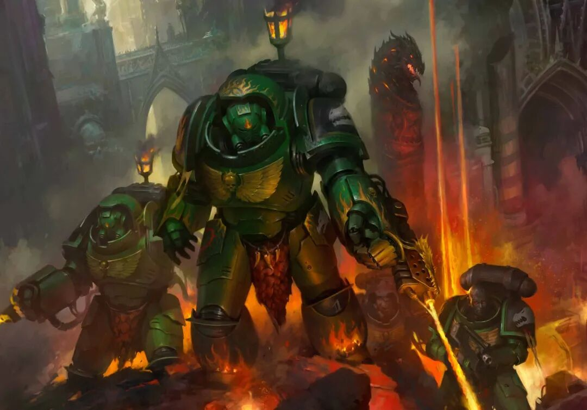

# 员工一律禁用AI！50年老牌游戏公司下发最严禁令

转自：CSDN（ID：CSDNnews）

如果你最近刷过游戏圈和创意产业的新闻，可能会产生一种错觉：只要不拥抱 AI，就等于跟时代作对。

EA CEO 说 AI 是他们的“业务核心”；Square Enix 刚完成一轮大规模裁员与重组，并明确表示要“激进地应用 AI”；《死亡空间》之父 Glen Schofield 希望用生成式 AI“修复整个游戏行业”；前《战神》开发者 Meghan Morgan Juinio 更直言：“如果我们不拥抱 AI，那就是在低估自己。”

就在所有人加速踩油门的时候，《战锤 40K》的母公司 Games Workshop（简称 GW，成立于 1975 年）却猛地一脚刹车：全面禁止员工在内容创作与设计流程中使用 AI。

甚至，GW CEO 还补了一刀：公司目前没有一位高管对 AI 真正感到兴奋。

（图片来自《战锤 40K》官网）

  

CEO 亲自定调：AI 可以研究，但不能用来“干活”

这一立场并不是媒体解读，而是GW CEO Kevin Rountree 在最新财报会上亲口说的。

他先是自嘲了一句：“AI 是一个非常宽泛的话题，说实话我也不是专家。”然后开始抛出 Games Workshop 的官方内部政策，核心就一句话：极度保守。

具体包括：

● 员工不得使用 AI 生成任何正式内容；

● AI 不得参与设计流程，包括概念设定、插画、美术、写作、雕塑等；

● 禁止在任何未经授权的场合使用 AI，包括公司举办的比赛；

● 从数据合规、安全与治理角度对 AI 工具进行严格监控；

● 即使是手机、笔记本里“被系统自动塞进来的 AI 功能”，也必须保持警惕。

Kevin Rountree透露，公司中目前只有极少数高管被允许“出于好奇心”研究 AI，但他也补充道：“我们那几位对 AI 最懂的高管，目前也没有一个是真正感到兴奋的。”

  

不裁员，反而扩招：GW 把钱砸给了真人创作者

更反常识的是，在同行纷纷裁美术、削内容团队的背景下，Games Workshop 在最近一个财年做了完全相反的事：

持续加大对 Warhammer Studio 的投入，招聘更多概念设计师、插画师、作家、雕塑师，明确把“尊重人类创作者、保护知识产权”写进公司承诺。

CEO 的原话很直白：“正是这些充满热情与才华的人，才让《战锤》成为玩家和我们共同热爱的丰富而富有感染力的 IP。”

要理解 GW 的态度，必须先理解《战锤 40K》这个 IP 是怎么来的。《战锤40K》（Warhammer 40000）是由GW于1987年推出的桌面战棋游戏，其游戏宇宙并不是靠程序生成的，而是由一代代艺术家堆出来的。其中最具代表性的，就是 John Blanche 等老一辈艺术家塑造的：“Grimdark”风格——极端、残酷、阴暗、充满宗教隐喻的黑暗未来。

这种风格，是《战锤》与所有科幻 IP 最大的区分点，也是粉丝心中最不可替代的“灵魂”。

  

只要“有点像 AI”，社区就会炸

其实，GW 对 AI 的零容忍，也不只是公司“洁癖”，更是对玩家社区情绪的精准判断。

上个月，GW 的合作方 Displate 就因为一幅官方授权《战锤 40K》作品，被玩家怀疑“有 AI 痕迹”，而不得不紧急澄清：所谓的“红旗细节”只是人类失误，绝非生成式 AI。

这件事本身已经说明问题：在《战锤》社区，哪怕只是“有点像 AI”，都足以引发信任危机。

更别说当下 GW 还在销售价格不菲的《战锤 40K》“Codex（规则书）”，里面不仅包含规则系统，还塞满了高质量的官方插画与世界观设定。

如果哪一天这些画作被证实是由生成式 AI 参与完成的，几乎可以确定会引发一场社区级“核爆”。

  

宁愿慢一点，也不愿失去灵魂

本质上来说，GW 对于 AI 的态度不只是价值观上的对抗，更是对生成式 AI 版权与数据来源不可控的极度警惕。

毕竟在当前法律框架下，模型训练数据来源不透明，输出内容是否侵权无法完全验证，而内部创作若被污染，将导致整个 IP 合规风险失控——对于一个核心资产是世界观与视觉风格的公司来说，这种风险是不可接受的。

因此，当整个游戏产业都在高喊“AI will fix everything”时，GW 给出的答案是：我们宁愿慢一点，也不愿失去灵魂。

这或许不是最高效的选择，但在一个 IP 比模型更值钱的行业里，这可能是最理性的选择。

那么，你对于 GW 的态度又有何看法呢？

参考链接：

https://www.ign.com/articles/warhammer-maker-games-workshop-bans-its-staff-from-using-ai-in-its-content-or-designs-says-none-of-its-senior-managers-are-currently-excited-about-the-tech
