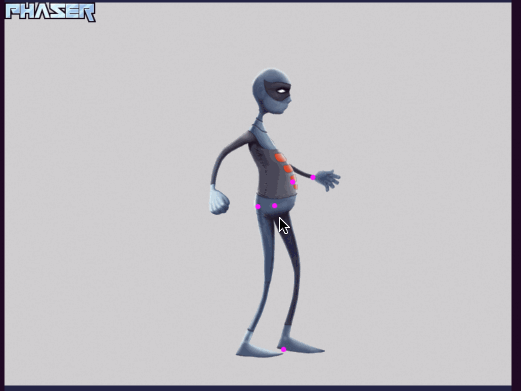
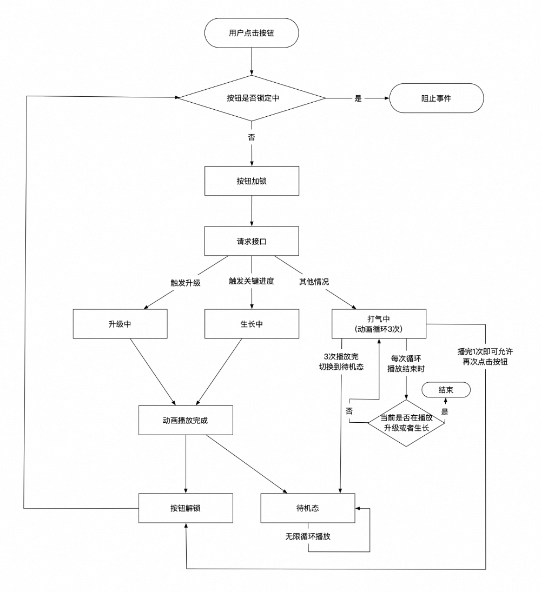
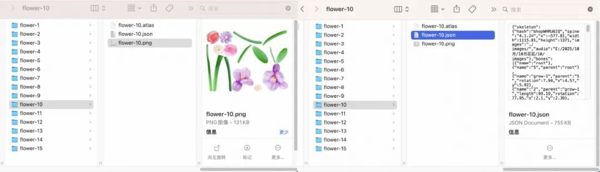
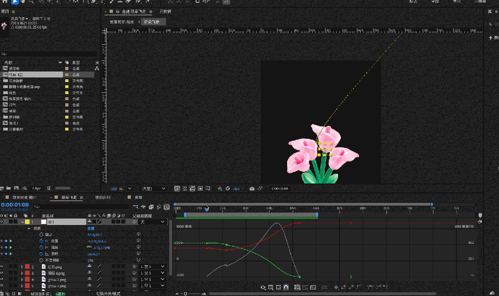
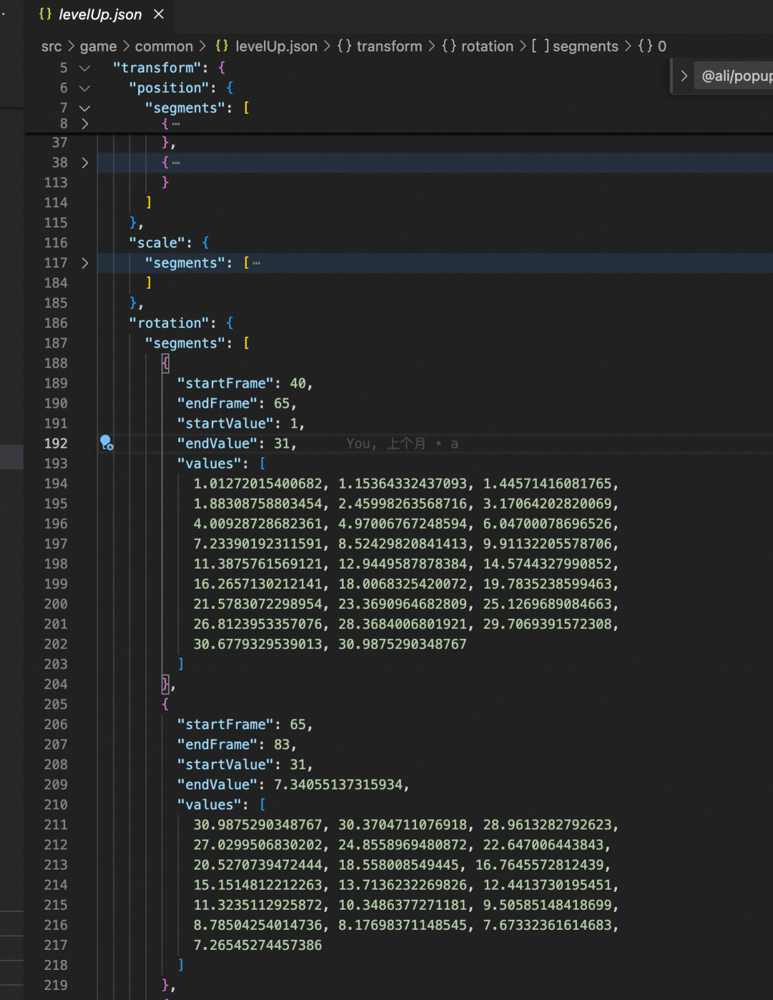
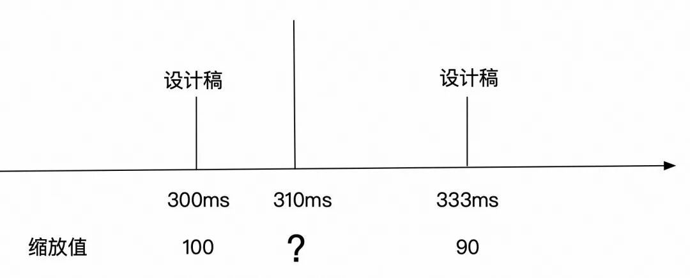
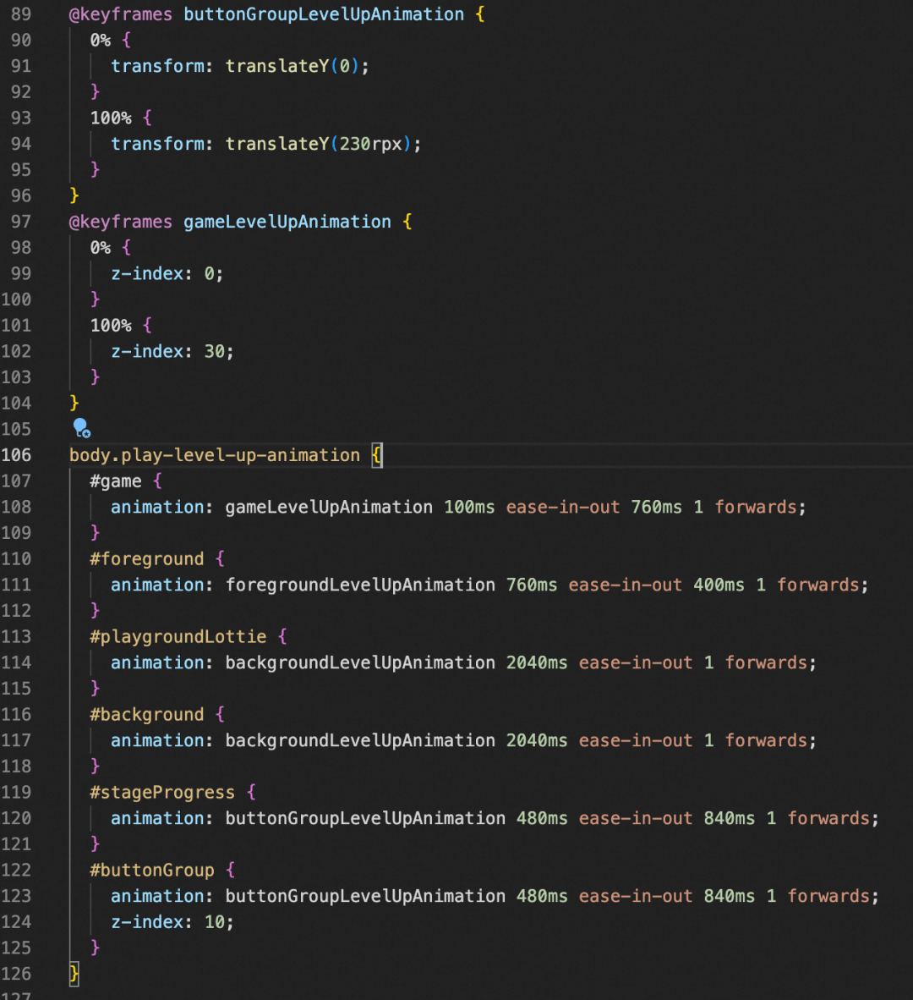
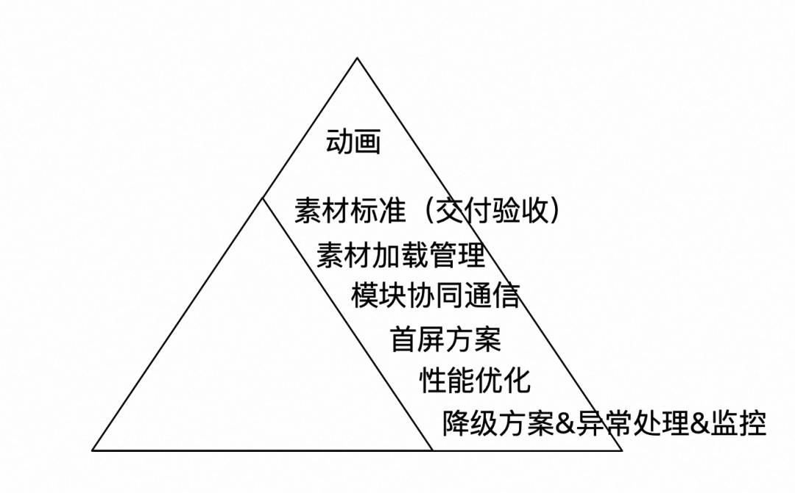
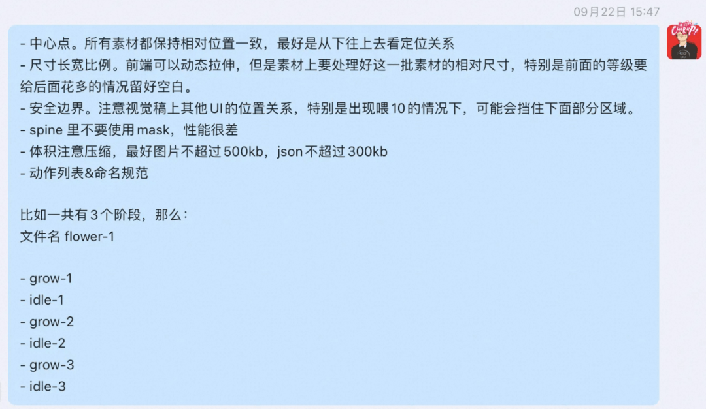
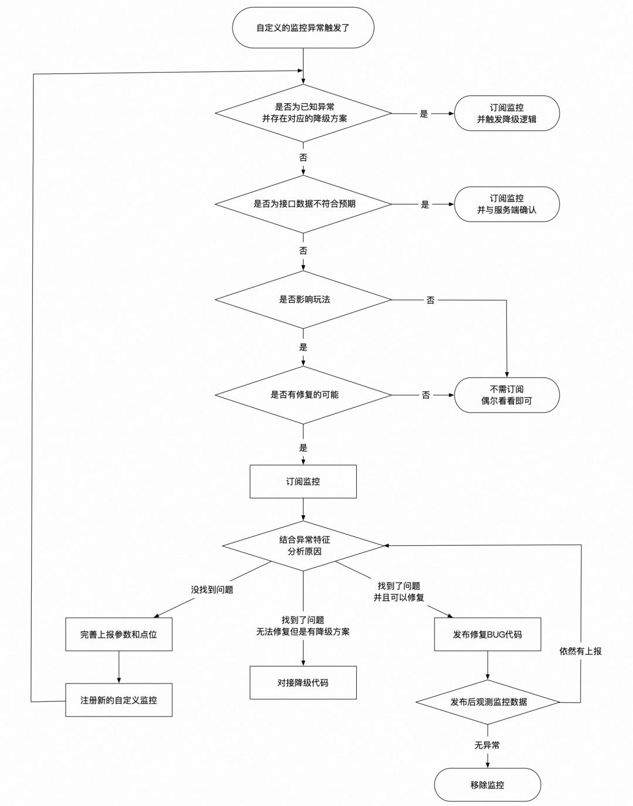

# 2025淘宝直播双11花花乐动画实现方案思考&分享

  

  

  

本文系统复盘了淘宝直播2025年双十一主互动玩法“花花乐”的H5动画实现与工程保障实践。这是一篇聚焦**高性能、高可用、可维护的H5交互动画落地实践**的技术复盘，不止讲“怎么做动画”，更系统回答了“如何让复杂动画在千万级真实用户场景中稳、准、快地跑起来”。  

  

业务背景

  

花花乐是淘宝直播2025双十一的主互动玩法。玩法是引导用户通过访问直播间做任务的方式来积累能量，消耗能量进行升级获得直播间红包，并且如果在11.10前能升满级的话，那么有机会额外开出4999元红包。

  

在页面上具体样式表达上采用的是气球花的元素，为了提升玩法的质感，我们会在打气涨进度时、进度条达到关键进度时、升级时，都会做出一些更精细的动画效果。

  

因此本篇文章主要从动画样式上来介绍一下实现思路以及相关需要注意的点。

  

看动画需求

  

设计师demo视频

  

▐  从视频中看到的关键点

  

1\. 按钮上有风吹过的花

2\. 花会晃动

3\. 到一定阶段时，会长出新的枝叶

4\. 进度条满时，会出现花飞上去的效果

  

▐  **2**.2 分解动作具体实现方案解析

  

1.  直接使用lottie等动画素材播即可。
2. 这个要看具体晃动的效果，如果比较简单，lottie也是可以，但是效果涉及到了图片自定义节点拉伸形变，那么最好上spine。否则用lottie导出帧动画的话，不仅素材体积巨大，而且帧率难以保障足够流畅。
3. 这个点跟上面一样，用到了自定义节点拉伸形变，所以要上spine了
4. 红包飞出的难点有三个：
- 红包的飞行路径如何实现？
- 破窗效果如何实现？
- 红包弹窗如何在正确的时间出现？

  

所以基于上面的动作拆解，有三个核心问题要解决：

1. 整体技术方案用什么？如何兼容这些动画的实现？
2. spine是什么？为什么要用spine？
3. 红包的飞行动画如何实现？

  

技术实现

  

▐  **3**.1 整体技术方案

  

react + phaser + spine + lottie + 事件通信

  

- 3.1.1 为何要使用phaser？

  

我们用它主要是做spine素材的播放，虽然spine官方是有专门的web spine播放器，不过大多数需要用到spine的情况，都不是只有播放spine的需求，比如我们这次的需求，它实际包含了：

- 播放spine素材
- 渲染图片
- 素材加载控制
- 素材分组，根据分组来播放动画。

因此我们需要一个轻量的游戏引擎来更好的实现这些需求，而phaser就是一个h5的轻量活跃2d游戏引擎。它可以更方便地帮我们管理素材加载、实现逻辑动画等。

  

- 3.1.2 react 和 phaser 如何分工？

  

react 在开发效率上是相对更高的，而且也有大量的相关UI组件可以使用，因此主要功能默认都是用react来实现。phaser只用来渲染花的spine素材和它下面的红包，以及相关的抖动、生长、升级动画。

  

这种混合技术方案会产生2个问题：

1. phaser 和 react 两种技术如何通信？
  
  整个项目使用事件通信，不仅为了跨技术通信，也是为了在react内，由于存在大量的动画效果，使用事件会更灵活，同时也能最大程度地降低无效重复渲染。
2. phaser是在canvas内渲染，而页面中只会存在一个canvas元素，是否会出现层叠样式排不开的情况？
  
  理论上是存在的，这个要看具体样式，如果出现了的话，那么会需要把相关样式放在canvas内渲染。本次项目的样式没有出现排不开的情况。

  

▐  **3**.2 spine是什么？为什么要用spine？

  

跟lottie类似，spine也是一个比较常见的社区2D动画素材的格式，通常用在2D游戏上。

  

与lottie相似点：

- 对原始素材进行图片分层
- 使用json描述动画具体行为，避免使用帧动画。

  

上图是spine素材图片部分

  

上图是演示自定义节点拉伸

  

与lottie不同点：

- 没有帧的概念，而是以时间为单位
- 动画是以动作名来拆分，而非帧数范围
- 支持更换皮肤
- 支持动作间的补间动画，即两个动作之间的切换能够避免过于生硬，支持补充简易的过渡效果。
- 支持绑定自定义点位做形变
- 必须使用canvas来播放，不能使用svg播放。

  

▐  **3**.3 spine动画播放

  

了解spine之后，播放花的抖动和生长效果只要播放对应动作即可。

但是由于存在待机循环动画，因此需要注意控制何时可以打断当前动画播放新动作，何时不能打断的问题，并用这个逻辑反推按钮加锁逻辑。

  

  

上图是整个状态机理论上完美运行的情况，实际上还有比如素材加载异常、中途各种js error的情况发生，因此还需要增加一些兜底监控。

- 当动画长时间不循环时，上报自定义监控并执行兜底逻辑。
- 当按钮长时间锁定时，上报监控并执行兜底逻辑。

  

▐  **3**.4 红包的飞行路径如何实现？

  

上图为设计师演示demo

  

先介绍一下我们目前的素材情况：

单个等级的花的素材 png +json 体积约 900kb

  

我们一共有15级，每级一份spine素材，每个spine素材内包含3到5组动作（打气、生长、待机）如果这个动画放在动画素材里来做，则15个文件都要增加红包的重复的升级动画，会增加设计师工作量与素材体积。为了降低素材的体积和素材的可维护性，这个升级动作需要由代码来实现。

而动画的详细参数，我们需要拿到设计师的源文件来确认关键帧的设置，也就是AE源文件（类似sketch之于视觉稿）

  

接下来我们看这个动画有几个关键点：

1. 动画是成组（花+红包）做变换的
2. 变化包含：缩放、位移、旋转、透明度
3. 组的中心点在上面偏右的位置
4. 整个动画曲线看起来是有“重力”的感觉的，这个是常见的贝塞尔曲线难以复刻的。

  

关键的问题就是这个动画曲线如何获取，拿到了AE的源文件，能看到设计师手动拉的动画曲线，但是我们拿不到具体的值，自然也构建不了准确的动画曲线。关键的问题就是这个动画曲线如何获取，拿到了AE的源文件，能看到设计师手动拉的动画曲线，但是我们拿不到具体的值，自然也构建不了准确的动画曲线。

  

  

于是我先手动拿 ease-in、ease-in-out 等常见曲线进行模拟。模拟之后的效果如下：

左图为设计师demo效果，右图为手动粗略模拟的效果

  

这个效果差别还挺大的，因为它不仅是位移曲线，整个缩放、旋转的曲线也都是手拉的，合并在一起表现的差别就很大。

  

于是接下来就麻烦了， 因为人眼粗估的效果和设计师原方案差别大，而我们又看不到具体的动画曲线公式。好在这里有具体的值，我们可以反推公式，不过目前还有个更简单的方案，即直接把每一帧的值带入每一帧的渲染，类似算法中“打表”的方式来执行这个动画曲线。

  

而AE是支持运行JS脚本的，所以我们可以用AI帮忙写AE脚本，执行并导出相关数值。

上图是加工之后的通过脚本结构化输出的动画分帧具体值

  

然后再让AI写个在运行时每帧渲染读取相关的值进行渲染的动画播放器。接下来只需要做好坐标系的转换即可，即在AE中的初始值和代码中的初始值做好比例转换。

下个问题是动画是以30帧进行导出的，而用户设备渲染频率至少是60帧。如果不做额外处理，那么用户操作其他的效果都是60帧，唯独升级时由于数值是30帧的数据，渲染起来就是30帧了，会明显感觉卡顿。

  

  

如上图，例如设计师的源稿表示在300ms时，缩放值为100，333ms时，缩放值为90，那么如果运行时本帧渲染的时间为310ms，那么应该渲染的缩放值是多少？

这个问题也好解决，有两套办法：

1. 导出数据改成60帧
2. 执行时进行动态补帧

  

方案1的问题在于如果用户设备是更高刷的屏比如144帧，那么依然会感觉不流畅，且json文件体积翻倍。所以采用了方案2。

  

目前很多高端电视都是支持动态补帧能力，根据两帧之间的颜色来动态计算中间值，这个方案问题是会造成延迟，因为必须先拿到后一帧的数据，才能算出要上屏的中间帧是用什么颜色。所以这种补帧都是在看电影看视频等场景可以开启，而游戏不行，电视加了补帧等于画面增加操作延迟，游戏需要操作跟手。

  

但是我们的场景刚好可以借鉴动态补帧的方案，不涉及到用户实时输入响应的问题，只要拿数据计算即可。

  

## ▐  **3**.5 破窗效果如何实现？

##   

上图为设计师演示demo，在升级时花盖住了其他UI区域。

  

页面层级保持干净 -> 升级时给全局加className，临时调整相关模块到对应层。有个关键点是花朵（canvas）原本会被前景的云图片遮挡，当它飞到某个时刻时，花朵会要移动到最上层。这个是在对应的时机执行，设置z-index。

  

上图是破层动画部分的代码，只要body上存在对应classname，即对应层自动开始执行动画。

  

这里需要重点说明下“页面层级保持干净”指的是需要注意z-index的堆叠规则，简单说是如果想要让dom元素的层级可以完全按照z-index值随时调整层叠关系，那么必须注意这些层它们的任意父层是否创建了不同的层叠上下文。如果创建了的话，那么会先优先从这个上下文的层进行判断。因此需要避免在父层创建层叠上下文，最好是保持它们的上下文一致，这样在进行动画操作时会更安全。

##   

## ▐  **3**.6 红包弹窗如何配合动画在正确的时间出现？

  

这种连续的动画必须在开始执行前就做好素材和数据的准备，也就是用户在点击按钮后，先请求接口拿到返回数据，首先对返回数据做好校验的处理，明确好接下来的动作：涨进度/涨阶段/升级。如果不合法，那么在播放动画前就直接走异常流程，比如出toast反馈给用户。

  

这样就能保证开始播动画时已经做好数据上的准备，只要根据设计师的动画效果对应时间触发弹窗渲染数据即可。

  

## ▐  **3**.7 最终上线效果

  

- ### 升级动画对比

###   

左侧为设计师演示demo，右侧最终线上效果。基本做到了1:1的还原

###   

- ### 线上完整动画演示

  

线上效果录屏。包含：首屏入场、打气、涨阶段、升级。

  

除了做动画本身，还有什么意料之外的难点？

  

可以说实现动画是在实现动画这件事情中，比较简单的事情，更需要关注的包括不限于：

就像金字塔一样，想要更高一点，需要投入的砖块数量可能要大于其本身的数量。

##   

## 

## ▐  **4**.1 素材交付标准与工期约定

##   

交付动画素材和交付视觉稿不一样。因为设计师交付的素材要运行在线上的，因此需要在前期约定一些交付标准，比如：

  

设计师交付素材之后，还要有联调的时间，内容包含：

- 检查动作命名是否正确
- 素材体积
- 素材尺寸是否标准、中心点是否正确
- 每个动作的时间是否符合预期
- 每个动作的效果在页面中是否展示正常无遮挡
- 素材发布&离线包发布

  

这部分的工作量是比较重要但是容易遗漏的，因此建议维护一个表格，用于记录素材的交付、联调情况，定期与设计师同步进度。

##   

## 

## ▐  **4**.2 素材加载管控

  

整个玩法一共有15级，即15种花，这些素材不需要同时加载，页面上渲染的只有其中一种花，因此加载当前等级即可。问题在于何时加载下个等级的素材，以及如果需要用到下个等级的素材，但是发现没有加载完成怎么办？当前等级素材加载失败怎么办？

  

目前的方案是进入页面首屏完成后，第一时间加载当前等级的素材并上屏渲染。一旦首屏的花渲染完成，开始预加载升级时要用的素材和下个等级的素材。在每次升级动画完成之后重新执行该逻辑。这样能够最大程度地降低素材未加载完成的概率。

##   

## 

## ▐  **4**.3 动画降级

  

因为页面上有加载phaser + spine这套比较重的动画方案，所以我们的降级主要就是围绕这个的技术方案的。理论上canvas和webgl是绝大部分设备都支持的技术。但是其中的异常情况来源有很多，比如设备开启了低电量模式、网络不好、系统版本等等。

  

这里我们不能考虑得太细，比如仅支持canvas，不支持webgl要不要搞个降级到canvas渲染的模式。不要做这些兼容，因为兼容效果同样不完美，而且兼容不过来，更而且是恰好命中这些异常的用户并不多。

  

不如直接把兜底降级方案做好。我们的降级方案是用dom渲染，同时这套方案也交给测试同学进行完整的测试验收。

  

接下来的问题是降级方案何时使用，这里也是需要关注的，我做了3种开关：

1. 全局开关，推一个配置所有设备都降级
1. 用于发现spine这套方案有重大问题时
3. UA正则表达式判断开关，推一个配置，命中该表达式的设备降级
1. 用于发现部分设备明显有问题时
5. 如果有写入明确要降级cookie的时
1. 用于在运行时发现有相关报错，代码写入cookie，供刷新页面后SSR做判定
2. 这次刚好遇到 iOS 18.7.2 的webgl问题，也没有超出自动降级的射程范围。

  

最终的情况是每天大约有1%的用户由于各种异常被降级。因为是降级时间只有当天，所有总共大约也只有1%的用户需要降级。

##   

## 

## ▐  **4**.4 低端机、弱网、接口异常

  

兼容异常场景的思路是针对结果而非针对过程。

举例来说就是我们不能针对性地看“低端机”或者“弱网”，因为在某些情况下，所有用户都可能是“弱网”，设备运行的软件多了，或者开启节能模式，都可能成为“低端机”。而且要尽可能的泛化掉这些异常，把他们更粗力度的去看，比如“接口返回的慢/无返回”、“页面加载的慢”，针对这种具体发生的情况我们的方案是什么。

  

不过我们的玩法并不复杂，数据的计算都是在服务端的，前端是负责渲染页面，核心操作也只是发接口，本质上是用户页面的状态是服务端在控制的，因此我们的方案就是只需要围绕着样式渲染符合预期即可，极端复杂的情况是可以刷新页面的。

  

所以我们实际上做的事情大致有：

- 所有接口手动封装一层promise，并处理干净返回值，把不确定的外部依赖收敛掉；
- 所有的接口异常及时上报，因为如果玩法真出了问题，没办法脱离服务端做纯前端的修复；
- 重点关注影响主流程的素材加载、动画运行是否“粗略”的符合预期，否则执行降级方案。

  

举例来说，我们首屏加载完成之后，会设置个10秒计时器，如果届时spine的花还没渲染出来，那么执行动画降级。这种粗力度的降级策略可以帮我们处理掉很多意想不到的意外。粗力度的降级判定等于精细严格的合法验证。

##   

## 

## ▐  **4**.5 监控

  

由于是大促项目，不仅项目运行期间变更发布不方便，而且如果出问题影响会很容易扩大，因此除了本身的代码质量要保证好之外，对关键链路的监控也是必不可少。

  

本次项目布置了50+条监控，分类来看的话主要有：

- 接口异常
- 这里的接口异常不是网络接口层面的，而是前端经过校验的，比如某些接口期望返回一个红包数据，若返回的红包无有效面额也视为失败。这种应该在拿到接口数据的时候做一次校验，不应该视为接口成功。
- 素材资源加载异常
- 主动校验代码异常
- 花儿长时间没渲染出来、按钮长时间不可点。
- 在代码逻辑中正常逻辑不会执行，但是有理论可能的。比如执行到某段代码期望传入的值是大于当前值的，但是却小于了。
- 还比如对服务端下发的某个字段做映射，但是发现前端代码中没有与之匹配的承接方式。类似下发的任务类型、下发的弹窗id。
- 被动触发异常
- 监听全局js error，把其中明确是已知问题的单独拆出来做上报，不扔到js error中。分类出全局报错做对应的降级。比如没加载到phaser、spine文件解析失败等。
- JS API 异常
- 一些js api调用可能会在某些设备、某些版本下不支持，一方面做上报，另一方面为降级浏览器的方式。
- SSR 异常
- 被SSR降级到了CSR

  

我们做了监控的同时，同时还要考虑如何应对异常情况的发生：

  

  

即做好监控是整个产品生命周期持续迭代优化的事情，这样才能更好的分析出深层次的问题，才能发现并解决更多疑难杂症。如果是在发布阶段盯盘发现某个明显影响玩法的异常数据飙升节奏与发布节奏高度吻合，那么是要走回滚的。

#   

总结

  

理论上无论多么复杂的动画效果都是能实现出来的，但是若要做到能在大促生产环境上线的标准，就需要各个方面的兼容和优化了。不同业务场景的最佳实践也必然有所差异，然而总会有一些底层相同的方法是可以总结的，希望本文能给大家带来一些动画实现的思路。

  

应用背景

  

本文作者酒舟，来自淘天集团-直播用户终端技术团队。我们致力于建设完善的直播访问路径，汇集淘宝直播强大的音视频处理能力，提供直播、互动、营销一体化解决方案，实现「生态开放、直播未来」的愿景。 同时我们也在持续进行 R2C 和 AGI 探索，HC 开放，诚邀专业、有趣的小伙伴加入！

  

  

  

  

**¤** **拓展阅读** **¤**

  

[3DXR技术](https://mp.weixin.qq.com/mp/appmsgalbum?__biz=MzAxNDEwNjk5OQ==&action=getalbum&album_id=2565944923443904512#wechat_redirect) | [终端技术](https://mp.weixin.qq.com/mp/appmsgalbum?__biz=MzAxNDEwNjk5OQ==&action=getalbum&album_id=1533906991218294785#wechat_redirect) | [音视频技术](https://mp.weixin.qq.com/mp/appmsgalbum?__biz=MzAxNDEwNjk5OQ==&action=getalbum&album_id=1592015847500414978#wechat_redirect)

[服务端技术](https://mp.weixin.qq.com/mp/appmsgalbum?__biz=MzAxNDEwNjk5OQ==&action=getalbum&album_id=1539610690070642689#wechat_redirect) | [技术质量](https://mp.weixin.qq.com/mp/appmsgalbum?__biz=MzAxNDEwNjk5OQ==&action=getalbum&album_id=2565883875634397185#wechat_redirect) | [数据算法](https://mp.weixin.qq.com/mp/appmsgalbum?__biz=MzAxNDEwNjk5OQ==&action=getalbum&album_id=1522425612282494977#wechat_redirect)
