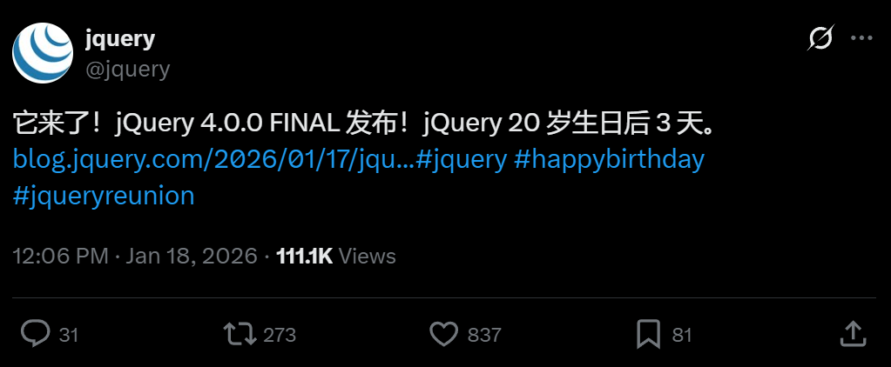
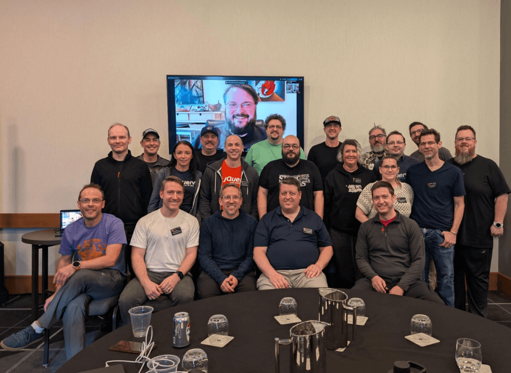

# 十年首更！jQuery 4.0 全新发布，开启新篇章！

对于老前端来说，jQuery 是刻在青春里的工具库。2026年恰逢其**诞生20周年**，这款陪伴一代开发者的“前端瑞士军刀”，迎来了**近10年来首个重大版本——jQuery 4.0.0**，以精简和现代化完成自我革新。



## 经典不死，持续进化

2006年，John Resig 推出 jQuery，凭**“写得少，做得多”**的理念，解决了当时浏览器兼容、DOM操作繁琐的痛点，巅峰时几乎垄断互联网网站。


如今前端框架迭代频繁，但 jQuery 仍未退场。4.0.0 版本历经多轮预发布，以“断舍离”适配现代生态，虽含**破坏性变更**，但多数用户**少量改码即可升级**，配套升级指南和 Migrate 插件降低迁移成本。

## 四大关键更新

本次更新聚焦**“砍包袱、追标准”**，核心变更如下：

### 1\. 放弃老旧浏览器，轻装上阵

移除**IE10及以下**、旧版 Edge、iOS 旧版等兼容代码，暂留 IE11 支持（计划在 jQuery 5.0 中移除）。需兼容旧浏览器可继续使用 **jQuery 3.x**。

### 2\. 适配现代开发：ES模块+安全升级

源码从 AMD 迁移至**ES模块**，可直接通过 \`**Trusted Types 支持**3\. 精简API，缩小体积移除 **jQuery.isArray** 等12个废弃API（改用原生方法替代），剔除内部无用方法。**gzip体积减少超3KB**，精简版（无AJAX、Deferreds）仅**19.5KB**，比完整版小8KB。

### 4\. 事件顺序对齐W3C规范

焦点事件顺序改为 `blur→focusout→focus→focusin`，放弃旧版自定义顺序，仅 IE 保留旧行为，开发需留意差异。

## 下载与升级建议

版本已上线**官方CDN**和**npm**，获取方式如下：

#### 1\. 官方CDN引用

```
// 完整版
<script src="https://code.jquery.com/jquery-4.0.0.min.js"></script>
// 精简版
<script src="https://code.jquery.com/jquery-4.0.0.slim.min.js"></script>
```
#### 2\. npm安装

```
npm install jquery@4.0.0 
```
升级前建议查阅**官方指南**，借助 **Migrate 插件**排查兼容问题。

## 20周年：情怀之外，依旧能打

如今前端框架当道，jQuery 仍有**不可替代的价值**：小型项目、后台系统中，其简洁语法高效便捷；对遗留系统而言，4.0版本为现代化迁移提供了路径。

此次发布恰逢团队**达拉斯20周年重聚**，**创始人John Resig**也线上参与。20年迭代，jQuery 从颠覆者到适配者，承载着一代开发者的记忆，未来仍将以轻量化姿态立足前端生态。



## 结语

我是林三心，一个待过**小型toG型外包公司、大型外包公司、小公司、潜力型创业公司、大公司**的作死型前端选手

我建了一些**前端学习群**，如果大家想进群交流前端知识，可以关注我，回复**加群**
