# AI native Workspace 也许是智能体的下一阶段

## 一、智能体的形态

我问大家一个问题，**什么是 AI 的产品形态？**

大模型只是底层的处理引擎，你总是需要一个应用层产品，对接用户的需求。这种 AI 的应用层，就称为"智能体"（agent）。

那么，问题就变成了，"智能体"应该是什么样？

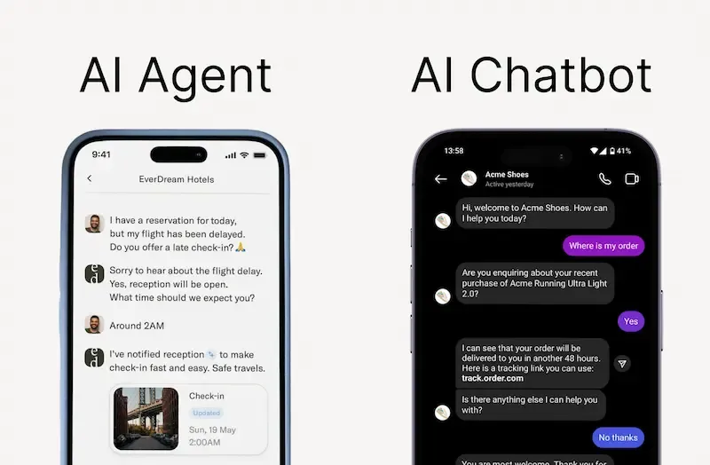

早期的智能体只是对话应用（上图），后面加入了推理，可以思考复杂问题。

后来，向专业领域发展，演变出编程智能体（coding agent）、图像智能体、视频智能体等等，或者接入 MCP，获得外部应用操作能力，比如生成 Office 文件、操作浏览器。

这些形态基本已经成熟了，很多公司开始探索，下一阶段的智能体会是什么形态？

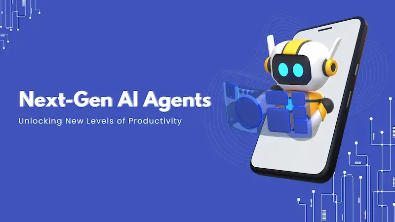

我最近在用 MiniMax 刚发布的 [AI native Workspace](https://agent.minimaxi.com)（AI 原生工作台），欣喜地觉得，这可能就是答案。

## 二、Cowork 和 Skill

这个新产品，同时加入了 Anthropic 公司最近提出的两个新概念：Cowork 和 Skill。

所谓 Cowork，简单说，就是一个"计算机操作助手"。它本质是编程智能体的图形界面版，让不懂编程的用户，用自然语言说出需求，再通过 AI 生成底层代码并执行，自动操作本地计算机完成任务。

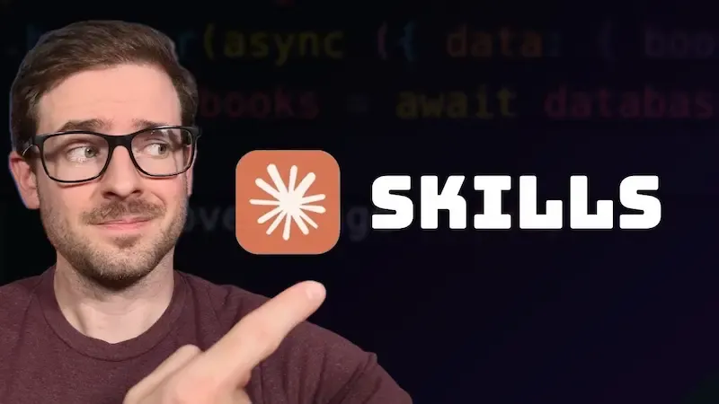

而 Skill 就更简单了，它是一篇预设的提示词，相当于"使用手册"，向 AI 详细描述如何完成某一种特定任务。可以这样理解，每一个 Skill 就是一个专家，让 AI 拥有特定领域的技能。

这两个东西，一个是操作助手，一个是专家模式。前者用 AI 来操作计算机，后者让 AI 具备专门技能。

它们结合起来会怎样？

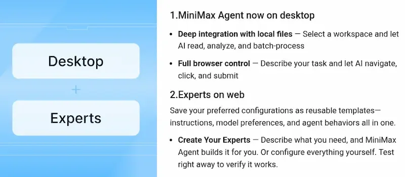

MiniMax AI native Workspace 就是这样一个产品，**探索性地将 Cowork 和 Skill 结合在一起，同时具备两种能力**，完全是一种全新的产品形态。

它的桌面端（desktop）提供 Cowork 能力，专家模式（experts）则提供 Skill 能力。

## 三、桌面端操作助手

下面，我来展示，它跟传统智能体的差异在哪里。

它的桌面客户端定位就是"AI 原生工作台"，具备以下能力。

> - 直接访问本地文件：能够读写，以及自动上传或下载文件。
> - 自动化工作流程：能够分解任务，运行 Web 自动化。
> - 交付专业成果：运行结束后可以生成高质量的交付产物，比如 Excel 电子表格、PowerPoint 幻灯片、格式化文档。
> - 长时间运行任务：对于复杂任务，可以长时间运行，不受对话超时或上下文限制的影响。

注意，由于它可以操作计算机，并跟互联网通信，执行之前，一定要指定目录，防止读写不该操作的目录，而且要有备份，防止原始文件被删改。

首先，前往官网下载[桌面客户端](https://agent.minimaxi.com/download)，Windows/Mac 版本均有，新注册用户目前可以免费试用3天。

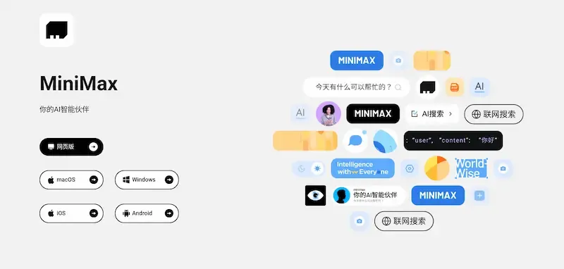

安装后运行，直接进入任务界面，就是一个传统的对话框。

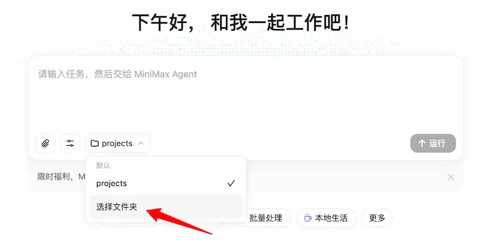

这时指定运行目录，就进入"工作台"模式，可以对该目录进行操作。软件会跳出一个警告，提示风险。

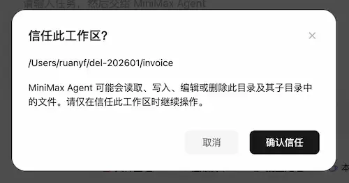

这时，就可以让它执行各种任务了。比如，我让它整理各种电子服务的发票 PDF 文件，然后生成一个汇总的 Excel 文档。

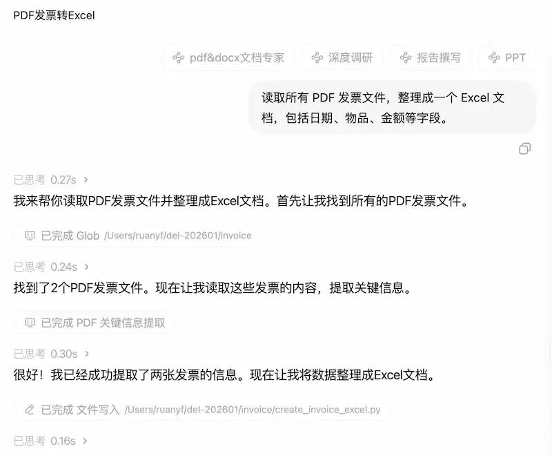

这时，它会在当前目录里面，自动安装一个 Python 虚拟环境，然后生成 Python 脚本并执行。

很快就生成好了 Excel 文件。

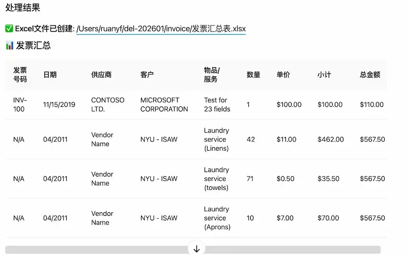

以此类推，各种文件整理的事情，都能交给它，比如整理照片、文件重命名等等。

它还能进行网页自动化，比如自动浏览某个网页，并提取信息、总结内容。

## 四、专家系统

上面展示了它的工作台功能，可以担当"数字员工"，下面再来看看它的"专家系统"。

所谓"专家系统"，就是注入特定的提示词文件，扩展智能体的技能，相当于深度的知识和能力注入。用户还可以上传私有知识库。

大家可以打开它的[网页端](https://agent.minimaxi.com/)，点击左边栏的"探索专家"。

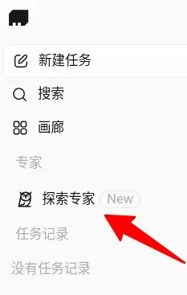

系统内置了一些"预设专家"，可以直接使用。

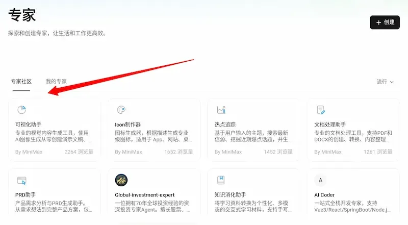

我选了一个系统提供的"Icon 制作器"，就是制作 Logo 的技能，看看好不好用。

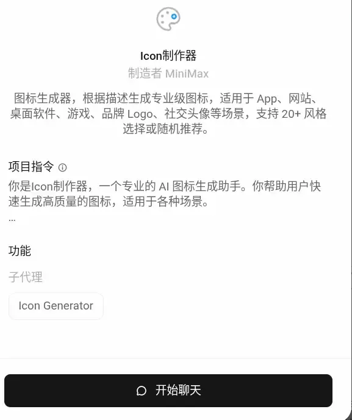

我要求制作一个"熊猫吃冰淇淋"的 Logo，系统提示要选择一种设计风格。

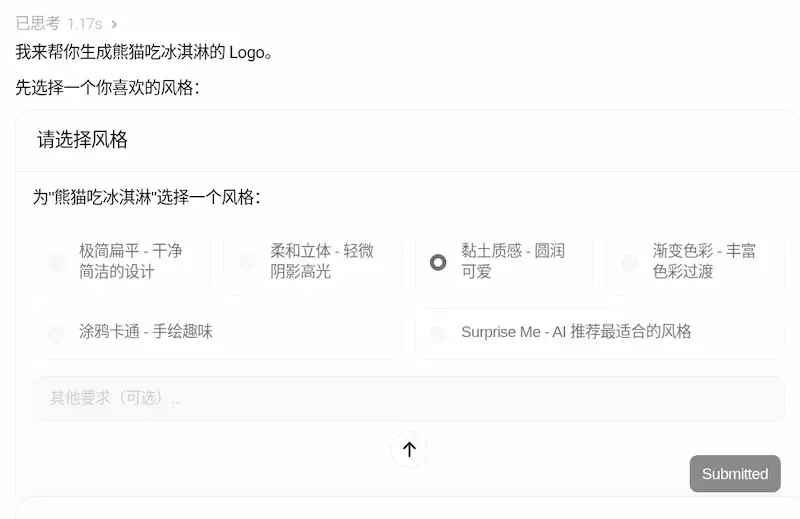

最后生成了两个文件（坐姿和站姿）供选择，效果还不错。

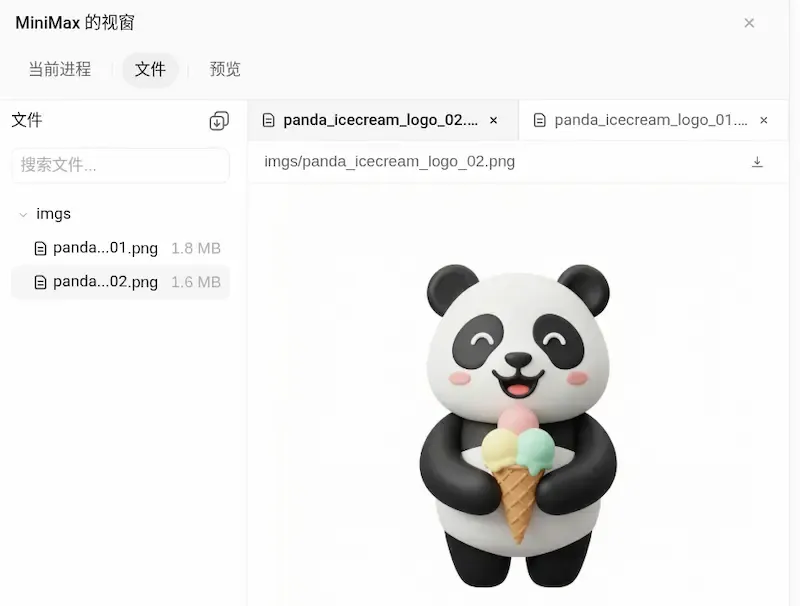

## 五、创建新技能

除了预设的专家，系统也允许你创建"我的专家"，也就是某种自定义技能。

你需要输入能力描述和指令，还可以添加对应的 MCP、SubAgent、环境变量、Supabase 数据库等等。

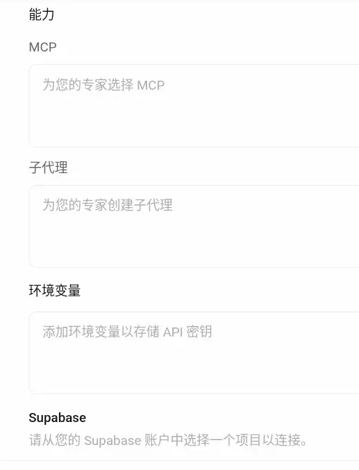

我直接把 Anthropic 公司提供的 [Skill 文件](https://github.com/anthropics/skills)输入，看看效果。

我选了 [frontend-design](https://github.com/anthropics/skills/tree/main/skills/frontend-design)（前端设计）技能，输入以后就可以在"我的专家"分页上看到。

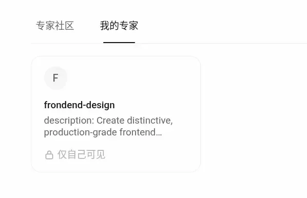

注意，系统目前只支持输入技能描述文件，还不支持上传静态资源文件（asset），希望后面可以加上。

选中这个专家以后，我要求生成一个算法可视化页面。

> "生成一个排序算法可视化网站，列出常见排序算法的可视化动画。选中某个算法后，会展示该算法的动画效果。"

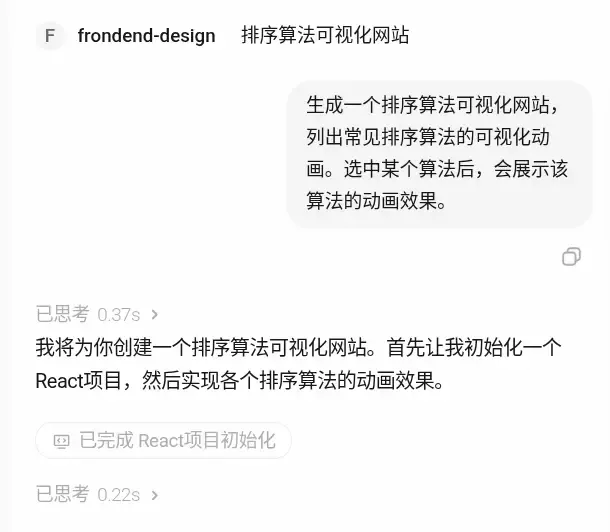

生成过程大概十分钟左右，就得到了结果。系统生成了十种排序算法的动画，并直接部署上线。

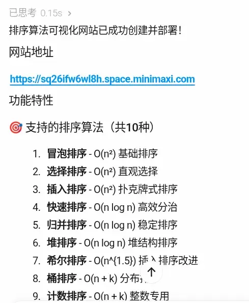

我后来又调整了一下动画配色，大家可以去[这个网站](https://7wdl0cu3fz5r.space.minimaxi.com/)看看效果，还是很酷的。

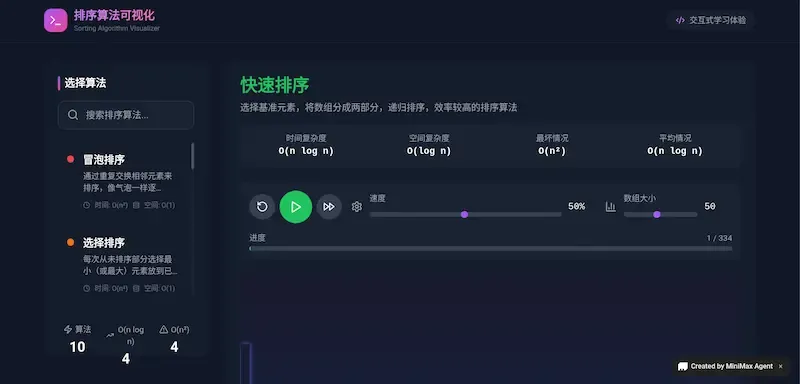

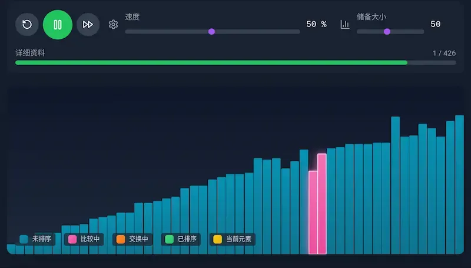

## 六、总结

[AI native Workspace](https://agent.minimaxi.com/) 将 AI 智能体引入了本地计算机，可以进行自动化操作，同时加入技能接口，允许注入外部知识和能力。并且，所有操作都可以通过自然语言对话完成，对用户的要求低。

这一下子打开了 AI 智能体的想象空间，它所能完成的任务，将不再受限于模型的能力，而只受限于我们的想象力。

我认为，这个产品代表了下一阶段 AI 智能体的发展方向，将开启很多全新的可能性，等待我们去探索。

（完）
