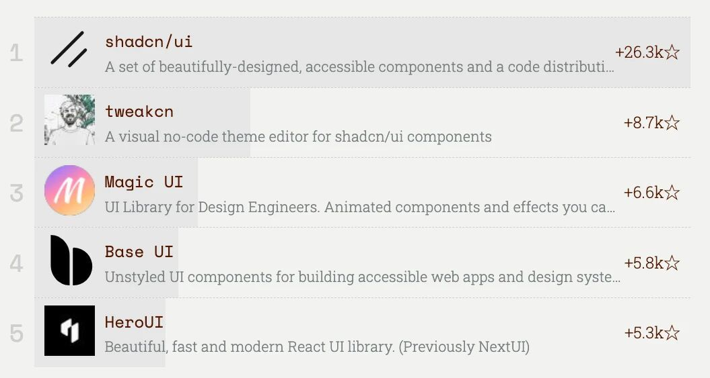

# UI组件库排名出炉！ElementUI和AntDesign均未进前五！

1\. shadcn/ui：设计精美、支持无障碍的组件集，获26.3k星标居首，是认可度极高的UI组件方案。  
  
2\. tweakcn：shadcn/ui的无代码主题编辑器，8.7k星标排名第二，大幅降低组件定制门槛。  
  
3\. Magic UI：面向设计工程师的UI库，6.6k星标位列第三，主打动画组件与特效功能。  
  
4\. Base UI：提供无样式无障碍UI组件，5.8k星标排第四，适配各类Web应用定制需求。  
  
5\. HeroUI（原NextUI）：现代化React UI库，5.3k星标居第五，兼顾美观与开发效率。

广东,1月8日 12:01,

