# 震撼升级：Claude获得「永久记忆」！全球打工人变天

### 

转自：新智元

搅翻整个硅谷的Anthropic，继续甩出新的核弹。

就在今天，消息人士爆出：Anthropic正在给Claude Cowork重磅升级，知识库注入永久记忆！

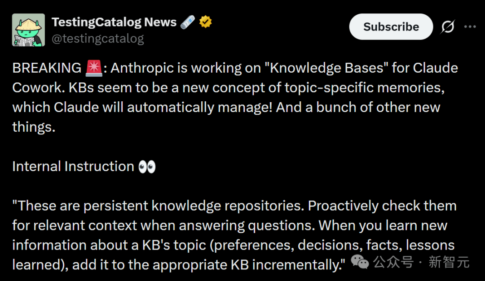

也就是说，从此Claude将不再是金鱼记忆，在它的「永存大脑」中，它将开始自动记住一切。

从此，Claude将不再是个聊天机器人，这种永久记忆模式的Cowork模式，将会彻底颠覆AI办公革命！

此外，Cowork模式将与Chat模式合并，并成为Claude Desktop的默认用户界面。

总的来看，这份曝光的Anthropic内部指令信息量极大，还包含其他重磅升级。

知识库（Knowledge Bases） 

Claude Cowork成为主入口 

统一 UI +Artefacts侧边栏 

更强的自动化连接器（MCP） 

语音模式 + Pixelate升级

另一位硅谷著名爆料人Tibor Blaho，也曝出了类似消息。

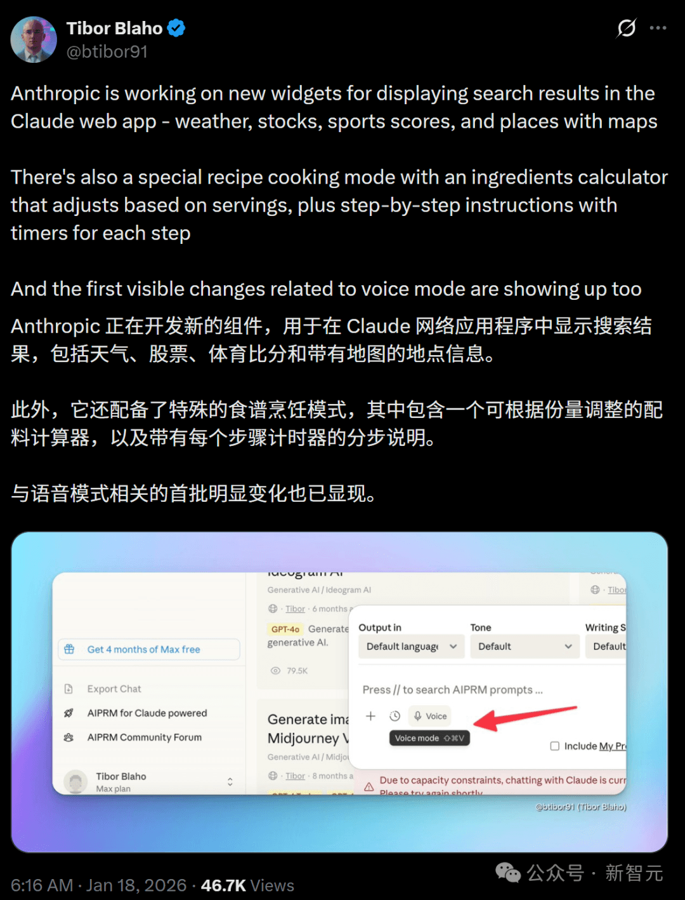

已经用上Cowork的Reddit网友敲桌表示：等不及了，这个功能会让氛围编程容易得多！

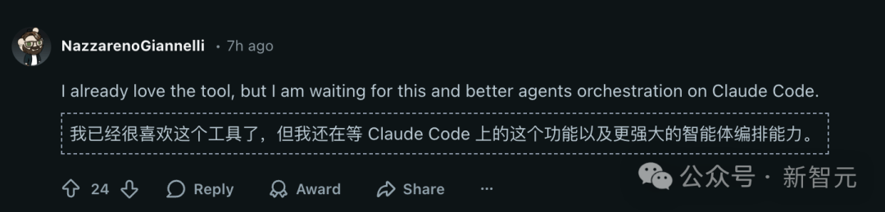

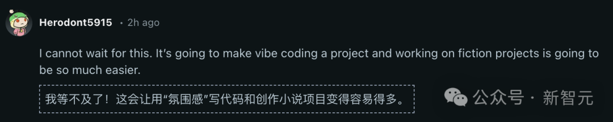

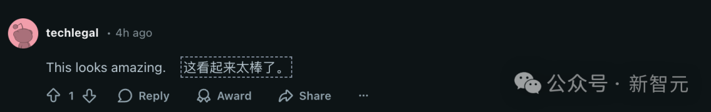

如果这些功能全部顺利落地的话，Claude将进化成一个名副其实的生产力搭子——会长期协作，会执行任务，还能记住你的一切！

有圈内人自曝说，自家公司给内部也正在开发类似的上下文引擎，推测Anthropic这么做的最终目的，是减少token消耗。

果然，Anthropic在引领整个硅谷。

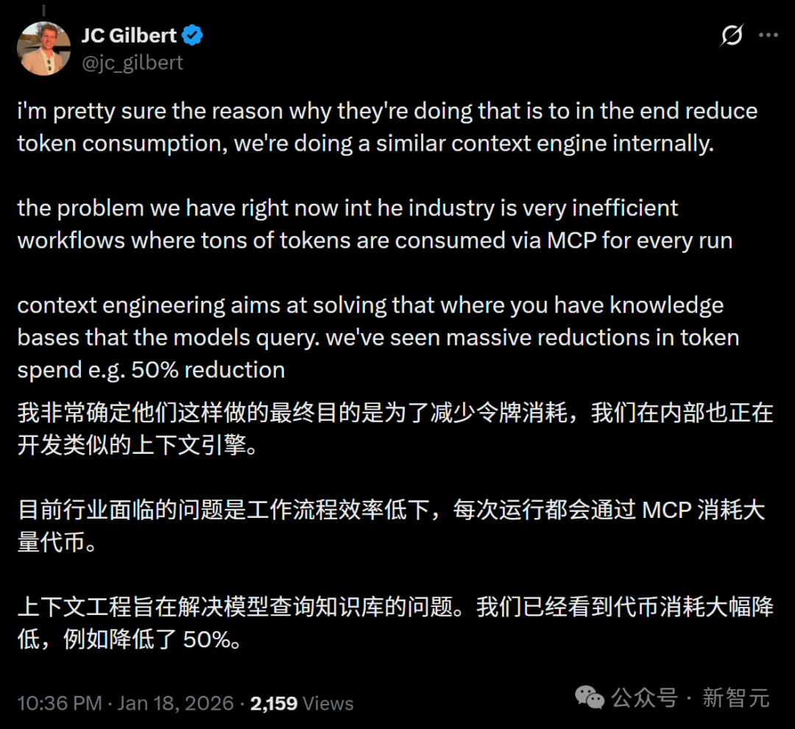

##   

**知识库，让Claude拥有「永久记忆」**

##   

根据爆料，Anthropic正紧锣密鼓地搞定Claude Cowork的「永久记忆」。

这种「知识库」，是Anthropic给Claude设计的一种全新记忆方式。

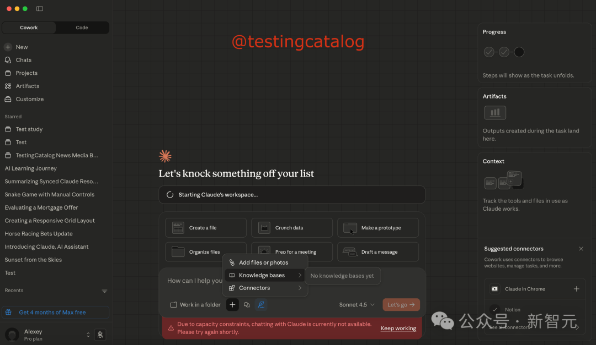

而引入知识库，是核心的新增功能。

这个功能甚至Claude Code都没有，而Cowrok要捷足先登了。

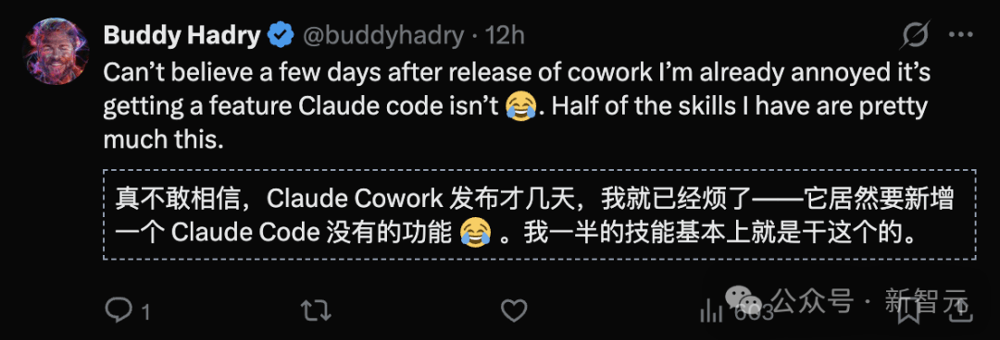

知识库内部指令 

  

知识库：这是持久化的知识存储库。在回答问题时应主动检索其中相关的背景信息。当获取到与某个知识库主题相关的新信息时（如偏好设定、决策过程、事实依据或经验总结），应将这些内容逐步添加至对应的知识库中。

你可以把它理解成：Claude不再把所有信息都一股脑儿塞进一个大脑，而是分门别类地存进不同的「小本子」。

在你向Claude 提问或一起做事时，它会主动去翻这些知识库，看看有没有和当前任务相关的背景信息，而不是每次都从零开始。

更重要的是，这些知识库不是死的。

当Claude在某个主题上学到新的东西，比如你的个人偏好、已经做过的决策、确认过的事实，或者踩过的坑，它会一点一点把这些补充进对应的知识库里。

总之就是一句话，越用越懂你！

最大的变化就是——

Claude不再依赖一个混乱、不可控的「通用记忆」，而是让用户自己管理多个清晰、独立的知识库。

以后再用Claude Cowork做事，我们可以手动选择用哪个知识库作为上下文了。

比如，写方案就用「项目知识库」，跑自动化就用「工作流知识库」，整理文件就挂上「资料管理知识库」。

对于自动化、文件管理这类复杂任务，意义简直是颠覆性的。Claude终于能真正理解「你正在干什么」，而不是瞎猜了。

****

**Claude Cowork上位，成为主模式**

另一个非常明确的信号，就是Claude Cowork将成为主模式。

也就是说，传统的「Chat」不会消失，但会被折叠进Cowork。

从此，Cowork将成为未来Claude的默认工作空间。

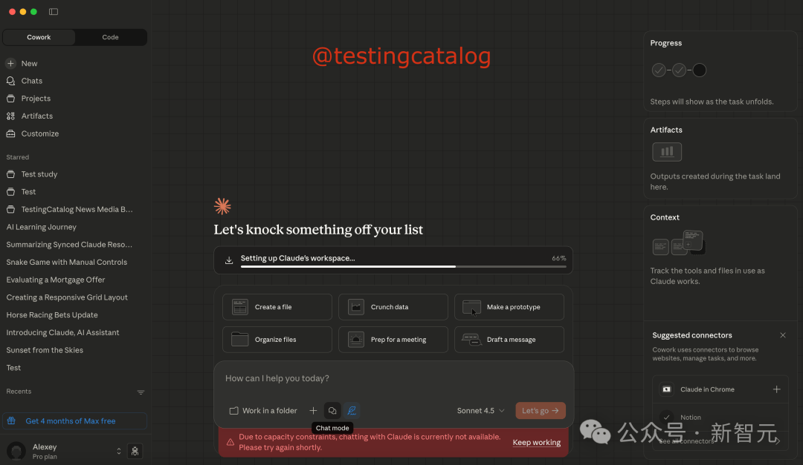

Chat模式切换

可以将它理解为，一个融合了聊天、文件、自动化、知识库、产出管理的AI工作台。

当然，如果你只是想随便聊两句，可以在Cowork里打开chat模式。

但显然，Anthropic的态度很明确：**「聊天只是入口，真正的价值在工作流上。」**

****

**UI也要大改，右侧是Artefacts的时代**

**同时，Claude的UI层也在同步调整：它的右侧边栏，将有一个专门的Artefacts区域，不再是「聊完就没了」。**

从此在Claude中，我们可以持续生成、管理和复用成果。

这意味着，Claude未来会更强调输出内容的可持续性，而不是一次性回复。

你和Claude的关系，也不再是你问我答，而更像是一起做项目。

****

**更猛的自动化：MCP连接器体系**

另外，爆料里还提到一个关键词：**MCP Registry。**

也就是说，Claude很可能会动态管理多个远程连接器，按需安装「官方批准模块」。

这样，Cowork的自动化能力就会大幅提升。

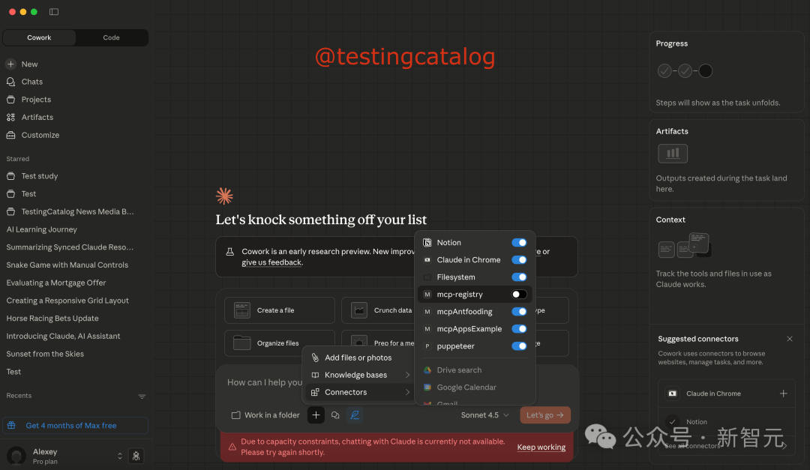

MCP注册表

而且为了完成任务，它还会自动调用合适的能力。

这一步如果真正落地，会非常危险，尤其是对工具软件来说。

因为这意味着Claude Cowork不仅能帮你想、帮你写，还能真正帮你操作系统和工具。

****

**语音模式&Pixelate，体验层也升级**

另外，这次除了「大脑升级」之外，Anthropic也没忘记体验层。

其中之一，就是Claude Web语音模式。

根据爆料，这个模式正在开发中。如果正式上线，就意味着我们就可以更丝滑地随时随地使用Claude了。

另一个更新，是Pixelate的升级。

这个功能允许用户将图像转换为像素艺术头像。现在，它可以生成更高质量的结果，并且已经扩展到了桌面应用程序。

总的来说，这两个虽然都看似「轻功能」，却共同显明了一件事：Claude正在往多模态+高频使用进化。

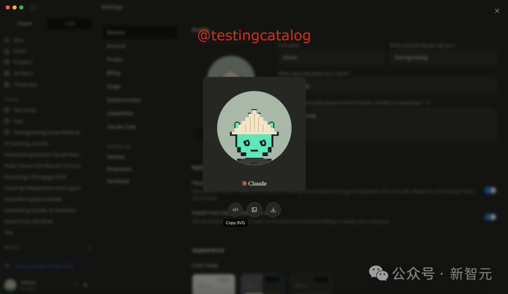

****

**有永久记忆的AI同事来了，你准备好了吗**

##   

从爆料中的这些变化，可以清晰看出Anthropic的方向——

不只是对话，抑或模型能力的堆叠，而是一个长期陪伴你工作的AI合作者，关键词是知识库、工作流、自动化。

如果说，以往的ChatGPT等大模型更像一个随叫随到的顾问，那Claude Cowork，就更像一个会记事、能执行的AI同事。

这波更新如果真的上线，AI助手的竞争，可能从此将会进入一个全新的阶段。

  

**持续学习之年**

本质上，Anthropic这次引入的知识库，在解决AI的持续学习或者说AI记忆问题。

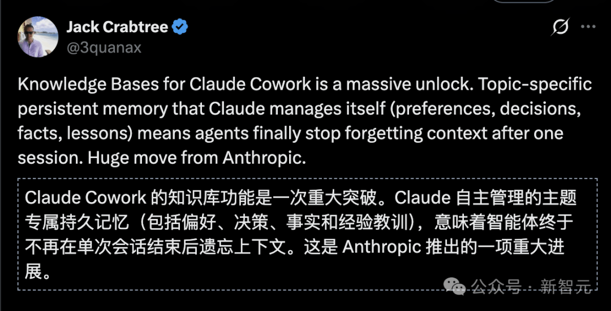

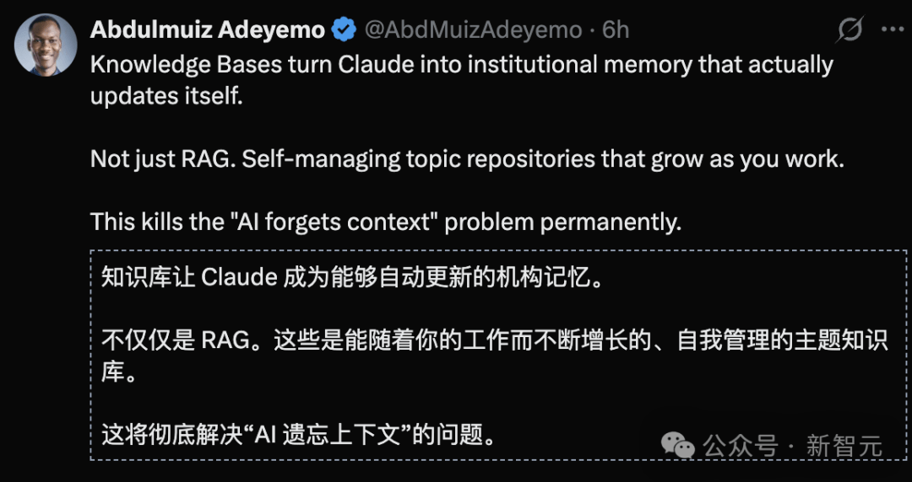

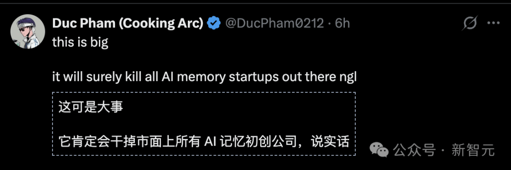

去年，Anthropic的CEO Dario Amodei认为，「持续学习最终将没有看起来那么困难。」

从OpenAI到谷歌，硅谷科技圈几乎达成了一个共识：2026年将是持续学习之年。

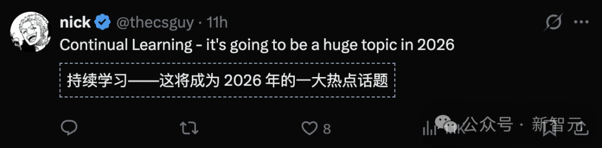

2024年9月5日，OpenAI首次开放了记忆功能给ChatGPT用户。

这次Claude Cowork的「知识库」看起来就像是ChatGPT记忆功能。

去年4月10日，OpenAI更新了ChatGPT 的记忆功能，更加全面：

除了此前已有的保存记忆功能外，它现在还会参考与您过往的所有对话，从而提供与您更相关、更个性化的回复。

此后不断更新ChatGPT记忆功能。

而奥特曼对持久记忆寄予厚望，甚至表示：「AI真正的突破不是更好的推理能力，而是完整的以及能力，一旦记忆可以持久，（智能）AI助理的概念彻底改变。」

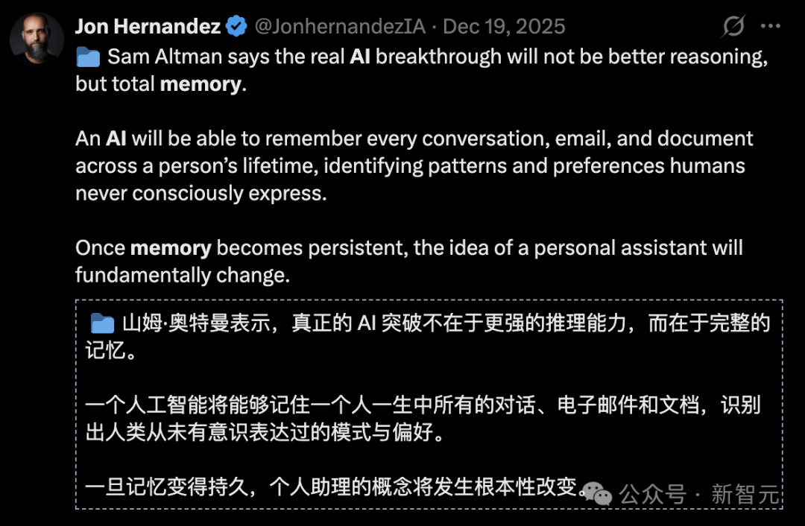

谷歌DeepMind的Demis Hassabis则判断，要实现真正的AGI，需要的突破并不多。而首个突破持续学习，预计将在2026年底实现。

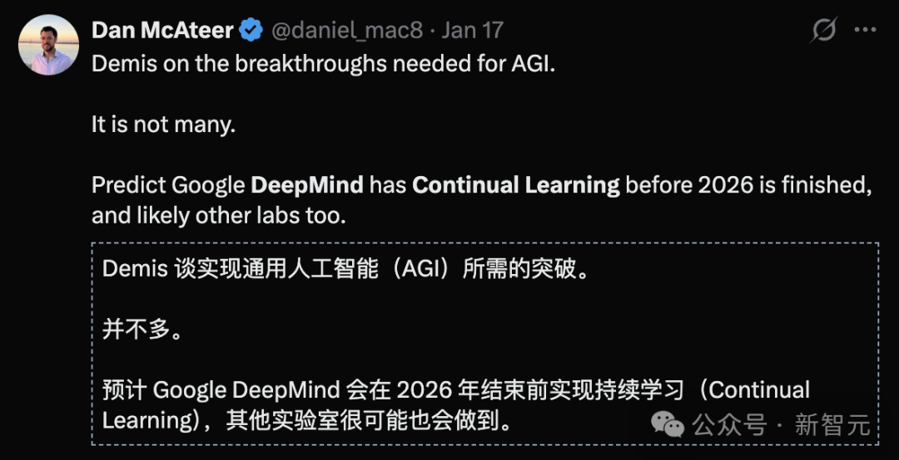

为了解决持续学习问题，谷歌DeepMind推出了多种新AI架构：递归语言模型、Titans和Atlas架构，以及嵌套学习Nested Learning。

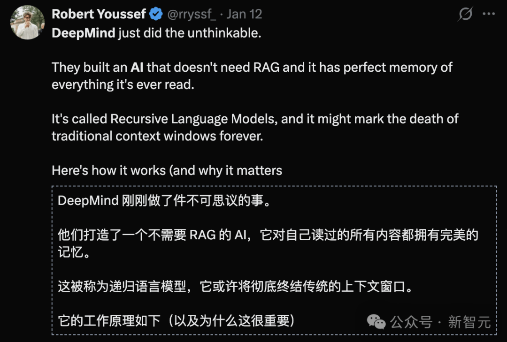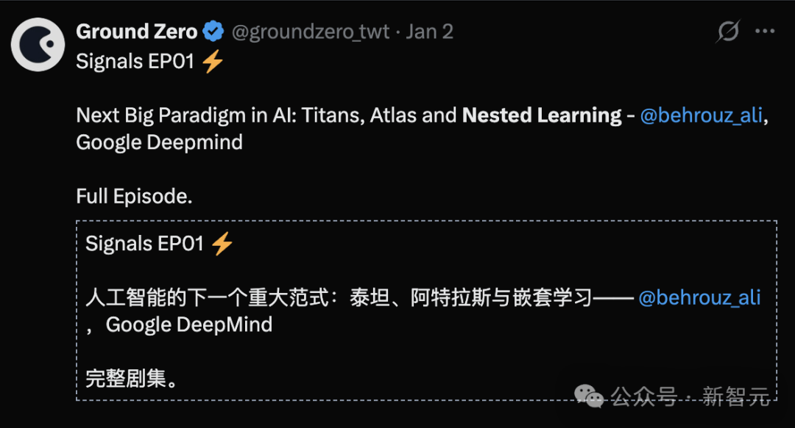

特别是嵌套学习，让外界认为谷歌在持续学习上已取得突破。

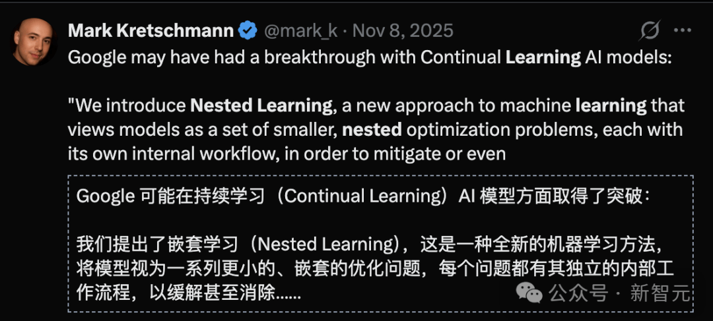

下一阶段的AGI赢家，关键可能不是看谁最会展示Demo，而是谁能最早把「可控的记忆与工具」做成标准件。

参考资料：

https://x.com/testingcatalog/status/2012891786226626919

https://www.testingcatalog.com/anthropic-works-on-knowledge-bases-for-claude-cowork/
