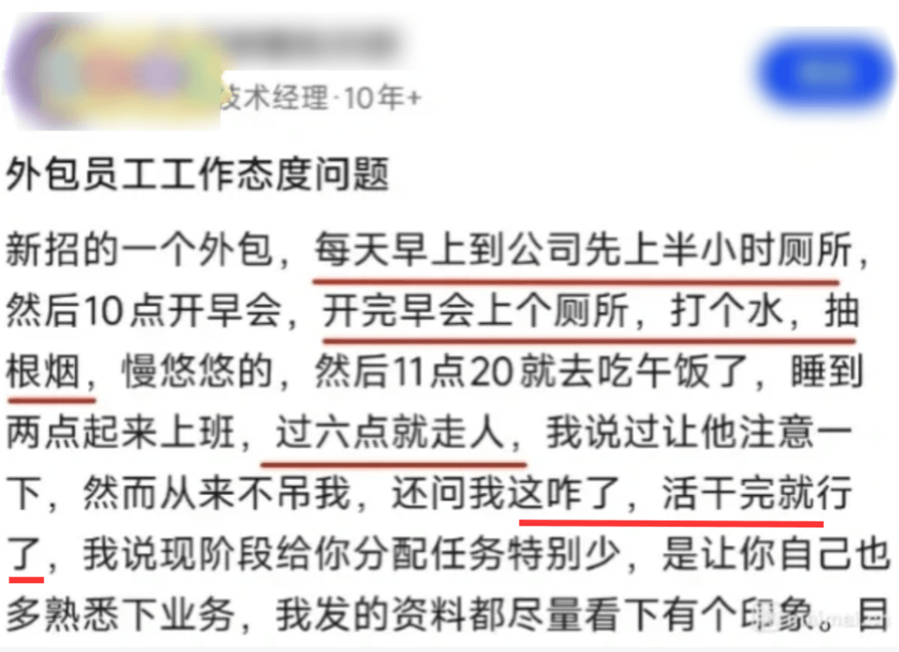

# 新招的外包，每天先带薪如厕 30 分钟，早会后各种摸鱼晃到 11:20 就去干饭。经理提醒多熟悉业务，他回怼“这咋了？活干完就行了”

职场里最戳心的从不是突如其来的裁员，而是你熬着996当牛做马，身边却有人把摸鱼玩到让领导直呼破防。最近刷到一位技术经理的吐槽帖，属实让人哭笑不得：新招的外包员工，每日上班先蹲半小时厕所，早会结束再溜一趟，顺带打水、抽烟，慢悠悠晃到11点20，直接冲去干饭；下午睡到两点才开工，傍晚六点一到，立马消失不见。经理苦口婆心劝他多熟悉业务，对方反倒硬气回怼：“活干完了就行，这有啥问题？”

这则吐槽转到小红书，一条高赞评论精准扎心，直接撕烂了职场的遮羞布：外包说开就开，大不了再找个好拿捏的应届生顶替，可天底下哪有这么好的事，能找到既薪资要求低、又经验老道，还任劳任怨的员工？

  

## 外包从不是刺头，是照见职场双标的镜子

别把这件事归为外包员工的态度问题，本质上是管理者的认知幻觉。领导总挂在嘴边的“任务少的时候要主动熟悉业务”，潜台词不过是“哪怕没事做，也得装出忙忙碌碌的样子”。但外包员工偏不吃这一套：拿的是项目结算的钱，不是签了卖身契，活干完了，凭啥要无偿奉献？

管理者想要的是一场“职场表演”，外包追求的是实打实的“等价交换”，这种鸡同鸭讲的矛盾，核心不过是企业既想省钱，又想摆老板的架子。这就像去理发店剪头，理发师剪完了还让你留下擦镜子，美其名曰“熟悉流程”，换谁恐怕都要当场翻脸。外包的清醒，恰恰戳破了部分管理者的拧巴：既想花最少的钱，又想让员工有“主人翁意识”，天下从来没有这样的美事。

## 要钱少、经验足、任劳任怨，是职场PUA的终极幻想

“很难指望一个人同时具备要钱少、经验足、任劳任怨这三点”，这句话堪称打工人的嘴替，道尽了职场的现实。这三个特质本就天生矛盾，根本无法兼得：经验老道的人，早摸透了职场规则，绝不会为画饼拼命；薪资要求低的新人，要么能力尚浅，要么终会觉醒；而看似任劳任怨的人，或许只是暂时没找到更好的出路。

当管理者把“任劳任怨”当作评价员工的核心标准，本质上就是在进行低成本的职场PUA。职场从不是慈善堂，打工也不是无私奉献，谈钱，才是对彼此最基本的尊重。给外包开的薪资，若是只到市场价甚至低于市场价，又凭什么要求人家主动加班、额外熟悉业务？与其揪着员工摸鱼吐槽，不如先反思：是不是公司的薪酬体系，本就只配招来“活完就溜”的人？

## 准点下班，是打工人最后的尊严

帖子里最让人共情的，莫过于外包员工“一过六点立刻消失”的硬气。多少打工人被所谓的“狼性文化”PUA，明明工作早已完成，却还要假装加班到深夜，只为博领导一句“你很努力”。而这位外包员工，直接打破了这层潜规则：按合同办事，到点下班，本就是天经地义。

那些嘲笑别人准点下班的人，无非两种：要么是职场既得利益者，要么是被PUA久了早已麻木。在领导眼里，“摸鱼”是态度问题；但在员工眼里，“准点下班”是底线问题。当公司只谈奉献不谈回报，员工用摸鱼进行反抗，实则是职场的一场“反向筛选”——最后留下的，都是能接受不合理要求的人，而清醒的打工人，早就转身离开了。
