# ICCV25 | 淘宝人脸吸引力预测算法FPEM

  

  

  

淘天音视频技术团队与上海交大合作论文《 FPEM: Face Prior Enhanced Facial Attractiveness Prediction for Live Videos with Face Retouching 》，被计算机视觉领域顶级会议ICCV 2025（CCF A类顶会，录用率24.2%）成功收录。  

  

论文含金量背景介绍

  

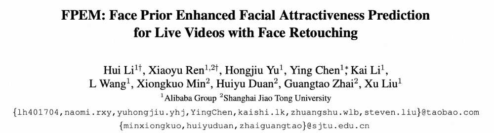

  

ICCV是由IEEE/CVF主办的计算机视觉领域的顶级学术会议，也是中国计算机协会CCF推荐的A类学术会议。该会议在世界范围每两年举办一次，其收录的论文涵盖了图像和视频领域的创新技术和重大成果，是相关领域学术研究与行业发展的风向标。ICCV 2025共收到创纪录的11,152篇有效投稿，经过严格的同行评审，最终录用了2,702篇，整体录用率约24.2%。此篇被收录论文属于人脸吸引力预测领域，由淘天音视频技术团队和上海交通大学合作完成。

  

在淘宝，每天有数十万的直播间存在美颜需求，人脸的吸引力已成为影响直播用户整体视觉体验的核心变量，通过实时监测确保美颜效果的稳定性，对保障主播和用户的双端体验至关重要。对于电商平台而言，这一点尤为重要，因为它能显著影响人均观看时长，甚至直接关系到商品交易总额（GMV）。因此，淘天音视频技术团队自研了一种针对直播美颜场景下的人脸吸引力预测模型——FPEM（Face Prior Enhanced Multi-modal Model），通过融合图像和文本两种模态，对人脸面部吸引力做量化预测。

  

论文下载链接：https://openaccess.thecvf.com/content/ICCV2025/papers/Li\_FPEM\_Face\_Prior\_Enhanced\_Facial\_Attractiveness\_Prediction\_for\_Live\_Videos\_ICCV\_2025\_paper.pdf

  

论文背景

  

#### **▐**  **定义AI审美新标杆！淘宝直播自研FPEM模型，开启直播美颜“量化时代”**

  

随着直播与短视频行业的蓬勃发展，美颜技术已成为内容生态的底层标配。在追求极致视觉体验的今天，如何客观量化人脸的感知质量，已成为驱动美颜技术进化与体验升级的关键突破口。在这一背景下，构建一套兼顾“清晰度”与“美学感受”的量化评价体系，不仅能助力平台实时监控服务质量，更能精准追踪直播间的内容吸引力，从而实现体验的跨越式提升。

  

#### **▐**  **从“感知”到“量化”：LiveBeauty数据集重磅发布**

  

美，能否被计算？淘天音视频技术团队给出了肯定答案。依托淘宝直播海量的真实应用场景，团队重磅发布了业界领先的大规模直播人脸吸引力数据集——LiveBeauty。该数据集涵盖了10,000张精选图像，不仅广泛覆盖了不同的美颜算法参数、光照条件与面部表情，更通过专业的主观标注，获取了高达20万个主观分数标签，构建起目前业界最具代表性、标注最精细的“直播审美坐标系”。

  

#### **▐**  **技术突破：业界首个多模态人脸吸引力预测模型FPEM**

  

在此基础上，团队推出了业界首个针对直播场景的人脸吸引力预测模型——FPEM（Face Prior Enhanced Multi-modal Model）。通过将视觉图像与文本语义深度融合，FPEM模型仿佛拥有了“人类审美直觉”，能够精准洞察复杂环境下的面部魅力值。在SCUT-FBP5500\[1\]、MEBeauty\[2\]等学术权威数据集上，FPEM凭借优秀的性能表现全面霸榜，各项指标（SROCC、PLCC、KROCC）均超越现有SOTA方案，标志着其在人脸美学吸引力评价领域已实现全方位领跑。

  

#### **▐**  **业务赋能：科技驱动视觉交互体验升级**

  

目前，FPEM模型已正式应用于淘宝直播业务。通过联动视频质量评价模型（MD-VQA\[3\]），FPEM实现了对大盘视觉体验的全天候监控。这种精准的“水位分层”能力，让平台能够快速识别优质内容，并有效驱动美颜算法的迭代优化，为主播与用户提供更加自然、高品质的交互体验。

  

具体方法

  

为更好地适配淘宝直播平台的数据场景，我们基于淘宝直播平台的视频，构建了大规模直播场景下的人脸吸引力预测数据集LiveBeauty，包含10,000张图像，涵盖不同美颜算法参数、光照条件、面部表情，并通过专业的主观标注，获取200,000个对应的主观分数的标注数据。与此同时，我们自研了一种针对直播美颜场景下的人脸吸引力预测模型——FPEM（Face Prior Enhanced Multi-modal Model），通过融合图像和文本两种模态，来预测人脸面部吸引力的高低。

  

#### **▐**  **LiveBeauty 数据集**

  

为了准确刻画直播视频中人脸吸引力的分布规律，我们从淘宝直播平台选取了较高页面浏览量（Page View）的直播间回放，对每个直播间采样三次，随后利用SOTA的人脸检测模型 \[4\] 提取人脸区域的边界框。数据清洗时，剔除了包含动漫角色、虚拟头像以及同一人物的重复样本，以确保数据集的质量与多样性。最终，我们从 9,500 多个直播间中采集了 10,000 张图像，确保涵盖 10,000 张互不相同的人脸。图 1 展示了 LiveBeauty 数据集中部分人脸图像的示例。

  

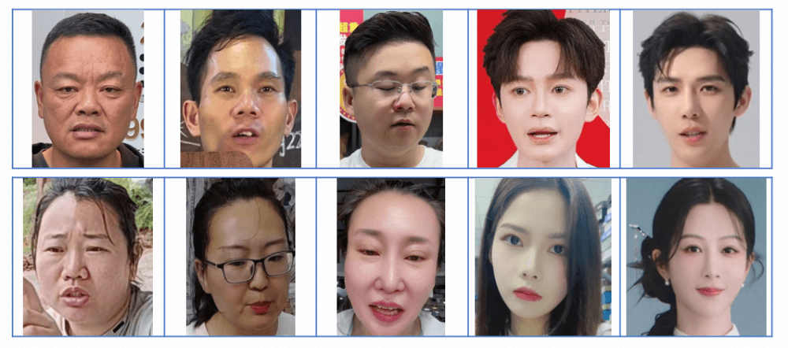

图1. LiveBeauty数据集示例

  

在此基础上，我们组织了20名专家组成的主观测评团队，对上述10,000张人脸图像进行主观打分，共生成200,000条主观分数的标注数据。然后，我们根据ITU-RBT.500-13\[5\]标准，将标注数据转换为Mean Opinion Score（MOS）分数，作为人脸吸引力的ground-truth（GT）数据。

  

我们也和学术界主流的人脸吸引力预测数据集进行了比较，如表1所示。从表中可以看出，先前的数据集闭源的较多，开源的数据集则规模偏小。我们构建的数据在数据规模上具有一定竞争力，且考虑了直播中美颜算法的影响，同时更适合于电商直播场景。

  

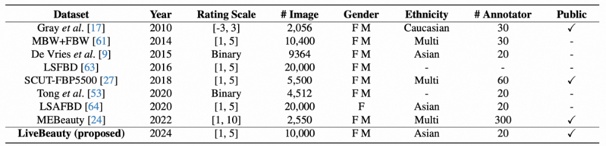

表1. 主流人脸吸引力预测数据集比较

  

#### **▐**  **模型设计**

  

图2展示了所提出的FPEM模型的框架，该模型使用了两阶段训练策略，包含了3个核心模块：PAPM模块、MAEM模块和SFM模块。具体地，FPEM使用了图像和文本两种模态，有选择地融合了人脸先验和美学语义信息来预测人脸面部吸引力的高低。在训练的第一阶段，PAPM模块和MAEM模块独立训练；训练的第二阶段，冻结二者参数，利用SFM模块动态地整合二者提取的人脸先验知识和多模态美学语义信息。

  

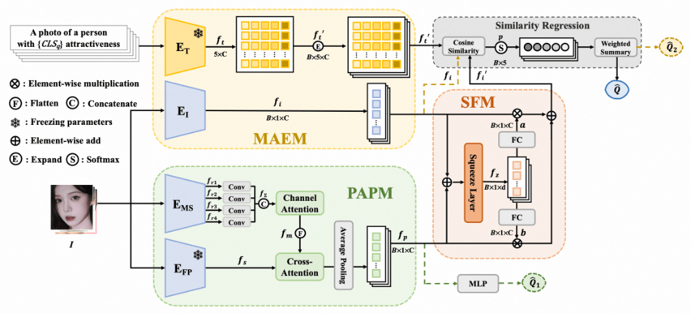

图2. FPEM模型框架

  

- PAPM 模块

  

Personalized Attractiveness Prior Module（PAPM）模块包含两个视觉特征提取模块和（FaceNet\[6\]）,分别提取多尺度的视觉特征和全局的人脸先验特征，随后通过一个交叉注意力模块融合后回归出一个预测分数。这个过程的主要目的是整合low-level的视觉语义信息和在百万级人脸图像上训练过的模型获取的人脸先验信息。

  

- **MAEM 模块**

  

Multi-modal Attractiveness Encoder Module (MAEM) 模块包含文本编码器和图像编码器，基于CLIP模型架构提取多模态的美学语义信息。在文本模态上，我们使用了5级的吸引力标签 :  

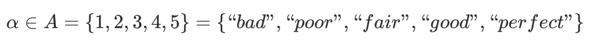

随后使用文本template：“a photo of a person with {a} attractiveness ” 可以构造5个候选的文本描述。在回归时我们使用Similarity Regression（SR）模块进行相似度回归，得到一个预测分数。

  

- #### **SFM 模块**

  

Selective Fusion Model (SFM) 模块通过一层Squeeze Layer压缩PAPM和MAEM提取的特征，并通过全连接层映射得到加权参数，在训练的第二阶段自适应地融合二者表征的人脸先验知识和多模态美学语义信息。在回归时同样使用Similarity Regression（SR）模块进行相似度回归，得到最终的预测分数。

  

#### **▐**  **损失函数**

  

在MAEM的训练中，我们引入了2种损失函数：L1损失函数和Rank Loss 。Rank Loss又分为两个部分Fidelity Loss 和 Two-direction Ranking Loss 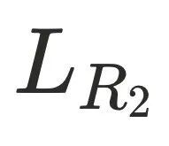。

对于保真度损失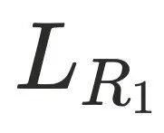，给定一组图像对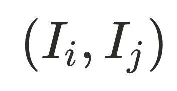，根据其吸引力MOS分真值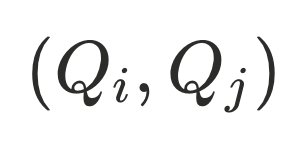定义的二元标签（Binary Label）如下所示：

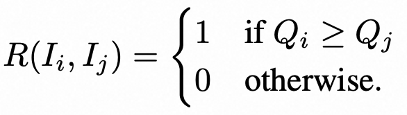

根据瑟斯顿模型（Thurstone’s model），图像被感知为比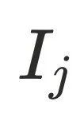更具吸引力的概率估计如下所示，其中Ψ(⋅) 表示标准正态分布的累积分布函数（CDF），且其方差设定为 1。

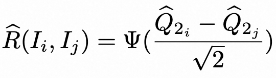

随后，保真度损失可由如下公式计算得出：

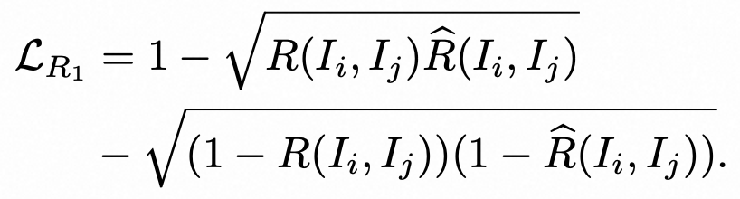

  

对于Two-direction Ranking Loss 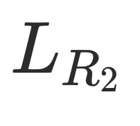 ，给定图像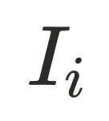，用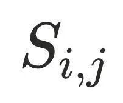表示其与第 j 个吸引力等级之间的余弦相似度分数，并用 o 表示概率最高的吸引力等级。由于人类对面部吸引力的感知是循序渐进的，且极少出现多个峰值（即多峰分布），我们通过确保吸引力等级的概率分布仅呈现单峰、并向左右两个方向递减，从而进一步获取排序信息。据此，Two-direction Ranking Loss 可由如下公式定义。

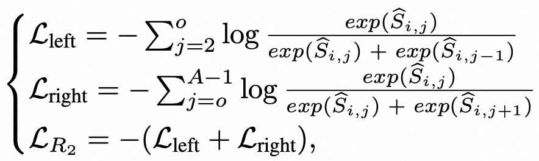

  

实验论证与结果

  

我们在两个公开的人脸吸引力预测数据集SCUT-FBP5500、MEBeauty，以及我们自建的LiveBeauty数据集上，与现有SOTA方法进行了对比。我们使用Spearman Rank Correlation Coefficient（SROCC）Pearson Linear Correlation Coefficient（PLCC）和 Kendall Rank Order Correlation Coefficient（KROCC）作为指标进行对比。更高的SROCC和KROCC表示样本间更好的保序性，更高的PLCC表示与标注分数更好的拟合程度。结果如表2所示。

  

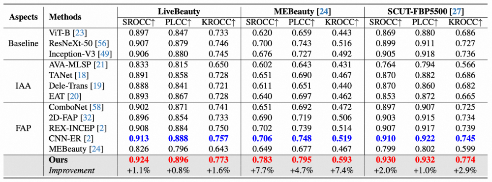

表2. FPEM与其它人脸吸引力预测SOTA模型在SCUT-FBP5500、MEBeauty和LiveBeauty

数据集上的性能比较

  

从表中可以看出，我们在3个数据集上的SROCC、PLCC和KROCC均超过了现有SOTA方法，达到了先进性能。

此外，为了探索不同模块对模型性能的贡献，我们还进行了消融试验，如表3和表4所示。

  

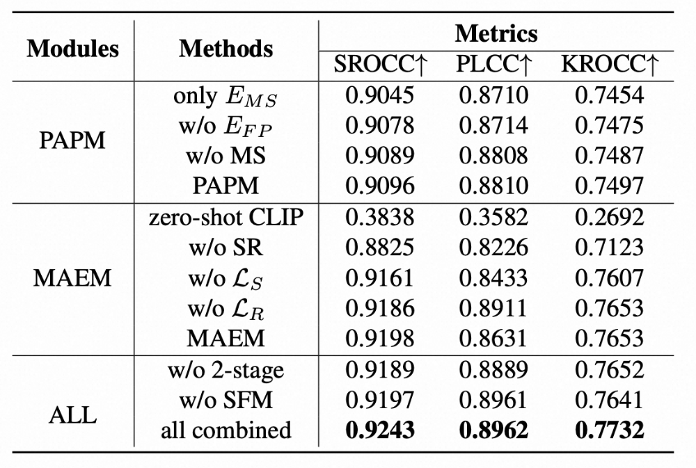

表3. LiveBeauty 测试集上各个模块和损失函数对于模型性能的贡献比较。其中MS 指多尺度融合操作；SR 代表相似度回归策略；代表 L1 Loss； 表示 Rank Loss。

  

从表3可以看出，在PAPM中引入人脸先验和多尺度特征均能有效提升模型性能；在MAEM中，零样本（zero-shot）CLIP 在人脸吸引力预测（FAP）任务中的泛化能力有限，且移除 SR 策略后性能出现显著下降，这表明专门设计的回归策略对于 CLIP 适配回归任务至关重要。同时，排序损失与回归损失的联合优化也进一步提升了 SROCC 指标；在所有模块的消融上，使用两阶段训练和SFM取得了最佳性能，证明了 SFM的有效性，即它能够自适应地将多模态美学特征与全局人脸先验知识进行深度融合。

  

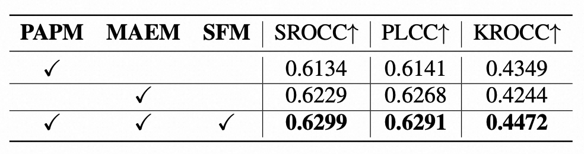

表4. PAPM、MAEM和SFM模块在模型泛化性上的贡献。所有实验均在LiveBeauty上训练，MEBeauty上测试

  

从表4可以看出，各个模块在模型泛化性上均有贡献。此外，指标整体偏低，这是由于数据分布和面部吸引力评分标准定义的不同，影响了模型在不同数据集间的迁移能力。

  

总结与展望

  

为了弥补领域内现有数据集的空白，我们构建了大规模人脸吸引力预测数据集LiveBeauty，这是首个包含直播场景美颜效果的人脸数据集。该数据集采集自真实场景，兼具高质量与真实性，是目前公开可用的规模最大的人脸吸引力预测数据集。此外，我们提出了一个多模态框架FPEM，能够自适应地融合全局人脸先验与美学语义特征以量化人脸吸引力。大量实验表明，FPEM 的表现优于目前最先进（SOTA）的方法。同时，LiveBeauty 数据集与 FPEM 框架亦可有效推广至其他视频应用场景中的人脸美感预测任务。

  

在直播生态中，美颜并非简单的“磨皮”，而是包含脸型、五官比例微调等复杂变换，这种“算法处理后的美”已成为互联网上一种新的视觉常态。LiveBeauty数据集和FPEM模型的提出为这一审美现象提供了新的研究视角和应用思路。然而，美感预测本质上具有高度的主观性。虽然模型在主观平均分预测上表现优异，但在不同文化背景、性别或族裔下的审美差异仍是该领域面临的深层挑战。

  

参考文献

  

1. Lingyu Liang, Luojun Lin, Lianwen Jin, Duorui Xie, and Mengru Li. Scut-fbp5500: A diverse benchmark dataset for multi-paradigm facial beauty prediction. In Proceedings of the IEEE International Conference on Pattern Recognition, pages 1598–1603, 2018.
2. Irina Lebedeva, Yi Guo, and Fangli Ying. Mebeauty: a multiethnic facial beauty dataset in-the-wild. Neural Computing and Applications, pages 1–15, 2022. 
3. Zhang Z, Wu W, Sun W, et al. MD-VQA: Multi-dimensional quality assessment for UGC live videos\[C\]In Proceedings of the IEEE International Conference on Pattern Recognition, pages  1746-1755, 2023.
4. Shifeng Zhang, Xiangyu Zhu, Zhen Lei, Hailin Shi, Xiaobo Wang, and Stan Z Li. Faceboxes: A cpu real-time face detector with high accuracy. In Proceedings of the IEEE International Joint Conference on Biometrics, pages 1–9, 2017. 
5. RECOMMENDATION ITU-R BT. Methodology for the subjective assessment of the quality of television pictures. International Telecommunication Union, 2002.
6. Florian Schroff, Dmitry Kalenichenko, and James Philbin. Facenet: A unified embedding for face recognition and clustering. In Proceedings of the IEEE/CVF Conference on Computer Vision and Pattern Recognition, pages 815–823, 2015.

  

团队介绍

  

该工作主要由淘天音视频技术团队完成，该团队依托淘宝直播、逛逛、手淘首页信息流等内容业务，致力于打造行业领先的音视频技术。团队成员来自海内外知名高校，先后在在MSU世界编码器大赛，NTIRE视频增强超分竞赛这样的领域强相关权威赛事上夺魁，并重视与学界的合作与交流。

  

这项工作的合作方为上海交通大学翟广涛教授创办的多媒体实验室，隶属于上海交通大学电子信息与电气工程学院电子系图像通信与网络工程研究所，是多媒体处理与传输及多媒体感知计算的主要研究力量之一。面向国家推动人工智能发展的战略，顺应内容生成智能化的发展趋势，近年来开展的重点研究领域包括AIGC内容质量评价、三维数字人生成和驱动等。

  

  

  

**¤** **拓****展阅读** **¤**

  

[3DXR技术](https://mp.weixin.qq.com/mp/appmsgalbum?__biz=MzAxNDEwNjk5OQ==&action=getalbum&album_id=2565944923443904512#wechat_redirect) | [终端技术](https://mp.weixin.qq.com/mp/appmsgalbum?__biz=MzAxNDEwNjk5OQ==&action=getalbum&album_id=1533906991218294785#wechat_redirect) | [音视频技术](https://mp.weixin.qq.com/mp/appmsgalbum?__biz=MzAxNDEwNjk5OQ==&action=getalbum&album_id=1592015847500414978#wechat_redirect)

[服务端技术](https://mp.weixin.qq.com/mp/appmsgalbum?__biz=MzAxNDEwNjk5OQ==&action=getalbum&album_id=1539610690070642689#wechat_redirect) | [技术质量](https://mp.weixin.qq.com/mp/appmsgalbum?__biz=MzAxNDEwNjk5OQ==&action=getalbum&album_id=2565883875634397185#wechat_redirect) | [数据算法](https://mp.weixin.qq.com/mp/appmsgalbum?__biz=MzAxNDEwNjk5OQ==&action=getalbum&album_id=1522425612282494977#wechat_redirect)
