# AI真人数字人语音对话性能优化实践总结


  

  

  

本文总结了为解决 AI 数字人导购对话中的回答延迟感而进行的性能优化实践。初始的对话链路因 ASR、LLM 和 TTS 的串行叠加，导致平均端到端延迟高达 5.64 秒。为实现数据驱动的优化，首先搭建了一套覆盖全链路的高精度性能监控体系作为基础。核心解决方案是集成 Qwen Omni 一体化模型，旨在通过流式传输音频和文本来减少中间环节，同时在客户端设计了音频窗口缓冲机制以确保嘴型同步。最终，通过采用 ASR 后的文本输入 Omni 的优化方案，系统的平均端到端延迟从 5644 毫秒成功降至 1323 毫秒，取得了 76.6% 的显著提升，并大幅改善了系统的稳定性。  

  


问题背景与现状

  

在VisionPro 淘宝旗舰店中，你可以与一个逼真的真人AI数字人进行对话，他可以为你解答店铺的问题、商品的问题等等，能带来更好的互动体验和全新的智能购物感受。但是，在之前与AI数字人导购聊天的过程中，交互提示词在2万字以上的情况下，会有明显的回答延迟感。

  

我们经过多组测试，得到平均的基线数据如下（人设提示词2万字+，每组10个会话）：

- 端到端延迟（ASR结束到语音首次播放）平均 5.64 s，并且稳定性不佳；
- ASR 平均 2.28 s、LLM 首 Token 平均 2.26 s、TTS 平均 2.03 s，各阶段叠加造成明显"思考时间"，用户体感明显"卡壳"；

对于用户而言，最关心的是问完问题之后，多久能够得到数字人的回复。因此，我们核心需要优化ASR结束到最终数字人回答的耗时。在本文中，我们完整的总结了将AI数字人语音对话端到端链路延迟从5.64秒优化到1.32秒的完整方案与实战经验。

  

最终对话效果如下：

  


解决方案调研

  

在优化之前，我们先回顾一下目前 AI 数字人对话链路，它通常采用 **ASR → LLM → TTS & A2BS** 的三段式串行结构：

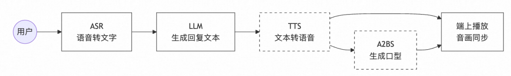

  

这种架构的痛点在于：每个环节都必须等待上一个环节完全结束（或至少积累一定 buffer）才能开始，导致延迟逐级叠加。针对这个"5 s 以上首句延迟"的痛点，我们在多个方向和不同阶段做过可行性评估：

- ASR（语音转文字）优化：若直接换成"一体模型(Audio2Audio)"可减去单独的ASR环节，但会丢字幕需求，因此保留 ASR/VAD。
- LLM（大模型回复）优化：尝试对比 Qwen-Max / Omni / Plus，多维度实验确认 Omni TTFT 具备明显优势。或者也可以使用小模型快速返回，再大模型完整回答。
- TTS（文本转语音）优化：实验 1s chunk、端上缓存等手段， 或使用 Omni 音频，无需单独 TTS。
- A2BS（语音转口型）优化：原本速度已经较快，但需要设置合适的整段调用；若能窗口化即可同步嘴型。
- 通信优化：把多个服务 ASR、TTS 和 LLM 等都统一到同一台服务器，降低服务直接调用成本。

  

不同方案对比：

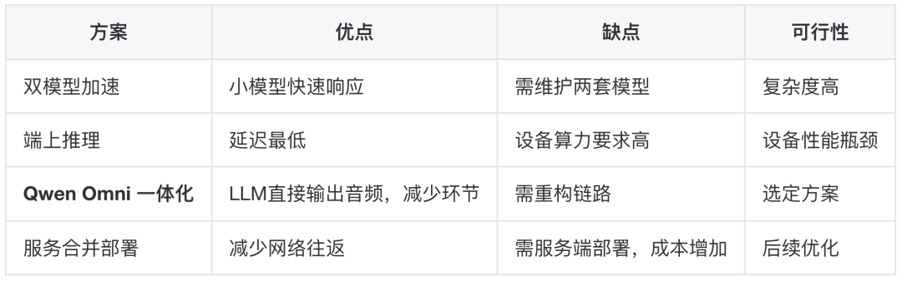

  

原始的导购对话流程，基线数据的链路是"ASR → LLM → TTS & A2BS"的三段式结构：ASR 识别结束后发起文本请求，获取请求之后，当达到一定的标点符号截断，才会调用 TTS和面部动画生成，回传结果之后，再播放音频和面部动画。采用Qwen Omni，可以Audio到Audio，减少中间环节。

  

而因为字幕原因，最终我们使用的是 Qwen Omni的Text→Audio/Text模式，让 LLM 直接流式返回音频和文字，端上再负责补建嘴型、同步播放功能。所以新的链路结构为"ASR->LLM->Text/Audio->A2BS"。

  


性能监控系统设计

  

在实施优化前，我们首先完善了性能监控体系，确保每一步改动都有数据支撑。这是本次优化的关键基础设施。

###   

## **▐**  **3.1 设计目标**

###   

- **全链路覆盖：从 VAD 启动到面部表情播放，覆盖所有关键节点**
- **线程安全：支持多线程并发打点，不影响主业务逻辑**
- **高精度时间戳：基于 std::chrono::high\_resolution\_clock 提供毫秒级精度**
- **多维度输出：支持实时日志、JSON 文件、CSV 导出、统计报表**
- **易于扩展：新增事件类型只需修改枚举和映射函数**

###   

## **▐**  **3.2 核心类设计**

###   

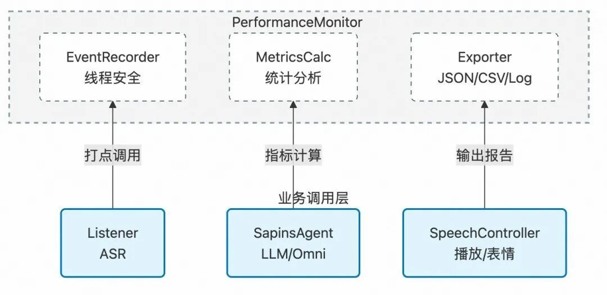

  

## **▐**  **3.3 事件类型设计**

####   

#### 基础链路事件

```code-snippet__js
enum class EventType {
    ASR_START,                 // VAD 检测到语音开始
    ASR_END,                   // ASR 识别完成
    LLM_REQUEST_START,         // LLM 请求发起
    LLM_FIRST_TOKEN,           // LLM 首个 token 返回
    LLM_COMPLETE,              // LLM 流式完成
    TTS_REQUEST_START,         // TTS 请求开始(每个 chunk)
    TTS_RESPONSE,              // TTS 响应返回
    AUDIO_PLAY_START,          // 音频开始播放
    ANIMATION_START,           // 表情动画开始
```
#### Omni 事件

```code-snippet__js
Omni_STREAM_START,        // Omni 流式开始
    Omni_FIRST_AUDIO_CHUNK,   // 首个音频 chunk 到达
    Omni_AUDIO_CHUNK,         // 音频 chunk(每个)
    Omni_STREAM_COMPLETE,     // 流式完成
    Omni_STREAM_ERROR,        // 流式错误


    // A2BS 窗口化相关
    Omni_AUDIO_WINDOW_SEALED, // 音频窗口封存
    Omni_A2BS_FACIAL_START,   // A2BS 请求开始
    Omni_A2BS_FACIAL_RESPONSE,// A2BS 响应返回
    Omni_A2BS_FACIAL_PLAY_START, // 首次嘴型播放
    Omni_AUDIO_WINDOW_PLAY,   // 窗口音频播放


    Omni_FACIAL_START,        // 面部数据生成开始
    Omni_FACIAL_COMPLETE,     // 面部数据生成完成
    Omni_FACIAL_ERROR         // 面部数据生成失败


    ...
};
```
###   

## **▐**  **3.4 关键指标定义**

####   

#### 基础指标

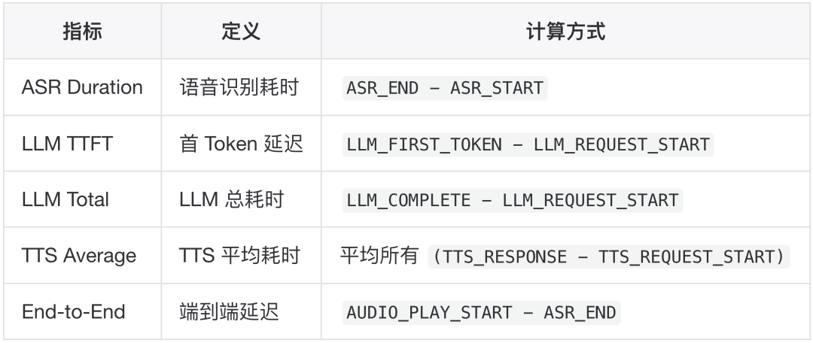

####   

#### Omni 指标

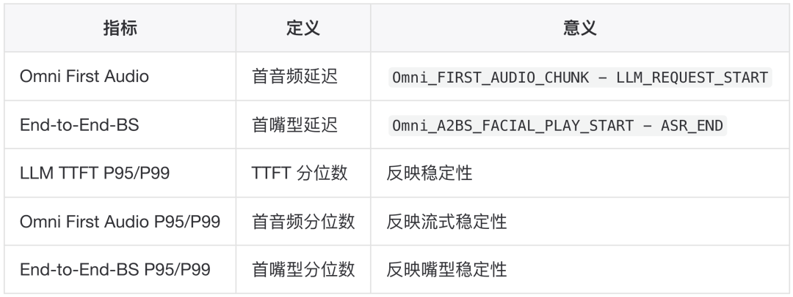

###   

## **▐**  **3.5 数据结构设计**

###   

```code-snippet__js
// 单次请求的性能数据
struct RequestPerformance {
    int64_t requestId;
    std::string inputType; // "voice" or "text"
    std::vector<std::pair<EventType, int64_t>> timeline;
    std::map<EventType, std::string> metadata;


    // 计算后的指标
    int64_t asr_duration_ms;
    int64_t llm_ttft_ms;
    int64_t llm_total_ms;
    int64_t end_to_end_ms;
    int64_t end_to_end_bs_ms;
    int64_t Omni_first_audio_ms;
    int64_t tts_avg_ms;
    int32_t tts_count;
};
// 全局统计数据
struct PerformanceStatistics {
    int32_t total_requests;


    // 均值/最大/最小
    double avg_asr_ms, max_asr_ms, min_asr_ms;
    double avg_llm_ttft_ms, max_llm_ttft_ms, min_llm_ttft_ms;
    double avg_end_to_end_ms, max_end_to_end_ms, min_end_to_end_ms;


    // P95/P99,反映稳定性
    double p95_end_to_end_ms, p99_end_to_end_ms;
    double p95_llm_ttft_ms, p99_llm_ttft_ms;
    double p95_Omni_first_audio_ms, p99_Omni_first_audio_ms;
    double p95_end_to_end_bs_ms, p99_end_to_end_bs_ms;


    // Omni 统计
    double avg_Omni_first_audio_ms;
    double min_Omni_first_audio_ms;
    double max_Omni_first_audio_ms;
    double avg_end_to_end_bs_ms;
    double min_end_to_end_bs_ms;
    double max_end_to_end_bs_ms;
};
```
###   

## **▐**  **3.6 实现要点**

####   

#### 线程安全

使用

- std::mutex m\_Mutex：保护共享资源
- std::lock\_guardstd::mutex lock(m\_Mutex);：RAII 方式自动上锁/解锁，防止死锁或遗漏释放

```code-snippet__js
class PerformanceMonitor {
private:
    std::mutex m_Mutex;
    std::map<int64_t, RequestPerformance> m_Requests;


public:
    void RecordEvent(int64_t requestId, EventType type, 
                     const std::string& metadata = "") {
        std::lock_guard<std::mutex> lock(m_Mutex);
        // ... 记录逻辑
    }
};
```
####   

#### 自动计算触发

在关键事件到达时自动触发指标计算：

- `AUDIO_PLAY_START: 计算 End-to-End`
- `Omni_A2BS_FACIAL_PLAY_START: 计算 End-to-End-BS`

#### 多格式输出

**实时日志**格式:

```code-snippet__js
========== Performance Report for Request 1 ==========
Input Type: Voice
Timeline:
[269806374 ms] ASR_START
[269809542 ms] ASR_END - {"text":"给我介绍一下伯希和"}
[269810133 ms] LLM_FIRST_TOKEN - 伯
[269810374 ms] Omni_FIRST_AUDIO_CHUNK
[269810385 ms] AUDIO_PLAY_START
Performance Metrics:
ASR Duration: 3168 ms
LLM TTFT: 590 ms
End-to-End: 843 ms
End-to-End-BS: 1856 ms
Omni First Audio: 241 ms
```
**JSON 文件** (`ExportAllToJSON`)格式:

```code-snippet__js
{
  "session": "20251113_150748",
  "total_requests": 31,
  "requests": [
    {
      "requestId": 1,
      "durations": {
        "asr_duration_ms": 3168,
        "llm_ttft_ms": 590,
        "end_to_end_ms": 843,
        "end_to_end_bs_ms": 1856,
        "Omni_first_audio_ms": 241
      },
      "timeline": [...]
    }
  ],
  "statistics": {
    "total_requests": 31,
    "asr": {"avg_ms": 2449.7, "max_ms": 3868, "min_ms": 1284},
    "llm": {
      "avg_ttft_ms": 968.5,
      "p95_ttft_ms": 1683.0,
      "p99_ttft_ms": 1920.0
    },
    "Omni_first_audio": {
      "avg_ms": 1250.0,
      "p95_ms": 1450.0,
      "p99_ms": 1500.0
    },
    "end_to_end_bs": {
      "avg_ms": 1856.6,
      "p95_ms": 2100.0,
      "p99_ms": 2300.0
    }
  }
}
```
**统计报表** ( `LogStatisticsReport` )格式:

```code-snippet__js
==================== Performance Statistics Report ====================
Total Requests: 31
ASR Performance: avg=2449.7ms, min=1284ms, max=3868ms
LLM TTFT: avg=968.5ms, min=640ms, max=1920ms, P95=1683ms, P99=1920ms
Omni First Audio: avg=1250.0ms, min=890ms, max=2314ms, P95=1450ms, P99=1500ms
End-to-End Latency: avg=1264.5ms, min=890ms, max=2314ms, P95=1683ms, P99=2314ms
End-to-End-BS Latency: avg=1856.6ms, min=1500ms, max=2300ms, P95=2100ms, P99=2300ms
TTS Performance: avg=N/A (Omni mode)
======================================================================
```
###   

## **▐**  **3.7 配置化管理**

  

创建 `PerformanceConfig.h` 统一控制编译开关：

```code-snippet__js
#ifndef PERFORMANCE_MONITORING_ENABLED
#define PERFORMANCE_MONITORING_ENABLED 1
#endif
```
需要打点的文件统一引入。

###   

## **▐**  **3.8 使用示例**

###   

```code-snippet__js
// 1. 记录简单事件
PerformanceMonitor::GetInstance()->RecordEvent(
    requestId, 
    EventType::ASR_START
);
// 2. 记录带元数据的事件
nlohmann::json metadata;
metadata["text"] = "用户问题";
PerformanceMonitor::GetInstance()->RecordEvent(
    requestId,
    EventType::ASR_END,
    metadata.dump()
);
// 3. 记录窗口化 A2BS
metadata["windowIndex"] = windowIdx;
metadata["audioDuration"] = duration;
PerformanceMonitor::GetInstance()->RecordEvent(
    requestId,
    EventType::Omni_A2BS_FACIAL_START,
    metadata.dump()
);
// 4. 触发报告(在 LLM_COMPLETE 时)
PerformanceMonitor::GetInstance()->LogSummary(requestId);
// 5. 导出全局统计
PerformanceMonitor::GetInstance()->LogStatisticsReport();
PerformanceMonitor::GetInstance()->ExportAllToJSON("/path/to/output");
```
##   


技术方案详细设计

  

基于完善的监控体系，我们开始实施 Omni 链路改造。

###   

## **▐**  **4.1 配置化入口与 Omni 开关**

  

JSON 中新增 `character_bs`（嘴型角色）以及 `Omni_audio.enabled` (后续可能配置更多与Omni相关内容) 相关设置：

```code-snippet__js
{
  "model_name": "qwen3-omni-flash",
  "voice": "Cherry",
  "character_bs": "yuhe",
  "Omni_audio": {
    "enabled": true
  }
}
```
###   

## **▐**  **4**.2 播放与同步流程

###   

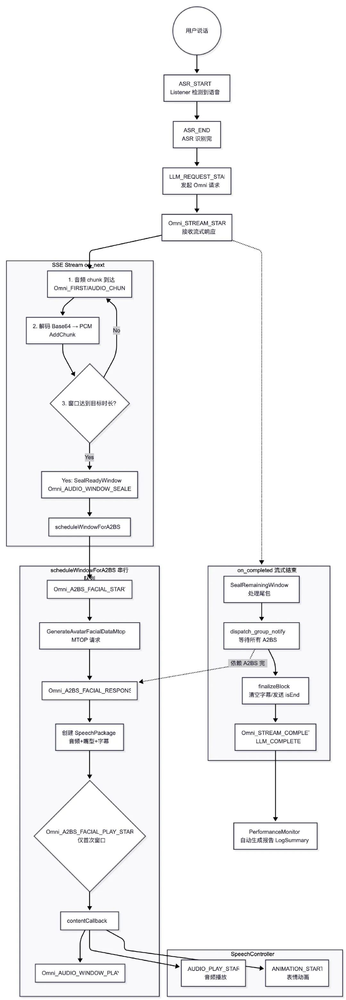

###   

## **▐**  **4.3 音频窗口缓冲 + 串行 A2BS**

  

对于Omni的语音返回，我们需要调用服务端A2BS接口，生成对应的表情。Omni返回的每个chunkSzie 在 20480字节，如果每次返回都进行请求，那么表情生成的会非常不自然，会有明显的不连续。在原始的链路中，是根据文本断句到标点符号进行请求，对应语音的返回，通常用户说话1～2秒即为完整的句子。

所以我们设计为按采样率**累积 1~2 秒音频窗口，达到目标窗口时长再触发A2BS**。此外，算法也会针对性进行平滑。

其关键结构如下：

```code-snippet__js
// `OmniA2BSHelper`
struct OmniA2BSConfig {
    float targetDurationSeconds = 1.0f;  // 目标窗口时长
    float minDurationSeconds = 0.01f;    // 最小窗口时长
    int32_t sampleRate = 24000;
};
struct AudioWindow {
    int32_t windowIndex = 0; // 每个窗口记录 `windowIndex`，便于打点与回放排序
    std::vector<std::string> base64Chunks;  // Base64 音频块
    std::vector<int16_t> pcmSamples;        // PCM 音频样本
    std::string mergedBase64;               // 合并后的 Base64
    int32_t sampleRate = 24000;
    bool base64Finalized = false;
    void Append(const std::string &base64Chunk, 
                const int16_t *samples,
                size_t sampleCount);
    float GetDurationSeconds() const;
    void FinalizeBase64();
    std::string ConsumeMergedBase64();
};
struct AudioWindowQueue {
    explicit AudioWindowQueue(const OmniA2BSConfig &cfg);
    std::shared_ptr<AudioWindow> SealReadyWindow();
    std::shared_ptr<AudioWindow> SealRemainingWindow();
    float CurrentDurationSeconds() const;
    bool HasCurrentWindow() const;
private:
    void EnsureWindowLocked();
    OmniA2BSConfig config;
    mutable std::mutex mutex;
    std::shared_ptr<AudioWindow> currentWindow;
    int32_t nextWindowIndex = 0;
};
```
##   


优化效果数据对比

  

基于伯希和导购业务对话场景，对于一组数据会询问以后问题，每次三组数据：

1. 手套多少钱？
2. 介绍一下伯希和品牌
3. 怎么购买？
4. 这个帽子有哪些颜色，材质是什么？
5. 美丽奴羊毛是什么意思？
6. 这个伯希和头灯的流明是多少？
7. 这个围巾有哪些颜色？
8. 还有哪些东西可以购买？
9. 手套是什么材质？
10. 现在有什么优惠？

###   

▐  **6.1 详细数据对比**

  

采用不同的接口或者策略迭代演进多次，得到以下数据对比：

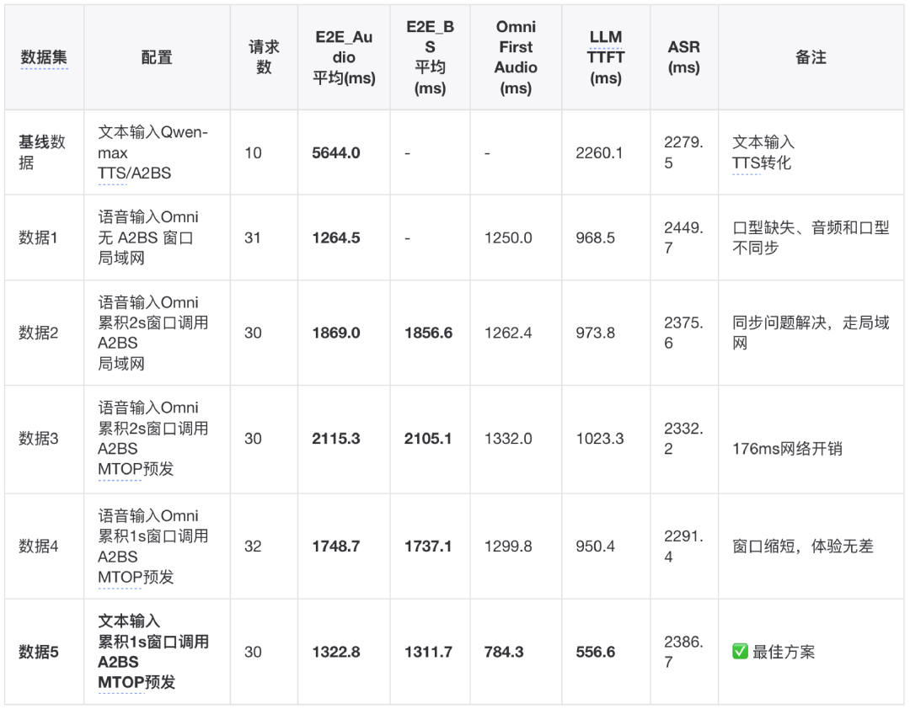

  

其中，第5组数据的考虑是基于，因为用户说话需要字幕，ASR是必须的，所以想到Omni也可以从输入音频，到切换为**输入文本**，同样保留输出为音频和文本。测试Omni输入文本，相较于输入音频处理速度更快。

  

总体来看，**之前性能的瓶颈，一个是大模型返回的速度更慢，另外一个是每次TTS占用的时间更长，虽然A2BS累积也会导致一定的延迟，但不是主要的延迟来源。**

  

对于整体解决方案，完整的性能监控打点机制是优化的基础，具体实施时，一方面，我们用更合适的模型，端测针对新模型增加输入输出链路，另一方面，端测针对A2BS进行窗口累积和语音表情同步的处理，保障链路的正确性。

###   

▐  **6.2 关键指标改善**

  

关键指标数据：

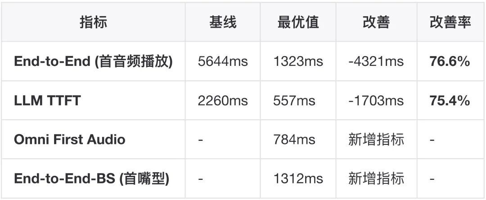

  

P95/P99 稳定性分析：

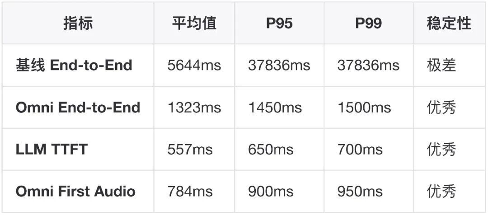

**结论**：不仅平均延迟大幅降低，P95/P99 也控制在合理范围，用户体验稳定性显著提升。

###   

▐  **6.5 各阶段耗时分布对比**

**基线链路**：

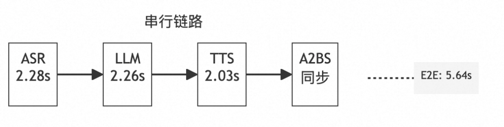

**Omni 链路**：

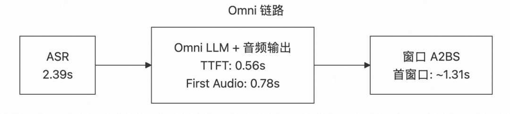

##   


展望

  

在之后的优化中，也设想了一些方向：

1. **自动化测试体系：**
- 录制标准问句集（10-20 个典型问题）
- CI/CD 集成性能回归测试
3. **自部署链路：**
- 研究 Omni 模型自部署可行性
- 对比延迟、成本、维护复杂度
5. **端上推理：**
- 小模型快速响应首句（<500ms TTFT）
- TTS / A2BS 端上推理可行性
7. **双模型加速：**
- 小模型快速生成首句
- 大模型补充完整回答
- 用户感知"秒回"体验
9. **预录制：**
- 提前准备高频回答的音频/嘴型
- 缓存常见问答的 facialSamples

##   


总结

  

通过本次优化，我们不仅将端到端延迟从 5.64s 降至 1.32s（76.6% 提升），更重要的是建立了一套完整的性能监控与优化体系。不仅适用于当前的 Omni 链路，也为后续的自部署、端上推理、双模型加速等探索奠定了基础。性能监控体系的建立，让我们能够快速定位问题、量化优化效果，真正做到"用数据说话"。

##   


后记

  

值得一提的是，使用 Qwen Omni 模型也有局限，只支持官方音色输出，而不像我们通过TTS可以自由生成任意音色。对于通用场景，我们需要使用特定人的声音，那么就需要有音色复刻的能力，同时有流式输出的能力。25年11月中旬，百炼发布的的Qwen-TTS-Realtime模型，可以实时复刻声音并且流式输出，可以同时满足上诉两个需求。在后续自定义音色的场景下，我们可以采用任意LLM模型加TTS-Realtime的模式，模拟Omni的流程，LLM流式输出的内容通过WebSocket与TTS-Realtime交互，流式的生成自定义音色的TTS。时间上会增加些许的网络通信延迟。所以在不同的场景业务下，我们可以采用不同的解决方案。

  


团队介绍

  

**本文作者**揽清**，来自淘天集团-**Meta技术团队**。本团队目前负责面向消费场景的3D/XR基础技术建设和创新应用探**索，创造以手机及XR 新设备为载体的消费购物新体验。团队在端智能、端云协同、商品三维重建、真人三维重建、3D引擎、XR引擎等方面有着深厚的技术积累，先后发布深度学习引擎MNN、商品三维重建工具Object Drawer、3D真人数字人TaoAvatar、端云协同系统Walle等。团队在OSDI、MLSys、CVPR、ICCV、NeurIPS、TPAMI等顶级学术会议和期刊上发表多篇论文。欢迎视觉算法、3D/XR引擎、深度学习引擎研发、终端研发等领域的优秀人才加入，共同走进3D数字新时代。

  

  

  

**¤** **拓展阅读** **¤**

  

[3DXR技术](https://mp.weixin.qq.com/mp/appmsgalbum?__biz=MzAxNDEwNjk5OQ==&action=getalbum&album_id=2565944923443904512#wechat_redirect) | [终端技术](https://mp.weixin.qq.com/mp/appmsgalbum?__biz=MzAxNDEwNjk5OQ==&action=getalbum&album_id=1533906991218294785#wechat_redirect) | [音视频技术](https://mp.weixin.qq.com/mp/appmsgalbum?__biz=MzAxNDEwNjk5OQ==&action=getalbum&album_id=1592015847500414978#wechat_redirect)

[服务端技术](https://mp.weixin.qq.com/mp/appmsgalbum?__biz=MzAxNDEwNjk5OQ==&action=getalbum&album_id=1539610690070642689#wechat_redirect) | [技术质量](https://mp.weixin.qq.com/mp/appmsgalbum?__biz=MzAxNDEwNjk5OQ==&action=getalbum&album_id=2565883875634397185#wechat_redirect) | [数据算法](https://mp.weixin.qq.com/mp/appmsgalbum?__biz=MzAxNDEwNjk5OQ==&action=getalbum&album_id=1522425612282494977#wechat_redirect)
