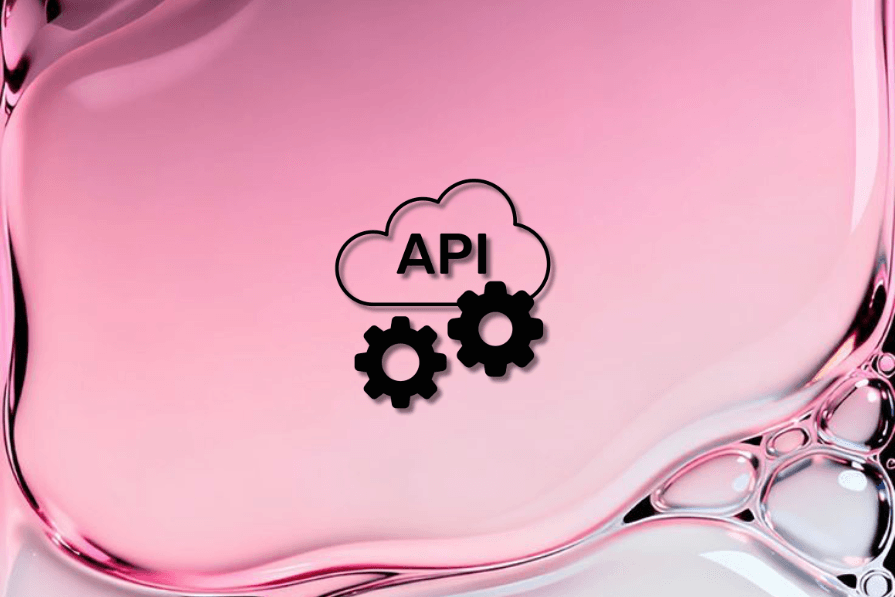

# 【第3639期】反框架主义：选择原生 Web API，而非前端框架

前言

现代浏览器已能处理多数前端框架最初要解决的问题，开发者该重新思考：我们真的还需要 React 吗？今日前端早读课文章由 @Anna Monus 分享，@飘飘编译。

译文从这开始～～

如今的浏览器能够处理前端框架最初为解决的大多数问题。Web Components（网页组件）提供了封装能力，ES modules（模块化）负责依赖管理，现代 CSS 的特性（如 Grid 网格布局和容器查询）让复杂布局变得容易，而 Fetch API 则负责网络请求。



尽管如此，开发者在面对问题时，仍常常默认选择 React、Angular、Vue 等 JavaScript 框架来处理 —— 哪怕这些问题浏览器本身已经能原生解决。这样的默认选择，往往牺牲了实际的用户体验成本 —— 页面体积更大、性能更慢、SEO 效果更差 —— 只换来了开发上的方便。

[【第3440期】探索 React 19：性能、开发体验与创新特性的全面提升](https://mp.weixin.qq.com/s?__biz=MjM5MTA1MjAxMQ==&mid=2651274939&idx=1&sn=5237262ecd21d75b8dcaa6e56ee72c2a&scene=21#wechat_redirect)

本文将探讨：什么时候框架真的有必要？什么时候原生 Web API 已经足够？在今天，我们究竟在多大程度上需要框架。

#### 框架主义与反框架主义

“框架主义” 和 “反框架主义” 并非正式术语或已确立的运动。它们是对开发者在着手新项目时两种相互竞争的默认倾向的简略说法。其核心在于你选择从何处起步。

框架主义倡导 “框架优先” 思维。开发者一开始就选定一个框架（通常是 React），并把它作为项目基准。这种做法假设用户设备性能强、网络稳定，项目从一开始就比较 “重”，等到性能问题出现时再做优化。

反框架主义则采取了截然相反的方法。它从 “零依赖” 开始，只在必要时才引入框架。框架被视为解决特定问题的工具，而非默认选择。开发者优先利用浏览器原生能力，只有在遇到真正的限制时才引入框架。这种思路假设用户可能使用较慢设备、网络条件不佳，因此从一开始就更加谨慎与高效。

[【早阅】LLM 时代的前端革命：React 不再是框架，而是平台](https://mp.weixin.qq.com/s?__biz=MjM5MTA1MjAxMQ==&mid=2651278142&idx=1&sn=c310375429ed17ec469ff84e61e56d6f&scene=21#wechat_redirect)

#### 技术层面对比

如今的跨浏览器兼容问题在很大程度上已不再是问题。Internet Explorer 已退出舞台，就连 Safari 也支持了大多数现代 Web API，仅有少量例外。那些当初促使我们使用 React 等框架的 “平台差距”，如今大多已经被填补。

近几年，Web 平台有了显著进步。对于绝大多数常见需求来说，原生 JavaScript（也叫 Vanilla JS）已经绰绰有余。

以下是平台本身提供的一些关键能力：

##### Web Components（网页组件）

Web Components 建立在三项核心技术之上：

- Custom Elements（自定义元素）：定义新的 HTML 标签
- Shadow DOM（影子 DOM）：实现封装与样式隔离
- Template 元素：实现可复用的模板结构

这些 API 一起构建出一种无需框架支持的组件化体系。下面是一个简单的 Web Component 示例（也可以参考更高级的例子）：

```
 class TodoItem extends HTMLElement {
   constructor() {
     super();
     this.attachShadow({ mode: 'open' });
   }

   connectedCallback() {
     this.shadowRoot.innerHTML = `
       <style>
         :host { display: block; padding: 10px; }
         .completed { text-decoration: line-through; }
       </style>
       <div class="${this.hasAttribute('completed') ? 'completed' : ''}">
         <slot></slot>
       </div>
     `;
   }
 }

 customElements.define('todo-item', TodoItem);
```
上面的组件包含封装的样式和生命周期方法（`constructor()` 创建 shadow root，而 `connectedCallback()` 在元素加入 DOM 时触发）。

你可以像使用普通 HTML 标签一样，把它加到页面里：

```
 <!-- 基本用法 -->
 <todo-item>学习 Web Components</todo-item>

 <!-- 含“完成”状态 -->
 <todo-item completed>选择 UX 而非 DX</todo-item>
```
这种方式无需编译步骤（比如将 JSX 转换为 JavaScript）、没有虚拟 DOM，也不需要构建工具 —— 当然如果你愿意，依然可以配合使用。代码直接在浏览器中运行，无需框架初始化，因此启动几乎是即时的。

不过，Web Components 并不自带响应式机制。与 React 等框架不同，后者只需声明 UI，框架就会自动更新界面；而 Web Components 是命令式的 —— 你需要自己管理 DOM 更新、监听属性或状态变化。除非你使用像 Lit 这样的辅助库，否则这些都得手动实现。

##### 理想的使用场景：叶子组件（Leaf Components）

独立的叶子组件 —— 例如表情选择器、日期选择器、颜色选择器等 —— 非常适合用 Web Components 来实现。它们位于组件树的最外层，不包含嵌套子组件，因此能够避免与服务器端渲染（SSR）或多层 Shadow DOM 之间通信相关的复杂问题。

#### 静态内容 + 轻量交互

当处理以静态内容为主且只需少量交互时，原生方法表现出色。大多数网站本质上仍是 HTML 文档，只是偶尔需要动态行为，这些行为可以通过 原生 JavaScript 渐进增强（progressive enhancement） 实现。

例如，以下代码展示了如何使用 Fetch API 为一个基础的联系表单添加异步提交功能：

```
 document.querySelector('form').addEventListener('submit', async (e) => {
   e.preventDefault();
   const formData = new FormData(e.target);

   const response = await fetch('/api/submit', {
     method: 'POST',
     body: formData
   });

   if (response.ok) {
     e.target.innerHTML = '<p>谢谢，你的信息已成功发送！</p>';
   }
 });
```
##### 其他 Web 平台特性

除了 Web Components 和基础交互外，现代 Web 平台如今几乎已覆盖当初框架承担的大部分职责。

- 原生 ES 模块和动态导入（dynamic imports）可实现依赖管理与代码分割；
- Import Maps 让加载第三方库更加简单；
- Fetch API 负责网络请求；
- 在样式层面，现代 CSS 动画、容器查询（container queries）以及自定义属性（custom properties），让我们能在无需依赖复杂 JavaScript 框架的情况下实现灵活的响应式布局。

##### 维护性

从长期来看，原生方案在可维护性方面更有优势。十年前写的 Vanilla JavaScript 代码，今天仍然可以直接运行；而基于框架的应用，通常每次框架大版本更新都需要大量重构。原生 Web API 不依赖外部工具链或包管理生态，且在向后兼容性上更稳定。这意味着 —— 你投入学习的原生知识可以在未来多年持续生效，而不仅仅限于某个框架的几个版本周期。

#### 服务器端渲染（Server-side Rendering）

过去，服务器端渲染几乎完全依赖框架。但如今 Web 平台在这方面也取得了重大进展。Declarative Shadow DOM（声明式 Shadow DOM） 已在主流浏览器中得到支持，它允许我们直接在 HTML 中通过 `shadowrootmode` 属性定义 shadow root，而无需使用 JavaScript。

下面的示例展示了这种方式的好处：组件可以立即渲染，而不必等待 JavaScript 执行，从而加快首屏渲染速度。CSS 还可以直接响应属性变化，比如 `completed` 状态可通过 `:host([completed])` 选择器自动添加删除线。

```
 <todo-item completed>
   <template shadowrootmode="open">
     <style>
       :host { display: block; padding: 10px; }
       :host([completed]) div { text-decoration: line-through; }
     </style>
     <div><slot></slot></div>
   </template>
   Pick UX over DX
 </todo-item>

 <script>
 class TodoItem extends HTMLElement {
   constructor() {
     super(); // 不再需要 attachShadow()
   }
 }
 customElements.define('todo-item', TodoItem);
 </script>
```
#### AI 与 “框架默认化” 现象

如今的 AI 编码工具强化了 “框架优先” 的默认趋势。它们往往自动生成基于 React 或其他流行框架的代码，并常常搭配 Tailwind 等工具。这并不是因为这些技术总是最优解，而是因为 它们在训练数据中占了绝对主导地位。

Paul Kinlan 将这种由 AI 驱动的趋势称为 “死框架理论（Dead Framework Theory）”。他认为 React 已经赢得了前端之战，其他替代品几乎 “生不逢时”。虽然这个结论可能过于悲观，但核心观点 ——AI 默认倾向于框架化输出 —— 确实成立。

一项实验：它揭示了关于氛围编码、输出质量和框架权重的哪些内容？

为了验证这一点，作者做了一个小实验 —— 让 Claude AI 生成一个记忆卡片游戏。不同模型表现可能不同，此实验仅代表单一结果。


| 版本 | 使用框架 | 提示内容 | 框架依赖 | 字体 | 图标 | 核心体积（min+gzip） |
| --- | --- | --- | --- | --- | --- | --- |
| V1 | React + Tailwind | 创建一个记忆游戏 | React, ReactDOM, Tailwind, lucide-react | Google Fonts (Space Mono) | lucide-react + emoji | 65.62 KB |
| V2 | React | 创建一个简单的记忆游戏 | React, ReactDOM, lucide-react | Google Fonts (Fredoka) | lucide-react (8 图标) | 63.63 KB |
| V3 | 无框架 | 创建一个简单的 HTML 记忆游戏 | 无 | 系统字体 (Arial) | UTF-8 emoji | 2.16 KB |


在所有版本中，游戏功能完全相同（卡片匹配、翻转动画、计数器、胜利检测、重置功能）。React 版本在外观上略显精致（因使用了 Lucide 图标），但其实这些图标也可通过内联 SVG 在无框架环境中实现。

结果非常明显：V1 和 V2 的体积约为原生版本的 30 倍，其中 95% 的代码是框架开销。React 和 Tailwind 并没有让应用 “更好”，只是让它更 “重”。

[【早阅】Dropbox 工程师职业发展框架：什么是影响力？](https://mp.weixin.qq.com/s?__biz=MjM5MTA1MjAxMQ==&mid=2651275378&idx=1&sn=9f037465c461533993fecaf37ccaf2ee&scene=21#wechat_redirect)

这正是 “死框架理论” 的一个实例。如果提示不够具体，AI 就会默认生成 React 版本。要改变这种结果，开发者必须在提示中明确指定技术栈。但在现实中，大多数人不会这么做 —— 因此，这无形中让 “框架主义” 在 AI 时代继续占据优势。

#### DX 与 UX 的取舍（开发体验 vs 用户体验）

框架确实会带来明显的性能开销。以前面提到的记忆卡片游戏为例，React 版本的体积大约是原生 JavaScript 实现的 30 倍。

在大型生产环境的应用中，这种开销会进一步扩大。当你添加路由、状态管理、UI 库以及各种工具函数后，单是框架相关的代码就可能达到 150–300 KB。

当然，随着应用复杂度的上升，原生实现（vanilla）的项目体积也会增加，因此比例比较并非完全线性。  
但可以确定的是：框架始终会引入一层固定的额外负担，无论项目规模如何，它都会存在。

从用户体验（UX）的角度来看，更轻的页面体积和更快的加载速度，无疑是 “反框架主义” 方法的胜利。但这也带来了开发体验（DX）上的取舍 —— 手写 Web Components 往往更繁琐：传递属性、处理事件、手动更新状态都比使用框架麻烦得多，跨多个组件进行状态管理也缺乏成熟的标准模式。

#### 一些能在 DX 与 UX 之间 “折中” 的轻量替代方案

以下这些更轻量的库，可以在 “原生代码的繁琐（DX 成本）” 与 “框架臃肿（UX 成本）” 之间找到平衡点：

- HTMX（约 14KB）在无需 JavaScript 重型前端的情况下增强 HTML 功能
- Alpine.js（约 15KB）直接在 HTML 中提供响应式功能
- Preact（约 3KB）提供了一个与 React 兼容的 API，体积小巧，是作为 React 替代品直接嵌入的绝佳选择。
- Lit（约 5KB）是 Polymer 的继任者；它为 Web 组件提供了响应式模板和作用域样式。
- Solid（约 7KB）提供了类似 React 的语法，却没有虚拟 DOM 的开销

这些库能显著改善原生开发体验，同时保持合理的打包体积。但要记住 —— 用户并不关心你的 DX（开发体验）。他们只关心网站能否在他们的设备和网络条件下快速加载，并且正常运行。

[【早阅】门口效应与开发者体验](https://mp.weixin.qq.com/s?__biz=MjM5MTA1MjAxMQ==&mid=2651272470&idx=2&sn=723214702e47e4cb57865600c67e56e0&scene=21#wechat_redirect)

对于中小型项目而言，React 等重量级框架带来的 DX 优势，通常并不足以抵消它们在 UX 上的成本。当然，在企业级、大型团队协作的高交互式应用（如复杂数据仪表盘）中，框架仍然有其合理性。但这些场景，仅占使用框架的网站和应用的一小部分。

### 接下来呢？优先考虑用户，立足现实

现代 Web 平台已经能够支撑大型应用。

- Netflix 曾将其登录页从 React 改写为原生 JavaScript，结果页面加载时间和 “可交互时间（Time to Interactive）” 均减少了 50% 以上，JavaScript 打包体积也缩小了约 200 KB。
- GitHub 则通过开源库 Catalyst 广泛使用自定义 Web Components 来减少样板代码。
- Adobe 甚至将 Photoshop 移植到 Web 上，采用了基于 Lit 的 Web Components。

这些并不是特例，而是说明 \* Web 平台已经具备生产级能力。

不过，现实的就业市场要复杂得多。所谓 “简历驱动开发（Resume-Driven Development）” 是真实存在的现象。React 依然在招聘市场上占据主导地位。想保持就业竞争力，你几乎肯定需要掌握 React。但要注意：招聘市场反映的是企业当前使用的技术，而不是新项目的最佳技术选择。

如果你想成为优秀的开发者，而不仅仅是 “可就业”，你需要理解 原生 Web API，并且知道 何时该用框架、何时不该用。

#### 结语

反框架主义（Anti-Frameworkism） 并不是拒绝工具，而是倡导从 “问题” 出发，而非跟随 “潮流”；在追求方便之前，先权衡真实影响；最终，选择最能服务用户的技术。

关于本文  
译者：@飘飘  
作者：@Anna Monus  
原文：https://blog.logrocket.com/anti-frameworkism-native-web-apis/

这期前端早读课  
对你有帮助，帮” 赞 “一下，  
期待下一期，帮” 在看” 一下。
