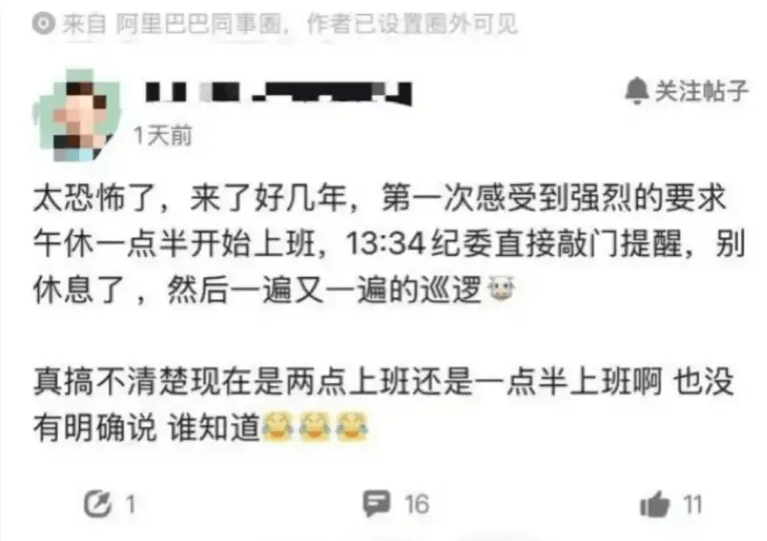

# 午休只有一小时的公司？我真不想干了！

最近看到一位兄弟说，阿里内部在严格抓午休

“太恐怖了，下午13:34就有纪委直接敲门提醒他别午休了，然后一遍又一遍的巡逻。”

这让我想到了以前待过一家**午休时间只有一小时**的公司，真的是谁TiMi爱干谁干！！！

别跟我扯什么“高效办公”“时间管理”，一小时的午休，到底是给员工休息，还是给员工安排的另一场冲刺？先不说下楼排队打饭要花十几二十分钟，要是遇上食堂人多，或者想点个外卖等配送，光吃饭就得扒拉着赶时间，连嚼碎食物的功夫都得掐着表。更别提吃完饭后那点想眯十分钟、缓一缓的念头了，刚把椅子放平，刚有点困意，闹钟就响了，就得强撑着昏沉的脑袋爬起来，接着面对下午堆积如山的工作。 我真的想问问老板们，你们是觉得员工都是铁打的吗？上午对着电脑敲了四五个小时，眼睛酸、肩膀硬、脑子懵，就盼着中午能好好歇口气，恢复点精力。结果就给一小时，连“吃饭+休息”的基本需求都满足不了，这跟变相压榨有什么区别？

之前在别的公司，虽然工资没高多少，但午休有一个半小时，吃完饭后能安安稳稳趴在桌上睡二十分钟，下午上班整个人都是精神的，效率反而更高。现在倒好，每天中午都在“赶饭+赶时间”的焦虑里度过，下午要么昏昏沉沉犯迷糊，要么因为没休息好情绪暴躁，工作频频出错还得挨骂。合着我们拿时间换工资，连最基本的休息权都要被克扣？

有人说“一小时够了，我吃完饭还能刷会儿手机”，那是你没体验过真正的休息有多重要！不是刷几分钟短视频就叫休息，是让紧绷的神经放松，让疲惫的身体缓过来。一小时的午休，去掉吃饭和往返的时间，剩下的那点碎片时间，根本不够让身体和大脑回血，反而会让人更累，更抵触下午的工作。

我真的受够了这种抠抠搜搜的午休制度！每天中午都像在打仗，下午都像在梦游，长期下来身体越来越差，情绪越来越糟。这种连员工基本休息都舍不得保障的公司，根本没把员工当人看，只把我们当成能赚钱的工具。

所以说，午休一小时的公司，谁TiMi干谁干去！我不伺候了！我宁愿找个工资稍低但能好好休息的地方，也不想再在这种消耗身体和情绪的破地方浪费时间。毕竟，身体是自己的，没必要为了一份工作，把自己熬成连好好休息都成奢望的陀螺！

## 结语

我是林三心，一个待过**小型toG型外包公司、大型外包公司、小公司、潜力型创业公司、大公司**的作死型前端选手

我建了一些**前端学习群**，如果大家想进群交流前端知识，可以关注我，回复**加群**

