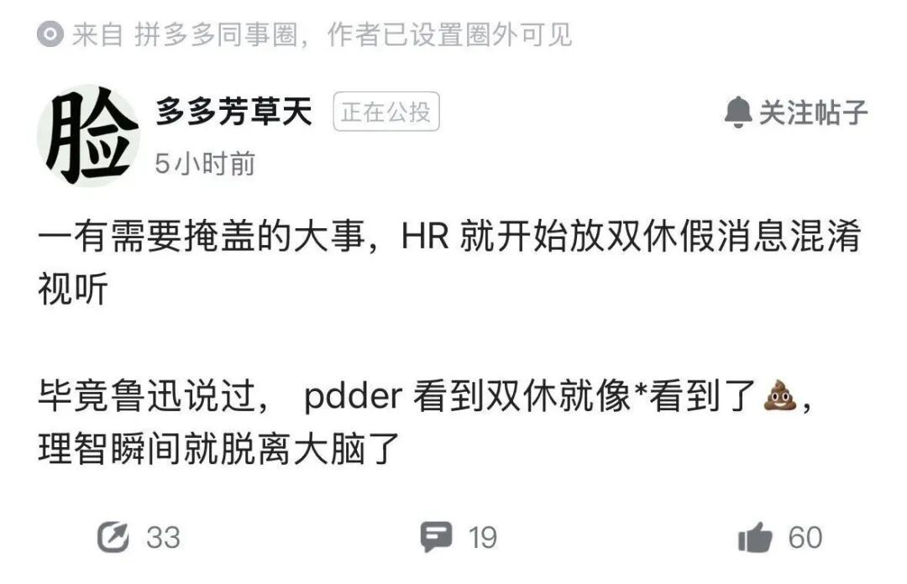

# 拼多多实行双休！引起员工强烈反对！啊？双休了还不开心了？

拼多多又有新消息传出，有网友爆料其内部已透露出信号：春节假期结束后，将正式推行双休制度，逐步取消长期实行的单休模式。

放在整个互联网行业，这本该是件让打工人欢呼的事。毕竟大小周、996早已是行业常态，企业主动取消单休、落实双休，堪称难得的“业界清流”。可令人意外的是，这则消息却传出遭到不少拼多多员工反对，甚至有人直言“千万别改双休”“改了钱就少了”，这般反常的态度，让网友直呼不解。

有人疑惑，拼多多员工难道是被工作节奏磨平了想法，还是这背后另有隐情？答案其实很现实，说到底还是绕不开“钱”这个字，毕竟对很多打工人而言，没有薪资支撑的休息，终究只是奢望。

先说说拼多多的单休现状，这在行业内早已是公开的事实。和部分大厂偶尔的弹性加班不同，拼多多的单休是实打实的常态化安排，而对应的，其给到员工的薪资和加班费，也远高于行业平均水平。对不少想多赚钱的打工人来说，多上一天班就能多拿一天加班费，这笔收入可不是小数目。

不过也有拼多多员工在社交平台发声，有人表示自己并不在意那点加班费，也有人直言网传的“员工反对双休”并非实情，只是大家的调侃，更有甚者直接表示，双休的消息本身就是假的，不过是用来转移注意力的。

暂且抛开消息真假不谈，为何会有员工对双休调整持抵触态度？核心原因终究还是薪资。有拼多多员工匿名透露，大家并非不想休息，而是打心底里担心——双休落地的同时，加班费也会随之取消，直接导致整体薪资缩水。

要知道，拼多多的加班费在员工收入中占比不低，尤其是研发这类高薪岗位，一旦取消单休，薪资可能会直接缩水1/3到1/4。对于在一线城市打拼，要面对租房、还贷等压力的打工人来说，这笔钱是支撑日常的关键，没有加班费的双休，无异于变相降薪，自然没人愿意接受。

除了薪资缩水的顾虑，员工还有另一层担忧：拼多多实行的是11-11-6的工作制度，早11点上班、晚11点下班，每周工作6天，本身工作强度就拉满了。大家担心，改成双休后，原本6天的工作量并不会减少，最后只能被迫在5天内完成，到头来不仅没捞着真正的休息，还得偷偷加班。与其这样，不如维持单休现状，至少能多拿点加班费，心里还能有个平衡。

还有员工表示，长期下来早已习惯了单休的工作节奏，突然改成双休，反而会觉得浑身不自在。更何况，不少人当初选择入职拼多多，正是看中了这里可观的薪资和加班费，若是单休取消、加班费也没了，或许会有不少人选择离职。

截至目前，拼多多官方尚未对“推行双休”和“员工反对”的网传消息作出任何回应，所有相关说法均来自社交平台的匿名分享，消息的真实性还需要时间验证，不妨让子弹再飞一会儿。

而这则网传消息，实则戳中了整个互联网行业打工人的共同难处：一边是迫切想要摆脱996、拥有完整休息时间的心愿，一边是担心薪资缩水、难以维持现有生活的现实，无论怎么选，都陷入了两难的境地。

网友们也纷纷感慨，拼多多员工并非真的和双休过不去，而是和“降薪后的双休”过不去，若是薪资保持不变，没人会拒绝好好休息的机会。

其实近些年，越来越多的互联网大厂都开始取消大小周、推行双休，这一变化能明显看出，企业正逐渐重视员工的休息权益，这是行业发展的好兆头。但与此同时，如何在推行双休的同时，平衡好员工的薪资待遇，避免让双休变成变相降薪，却是所有大厂都需要认真琢磨的问题。

最后想问一句，如果你是拼多多的员工，面对这次网传的双休调整，你会持反对态度吗？不妨说说你的看法。
