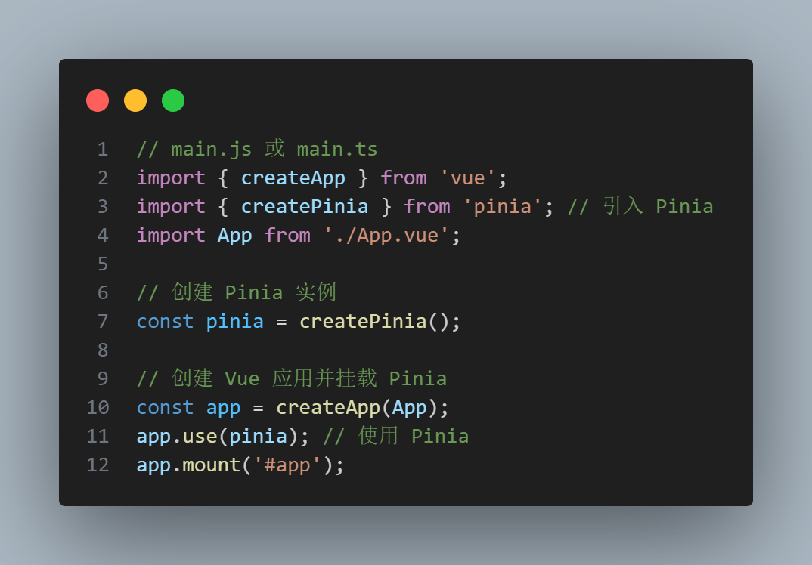
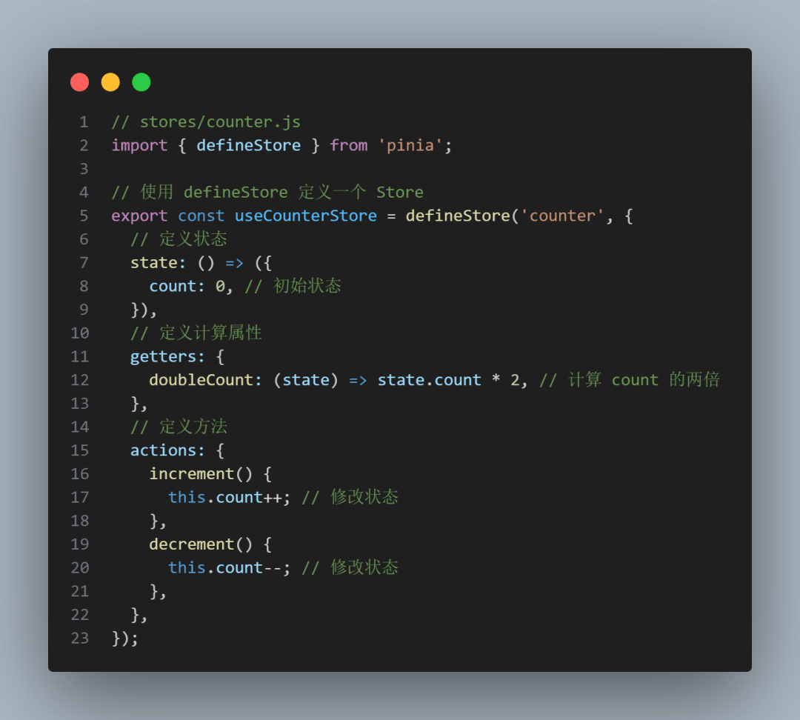
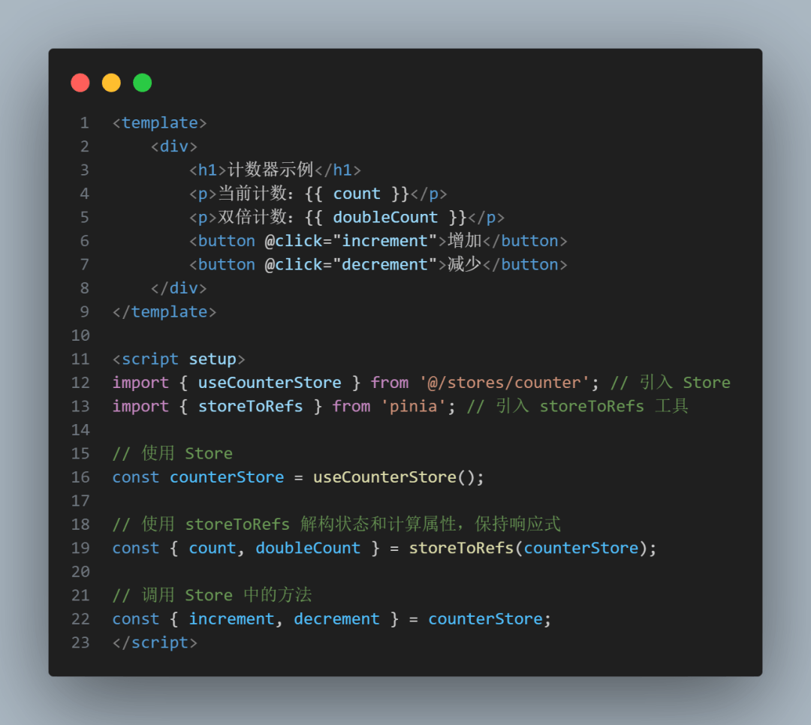
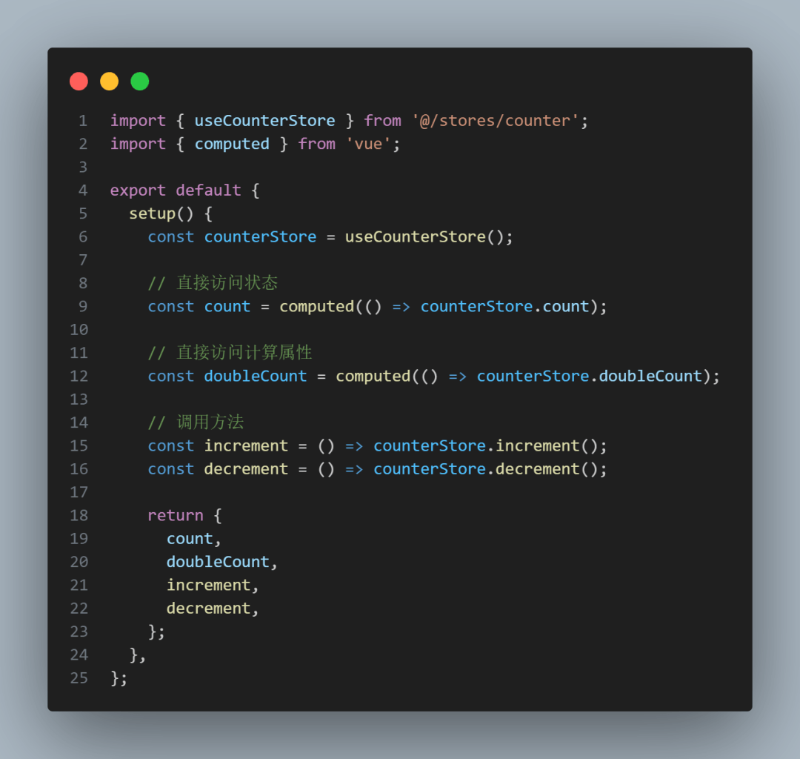
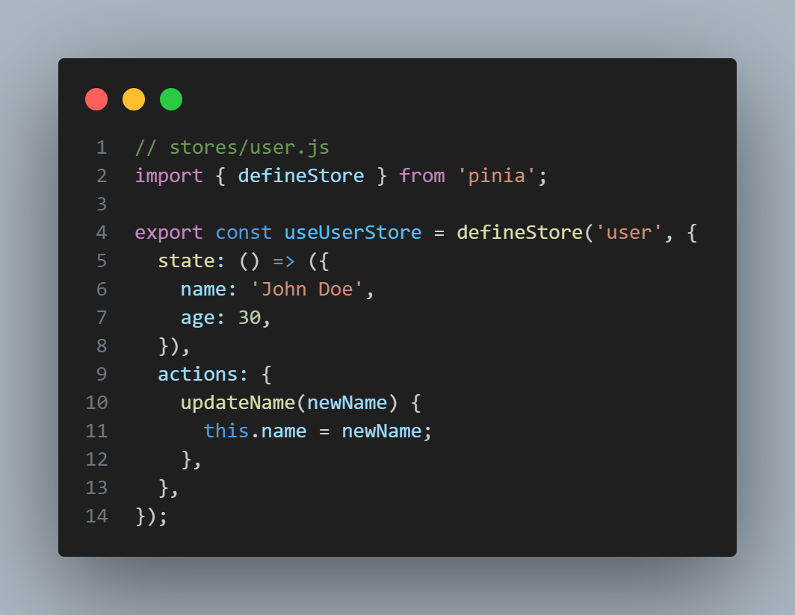
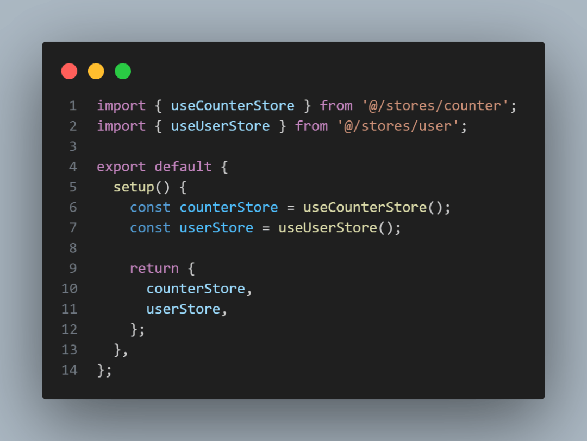

# Pinia3.0 彻底放弃了 Vue2 了！

## 前言

大家好，我是林三心，用最通俗易懂的话讲最难的知识点是我的座右铭，基础是进阶的前提是我的初心~

Vue 官方状态管理工具 Pinia 迎来 3.0 版本更新，正式放弃对 Vue 2 的支持Pinia 3.0 版本发布，此次更新并未引入新功能，而是移除了已弃用的 API 并升级了核心依赖项。

**以下是更新要点：**

- **Vue 3 专属支持：** Pinia 3.0 仅兼容 Vue 3，Vue 2 用户需继续使用 v2 版本
- **TypeScript 要求：** 需安装 TypeScript 5 或更高版本
- **Devtools API 升级：** Devtools API 已更新至 v7 版本
- **Nuxt 模块适配：** Nuxt 模块现已支持 Nuxt 3，Nuxt 2 或 Nuxt bridge 用户需继续使用旧版 Pinia

此次更新标志着 Pinia 全面转向 Vue 3 生态，开发者需根据项目需求选择合适的版本

有些朋友可能也是刚使用 Vue3 开发项目，所以对 Pinia 有点懵，接下来我带大家重温一下 Pinia 的用法

```
npm install pinia
```
## 1、创建 Pinia 实例

在 Vue 3 项目中，首先需要创建一个 Pinia 实例，并将其挂载到应用中。通常在 `store.js` 或 `store.ts` 文件中完成这一操作，这里我先在 `main.ts` 中去创建



通过以上代码，Pinia 已经成功集成到 Vue 3 项目中

## 2、创建 Store

Pinia 的核心概念是 Store，它是状态管理的核心单元。每个 Store 都是一个独立的模块，包含状态、计算属性和方法。

以下是一个简单的 Store 示例：



在上面的代码中：

- `state` 用于定义状态。
- `getters` 用于定义计算属性。
- `actions` 用于定义修改状态的方法

## 3、在组件中使用 Store

定义好 Store 后，可以在 Vue 组件中使用它。以下是一个使用 `useCounterStore` 的示例：



在上面的代码中：

- 使用 `useCounterStore` 获取 Store 实例。
- 使用 `storeToRefs` 解构状态和计算属性，确保它们保持响应式。
- 直接调用 `Store` 中的方法来修改状态。

## 4、组合式 API 中使用 Store

Pinia 与 Vue 3 的组合式 API 完美契合。以下是一个在 `setup` 函数中使用 Store 的示例：



## 5、模块化 Store

在实际项目中，通常会有多个 Store。Pinia 支持模块化管理，您可以将不同的状态逻辑拆分到多个 Store 中。

例如，可以创建一个 `userStore` 来管理用户相关的状态：



然后在组件中同时使用多个 Store：



## 结语

我是林三心，一个待过**小型toG型外包公司、大型外包公司、小公司、潜力型创业公司、大公司**的作死型前端选手
