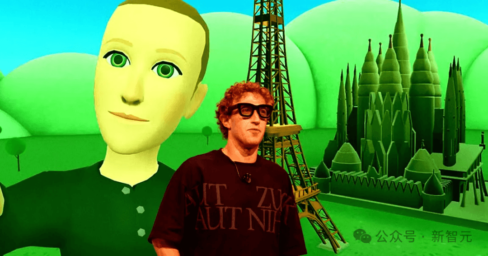
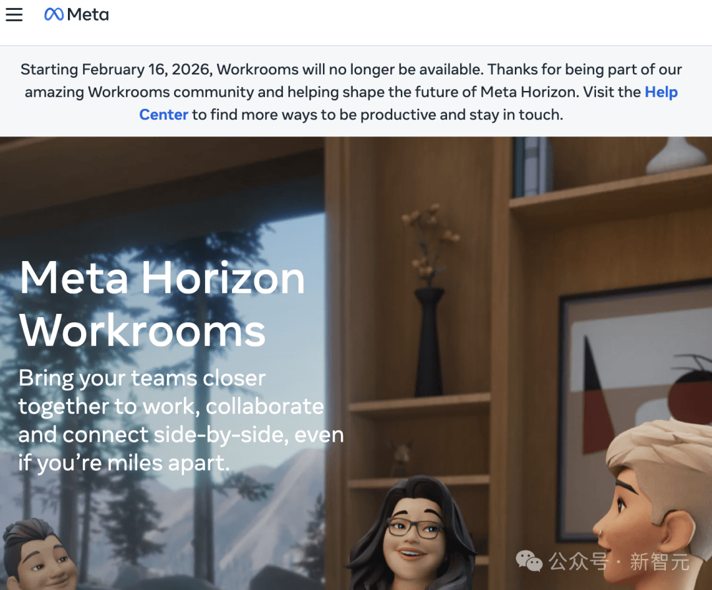
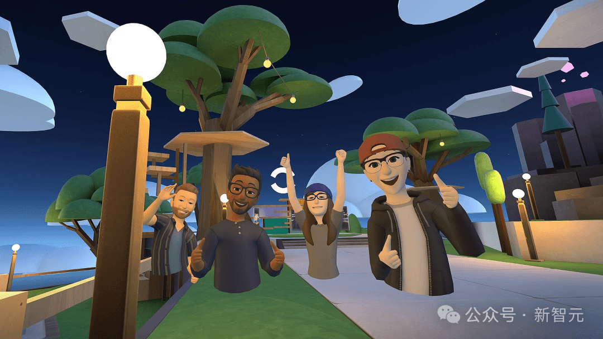
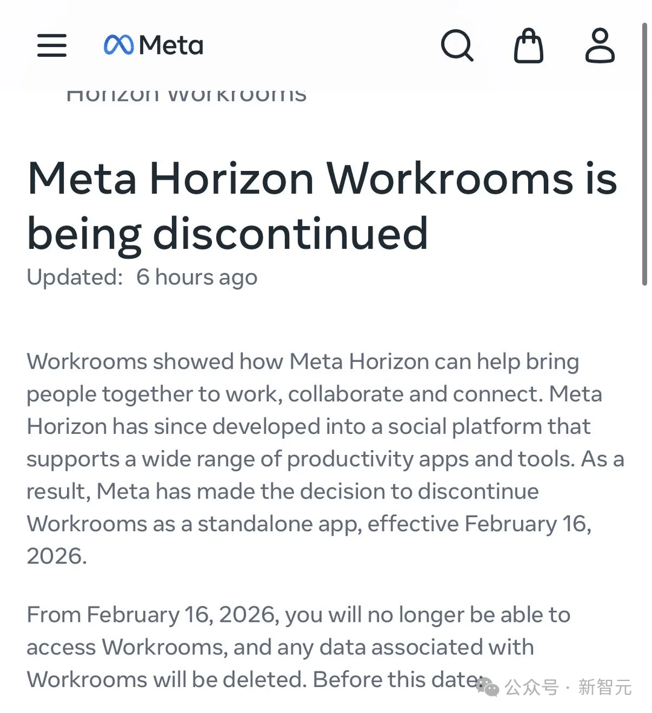
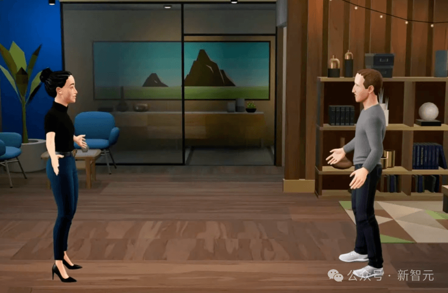
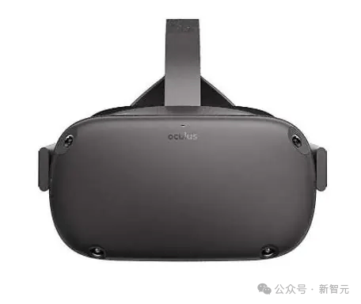
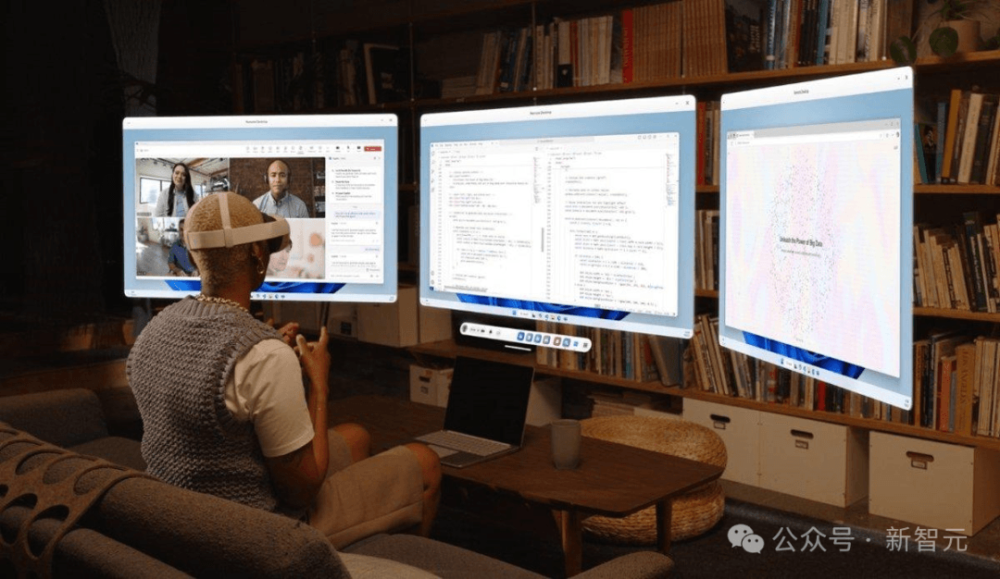
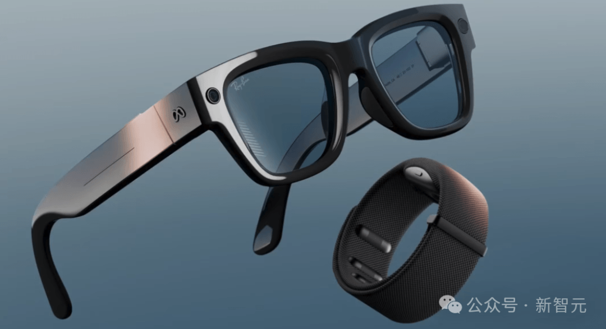
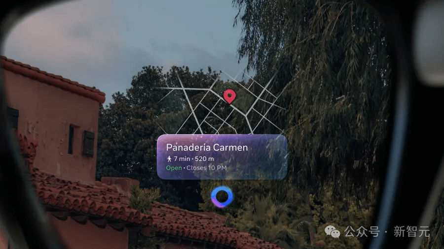

# 元宇宙，正式谢幕！

### 

转自：新智元

2021年，扎克伯格在舞台上描绘一个新世界：戴上头显，走进虚拟会议室，和同事围着白板讨论，像真的在同一个办公室。

那一年，Facebook改名Meta，元宇宙被写进公司的命运。

2026年1月16日，Meta在帮助页面上低调写下另一行字：Horizon Workrooms将于2月16日关闭，数据删除。

没有发布会，没有宣言，只有一句冷静的结束语——一个被寄予厚望的未来，终究没能变成日常。

**押注元宇宙的Meta战略撤退**

2021年，扎克伯格在Facebook Connect大会上慷慨陈词，宣布公司将全力押注元宇宙，并将其定义为「下一代互联网体验」，甚至不惜将Facebook这一标志性品牌更名为Meta以彰显决心。

作为元宇宙核心载体的Horizon Worlds应用，最初被设想为一个让用户以虚拟形象进行社交、工作和游玩的沉浸式世界，但**糟糕的用户体验**和匮乏的内容生态始终未能吸引大规模用户。

例如下图展示的「无腿小人」，被全网嘲笑。

据内部文件透露，Horizon Worlds在2023年的月活跃用户数未能突破20万，相对于Meta旗下其他社交平台数十亿的用户量级，这一数字显得微不足道。

2026年1月16日，Meta悄然更新了其帮助页面，宣布正式终止Horizon Workrooms服务。

这个曾经在2021年由扎克伯格亲自演示、被寄予厚望的元宇宙办公应用，寿终正寝！

Meta宣布，该应用将于2026年2月16日彻底关闭，所有用户数据将被删除。

此前，Meta裁员Reality Labs部门约10%（超过1500人），虚拟现实部门预算削减30%并关闭多个VR游戏工作室，以及Meta于2023年以4亿美元收购的VR健身应用Supernatural停止新内容开发，转入「维护模式」。

Workrooms的关闭具有标志性意义，曾经被寄予厚望的2B业务关闭，可以算得上是扎克伯格壮士断腕「元宇宙」。

**从高光到退场**

**Workrooms的短暂一生**

Workrooms曾是Meta元宇宙战略中最具实用价值的应用之一。

2021年7月，距离Facebook更名为Meta仅两个月，扎克伯格通过一段精心制作的演示视频向世界展示了Workrooms的愿景：

分布各地的团队成员，可以通过虚拟形象在同一个虚拟空间中协作 ，共享白板、文档，并获得比传统视频会议更沉浸的体验。

在当时的技术条件下，Workrooms确实展现了一定的创新性。

它支持头显，允许用户将自己的键盘带入虚拟空间，并提供了空间音频等增强沉浸感的功能。

Meta将其定位为「远程办公的未来」，试图在新冠疫情后远程工作兴起的背景下，抢占下一代企业协作平台的主导权。

然而真正使用之后，用户普遍反映长时间佩戴VR头显进行工作会议会让人感到不适，增加了疲劳感。虚拟环境中的互动效率也远低于预期——简单的举手发言、文件共享等操作在VR中变得复杂且不直观。

更关键的是，Workrooms始终未能解决企业级部署的实际问题。

设备成本、技术支持、隐私安全等让大多数企业望而却步。与已经成熟且免费的Zoom、Microsoft Teams等传统视频会议工具相比，Workrooms提供的额外价值微乎其微，却要求用户付出更高的硬件和学习成本。

在关停Workrooms的公告中，Meta建议Workrooms用户转向Arthur、Microsoft Teams和Zoom Workplace等替代方案。

这一建议本身就是对Workrooms失败的最好注解。

Meta甚至明确表示将保留Quest远程桌面应用，该应用允许用户在头显中模拟多个虚拟显示器——

这一相对简单却实用的功能反而获得了继续存在的价值，凸显了VR技术在特定垂直场景下的有限适用性。

**Meta元宇宙失败的深层根源**

2021年扎克伯格押注元宇宙时，他认为VR技术已经跨越了从早期采用者到主流市场的关键门槛。

然而现实是，VR技术仍面临硬件舒适度、运动眩晕、交互自然度等多个技术瓶颈。这些瓶颈限制了用户的使用时长和使用频率，使得VR设备更多被视为一种小众的娱乐工具，而非下一代通用计算平台。

如果VR设备不行，那就改变元宇宙的定义。

「元宇宙」（Metaverse）一词最初由《雪崩》作者Neal Stephenson创造，特指「完全沉浸式的共享VR世界」。

然而，在商业现实面前，Meta选择将「元宇宙」的定义扩大化，使其包含手机端的虚拟体验，如Fortnite等游戏平台。

不止Meta这么做——

微软在推广其「元宇宙」解决方案时，也倾向于强调混合现实和增强现实元素，而非完全的VR沉浸。

而苹果虽然推出了Vision Pro头显，但将其定位为「空间计算」设备。

巨头们的选择揭示消费者对完全虚拟世界的需求远低于预期。与构建一个平行的数字世界相比，用户更倾向于在现有设备（主要是手机）上获得增强的虚拟体验。

这种「轻量级」的元宇宙可能缺乏科幻作品中的震撼力，但具有更低的使用门槛和更广泛的普及潜力。

Meta在元宇宙上失败的另一原因，是其商业模式。

Meta一方面希望建立开放的元宇宙生态，另一方面又对平台上的交易收取高额分成，分成比例超过了苹果和微软这样的成熟平台。

Horizon Worlds内，Meta要拿走开发者高达47.5%的收入，对于这样一个不成熟的，用户不算多的平台，自然难以吸收到足够多的开发者。

据报道，Meta元宇宙核心团队中女性占比严重不足，这直接影响了产品对多元化用户需求的洞察和响应能力。由于团队性别失衡，诸如虚拟世界中的性骚扰等重要安全问题被忽视，直到问题被媒体曝光后才被迫应对。

而由于Meta在消费者市场，与隐私相关的黑历史太多，使企业对将其核心协作功能建立在Meta平台上心存疑虑。

Workrooms中可能的数据泄露、虚拟空间中的性骚扰等问题，进一步降低了企业采用意愿。

**从All in VR到All in AI**

对技术成熟度的预判失误，让Meta全力押注元宇宙之时，正是生成式AI技术爆发的前夜。

当ChatGPT等应用展示出AI技术的巨大潜力时，Meta才匆忙调整战略方向，但已经失去了先发优势。

如今，元宇宙为Meta全面转向AI扫清了道路。

Meta硬件的重心，从笨重的VR头显，变成了轻便的智能眼镜Ray-Ban。眼镜能更好地融入了用户的日常生活，提供了更自然的AI交互体验。

当这些设备专注于特定的实用功能（如拍照、听音乐、与AI助手对话），而非构建完整的虚拟世界，反而获得了更好的市场接受度。

软件层面，Meta正大力投资**AI助手和创作工具，想要**将「AI创作者工具带到移动端」。

这表明Meta认识到AI技术在增强现有平台能力方面的潜力，远比构建全新的虚拟世界更为现实。

Meta最近还推出了 Ray-Ban Display。

这是一种带显示功能的AR智能眼镜，右边的镜片还配备了用于应用程序、警报和导航的显示屏。这样的眼镜，相比VR设备更受欢迎，在 2024 年开始在一些零售店中销量超过了传统的 Ray-Ban眼镜。

**选对方向比投入多少更重要**

创始人的选择，往往能决定一家企业发展中的关键节点。

作为一家来自宿舍个人项目的企业，Meta一直带着一些Geek气息，其创始人会选择像元宇宙这样科幻感十足的方向，为此忽略了技术不成熟的现实因素，组建团队时也没有考虑个人隐私及保护，叠加平台生态不成熟时的高额分成，使得Meta元宇宙烧掉了73亿后，不得不回到现实。

如今Meta选择All in AI，但Meta同样选择了Manus这样看起来很美方案，同样是想用一个技术去解决所有的问题。

然而，Meta在元宇宙的败退，已经证明了技术愿景的吸引力并不能自动转化为商业可行性，中间需要跨越用户体验、市场需求和商业模式等多重鸿沟。

一个通用的AI工具，或许会如同Meta曾经设想的，能取代现实的元宇宙一样，被未来的历史证明难以满足用户需求。

Meta在元宇宙上最大的教训也许不是「投得不够」，而是：**把宏大愿景当成了产品路径。**

真正能跑出来的平台战略，往往反着来：先抓住用户已经在做的事。

再给他们一个更省事、更省钱、更省时间的理由。

一点点扩张，才会有生态。

愿景可以点燃人。

但只有日常，才能留住人。
