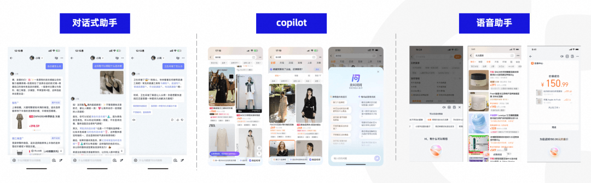
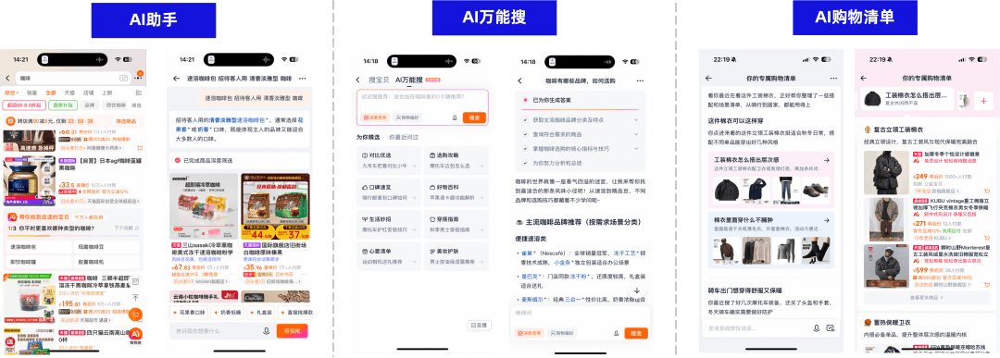
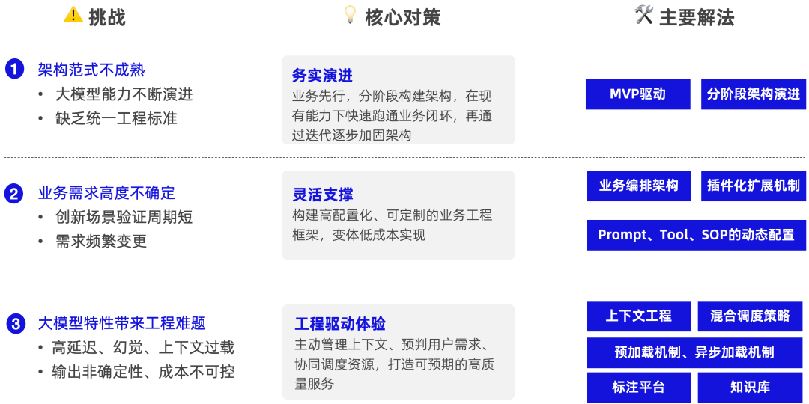
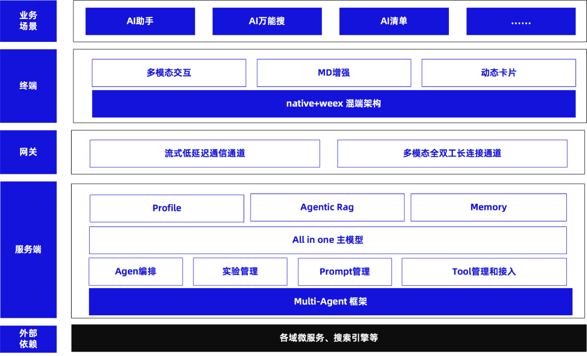
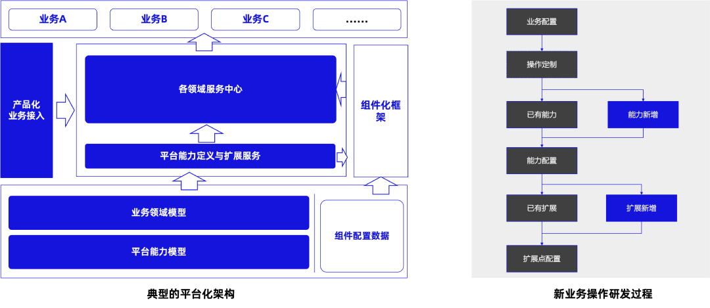
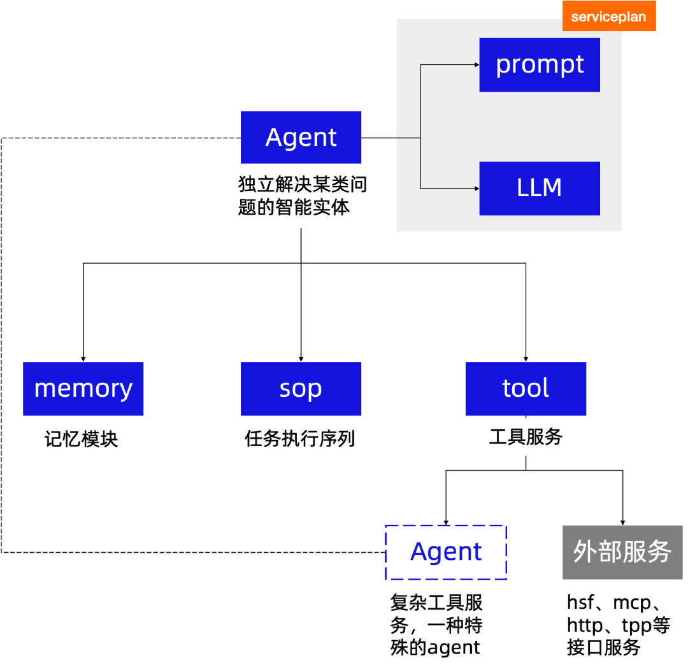
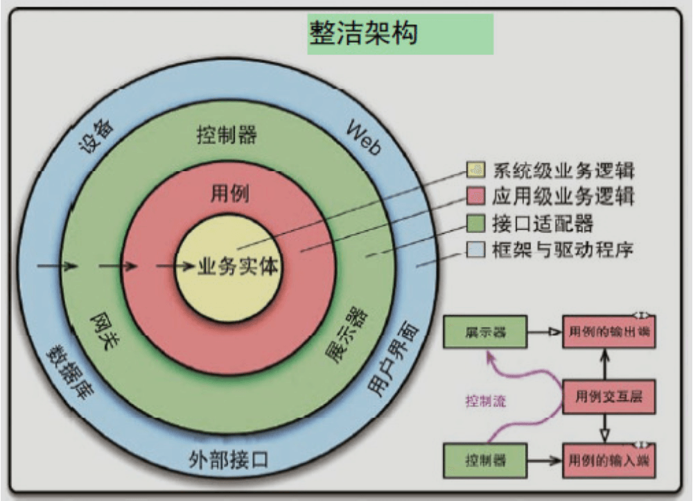
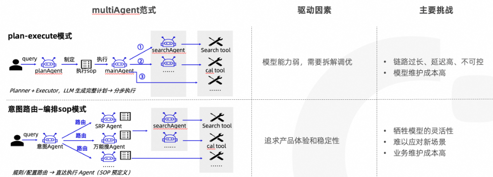
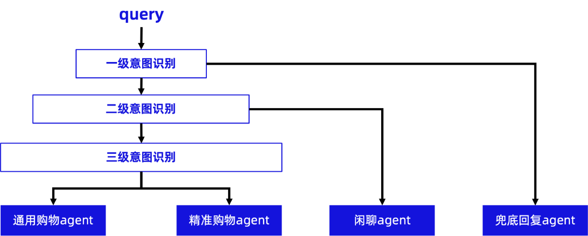
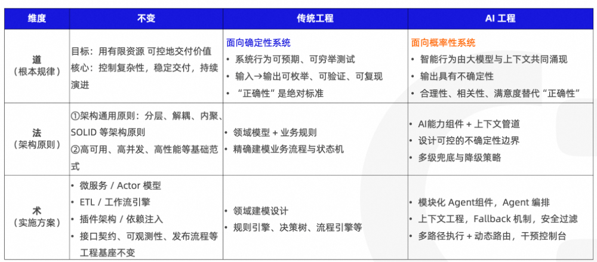

# AI工程vs传统工程 —「道法术」中的变与不变

  

  

  

本文从“道、法、术”三个层面对比AI工程与传统软件工程的异同，指出AI工程并非推倒重来，而是在传统工程坚实基础上，为应对大模型带来的不确定性（如概率性输出、幻觉、高延迟等）所进行的架构升级：在“道”上，从追求绝对正确转向管理概率预期；在“法”上，延续分层解耦、高可用等原则，但建模重心转向上下文工程与不确定性边界控制；在“术”上，融合传统工程基本功与AI新工具（如Context Engineering、轨迹可视化、多维评估体系），最终以确定性架构驾驭不确定性智能，实现可靠价值交付。  

  

引言

  

最近在准备一场题为《AI搜索技术演进实践》的分享时，我收集到不少架构师同行的疑问，其中反复出现的一个问题就是：AI 工程架构与传统工程架构究竟有何不同？这其实也是我自己曾长期思考的课题。身处 AI 快速发展的时代，许多开发者难免产生“AI 焦虑”——尤其当外界不断讨论“AI Coding 将改变开发方式”时，这种不安更显真切。

  

然而，过去一段时间的实践让我逐渐厘清了一个关键认知：AI 工程并非对传统工程经验的全盘否定，而是在我们过去十几年构建的坚实工程地基之上，为应对“不确定性”所进行的一次精准架构升级。

  

传统工程以“确定性”为基础——输入明确、逻辑清晰、输出可预测。但 AI 系统天生具有“概率性”和“涌现性”，这让原有的确定性范式面临挑战。不过，这种挑战并不意味着根基动摇。相反，若我们借用“道、法、术”的框架来审视，会发现支撑软件工业的核心逻辑依然稳固。

  

本文将以一名从平台基建转向 AI 用户端应用的实践者视角，尝试从架构层面梳理 AI 工程与传统工程在“道法术”维度中的变与不变，希望能为大家提供一些思考线索与实践启发。

  

关于 AI 搜索的实践

  

在深入探讨“道法术”框架下的架构演进之前，不妨先简要回顾我们团队在 AI 搜索领域的实践历程。

自 2023 年 3 月起，我们启动了“淘宝问问”的孵化项目，先后尝试了对话式助手、Copilot 和语音助手三种产品形态。目标是为用户提供更便捷、智能的一站式生活消费解决方案——借助自研大模型，让用户能用自然语言表达丰富、细致且个性化的购物需求，从而获得更精准的商品与服务推荐。这也是业内较早探索大模型在电商场景落地的尝试之一。

  

  

随着技术演进与用户反馈的积累，项目逐步聚焦于核心场景，重新定义产品方向。2025 年初，我们基于具备深度推理能力的大模型，推出新一代 AI 搜索产品——“AI 万能搜”，并在双 11 前上线“ AI 清单”。

  

  

从概念验证到成熟产品，AI 搜索的工程架构也经历了系统性演进：

- 2023 年：采用主流开源框架构建单体 Agent 架构，快速验证可行性；
- 2024 年：转向多模态全双工交互 + RAG（检索增强生成）为主流的技术栈；
- 2025 年：构建支持复杂推理的混合智能体体系，通过分层组件化设计、Multi-Agent 架构与 Context Engineering（上下文工程）等模块，逐步形成可支撑企业级产品交付的工程体系。

  

这一过程主要面临三大技术挑战：

① 架构范式尚不成熟

作为一个新兴领域，AI 工程缺乏统一的行业标准，各团队多处于探索阶段。技术栈迭代迅速，框架理念频繁演进。而且随着大模型能力和 Agent 的不断演进，架构思路和范式在不断变化。有个比较典型的例子，就是 langchain 框架，Chain → Agent → Graph → Agent，三年换了四次方向。AI 这个赛道，技术栈迭代太快了。

我们的应对策略是：务实演进，业务先行。以 MVP（最小可行产品）驱动业务闭环，在现有能力下快速跑通链路，再通过迭代逐步加固架构。

例如，在流式协议支持不足的初期，我们采用“客户端轮询 + 服务端分段缓存”的临时方案支撑首版体验；在构建多模态实时交互通道时，借助音视频基础设施，快速搭建出首个可交互 Demo。

  

② 业务需求高度不确定

作为创新产品，AI 助手的验证周期短，方向调整频繁。仅一年内，我们就完成了多次大版本迭代，并尝试多个实验性功能。

这部分恰是平台架构最擅长的领域。我们通过高配置化、可插拔的工程框架，低成本响应变化：抽象出 AI 搜索的核心领域模型与通用组件，复用主搜的业务编排能力，构建支持动态配置的插件体系。Prompt、Tool、SOP（标准操作流程）等关键模块均可通过配置热更新，并支持细粒度实验，极大提升了迭代效率。

  

③ 大模型特性带来的工程难题

前两类挑战在多数创新业务中普遍存在，而大模型本身引入了新的复杂性：高延迟、幻觉、上下文过载、输出非确定性、推理成本不可控等。

我们的解法是：将大模型的“波动性”视为系统设计的基本约束。通过上下文工程（Context Engineering）、异步预加载、熔断降级等机制，内建服务鲁棒性，确保可用性、事实一致性与用户体验的稳定性。同时，配套建设了电商知识库、标注平台和评估体系，形成“模型-数据-工程”闭环。

  

挑战-对策-解法

  

▐  成型的 AI 搜索工程体系

  

经过持续演进，我们已形成一套完整的 AI 搜索工程体系，主要包括以下模块：

- 终端：基于跨端框架，支持灵活扩展答案卡片类型，实现多场景复用；集成 Markdown 增强、ASR（语音识别）、TTS（语音合成）等能力，并创新交互形式如动态筛选、流式翻页、内容折叠等。
- 网关与协议：包含流式通信协议，实现端到端低延迟通信；同时构建多模态全双工长连接通道，支持 Agent 与客户端双向实时交互。
- 服务端：采用 Multi-Agent 架构，通过统一的 Agentic 框架，实现业务逻辑编排、模型调度与工具调用；提供开放接口协议，兼容多种接入方式，支撑灵活集成。
- Multi-Agent 架构：与算法团队共建面向电商场景的大模型协作框架，使 Agent 能自主规划交互流程——既能主动引导用户、输出结构化知识，又能将答案原子化、多样化呈现，摆脱传统固定意图的限制。
- 大模型：基于自研大模型进行业务定制，通过 Multi-Agent 架构进行编排和交互。

  

  

这套架构并非一蹴而就，而是在“不确定性”中不断试错、抽象、沉淀的结果。它既继承了传统工程对可靠性、可维护性和可扩展性的追求，又针对 AI 特性进行了精准升级——这正是我们理解“AI 工程不是推倒重来，而是架构进化”的实践注脚。

接下来，我将从“道、法、术”三个维度，系统剖析其中的变与不变。

  

道：从“追求绝对正确”到“管理概率预期”

  

“道、法、术”是中国传统哲学中一套深刻的认知框架：

- 道：根本规律与价值理念，是认知的底层；
- 法：制度与方法体系；
- 术：具体操作与技术手段。

在工程语境下，“道”决定了我们如何看待系统的本质、目标与边界。

  

▐  不变：目标和原则

  

无论技术如何演进，软件工程的根本使命始终未变。正如《架构整洁之道》所强调：“软件架构的终极目标，是以最小的人力成本满足系统构建与长期维护的需求。”这一原则在AI时代依然成立——用有限资源，可控地交付可持续的价值。

  

因此，以下核心准则并未因AI的引入而动摇：

- 控制复杂性仍是架构设计的首要任务
- 稳定交付与持续演进依然是衡量工程团队成熟度的关键标尺

我们不能因为模型具有“智能”就容忍系统频繁崩溃，也不能以“AI不可控”为借口放弃对用户体验的基本承诺。

  

▐  变：确定性 VS 概率性

  

真正发生范式转移的，是对“正确性”本身的理解。

- 传统工程建立在确定性之上。系统行为遵循 $y = f(x)$ 的严格映射。输入固定，输出必须一致；行为可穷举、可验证。“Bug”是非黑即白的存在——要么正确，要么错误。  
- AI工程则运行于概率空间之中。智能输出是大模型、提示（prompt）、上下文与环境共同“涌现”的结果。其本质具有内在不确定性。此时，“正确性”让位于合理性、相关性与用户满意度等多维指标。

这意味着，AI工程师的核心任务不再是“消灭所有不确定性”（这既不可能也不必要），而是通过架构设计、监控机制与人机协同策略，将不确定性收敛至业务与用户可接受的区间之内。从“追求绝对正确”向“管理概率预期”的转变。

  

法：架构准则的延续与演化

  

“法”是指导系统如何构建的通用方法论。在AI工程中，经典软件工程原则并未失效，而是引入了新的约束与优先级。

  

▐  不变：架构基本原则

  

控制复杂性仍是架构设计的第一要务，那些历经时间检验的通用原则——分层、解耦、高内聚低耦合、SOLID 等——依然是AI系统不可或缺的基石。

  

- 1\. 平台化思维与能力抽象的延续

  

传统工程的核心是领域模型标准化与业务流程抽象，实现80%~90%功能的复用。典型平台架构通过统一抽象，使新增功能可沉淀、可组合，类似场景的支撑效率呈“摩尔定律”式提升。

  

  

AI工程继承了这一思路，但抽象的对象发生了变化

- 从业务域实体转向AI能力组件
- 从状态机驱动转向Agent驱动

以当前 AI 搜索实践为例，AI工程体系包含以下核心组件：

- Agent：独立解决某类问题的智能实体。例如AI助手中商品筛选（跑马灯agent），双11清单对话页清单生成Agent等；
- SOP协议：统一Agent调度层以及Agent执行层调度协议。能够对Agent和tool进行编排（对应langChain框架中chain的概念）;
- Tool：工具服务，基于主搜编排框架，做了工具的配置化接入，支持通用的MCP协议工具、同时支持本地以及远程工具调用；
- Memory：记忆模块，针对过去回答的结构化存储和检索能力。
  
    

另外通过xLangchain框架（langchain 的 java 实现）对大模型调用进行配置化封装，内置 AB 实验、版本管理与插件机制，确保单一能力点的变更不影响整体系统稳定性。这些设计依然遵循分层清晰、职责单一、接口稳定等经典原则。变化的不是方法，而是被抽象的对象。

  

- 2\. 高可用与容错机制仍是生命线

  

高可用是分布式系统架构设计中必须考虑的因素之一，通过设计减少系统不能提供服务的时间。一般用可用性SLA来衡量。

AI推理具有高延迟、低吞吐、资源密集等特点，反而对系统弹性提出更高要求。传统架构中的熔断、降级、限流、服务治理等机制，不仅未过时，反而成为保障用户体验的“保命符”。

SLA 的定义或许需要调整（例如从“响应时间 < 200ms”变为“首字响应时间 < 1s”），但通过冗余与自动故障转移消除单点故障的核心思想始终不变。

  

▐  变：核心建模与边界设计

  

真正发生演进的，是系统的核心关注点与不确定性管理策略。

  

- 1\. 从“领域模型”到“上下文工程”

  

传统工程中，第一要务一定要先设计好领域模型。在于对业务世界的确定性建模，通过精确刻画实体关系、状态变迁与流程规则，构建高度结构化的领域模型，并由规则引擎驱动可预测的业务流转。因为架构实践上的经验，越往中心，抽象层次越高，越稳定；越往周边，抽象层次越低，偏细节，越多变。

  

架构整洁之道

  

然而，在 AI 工程最核心关注的问题，除了传统工程中对业务世界的建模以外，重点转移到了AI 组件和上下文管道，其目标是：在正确的时间，以正确的结构，向模型注入完成任务所需的最小必要信息，从而支撑其高质量推理与决策。

AI 工程关注点，从“如何定义业务”转向“如何喂养模型”。

  

- 2\. 设计“可控的不确定性边界”

  

这是AI架构升级的关键所在，不能让模型幻觉无限制扩散至整个系统，必须通过架构手段划定“安全区”。

- 架构策略： 用确定性的前处理（输入校验、意图识别）、后处理（结果校验、格式化）与安全保护逻辑（敏感词过滤等）包裹不确定的模型内核；
- 多级兜底： 当模型表现不佳时，系统必须能平滑降级（Fallback）。例如，当大模型超时或幻觉严重时，能够自动切换到基于规则的兜底策略，或者使用更小、更快的模型接管。

在 AI 搜索实践中，通过编排与路由策略，将“动态生成”转化为“受控执行”，从而在保留AI能力的同时大幅压缩不确定性空间。

  

例如，在早期多Agent系统中，曾采用 react 式的 plan-execute 范式：先由意图识别和Query改写模型处理用户输入，再由一个 Plan Agent 实时生成完整的执行计划（SOP），最后交由 MainAgent 执行。这种设计看似灵活，实则存在不少挑战——链路过长导致误差逐级放大，反复调用大模型造成高延迟、高Token消耗，且幻觉难以追溯。

  

为提升稳定性与响应速度，架构逐步转向预编排SOP模式：意图Agent仅负责路由至特定子Agent，而每个子Agent的执行流程不再依赖实时生成，而是基于人工配置或离线生成的固化SOP。虽然牺牲了部分动态适应能力，却显著降低了资源开销与输出风险，本质上是以有限灵活性换取高确定性，正是对不确定性边界的主动收拢。

  

两种multiAgent范式

  

此外，在请求入口处构建多级意图路由漏斗，也成为控制不确定性的关键手段：

系统首先进行安全筛查，风险内容直接拦截；安全请求则进入一级意图识别，区分闲聊与任务型需求；高价值任务再经多维细化，最终精准调度至专用模块。这一层层收敛的机制，将大模型的不确定性严格限制在必要环节，其余路径由轻量模型或规则逻辑保障，从而在整体上维持系统的可预测性与可靠性。这一层层收敛的机制，不仅提升了意图识别精度，更重要的是——将大模型的不确定性严格限制在必要环节，其余路径由轻量模型或规则逻辑保障，从而在整体上维持系统的可预测性与可靠性。

  

  

所以， AI工程的“法”并非放弃控制，而是在承认概率性的前提下，通过架构设计将不确定性“关进笼子”。真正的智能，不在于模型能生成多少可能性，而在于系统知道何时该让它说话，何时该让它闭嘴。

  

术：新旧武器的融合

  

如果说“道”是认知坐标、“法”是架构纲领，那么“术”便是工程师手中最具体的工具与战术。在AI工程落地的战场上，我们既未抛弃传统工程的“十八般兵器”，也未盲目迷信AI带来的“新式火器”，而是将二者熔铸为一套既能攻坚克难、又可稳守阵地的复合战法。

  

▐  不变：工程基本功仍是底盘

  

无论系统多么“智能”，其运行依然依赖于扎实的工程底座。我们在AI搜索实践中反复验证：那些工程技艺——如接口契约设计、日志埋点规范、性能压测流程、灰度发布机制、监控告警体系——非但没有过时，反而因AI系统的脆弱性而显得更加关键。

  

例如，构建 multiAgent 框架，我们复用了主搜团队沉淀几年的业务编排框架，将其扩展为支持Tool调用与Agent调度的通用执行引擎。这不仅避免了重复造轮子，更确保了在高并发场景下，AI请求与传统搜索请求共享同一套限流、熔断与链路追踪能力。

  

再如，我们在终端层基于 weex2的组件化体系，快速实现AI 回答卡片的动态渲染。一张包含商品流、筛选控件与解释文本的复合卡片，仅需通过配置即可在搜索、详情、会话等多个场景复用。这种“一次开发、多端通投”的能力，正是模块化思想在AI时代的延续。

  

▐  变：为不确定性锻造新工具

  

然而，面对AI 的特性，传统工具箱确实需要补充新武器。

  

上下文工程（Context Engineering）成为核心技能

传统工程关注数据结构与API契约，而AI工程则必须精通“如何向模型喂信息”。在 AI 搜索实践中，我们围绕三大高价值上下文模块构建 Context Manager，提升大模型回答的相关性、个性化与事实准确性。

- 用户信息（profile）：基于用户在平台内的交互行为，结合输入内容，提取有效信息
- Agentic RAG（知识检索）：大模型采取「规划 - 执行 - 观察」模式，自主决策获取所需信息，包括站内知识（如行业规则、活动信息）与站外知识（如趋势、百科）；
- Memory（记忆模块）：对历史对话进行摘要，保留关键信息；同时截取历史曝光内容，通过模型筛选并总结

这三类上下文由统一的 Context Manager 协同管理——它会动态整合信息、解决冲突，并根据任务需求调整优先级，最终生成一份精简、准确、与当前目标高度匹配的上下文输入。

  

例如，在大促场景中，系统会动态判断：若用户偏好明确，则优先注入行为序列；若 query 涉及新知识，则强化外部检索；若对话已进行多轮，则调用 Memory 模块提取摘要而非原始记录。这种“按需供给、精炼输入”的能力，降低了 Token 浪费与幻觉风险。

  

评估体系从“对错二分”转向“多维度量”

传统测试以断言为核心，而AI输出无法简单用True/False衡量。我们建立了评估机制：

- 人工标注层：由专业评测团队对意图覆盖、逻辑连贯、用户体验打分。为此构建了建设了一套面向大模型标注和评测的标注平台，支持多种数据源，动态编排标注模板、人效看板等功能
- 线上AB层：通过点击率、转化率、停留时长等业务指标反哺模型迭代

这套体系使我们能在“不确定”中寻找“相对确定”的优化方向。

  

调试范式从“日志回溯”升级为“轨迹可视化”

AI系统的错误往往源于上下文缺失或工具调用顺序不当，而非代码逻辑错误。为此，开发了Trace工具，可完整记录一次请求中：用户输入 → 意图识别 → 上下文组装 → Agent决策 → Tool调用 → 模型生成 → 后处理 的全链路轨迹。这样可以逐层下钻分析“为何模型在此处幻觉”“哪个Tool返回了异常数据”。

  

回望两年实践，AI工程的“术”之精髓，正在于这种融合——以传统工程的确定性骨架（稳定架构、可靠基础设施、严谨流程）为支撑，外挂AI的概率性肌肉（灵活推理、语义理解、自适应交互）。骨架确保系统不崩，肌肉赋予系统智能。

  

小结

  

以上是关于传统工程与 AI 工程的浅显思考。其实并没有绝对的“传统”与“AI”之分——AI 更多是一种能力。只是这种能力强大到足以影响架构的价值理念、方法体系和实操手段。

  

AI工程 vs 传统工程—“道法术”中的变与不变

  

AI工程不是推倒重来，而是在坚实工程地基上，为应对“不确定性”而做的精准架构升级。

作为技术负责人或架构师，我们当下的使命，就是用确定的架构（法与术），去驾驭不确定的智能（道），在混沌中交付清晰的价值。

  

写到最后的话

  

最后，给 AI 工程建设的同学几点建议：

1. 主动理解大模型原理，建立基本技术判断力
  
  祛魅是第一步：大模型并非万能，其能力有明确边界。要能分辨问题出在提示词（prompt）、上下文长度、数据质量，还是模型本身的认知局限，避免将工程问题简单归因于“AI不行”。
2. 系统目标从“可用性”升级为“合理性与真实性”
  
  “流畅”不等于“可信”。一个看似通顺却事实错误的回答，其危害远大于响应稍慢但准确的结果。AI系统的终极验收标准，应是真实、可靠、可解释。
3. MVP要快，但关键能力需有技术纵深与演进路线
  
  小步快跑验证闭环固然重要，但核心模块（如知识检索、推理链、安全过滤）必须预留技术纵深。在“先跑起来”和“可持续演进”之间，找到动态平衡点。
4. 将模型的不确定性视为前提约束，用工程手段内建鲁棒性
  
  不要把模型当作稳定服务调用，而要预设其输出可能波动、偏移甚至失效。通过校验、回退、多模型投票、人工兜底等机制，把不确定性“封装”在可控边界内。
5. 架构选型要面向AI原生需求，谨慎复用传统平台
  
  Agent、工具调用、动态路由、记忆管理等新范式，呼唤更轻量、灵活、可观测的基础设施。盲目套用传统微服务或单体架构，往往成为后续演进的枷锁。在“复用”与“新建”之间，需以AI工作流的本质需求为准绳。

  

以上思考难免有疏漏之处，诚挚欢迎各位批评指正。

如果你对文中提到的业务场景、技术挑战或AI工程实践感兴趣，非常期待与你进一步交流！

  

团队介绍

  

本文作者小枫，来自淘天集团-搜索技术团队。我们团队深耕淘宝搜索、拍立淘、AI导购等核心业务场景，专注于搜索领域的技术研发与产品创新。依托海量用户与真实复杂场景，我们构建了覆盖全链路的端到端搜索解决方案，持续服务数亿消费者。在数据驱动与技术创新的双轮驱动下，团队不断优化搜索体验、提升业务效能，并积极探索大模型等前沿技术在电商搜索中的落地应用。

  

如果你渴望在真实、高复杂度的业务场景中锤炼AI工程能力，与一群既懂技术又懂业务的伙伴并肩作战，这里将是你理想的舞台。目前团队在服务端、前端、客户端等多个方向开放社招岗位，工作地点为杭州。欢迎志同道合的同学加入！欢迎扫描下方二维码投递。

  

  

  

  

**¤** **拓展阅读** **¤**

  

[3DXR技术](https://mp.weixin.qq.com/mp/appmsgalbum?__biz=MzAxNDEwNjk5OQ==&action=getalbum&album_id=2565944923443904512#wechat_redirect) | [终端技术](https://mp.weixin.qq.com/mp/appmsgalbum?__biz=MzAxNDEwNjk5OQ==&action=getalbum&album_id=1533906991218294785#wechat_redirect) | [音视频技术](https://mp.weixin.qq.com/mp/appmsgalbum?__biz=MzAxNDEwNjk5OQ==&action=getalbum&album_id=1592015847500414978#wechat_redirect)

[服务端技术](https://mp.weixin.qq.com/mp/appmsgalbum?__biz=MzAxNDEwNjk5OQ==&action=getalbum&album_id=1539610690070642689#wechat_redirect) | [技术质量](https://mp.weixin.qq.com/mp/appmsgalbum?__biz=MzAxNDEwNjk5OQ==&action=getalbum&album_id=2565883875634397185#wechat_redirect) | [数据算法](https://mp.weixin.qq.com/mp/appmsgalbum?__biz=MzAxNDEwNjk5OQ==&action=getalbum&album_id=1522425612282494977#wechat_redirect)
