# 如何设计一个AI Agent系统


  

  

  

本文系统性地阐述了如何从工程实践角度设计、实现和落地一个**可控且可用的 AI Agent 系统**。全文以大模型（LLM）为认知核心，围绕“让 LLM 从被动响应走向主动规划与执行”这一主线，构建了一个面向工业级应用的 AI Agent 全栈知识与设计框架。作者强调在定义清晰的领域内，AI Agent 不仅是工具，更是具备持续进化能力的可靠协作者。  

  


前言

  

本文重点是站在工程视角，围绕如何基于现有大模型去设计、实现和落地一个可用且可控的 AI Agent，不包含模型预训练、微调、RL等模型层面内容。当前Agent技术体系仍在快速演进中，比如Claude Skills近期持续受到开发者关注。本文介绍的内容是截至目前业界主流的设计思路和实践经验，一起期待更强大的Agent技术落地吧！

  

本文目的是构建一个面向AI Agent的整体知识与设计框架，因此并没有过多深入具体技术实现细节，比如RAG的chunk和embedding等等，相关技术细节可参考其他资料。

  

如果你已经对整个Agent知识体系有了解，或者已经在开发Agent，建议直接阅读第6节的实践体会。

如果你对电商资损防控领域Agent的落地有兴趣，可直接看第5节。

  


什么是AI Agent

  

近几年大型语言模型（LLM）在规模和能力上经历了指数级增长，其核心突破在于获得了强大的“认知”与“推理”能力。然而一个核心瓶颈也随之出现：LLM本质上是封闭的——它无法主动感知环境、调用工具或操作外部系统。这一局限促使行业从“LLM为中心”转向“Agent为中心”。Agent的本质是为LLM这个“大脑”装配了可执行的“躯体”和“感官”，对技术同学也意味着可以将过去需要人工介入的复杂流程实现自动化，帮助业务实现又快又稳的迭代。

> AI Agent新技术不断涌现，是属于技术人的幸福时刻。

  


  

▐  **1.** 软件范式的演进

  

软件编程范式也正在发生根本性变革：从手写逻辑的软件1.0，到数据驱动的软件2.0，再到由自然语言提示驱动的软件3.0。开发核心也从“如何实现”转向“定义目标”，我们正从代码执行者转变为目标定义者。

  

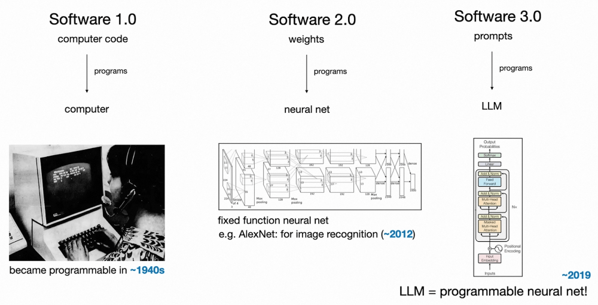

> 来自2025年6月Andrej Karpathy在YC的主题演讲《Software in the era of AI》，附演讲视频地址（https://www.youtube.com/watch?v=LCEmiRjPEtQ）
> 
> Andrej Karpathy：师从李飞飞、Tesla AI 总监（FSD）、OpenAI 研究科学家、Vibe Coding的提出者

  


|   | Software 1.0 | Software 2.0 | Software 3.0 |
| --- | --- | --- | --- |
| 核心范式 | 编写逻辑：定义规则和流程 | 定义目标：提供数据和架构 | 描述意图：提供Prompt和上下文 |
| 编程内容 | 编写代码 | 准备数据 & 训练模型 | 编写提示词 & 管理上下文 |
| 执行核心 | CPU | GPU | LLM |
| 构建对象 | 算法与逻辑 | 神经网络的权重 | 系统的行为与目标 |
| 核心特征 | 确定性、可调试 | 感知与泛化能力 | 极致的灵活性与通用性 |
| 典型场景 | 业务逻辑、系统内核 | 图像识别、语音合成 | 内容生成、复杂任务自动化 |
| 典型提问 | 我该如何实现这个功能？ | 我需要什么数据来训练模型？ | 我该如何设定目标，让Agent自主完成？ |


  

▐  **2.** 从LLM到Agent

  

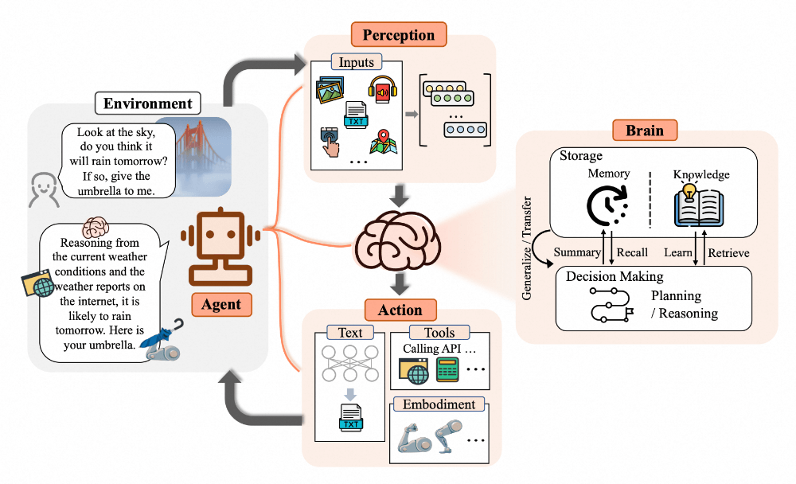

图片来自The Rise and Potential of Large Language Model Based Agents: A Survey

  

在当前以大型语言模型为基础的工程实践中，AI Agent 是一个软件系统，它以 LLM 作为核心大脑，并通过一系列架构组件来赋予其自主行动的能力。

AI Agent = LLM (Reasoning) + Planning + Memory + Tool Use

  

AI Agent 是从传统的人机对话（Copilot/助手）向自主决策与执行（主驾驶）的根本性转变，其核心特征是从“被动响应”跃升为“主动规划与执行”，行业普遍认为2025年是Agent元年。

  


|   | LLM | AI Agent |
| --- | --- | --- |
| 核心本质 | 推理内核：强大的“大脑”或预测引擎 | 执行系统：完整的自主智能体 |
| 技术架构 | Transformer 网络（参数/权重） | LLM+规划+记忆+工具 (完整软件系统) |
| 角色定位 | 被动的“知识专家”；等待提问，给出文本答案。 | 主动的“机器人助手”拥有大脑、双手和记忆 |
| 核心能力 | 文本理解与生成，在上下文窗口内进行推理。 | 感知、规划、决策、执行、学习的闭环。 |
| 工作模式 | 单次、静态的交互 | 多步、动态的工作流遵循 思考 -> 行动 -> 观察 的循环。 |
| 与环境的交互 | 封闭、被动，仅限于文本对话，无法操作外部系统。 | 开放、主动，能够调用工具，改变环境状态。 |
| 记忆与状态 | 基本无状态依赖有限的上下文窗口 | 有状态拥有短期记忆和长期记忆 |
| 打个比方 | 一位博学但足不出户的专家 | 一位拥有该专家大脑、能跑腿办事的全能助理 |
| 总结 | 强大的核心技术基石，是驱动Agent的引擎。 | 基于LLM构建的完整应用，它将认知能力转化为实际生产力。 |


> LLM 是新的操作系统内核 (LLM OS)，而 Agent 就是在这个新 OS 上运行的程序。--Andrej Karpathy

  

▐  **3.** Agent研发与传统研发的区别

  

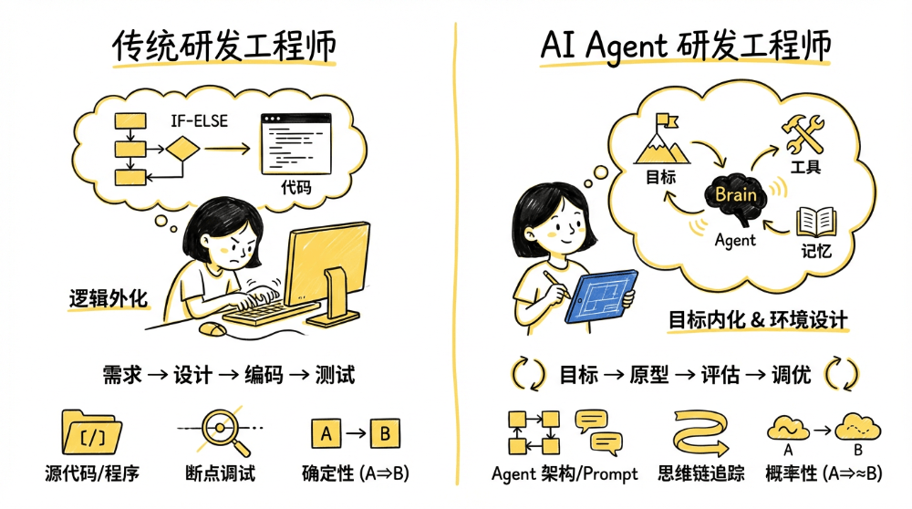

  

传统研发是将逻辑外化为代码，而Agent研发则是将目标内化到 Agent 的架构和 Prompt 中，并通过设计良好的环境（工具和记忆）来确保它能够自主达成目标。这要求开发者从一个逻辑精确的编码者转变为一个流程和智能体的设计者。

  


|   | 传统软件工程研发 | AI Agent 研发 |
| --- | --- | --- |
| 核心目标 | 实现特定的功能和逻辑 | 实现一个高级目标和自主行为 |
| 思维模型 | 命令式：定义每一步如何做 | 目标导向式：定义做什么和期望是什么 |
| 主要产出物 | 源代码、可执行程序、API等 | Agent 架构、Prompt、评估指标等 |
| 核心开发者角色 | 开发工程师、测试工程师、产品 | Agent架构师、Prompt工程师、业务专家 |
| 研发模式 | 计划驱动：需求分析 -> 设计 -> 编码 -> 测试 -> 部署。流程线性且严谨 | 实验驱动/探索式：定义目标 -> 构建原型Agent -> 大量评估与测试 -> Prompt调优/架构调整 -> 再评估。循环迭代，高度依赖反馈。 |
| 协作方式 | 基于接口和文档的协作：团队通过定义清晰的API接口、模块职责和设计文档进行协作。 | 基于目标和评估的协作：架构师、提示词工程师、业务专家围绕着一个共同的评估集进行协作。大家共同定义“什么是好结果”，并一起分析Agent在复杂场景下的失败案例。 |
| 调试方法 | Debug设置断点，检查堆栈和变量 | 追踪和可视化Agent的完整思维链 |
| 结果评判标准 | 确定性：输入A ⇒ 输出B（可复现）评判标准：功能正确性、性能、稳定性 | 概率性：输入A ⇒ 大概率输出B评判标准：行为可靠性、任务完成率、工具调用准确率 |
| 控制流 | 硬编码：由 If-else 语句和函数调用精确控制 | 动态决策：由 LLM 实时规划和选择工具 |
| 迭代核心 | 需求迭代、代码重构和 Bug Fix | Agent升级、Prompt 调优、记忆策略调整、评估体系优化等 |


  


Agent基础知识

  

为了让LLM这个大脑能够解决复杂的现实问题，我们需要为它配备记忆（Memory）、思考能力（Planning）、手脚（Tools）以及行动机制（Action），这就是一个普通的Agent全貌。

  

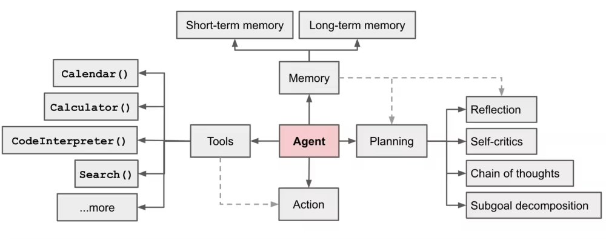

  

- Planning（从“直觉”到“逻辑”）：是指 Agent 将一个宏观的、抽象的目标拆解为一系列可执行的子任务，并根据环境反馈动态调整策略的过程。
- Memory（突破上下文限制）：Memory 是 Agent 存储、检索和管理信息的机制，它决定了 Agent 能在多大程度上利用过去的交互历史和外部知识。
- Tools（连接数字世界的接口）：Tools 是 Agent 的“扩展能力”。LLM 仅受限于预训练数据，而 Tools 让它可以联网、计算、绘图甚至控制物理设备。
- Action（从决策到执行）：Action 是规划和工具使用的最终落脚点，是 Agent 对环境产生的实际影响。

  

比如一个私人旅行助理 Agent：

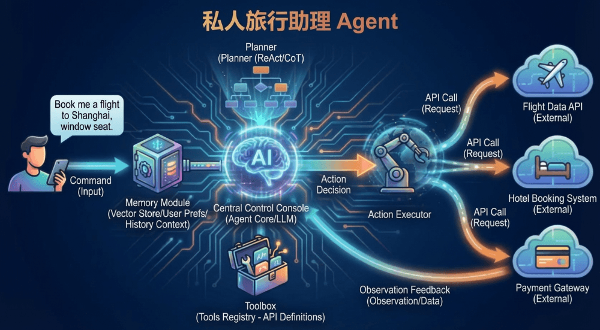

  

下面针对Agent研发涉及的一些关键技术点进行重点介绍，这些技术点的形式包括工具、协议、机制等等。

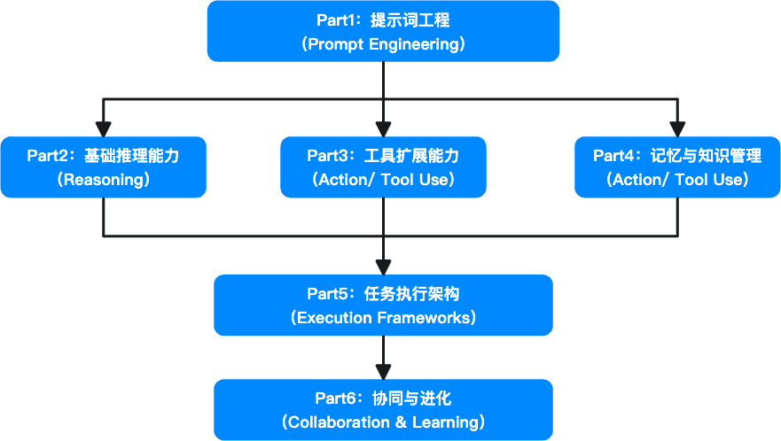

  

▐  Part1：提示词工程（Prompt Engineering）—— “智能体基石”

  

提示词工程是 Agent 的“底层协议”。它不是自然语言对话，而是通过结构化的文本指令，将非确定性的 LLM 输出约束为确定性的软件系统接口，是构建稳定 Agent 的地基。

Talk is cheap, show me your prompt！

  

关键点：角色设定 (Role Prompting)

说明：为 LLM 设定一个明确的专业领域角色，可以激活模型内部相关的垂直领域知识分布，使其输出内容的专业术语、视角和行为模式与设定角色保持一致，从而提升在特定领域任务中的表现。

示例：大促商品文案审核 Agent

```code-snippet__js
你现在是电商平台内容安全团队的资深审核专家，精通最新的广告法和平台营销规范。
你的任务是审查商家提交的双11大促商品短标题和营销文案。
审查重点：绝对化用语（如“第一”、“顶级”）、虚假比价（如“原价999，现价9.9”无依据）、诱导欺诈（如“点击领红包”实则引流）。
请以严谨、专业的口吻给出审计报告，指出违规内容、风险等级 (高/中/低) 和具体的合规修改建议。
```
  

关键点：零样本/少样本提示（Zero/Few-Shot）

说明：利用模型的上下文学习 能力。零样本提示直接下达指令；少样本提示则是提供若干个Input-Output 示例，引导模型模仿示例的模式。通过提供高质量的示例，可以让模型快速适应特定的业务场景和任务要求。

示例：商品标题生成 Agent

```code-snippet__js
你是一个资深的电商文案专家。你的任务是根据提供的商品关键属性，生成简洁、吸引人且符合SEO规范的商品标题。
标题应包含品牌、核心卖点、适用人群/场景等关键信息，长度控制在 30-60 个字符之间。
Few-Shot Examples:
Input: {"brand": "Apple", "model": "iPhone 15 Pro", "color": "原色钛金属", "storage": "256GB", "features": ["A17 Pro芯片", "4800万像素主摄", "USB-C接口"]}
Output: "Apple iPhone 15 Pro (256GB) 原色钛金属 移动联通电信5G手机 A17 Pro芯片"
Input: {"brand": "Nike", "category": "跑步鞋", "series": "Air Zoom Pegasus 40", "gender": "男", "color": "黑/白", "features": ["透气", "缓震", "回弹"]}
Output: "Nike耐克官方Air Zoom Pegasus 40男子跑步鞋透气缓震回弹运动鞋"
```
  

关键点：输出格式化 

说明：结合显式的格式约束指令（如要求输出特定 Schema 的 JSON、XML、Markdown 等），可以强制模型生成可被下游系统解析的结构化数据，而非自由文本。

示例：商品属性自动化抽取 Agent

```code-snippet__js
你是一个智能商品信息结构化助手。任务是从非结构化的商品详情描述中，提取出关键属性值，并严格按照指定的 JSON Schema 输出。
不要包含任何 JSON 以外的内容。


[Schema Definition]
{
  "type": "object",
  "properties": {
    "brand": {"type": "string", "description": "品牌名称"},
    "model": {"type": "string", "description": "具体型号"},
    "material": {"type": "string", "description": "核心材质成分"},
    "suitable_for": {"type": "array", "items": {"type": "string"}, "description": "适用人群/场景列表"}
  },
  "required": ["brand"]
}
User Input: "全新阿迪达斯三叶草系列休闲鞋，牛皮帮面，经典贝壳头设计，情侣款，出街必备。"
Model Output: {"brand": "阿迪达斯", "model": "三叶草系列休闲鞋", "material": "牛皮", "suitable_for": ["情侣", "出街"]}
```
  

关键点：工具使用提示模板 

说明：一种标准化的 Prompt 设计模式，用于向 LLM 描述外部可用工具（API、函数）的能力。模板通常包含工具名称、功能描述、参数列表（参数名、类型、描述、是否必填）以及使用示例。

示例：库存查询工具定义 Agent

```code-snippet__js
# Available Tools
You have access to the following tools:
## `query_sku_inventory(sku_id: str, warehouse_code: str = "MAIN_WH") -> int`
- **Description**: Use this tool to check the current available inventory quantity of a specific SKU in a given warehouse.
- **Parameters**:
    - `sku_id`: The unique identifier of the Stock Keeping Unit (e.g., "SKU_887799").
    - `warehouse_code`: The code of the warehouse to query. Defaults to "MAIN_WH" (Main Warehouse). Use "BONDED_WH" for cross-border items.
- **Usage Example**: To check inventory for SKU 'SKU_123' in the bonded warehouse, call `query_sku_inventory(sku_id="SKU_123", warehouse_code="BONDED_WH")`.
```
  

关键点：自我一致性/自我优化提示

说明：自我一致性：利用 LLM 生成结果的随机性，对同一问题并行生成多个不同的推理路径和答案，然后通过多数投票机制选择最一致的结果，从而提高复杂推理任务的准确性。

自我优化提示：一种迭代优化机制。先让模型生成一个初步结果，然后将该结果作为输入反馈给模型，并要求模型对其进行评估、批判和改进，从而生成质量更高的最终结果。

示例：大促商品文案生成与优化 Agent

```code-snippet__js
Task: "为一款即将参加双11大促的‘智能降噪耳机’撰写一条吸引人的商品短标题，要求突出降噪效果和优惠信息。"
Self-Consistency Strategy: Prompt 模型生成 5 条不同的短标题草案，例如：
"双11直降！智能降噪耳机，静享好声音"
"强力降噪，沉浸体验，双11特惠来袭"
"静无止境，智能降噪耳机双11半价抢"
"双11必买：智能降噪耳机，瞬间远离喧嚣"
"超强降噪黑科技，双11限时优惠，错过等一年" 然后通过人工或自动化评估机制，选择最符合要求、出现频率或得分最高的一条作为基础。假设选择了第3条。
Self-Refine Strategy (for generated copywriting):
Initial Output: "静无止境，智能降噪耳机双11半价抢"
Refine Prompt: "这条标题虽然突出了降噪和优惠，但略显平淡，不够吸引眼球。请针对追求高品质生活和性价比的年轻人群体，优化这条标题，使其更具紧迫感和诱惑力，可以适当使用一些网络热词或强调符号。"
Refined Output: "🔥双11炸场价！智能降噪耳机【半价】秒杀，一秒入静，手慢无！🚀"
```
  

工程挑战与应对方法


| 挑战点 | 现象描述 | 应对方法 |
| --- | --- | --- |
| 输出结构不稳定性 | 模型生成的 JSON/XML 等结构化数据可能包含语法错误（如漏逗号、引号）、未遵循预定义的 Schema 约束（如字段缺失、类型错误），或在结构化数据前后夹带无关的自然语言文本，导致下游解析失败。 | 鲁棒解析与重试机制 ：采用容错能力强的解析器；建立自动反馈机制，将解析错误信息回传给 LLM 并要求其按正确格式重新生成。Schema 校验：在解析成功后，立即对照预定义的 Schema 进行严格的数据结构和类型校验。 |
| 指令依从性衰退 | 在长上下文窗口中，模型可能会“忘记” System Prompt 中设定的关键约束条件，或在多轮交互后偏离初始角色设定，导致回复质量下降或违规。 | 提示强化 ：在多轮交互的关键节点（如每一轮的 Prompt末尾），简要重申最核心的约束指令。上下文管理：采用上下文压缩或滑动窗口策略，并确保关键的指令信息始终处于上下文窗口的活跃区域。 |


  

▐  Part2：基础推理能力（Reasoning）—— “如何思考”

  

打破 LLM “直觉式”回答，通过特定的 Prompt 技术让其进行逻辑严密、分步骤的“慢思考”，解决涉及多环节计算、规则判定和路径规划的复杂问题，逐步逼近人类式思维。

  

关键点：思维链 (CoT, Chain-of-Thought)

说明：通过在提示中加入引导（如 "Let's think step by step"），促使 LLM 显式地生成一系列中间推理步骤，而不是直接输出最终答案。这种将复杂问题分解为有序原子步骤的过程，显著提高了模型在逻辑、数学和规划任务上的准确性。

示例：复杂订单价格计算 Agent

```code-snippet__js
Task: "用户订单含商品A (100元), B (200元), C (50元)。用户有'满300减30'平台券（全场通用）、'B商品立减20'单品券、500京豆（抵5元，通用）。请计算最终应付金额。"
CoT Output:
Let's calculate the order price step by step.
1.  **Calculate Initial Total**: 商品总价 = 100 (A) + 200 (B) + 50 (C) = 350 元。
2.  **Apply Item-Level Discount**: 应用'B商品立减20'单品券。商品B价格变为 200 - 20 = 180 元。新的商品总价 = 100 (A) + 180 (B) + 50 (C) = 330 元。
3.  **Apply Platform/Cross-Store Discount**: 判断是否满足'满300减30'平台券条件。当前总价 330 >= 300，满足。应用平台券后总价 = 330 - 30 = 300 元。
4.  **Apply Virtual Currency**: 应用 500 京豆抵扣 5 元。最终应付金额 = 300 - 5 = 295 元。
```
  

关键点：思维树 (ToT, Tree of Thoughts)

说明：对于解决空间巨大或需要规划的复杂问题，ToT 框架允许 Agent 在思维空间中探索多条可能的路径。它将推理过程建模为一棵树，每个节点代表一个思维步骤。Agent 可以生成多个分支，评估每个分支的潜力，并使用搜索算法（如 BFS 或 DFS）选择最优路径继续探索，支持回溯机制。

示例：大促物流履约路径规划 Agent

```code-snippet__js
Task: "双11期间，针对华东地区的爆品订单，设计一个兼顾时效和成本的仓配履约方案。"
ToT Process:
Thought 1 (分支一: 极致时效):
Proposal: 全部从上海中心仓发货，使用顺丰特快。
Evaluation: 时效最优，但成本极高，且中心仓压力巨大，可能爆仓。评分: 6/10。
Thought 2 (分支二: 成本优先):
Proposal: 启用华东地区所有前置仓和门店店仓进行就近发货，使用通达系快递。
Evaluation: 成本最低，但前置仓库存深度不足，缺货率高，且物流服务商时效不稳定，客诉风险大。评分: 7/10。
Thought 3 (分支三: 分层履约):
Proposal: 根据用户画像分层。高价值用户/付费会员从中心仓发顺丰；普通用户订单利用算法拆单，有货的前置仓就近发普通快递，缺货部分中心仓补发。
Evaluation: 平衡了体验和成本，复杂度可控，是行业主流方案。评分: 9/10。
Decision: 选择 分支三 进行详细方案设计。
```
  

关键点：思维图 (GoT, Graph of Thoughts)

说明：将推理过程建模为有向图结构，是 ToT 的泛化形式。思维节点（Thought）不仅可以分叉，还可以合并、循环，形成复杂的依赖关系网络。这使得 Agent 能够从多个前序思维中聚合信息，或者在迭代过程中回流到之前的思维节点，适用于需要综合多视角信息或进行迭代优化的复杂问题。

示例：新商品冷启动营销策略制定 Agent

```code-snippet__js
Task: "为一款新发布的中高端扫地机器人制定冷启动营销策略。"
GoT Process:
Node A (市场分析): 分析竞品价格带和功能差异。 -> Node B (目标用户画像): 定义核心受众为“一线城市养宠家庭”。
Node C (渠道策略): 提出多渠道方案：站内搜索广告 + 小红书种草 + 直播带货。
Node D (内容策略): 提出主打“吸毛发不缠绕”和“静音”的卖点。
Aggregation Node E (策略融合): 将 A, B, C, D 的信息融合，制定一个整合营销计划。
Refinement Node F (迭代优化): 基于 Node E，评估预算分配合理性，提出先在小红书做两周种子用户测评口碑，再配合站内大推的优化路径。 -> 回流到 Node E 进行调整。
```
  

关键点：自我反思 (Self-Reflection)

说明：要求 Agent 在生成初步结果或采取行动后，暂时跳出当前任务视角，扮演一个独立的“批评者”角色。它会审视自己的输出是否符合要求、推理是否存在逻辑漏洞、行动是否产生了预期效果，并基于这些评估生成自我批评，进而指导生成改进后的结果或修正后的计划。

示例：智能客服回答质检 Agent

```code-snippet__js
User Question: "为什么我的快递三天了还没动？"
Initial Agent Output: "亲，大促期间物流比较慢，请您耐心等待。"
Reflection Trigger (System): "请检查你的回答是否具备同理心，是否提供了具体的订单状态信息，是否给出了明确的解决方案或预期。"
Agent Reflection Output:
Review:
我的回答过于敷衍，缺乏同理心。没有查询用户的具体订单状态，也没有给出具体的预计到达时间或解决方案，用户体验不好。
Revised Answer:
"亲，非常抱歉给您带来不好的体验。我刚帮您查询了订单（单号：SF123456），目前包裹已到达【杭州转运中心】，正准备发往您的城市。受双11大促影响，物流比平时晚了约1天。根据当前进度，预计明天（11月12日）能送到您手中。我会持续为您关注物流动态，请您再耐心等待一下。"
```
  

工程挑战与应对方法


| 挑战点 | 现象描述 | 应对方法 |
| --- | --- | --- |
| 推理错误累积 | 在多步推理链（如 CoT）中，早期步骤的微小错误（如计算错误、逻辑前提误判）会被后续步骤继承并放大，导致整个推理链路偏离正确方向，最终得出完全错误的结果。 | 过程监督：引入外部的确定性验证工具（如计算器、规则引擎）检查关键中间推理步骤的正确性，而非仅评估最终结果。多数投票：对同一问题并行生成多条独立的推理路径，通过多数投票机制选择最一致的答案，以降低随机性错误的影响。 |
| 推理延迟与成本激增 | 复杂的推理策略（如 ToT, GoT）需要生成大量的中间思维 Token，并可能涉及多次模型调用和搜索回溯，导致系统响应延迟显著增加，计算成本大幅上升。 | 按需推理：构建前置的分类模型判断任务难度，仅对复杂任务激活高成本的推理策略，简单任务采用直接生成模式。模型蒸馏 ：利用高性能大模型生成的高质量推理数据，微调更小、更快的模型，以平衡推理能力与部署成本。 |


  

▐  Part3：工具扩展能力（Action / Tool Use）—— “如何行动”

  

打破 LLM 的数字边界，通过标准化接口使其从一个纯粹的文本生成器进化为一个能够查询数据、生成报告等功能的Agent。

  

关键点：Function Calling

说明：一种使 LLM 能够与外部系统交互的机制。开发者提供可用函数（工具）的结构化定义（Schema），包括函数名、功能描述、参数列表及其约束。LLM 在对话过程中分析用户意图，如果判断需要使用工具，则不直接生成文本，而是输出一个包含目标函数名和参数值的结构化调用请求。宿主程序拦截此请求，执行实际函数，并将结果反馈给 LLM，LLM 据此生成最终响应。

示例：智能客服退换货处理 Agent

```code-snippet__js
Tool Definition (Schema):
{
  "name": "apply_for_return",
  "description": "为用户的指定订单申请退货服务。需校验订单状态是否支持退货。",
  "parameters": {
    "type": "object",
    "properties": {
      "order_id": {"type": "string", "description": "电商平台订单号"},
      "return_reason": {"type": "string", "enum": ["quality_issue", "wrong_item", "no_longer_needed"], "description": "退货原因代码"},
      "pickup_method": {"type": "string", "enum": ["door_to_door", "express_station"], "description": "取件方式"}
    },
    "required": ["order_id", "return_reason"]
  }
}
#交互流程
:
User: "我买的鞋子码数不对，订单号是 889900，我想退货，让快递员上门取件吧。"
Agent (Think): 用户意图是退货，提供了订单号和取件方式。退货原因可归类为 'no_longer_needed' (不喜欢/不合适)。调用 apply_for_return 工具。
Agent (Tool Call Output): {"name": "apply_for_return", "arguments": "{\"order_id\": \"889900\", \"return_reason\": \"no_longer_needed\", \"pickup_method\": \"door_to_door\"}"}
Host Program: 调用售后中心 API，成功提交申请。
Agent (Final Response): "好的，已为您申请了订单 889900 的上门退货服务。快递员预计在明天上午联系您取件，请保持电话畅通。"
```
  

关键点：Model Context Protocol (MCP)

说明：一种标准化的开放协议，旨在统一 LLM Agent 与外部世界（包括数据源、工具集、或其他 Agent）的交互方式。它定义了一套通用的消息格式和接口规范，使得 Agent 能够以一致的方式发现、连接和操作异构的外部资源，降低了集成复杂系统的难度。

示例：统一商品信息管理 Agent

```code-snippet__js
场景: 一个电商平台的商品信息分散在多个异构系统中：基础信息在 MySQL 数据库，图片和视频在 OSS 对象存储，库存和价格在 Redis 缓存，用户评价在 Elasticsearch。
应用: 通过 MCP，这些异构的数据源被封装为统一的资源接口。Agent 无需了解底层的 SQL、Redis 命令或 ES 查询语法，只需通过标准的 MCP 指令，如 read_resource("product://base/sku_123")、read_resource("product://media/sku_123")、read_resource("product://inventory/sku_123")，即可获取和聚合一个商品的完整信息，大大简化了跨系统数据操作的复杂度。
```
  

关键点：Claude Skills

说明：一种由 Anthropic 提出的模块专业化机制，允许为模型“安装”特定领域的专家能力包。每个 Skill 是一个独立的文件夹，包含领域知识、工具定义、行为规范和使用说明（通常以 SKILL.md 文件形式存在）。通过加载 Skill让LLM 可在不微调的情况下，快速转变为高精度和高可靠性的任务专家，显著提升在垂直场景中的性能与可控性。

示例：电商平台资损防控skill Agent

```code-snippet__js
/ecommerce_loss_prevention/
├── SKILL.md                # 技能说明书：用途、限制、输入输出规范
├── tools/
│   ├── check_activity_conflict.py   # 检查营销活动互斥规则
│   └── validate_pricing_rule.py     # 验证价格配置是否合规
├── knowledge/
│   └── loss_prevention_rules_v2.json  # 最新资损防控规则库
└── prompt_template.yaml     # 领域专属 Prompt 模板（含角色设定、输出格式、安全兜底）
```
  

关键点：代码解释器 (Code Interpreter / Sandbox)

说明：为 LLM 提供一个安全的、隔离的编程环境（沙箱）。LLM 可以针对计算密集型或数据处理任务编写代码（通常是 Python），并将其发送到沙箱中执行。沙箱运行代码后，将标准输出、错误信息或生成的文件（如图表）返回给 LLM。这极大地扩展了 LLM 处理数学计算、数据分析和可视化的能力。

示例：商家经营数据分析助手 Agent

```code-snippet__js
User Task: "帮我分析一下店铺上个月的销售数据（已上传 sales_data.csv），找出销售额最高的 Top 5 商品，并画一个饼图看看各品类的销售占比。"
Agent Action:
编写 Python 代码，使用 pandas 读取 CSV。
按商品 ID 分组汇总销售额，排序取 Top 5。
按品类分组汇总销售额，使用 matplotlib 绘制饼图并保存。
Agent Final Response: "上个月销售额 Top 5 的商品分别是 [商品A, 商品B, ...]。各品类销售占比饼图已生成（附图），可以看出‘数码家电’类目贡献了 60% 的销售额。"
```
  

工程挑战与应对方法


| 挑战点 | 现象描述 | 应对方法 |
| --- | --- | --- |
| 工具调用幻觉与参数错误 | 模型可能尝试调用不存在的工具函数，或者在调用现有工具时提供错误的参数类型、缺失必填参数，或提供不符合工具预期的参数值（如日期格式错误）。 | Schema 增强与前置校验 ：在工具定义中提供详尽的参数描述和约束条件。在实际执行工具前，对照 Schema 进行严格的参数类型和格式校验。错误反馈闭环 ：将工具执行失败的详细错误信息反馈给 LLM，使其有机会自我修正参数并重试。 |
| 安全风险与权限越界 | 拥有外部操作能力的 Agent 可能因提示注入攻击或自身推理错误，执行未授权的高危操作（如数据删除、系统配置修改），导致安全事件。 | 最小权限原则：为 Agent 分配专门的执行身份，仅授予完成任务所需的最小 API 权限范围。人机回环：对于关键或高危操作，强制要求在执行前进行人工确认和审批。 |


  

▐  **Part4：**记忆与知识管理（Memory）—— “长期记忆与上下文”

  

为 Agent 构建一个可持久化、可检索的存储系统，整合外部知识，实现跨会话、跨任务的记忆能力，让 LLM 在“知道什么”和“记得什么”之间无缝切换。

  

关键点：检索增强生成 (RAG, Retrieval-Augmented Generation)

说明：一种结合了信息检索和语言生成的技术框架。它通过将外部私有知识库（文档、数据库）进行切片和向量化索引，建立一个外部记忆体。当接收到用户查询时，系统首先在记忆体中检索最相关的知识片段，然后将这些片段作为上下文背景输入给 LLM，引导 LLM 基于这些可靠的外部信息生成答案，从而减少幻觉并利用私有知识。

示例：平台商家规则咨询助手 Agent

```code-snippet__js
背景：商家经常咨询复杂的平台发货时效和处罚规则。
RAG Process:
Indexing: 将《电商平台商家发货管理规范.pdf》切片并 Embedding 存入向量库。
User Query: "我是经营生鲜类目的，春节期间的发货时效要求是什么？晚发了会怎么罚？"
Retrieval: 系统检索到规范中关于“特殊品类（生鲜）发货要求”和“春节特殊时段履约规则”以及“延迟发货违规处理”的相关段落。
Generation: Agent 基于检索到的规则原文，准确回答商家春节生鲜发货的时效要求及对应的处罚措施。
```
  

关键点：对话上下文管理

说明：在多轮交互中维护和管理对话状态的机制。由于 LLM 的上下文窗口有限，不能无限累加历史信息。需要采用策略来决定保留哪些关键信息、丢弃哪些冗余信息，或如何对历史信息进行压缩摘要，以确保 Agent 在多轮对话中保持连贯的认知和目标。

示例：多轮导购对话 Agent

```code-snippet__js
策略: 采用 实体记忆 (Entity Memory) 策略。


Process: 在对话过程中，持续从用户的语句中提取关键购物意图实体（如 "需求: 跑步鞋", "品牌: 耐克", "预算: 500左右", "偏好: 减震好"），存储在结构化的状态中。在每一轮推荐时，都基于当前积累的所有实体状态调用搜索服务，确保推荐结果精准且连贯。
```
  

关键点：反思与经验记忆

说明：一种让 Agent 从过往经历中学习的机制。在任务完成或失败后，Agent 会触发反思过程，总结关键的成功因子或失败教训，并将这些提炼出的“经验”以文本或结构化数据的形式存储到长期记忆中。在处理未来的相似任务时，Agent 会主动检索相关的经验记忆，以优化当前的决策和规划，避免重复错误。

示例：大促活动配置经验积累 Agent

```code-snippet__js
场景: 去年双11，Agent 协助配置一个复杂的“预售+尾款”活动时，因未考虑到预售定金膨胀与店铺券叠加的互斥规则，导致活动上线后出现计价 Bug。
Memory Store: 事后存储一条经验：{"task_type": "activity_config", "scenario": "presale_and_coupon", "reflection": "配置预售活动时，必须先检查与现有店铺券的叠加互斥规则，需调用规则中心 check_conflict 接口确认。"}
New Task: 今年618配置类似活动时。
Action: Agent 检索到这条经验，主动先调用接口检查互斥规则，避免了同样的问题。
```
  

工程挑战与应对方法


| 挑战点 | 现象描述 | 治理策略 |
| --- | --- | --- |
| 检索内容质量与相关性问题 | RAG 系统检索到的知识片段可能包含过时、错误的信息，或者虽然语义相关但对解决当前问题无帮助，引入噪音导致模型产生幻觉或回答错误。 | 知识生命周期管理 ：建立知识内容的版本控制和过期淘汰机制。检索时优先使用最新版本或过滤掉已标记为过时的内容。检索重排序与过滤 ：在初步检索结果的基础上，引入更精细的重排序模型或相关性分类器，筛选出高质量、高相关的知识片段。 |
| 上下文窗口溢出与噪音干扰 | 检索到的知识片段、长对话历史和工具定义等信息量超过模型的上下文窗口限制，或者过多的无关信息导致模型注意力分散，无法聚焦核心任务。 | 信息压缩与摘要 ：对检索到的长文本进行摘要压缩；采用滑动窗口或选择性保留策略管理对话历史。关键信息甄别 ：在信息注入 Prompt 前，增加预处理步骤，识别并剔除对当前决策无价值的噪音信息。 |


  

▐  Part5：任务执行架构（Execution Frameworks）—— “工作流编排”

  

作为Agent 的“控制中枢”，包括组织推理、工具、记忆等能力，形成完整的任务执行策略。所有架构 = Prompt 模板 + 状态机控制。它们决定了 Agent 是“敏捷响应”还是“深思熟虑”。

  

关键点：ReAct (Reason + Act)

说明：一种流行的 Agent 执行范式，它将推理 (Reasoning) 和行动 (Acting) 交织在一个密集的循环中。Agent 面临任务时，首先进行思考 (Thought)，分析当前状态并规划下一步；然后采取行动 (Action)，即调用外部工具；接着观察 (Observation) 工具的返回结果；最后基于观察结果进行新一轮的思考。这个循环不断重复，直到 Agent 认为任务完成。适用于需要根据环境动态反馈不断调整策略的任务。

示例：全网比价与购买决策 Agent

```code-snippet__js
Task: "帮我买一个全网最便宜的国行 Switch OLED 主机，要求全新正品。"
Loop 1: Thought: 需在主要电商平台搜索商品价格。Action: 调用京东、天猫、拼多多搜索 API。 Observation: 获得各平台价格列表和商家信息。
Loop 2: Thought: 初步筛选出价格最低的几个链接。需要进一步核实是否为“国行”、“全新”、“正品”（通过查看商家资质、用户评价、问答）。 Action: 调用商品详情和评价查询 API。 Observation: 发现最低价的拼多多链接是港版，次低价的淘宝店评价中有提到是二手充新。京东自营价格稍高但确定是国行正品。
Loop 3: Thought: 综合考虑价格和信任度，京东自营是符合要求的最低价。 Final Answer: "推荐购买京东自营的链接，价格为 NT$xxxx，虽然不是全网绝对最低，但能确保是国行全新正品，售后有保障。"
```
  

关键点：规划与执行分离 (Plan-and-Execute)

说明：一种处理复杂长流程任务的架构。它将任务分离为两个明确的阶段：首先由规划器 (Planner) 生成一个包含所有必要步骤的完整、有序的计划清单；然后由执行器 (Executor) 按照计划顺序逐个执行这些步骤。这种方式降低了每一步的决策负担，适用于步骤明确、依赖关系清晰的结构化任务。

示例：新商家入驻流程自动化 Agent

```code-snippet__js
Task: "协助一家新企业商家完成平台入驻流程。"
Phase 1: Planning:
Planner Output: 1. 收集企业资质文件（营业执照、法人身份证）。 2. 调用工商 API 核验资质真实性。 3. 引导商家填写店铺基础信息和类目资质。 4. 提交平台人工审核。 5. 审核通过后，协助商家缴纳保证金并激活店铺。
Phase 2: Execution:
Executor Agent: 顺序执行计划。第一步通过对话收集文件，第二步调用 API 核验，依此类推。
```
  

关键点：Reflexion (带反思的执行框架)

说明：在标准的 Agent 执行循环中明确嵌入反思机制。当 Agent 的尝试失败、执行效果不佳或收到外部负面反馈时，触发一个反思步骤。Agent 分析之前的轨迹，识别错误原因，生成改进策略，并将这些反思存储到记忆中。在后续的尝试中，Agent 会利用这些反思记忆来指导决策，从而提高成功率。

示例：精准营销人群圈选 Agent

```code-snippet__js
Task: "为一款高端母婴产品圈选一波目标用户进行营销触达。"
Execution: Agent 初次圈选了“过去30天浏览过母婴频道的一二线城市女性”。营销效果（点击率）不佳。
Reflexion: Agent 反思认为，浏览行为太宽泛，未排除已购买用户，且未考虑购买力。应该增加“高消费力标签”和“近3个月未购买同类目商品”的过滤条件。
Retry: 基于反思更新圈选条件，重新执行任务，提升营销ROI。
```
  

工程挑战与应对方法


| 挑战点 | 现象描述 | 应对方法 |
| --- | --- | --- |
| 任务执行死循环与发散 | Agent 在执行循环中陷入重复尝试同一失败操作的死循环，或者不断生成偏离原始目标的无关子任务，导致流程无法终结。 | 最大步数与超时限制：设置强制的执行步数上限和整体任务超时时间，防止资源无限消耗。目标锚定与环路检测：在每轮交互中强化原始目标；检测重复的操作序列并强制中断循环。 |
| 可调试性与可观测性不足 | 复杂的任务执行过程涉及多次模型调用、工具交互和状态转换，当任务失败时，难以追溯完整的执行路径，定位是哪个环节（推理、工具、记忆）出现了问题。 | 全链路追踪：建立端到端的追踪系统，记录每一次模型 I/O、工具调用（参数/结果/耗时）和关键状态变更。关键决策日志：强制 Agent 在推理过程中输出关键决策依据，实现执行过程的“白盒化”。 |


  

▐  Part6：协同与进化（Collaboration & Learning）—— “群体智能与持续成长”

  

突破单 Agent 能力边界，实现协作与自主进化。从“单打独斗” → “团队协作” → “自主学习”，迈向真正的自主智能体。

  

关键点：Multi-Agent

说明：模拟人类组织的协作模式，将复杂任务分解并分配给多个具有不同角色设定、专业技能和工具权限的独立 Agent。这些 Agent 通过预定义的通信协议（如消息传递、共享黑板）和标准作业流程 (SOP) 进行交互和协作，从而实现超越单体智能的群体智能涌现，解决复杂的跨领域问题。

示例：全链路故障定位 Agent

```code-snippet__js
故障协调 Agent (Incident Coordinator Agent)：负责接收故障报警，创建故障工单，初步判断故障影响范围，协调各专业 Agent 进行排查，汇总排查结果，并向相关人员通报进度。
应用服务故障定位 Agent (Application Service Troubleshooting Agent)：专注于应用层面的故障排查。它可以分析应用日志、Trace 调用链、服务运行指标（如 QPS、RT、Error Rate），识别出服务异常、代码 Bug、配置错误等问题。
RPC 接口故障定位 Agent (RPC Interface Troubleshooting Agent)：专门负责 RPC 接口层面的故障诊断。它可以分析 RPC 调用成功率、延迟、超时、限流熔断等指标，定位出接口性能瓶颈、依赖服务故障、网络抖动等问题。
数据库故障定位 Agent (Database Troubleshooting Agent)：深入数据库层面进行故障排查。它可以分析数据库连接池、慢查询、锁等待、事务、主从延迟、硬件资源（CPU、内存、磁盘 I/O）等指标，识别出数据库性能瓶颈、死锁、索引缺失、硬件故障等问题。
离线资源故障定位 Agent (Offline Resource Troubleshooting Agent)：负责离线大数据处理任务的故障排查。它可以分析离线任务执行日志、资源调度情况、数据产出质量等，定位出任务失败、数据延迟、资源抢占等问题。
中间件故障定位 Agent (Middleware Troubleshooting Agent)：负责消息队列、缓存、搜索引擎等中间件的故障排查。它可以分析中间件的集群状态、消息积压、缓存命中率、查询延迟等指标，定位出中间件性能瓶颈、集群故障、配置错误等问题。
协作流程：当监控系统发出“订单创建失败率飙升”的报警时，故障协调 Agent 立即响应，创建故障工单，并通知相关 Agent 进行排查。应用服务故障定位 Agent 分析Trace调用链，发现订单创建接口调用库存服务的 RPC 接口大量超时。RPC 接口故障定位 Agent 进一步分析，确认库存服务的 RPC 接口延迟极高。数据库故障定位 Agent 深入分析库存数据库，发现存在大量的行锁等待和慢查询，导致数据库 CPU 使用率飙升。最终，各 Agent 将排查结果汇总给 故障协调 Agent，得出结论：是由于某个热点商品的库存更新操作引发了数据库行锁竞争，导致库存服务响应超时，进而引发订单创建失败。
```
  

关键点：Agent RL

说明：将 Agent 置于一个可交互的环境中，使其通过试错来学习最优策略的方法。Agent 根据当前状态 采取行动，环境会反馈一个新的状态和一个奖励信号 (Reward)。Agent 利用强化学习算法（如 PPO）来更新其决策策略，目标是最大化长期累积奖励。这种方法使 Agent 能够适应动态环境并探索出人类未预设的优化路径。

示例：个性化推荐策略优化 Agent

```code-snippet__js
Environment: 电商推荐系统仿真环境（基于历史用户行为数据构建）。
State: 用户当前特征、上下文信息、候选商品池。
Action: 选择一种推荐策略（如“侧重点击率”、“侧重转化率”、“侧重多样性”）或调整排序公式的参数。
Reward: 根据模拟用户在 Agent 决策下的反馈计算奖励（如用户点击得 +1 分，下单得 +10 分，负反馈得 -5 分）。
Learning: Agent 通过大量模拟交互，利用强化学习算法（如 PPO）不断调整策略，以最大化长期累积奖励（如 GMV 或用户 LTV）。
```
  

工程挑战与应对方法


| 挑战点 | 现象描述 | 应对方法 |
| --- | --- | --- |
| 多智能体协作通信效率低下与冲突 | 多个 Agent 之间出现冗余的信息传递、重复沟通，或者因目标不一致、资源竞争导致协作冲突和流程死锁。 | 标准化通信协议与SOP ：定义明确的 Agent 间通信接口、消息格式和协作流程规范。仲裁机制：引入高层级的仲裁 Agent 或规则引擎，解决 Agent 间的决策冲突和资源分配问题。 |
| 奖励信号设计与对齐困难 | 在强化学习中，难以设计出能够准确衡量任务完成质量的标量奖励函数。不恰当的奖励设计可能导致 Agent 利用环境漏洞获取高分（Reward Hacking），而实际行为不符合预期目标。 | 多维综合奖励体系：构建包含多个评估维度（如完成度、效率、安全性、合规性）的复合奖励函数，平衡短期和长期目标。基于人类反馈的奖励建模 (Reward Modeling from Human Feedback, RLHF)：利用人类专家的偏好数据训练奖励模型，使奖励信号更符合人类的价值观和预期。 |


  


Agent工程实践

  

▐  **1.** Agent研发流程

  

在AI Agent的研发过程中，不再是简单的编写逻辑，而是逐步设计一个自主的智能系统。研发流程的核心主要有以下三个关键点：

- 核心关注点的转变：从“功能实现”到“目标达成”  
  传统研发关注如何精确实现预设的每一个功能点；而Agent研发的核心是定义一个高级目标，并赋予其自主规划、调用工具以达成任务的能力。
- 流程驱动力的转变：从“计划驱动”到“实验驱动”  
  Agent研发并非线性的“需求-开发-测试-发布”瀑布流，而是一个紧密的 “评估-迭代”循环。不再追求输入与输出之间绝对的、确定的映射关系，转而追求在复杂环境中行为的可靠性与鲁棒性。
- 协作方式的转变：从“基于接口”到“基于目标与评估”  
  团队围绕一个共同的、可执行的评估集进行协作。这个评估集由业务专家、Agent架构师和提示词工程师共同定义和维护，它包含了多样化的场景和明确的评分标准，是团队统一的目标导向。

  

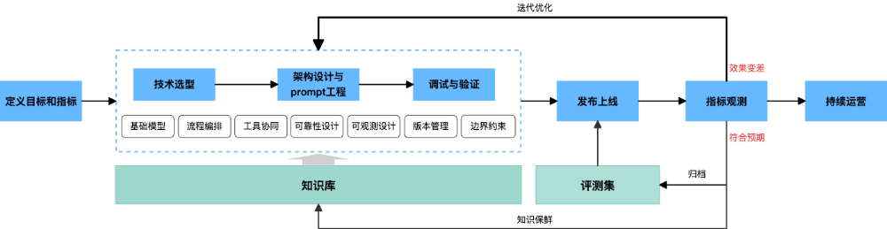

  

▐  **2.** Agent设计范式

  

> AI Agent 研发目前还没有形成像软件设计模式（如单例、工厂、观察者等）那样标准化、广泛共识的“设计模式”体系。
> 
> 本节中示意图来自  Anthropic-Building effective agents

  

- 范式一：最小可用范式

  

本质上是「自然语言入口 + RAG + 单次工具调用」，非常适合问问 / 查查 / 解释一下这类「轻交互、弱流程」场景。

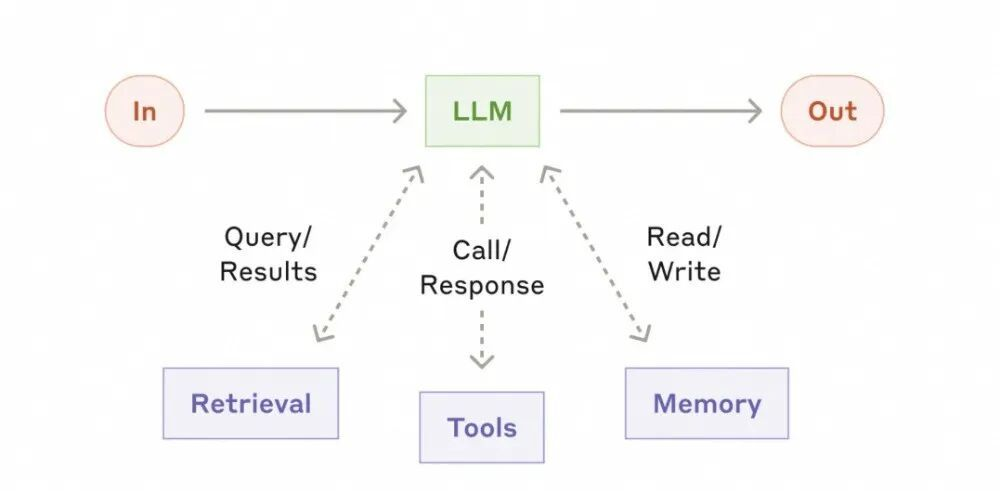

  

核心特征：

- 单轮触发：每次用户请求触发一次处理流程，整体是单轮或极少轮。
- 线性流程：在一次流程中，最多经历：意图识别 → RAG 检索 → 工具调用 → LLM 汇总输出，没有显式的多步规划或循环控制。
- 无状态设计：Agent 不维护长期任务状态（仅依赖 LLM 上下文窗口的短期记忆），也不做复杂任务拆解和多阶段决策。

  

优点：

- 高效率与低延迟：由于推理步骤最少（通常只调用 LLM 一次），响应快，适合对时间敏感的场景。
- 成本效益高：LLM 调用次数少，且无需复杂的规划提示，运行成本最低。
- 实现和维护简单：代码库简单，易于调试，适合作为复杂 Agent 的核心组件或原型。
- 可解释性较高：执行路径清晰，错误追踪直接。

  

缺点：

- 缺乏多步规划能力：无法处理需要连续决策、迭代优化或解决复杂依赖关系的深度任务。
- 工具使用局限性：对工具的复杂组合或条件触发能力不足，往往只能按顺序调用单个工具。
- 上下文依赖性强：短期记忆仅依赖 LLM 的上下文窗口，容易遗忘旧信息或被长对话淹没。

  

- 范式二：工作流式（workflow）

  

工作流式是一种由开发者预先定义任务执行流程的架构模式。Agent 不依赖运行时动态规划，而是严格按照预设的控制流，包括链式、路由、并行或状态驱动等，执行一系列结构化子任务。其核心思想是：将复杂目标拆解为可管理、可监控、可审计的原子步骤，并通过显式编排实现端到端自动化。

  


| 类别 | 示意图 |
| --- | --- |
| 链式 |   |
| 路由 |   |
| 并行 |   |


  

核心特征：

- 预定义执行路径：任务的流转逻辑（顺序、分支、循环、并行）在开发阶段即已确定，而非由 LLM 在运行时“即兴发挥”。
- 结构化任务拆解：通过固定流程、意图分流、并发处理或状态流转，将复杂问题结构化为具体的步骤。
- 关注控制流：系统的核心价值在于如何编排 LLM 的输入输出流向，确保逻辑的严密性和合规性。
- 确定性优先：虽然节点内部利用 LLM 进行智能处理（如填空、判断），但节点间的流转是确定的，强调规则和逻辑的约束。

  

优点：

- 高可预测性与可靠性：每一步的输入输出明确，行为边界清晰，极大地降低了 LLM 的幻觉风险；非常适合测试验证、合规审计以及对错误零容忍的场景。
- 强大的监控与调试能力：支持对每个节点设置 SLA（服务等级协议）、超时中断和失败重试机制；完整的执行日志支持问题回放和用户投诉的深度分析。
- 性能与资源效率：对于 I/O 密集型任务（如多源搜索），并行工作流可大幅降低总耗时；无无限动态分支，资源消耗稳定，便于容量规划；子流程可模块化（插件化），不同业务线可复用同一套意图识别或处理逻辑。
- 协作友好：业务人员可以通过流程图参与设计，开发人员负责实现，分工明确；支持灰度发布和 A/B 测试（针对路由策略），降低上线风险。

  

缺点：

- 灵活性受限，难以应对未知：缺乏探索性，无法处理开放式问题；交互僵化，用户体验较为机械，类似“填表”而非自然对话。一旦用户中途改变意图或跳出流程，系统往往无法自适应。
- 复杂度与维护成本：设计门槛高，要求开发者对业务过程有极深的理解，初始建模（尤其是状态机）难度大；随着业务场景增加，工作流图可能发生爆炸（状态爆炸、路由规则复杂），导致“维护地狱”；新增或修改流程往往涉及工程代码变更，迭代速度受限于流程设计。
- 集成与聚合难题：意图识别瓶颈，如果路由节点的分类模型出错，则整个后续流程都会错配；上下文隔离，跨子流程的信息传递往往比较困难；结果聚合问题，并行任务的输出结果在结构统一、排序和权重分配上处理难度较大。

  

- 范式三：动态规划类

  

动态规划式是一种依赖大模型在运行时进行自主推理和任务编排 的系统架构。与工作流式执行既定步骤不同，动态规划式 Agent 被赋予了“大脑”。它能够在不确定或未知的环境中，通过 “思考-行动-观察”的循环（ReAct） 或 “先规划-后执行”的策略（Plan-and-Execute），自主拆解目标、选择工具、处理反馈并动态调整路径，直到最终达成任务。

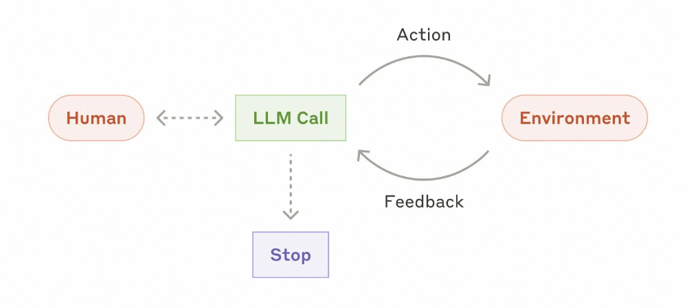

  

核心特征：

- 运行时动态决策：执行路径不是开发者预设的，而是由 Agent 根据当前环境状态和任务目标实时生成。
- 推理驱动行动：迭代式推理，通过 思考--> 行动-->反馈的闭环，逐步逼近答案；全局规划，通过生成完整的计划指导后续的(执行，并在必要时进行重新规划。
- 高度自治：Agent 具备自我修正能力，能够处理执行过程中的报错或意外信息，并在不修改代码的情况下探索新路径。
- 工具使用灵活性：只要工具在行动空间内，Agent 可以根据需要以任意顺序、任意次数调用，无需硬编码调用逻辑。

  

优点：

- 极高的灵活性与适应性：无需预定义死板流程，能适应未知环境和千变万化的用户需求；支持信息逐步揭示，能处理“一开始不知道怎么做，试一下才知道”的探索性任务。
- 具备解释性与可控性（相对黑盒模型）：过程透明，ReAct 的思考日志和 Plan-and-Execute 的计划列表，让用户能清晰看到 Agent 的思考路径和规划逻辑；人机协同友好，中间产生的“计划”可供人类审核、修改或重排，便于介入干预。
- 自然发现新路径：只要提供了足够的基础工具，Agent 可能会组合出开发者未曾预想到的解决方案路径。

  

缺点：

- 稳定性与可靠性挑战：循环与死锁，Agent 可能陷入无效的思考循环（如反复调用同一工具报错），或在规划时遗漏关键步骤；结果不可控：相同的输入在不同时间可能走出完全不同的路径，输出结果的方差大，难以满足强确定性业务的需求。
- 对模型能力的强依赖：推理瓶颈，极度依赖 LLM 的逻辑推理能力。如果 LLM 在规划或决策阶段“想偏了”，后续执行将全部错误；上下文限制，在长任务中，Observation（环境反馈）可能非常长，容易导致关键信息被截断或遗忘。
- 工程化难点：延迟高，ReAct 模式每一步都需要一次 LLM 推理，多步任务导致响应极慢；成本不可预测：无法预知 Agent 会调用多少次工具、消耗多少 Token，难以进行精确的费用预算；安全风险：由于 Agent 具有高度自主权，若无严格沙箱，可能生成恶意的工具调用指令。

  

▐  **3**. Agent开发方式

  

从实际工程开发方式看，大致可以分为三种方式：


| 类型 | 关键内容说明 | 示例 |
| --- | --- | --- |
| 纯prompt | 完全依赖大模型自身能力，通过精心设计的提示词实现，无外部工具调用，无自定义逻辑、无状态管理、无流程编排。 | 直接调用LLM、AI产品的自定义prompt能力。 |
| 拖拽/低代码型 | 通过可视化界面（拖拽节点、连线）定义 Agent 工作流；支持预置工具集成（API、数据库、LLM 调用）；提供基础状态管理、分支判断、重试机制；代码生成或配置驱动，无需手写复杂逻辑。 | Dify、Coze、AI Studio |
| 纯代码型 | 完全通过代码定义 Agent 行为：Prompt、工具、记忆、工作流、评估均以代码形式管理；支持任意复杂逻辑：动态规划（ReAct/Plan-and-Execute）、多 Agent 协作、自定义记忆策略；具备完整工程能力：版本控制、CI/CD、监控告警、A/B 测试。 | LangChain(Python)、LangEngine(Java)、Spring AI、Spring AI Alibaba、AgentScope |


  


案例分享：AI需求资损分析

  

▐  **1**. 背景

  

在大规模互联网业务中，需求迭代频繁、链路复杂、参与角色众多，资损风险往往隐藏在非常细微的业务逻辑变更中，与服务稳定性问题相比，资损问题具有更强的隐蔽性，然而随着业务进入高频迭代期，传统的资金安全模式面临着三个核心挑战：

  

- 资源与风险的错位分配

核心矛盾：资源投入与实际风险分布严重不匹配。

高风险项目往往投入更多资源进行保障，然而很多风险也隐藏在海量的日常中低风险需求中，而这些需求因人力和时间限制往往无法获得充分评估，导致"看似低风险"的变更在线上运行后逐步演变成重大资损故障，风险识别的准确率低也导致了防控资源的错位配置，形成了巨大的风险敞口。

  

- 专家经验的规模化难题

核心困境：优秀的资损分析能力无法有效复制和传承。

资损场景识别和布控策略制定高度依赖领域专家多年积累的知识储备、业务理解和历史经验，这种隐性知识难以标准化、文档化和规模化传播。不同评估人员的分析深度和质量存在显著差异，新团队成员的成长周期长，面对复杂的资损场景常常无从下手。

  

- 评估流程效率瓶颈

核心制约：线性的人工评估流程无法适应指数级增长的需求量。

随着业务迭代速度加快，需求变更频率持续提升，而人工评估本质上是一个串行、低并发的过程，同时也需要有统一的管控系统来实时感知保障进度，确保评估结果可追踪和验收。

  

▐  **2**. 整体方案

  

本方案核心定位是能够嵌入到需求研发周期（pipeline）的AI资损分析能力：包括在需求评审、技术评审、开发、测试验证到发布的每个阶段，AI能基于研发过程产生的PRD、技术方案、代码变更、测试用例等信息作为输入进行全面的资损分析，也就是通过Agent与研发周期的原生集成和自动化。

  

- 运行态（面向当次需求）：基于业务架构和生产关系统一设计业务领域Agent， MoE架构由总控协调器统一调度各领域专家Agent，基于多租户架构快速支持各业务产品线独立接入、调试、灰度与上线，统一技术链路与能力组件，支持与产品线共建。
- 归档与保鲜（面向长期演进）：需求归档和知识保鲜是本产品可持续的关键，前者将每次需求的分析结论、命中风险点、校验脚本与效果指标结构化沉淀；后者以自动更新的方式维护业务/技术/风险知识，降低对人工专家持续维护的依赖，避免知识库过期导致模型输出漂移，从而让系统具备“越用越准、越用越省人”的复利效应。
- 研发态（面向稳定迭代）：通过构建领域需求数据集与分析效果验证Agent，对模型输出进行打标与召回率度量，同时借助需求归档与知识保鲜Agent将真实场景中的新增风险点动态回流至底层知识库，实现了分析能力的迭代升级。

  

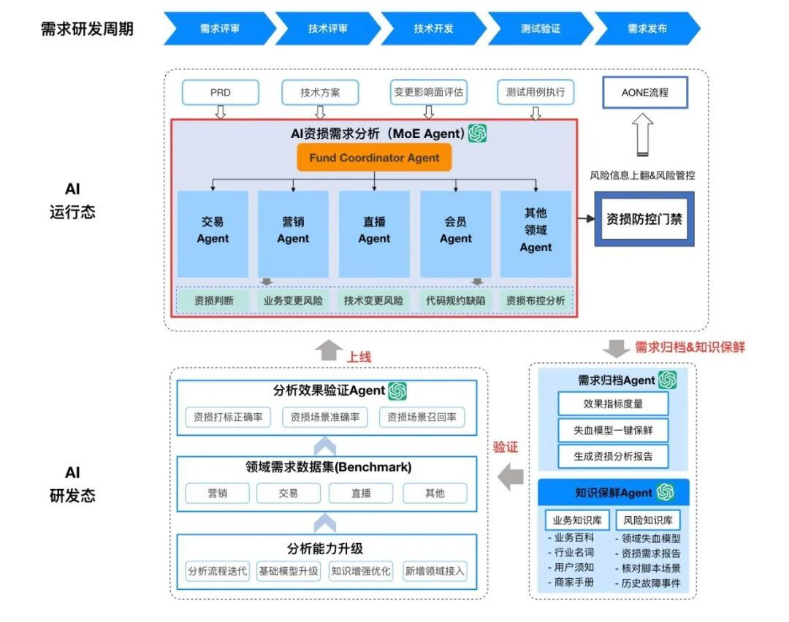

  

▐  **3**. 流程设计

  

资金安全保障的核心挑战在于如何在业务逻辑高度复杂、风险场景高度依赖专家经验、且需在动态上下文中精准推理。在流程设计之前我们先思考人工是如何进行分析（可以从新手的视角来看）：

- Step1：判断是否涉及资损。先通览PRD和技术文档，如果本次需求改动是围绕新增或者修改商业活动玩法，涉及资金链路改动的就是资损需求。
- Step2：需求改动点和技术实现点提炼。 如果需求涉及资损，则重点关注PRD中涉及的业务玩法规则以及技术文档中涉及资金链路改造的部分，忽略掉非资损相关的部分。
- Step3：丰富业务需求提炼内容。如果文档里提到了一些特殊业务名词或者行业术语，比如平台返、递进满减等，还有一些技术名词，比如应用缩写等，需要了解这些知识点来丰富业务需求提炼内容，这样一个更丰富的资损需求内容呈现在眼前了。
- Step4：召回相似资损场景。本次需求是全新的能力还是之前产品能力的迭代，如果是后者可以重点参考历史需求的资损场景分析结果。在之前沉淀的所有资损场景分析文档里是否有相似业务规则和资金链路的资损场景，以及各个领域持续沉淀的失血模型给资损场景分析提供输入，还有历史出现过的资损故障和事件都可以作为借鉴。总而言之用于召回本次需求相关的资损场景，但这还不是最终的输出结果。
- Step5：资损布控场景分析。有了丰富后的资损需求提炼内容和召回的资损场景就可以进行最终的资损场景分析，确保分析过程跟本次需求高度相关，给出最终的资损场景列表。

  

有了以上分析步骤就可以明确AI对一次需求进行资损布控分析的关键流程：

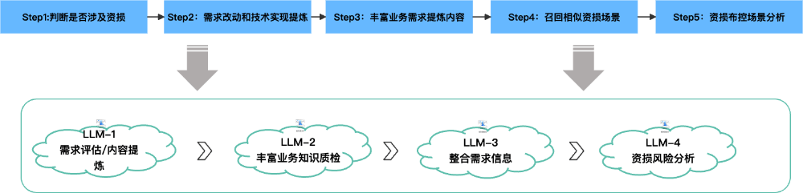

  

后续历经多轮架构迭代与多个核心业务领域的持续验证，同时考虑系统可控性，AI需求资损分析业务领域Agent采用工作流设计范式，将复杂的专家经验解构为确定性推理管道。通过分步拆解把高不确定任务分治为低信息熵子问题，并以过程状态与结构化中间产物形成强约束，持续抑制LLM幻觉与漂移，同时确保每步可观测、可回溯、可评估，便于定位问题与迭代优化。

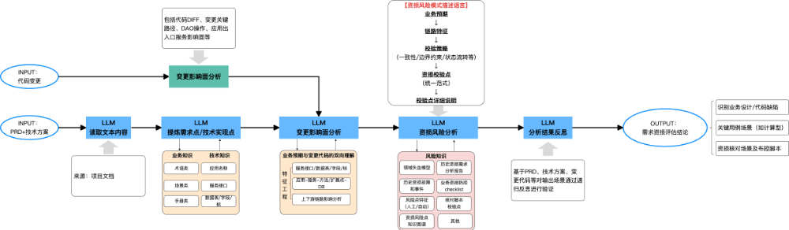

  

- 多源输入标准化：降低信息缺失与偏差  
  资金风险经常不是PRD一句话能解释清楚，关键风险往往藏在技术方案和代码变更中，整合研发过程pipeline的产物，避免仅分析代码或仅分析文档导致的遗漏，确保业务预期与技术实现的一致性校验。
- 需求点/实现点抽象：建立可推理的中间表示  
  直接从长文生成场景容易漂移，因此需要先把业务预期和技术实现抽成结构化要素，相当于给模型建立可控的推理地基，减少幻觉，再次提升一致性。
- 变更影响面分析：把风险评估从“可能”变成“触达范围”  
  资金风险能否发生取决于变更触达了哪段资金链路、哪些状态流转、哪些账务/优惠/结算口径等，从单点变更扩展至全链路影响，避免传统分析仅关注局部代码的局限性。
- 资金风险描述语言：统一表达、便于复用与保鲜  
  用统一的风险描述语言把“业务预期—链路特征—校验策略—校验点—核对脚本”串起来，输出结果可直接用于相似资损场景召回和核对脚本开发，将AI分析结论转化为可执行的防控动作。

  

▐  **4**. 知识体系

  

虽然通过功能区分了不同的LLM，也意味着对于不同LLM的能力要求也不一样，从而影响后续在具体工程落地时的设计思路，比如是否对外部数据有依赖，对哪些数据有依赖等。我们先看MSRA的一篇论文《Retrieval Augmented Generation (RAG) and Beyond: A Comprehensive Survey on How to Make your LLMs use External Data More Wisely》是如何对于一次查询任务进行分级。

  

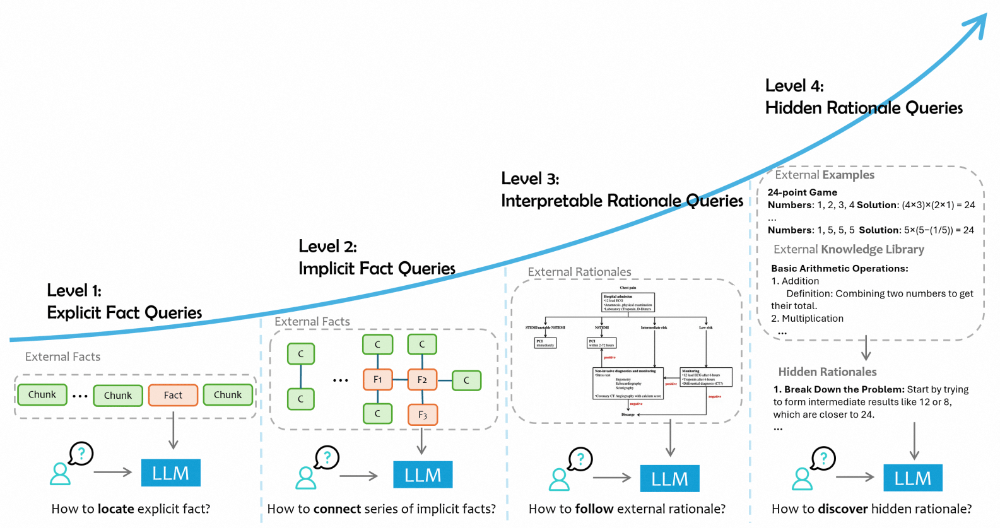

  

- Leve1：明确事实查询，直接从数据中提取答案无需推理。
- Level2：隐含事实查询，需要基本逻辑或者常识推理来组合信息。
- Level3：可解释推理查询，不仅需要事实还需要领域内的推理规则。
- Level4：隐藏式推理查询，需要从历史数据中挖掘策略。

那么对应一次需求资损分析中各LLM涉及的分析能力要求如下，也就明确了prompt的落地思路和对外部知识的依赖诉求，如RAG等。

  

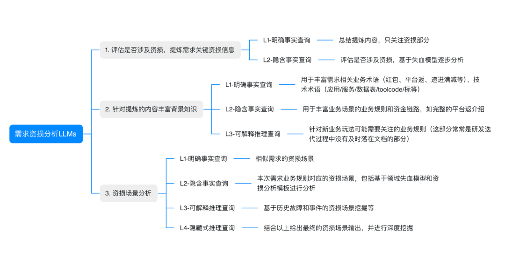

  

资金安全分析本质上高度依赖专家经验：同一个需求文本在不同业务形态、技术链路情况下，对应的风险结论可能完全不同。因此资金安全不是简单地“把文档喂给模型”就能解决的任务，它需要的是强上下文（context）能力：让Agent在分析时拿到足够的业务语义、技术链路与历史风险数据，才能把“可能有风险”收敛为“具体在哪个环节、以什么机制发生、用什么脚本验证”。

  

因此资金安全知识体系的价值不在于“信息罗列”，而在于提供三类关键上下文能力：

- 语义对齐能力（业务上下文）  
  解决“术语、玩法、规则等”在不同团队/文档中的表述差异，保证Agent对业务预期的理解稳定一致，避免因口径不一造成误判或漏判。
- 链路落点能力（技术上下文）  
  让风险推导能从抽象描述落到具体系统与数据对象：影响到哪些应用/接口/扩展点/表字段/指标口径。资金安全的核对脚本必须可执行，这要求知识体系天然支持“从变更到链路到数据”的可追溯。
- 经验复用能力（风险上下文）  
  资金风险高度重复出现（如重复计费、漏计、幂等缺失、补偿不一致、状态机错乱等），风险知识库的作用是把历史事故与最佳实践沉淀为可复用的“风险模式+校验点+脚本模板”，帮助Agent在新需求里快速召回相似风险并完成校验闭环。
  
    

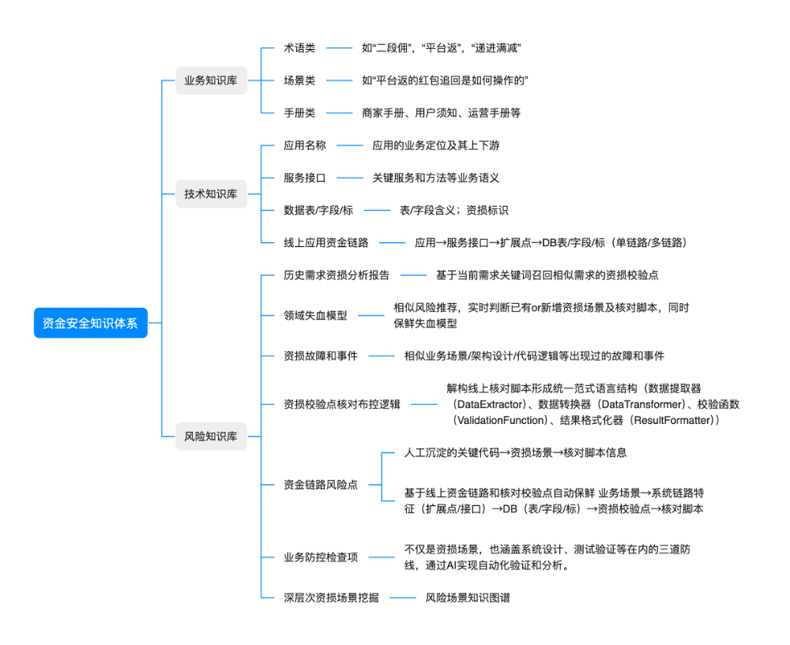

  

换句话说：资金安全知识库不是“资料库”，而是让AI具备专家上下文的工程化能力，用来保证输出的确定性、可解释性与可执行性。

  

▐  **5**. 产品页面

  

好的Agent能力不等于好的Agent产品。好的产品设计是技术落地、建立用户信任并达成业务价值的“最后一公里”。因此将把Agent输出变成研发可执行的AI资损资控门禁，从而将抽象的Agent能力转化为可量化、可操作的资损防控工具，真正解决“技术可用但业务难用”痛点，保障资损防控事项高效落地。

  

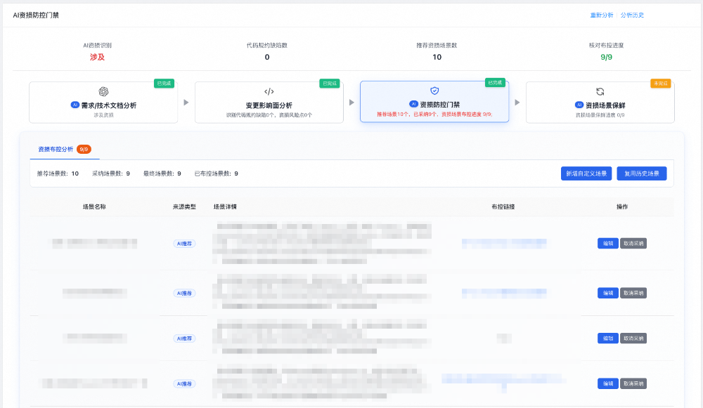

  


个人实践体会

  

- 从“最小可用范式”开始，压榨架构潜力，渐进式复杂，遵循“奥卡姆剃刀”。

在AI Agent设计中一般会面临一个误区：试图在初期就构建功能完备的复杂系统，但实践证明从最简单可用版本开始才是明智之选。先用基础的Prompt + LLM组合验证核心业务价值，再根据需求逐步引入ReAct、Planning等复杂范式。奥卡姆剃刀原则尤为适用：如无必要，勿增实体。很多时候精心设计的单轮对话系统比多Agent协作更稳定高效。通过渐进式方法，我们能快速验证业务假设，在每个阶段充分理解系统瓶颈，真正"压榨"出架构的最大潜力，避免过度工程化带来的维护成本和不确定性。

  

- 混合架构是落地常态，“工作流外壳 + 智能内核 + 知识管理”，避免Agent失控。

纯粹的自主Agent在生产环境中往往难以控制，"混合架构"已成为主流选择，核心是用确定性工作流作为外壳，定义清晰的任务边界；在关键决策节点嵌入AI作为智能内核，负责理解、推理和生成；配套完善的知识管理系统，包括向量数据库、业务规则库和工具集。这种设计既保留AI的灵活性，又通过工作流确保可预测性。

  

- 智能是奢侈品，稳定是必需品，在智能、可控和成本找到最优平衡点。

在AI Agent产品化中，比起“是否展现惊人智能”，用户更在意"能否稳定完成任务""。准确率95%但偶尔犯低级错误的Agent，往往不如准确率85%但错误可预测可兜底的系统受欢迎。设计时需在三个维度权衡：智能程度、可控程度、成本投入。实践中往往采用分层的策略：简单高频任务用规则和小模型保证稳定性和成本控制；复杂低频任务才调用大模型；关键环节增加人工审核，这种平衡需基于真实业务数据和用户反馈持续迭代。

  

- 没有银弹，AI极大地消除了次要困难，但无法解决根本困难，对人要求更高。

AI Agent能快速处理大量文本、生成多样化内容、工具调用等，这些属于"次要困难"，但业务中的"根本困难"依然存在：要解决什么问题？目标和标准是什么？如何领域建模？这些本质问题AI无法代替人类思考。AI的引入反而对团队提出更高要求：需要理解LLM的能力边界，掌握Prompt工程和评估方法，在模糊输出中识别价值和风险。成功的项目背后都需要对业务有深刻理解和对技术有清醒认知，用AI放大专业能力而非替代思考。

  

- Agent参与者都需要深度理解业务，无论对于架构设计和prompt工程都非常重要。

AI Agent开发是高度跨领域的工作，不能简单分为"产品定需求、工程写代码"。架构师和Prompt工程师都必须深入理解业务场景。架构设计时，只有理解业务才能判断哪些环节需要智能、哪些需要确定性，在Prompt工程中，业务理解更是核心：什么是正确的输出格式，哪些边界情况需要特别说明，对业务理解的深度决定了一个Agent架构的潜力。

  

- 领域知识壁垒比想象中高，包括来自平台沉淀和专家积累等，关注质量和持续性。

真正有价值的知识包含多个层次：显性的文档规范、隐性的专家经验、平台沉淀的案例库、实际操作中发现的边界情况。这些知识分散在不同人员和系统中，且存在冲突、过时、不完整等问题。更关键是质量和持续性：旧文档可能已不适用，专家经验需结构化整理，知识库需随业务持续更新。建议建立"知识工程"流程：比如业务专家 + 知识工程师协作梳理知识图谱，建立版本管理和更新机制，虽然会投入一定资源，但对于知识依赖强的Agent非常有必要，因为它决定了Agent的能力上限。

  

- 无评估，不迭代，无数据，不优化，不能用感觉效果不错代替量化验证。

AI Agent的输出不确定性使"感觉"成为最不可靠的评判标准。因此需要建立科学的评估体系，首先是离线评估：构建高质量测试集（覆盖正常、边界、对抗case），定义明确指标，建立自动化评估流程；其次是在线评估：通过A/B测试、用户反馈、人工抽检收集真实数据。更重要是能够建立线上数据发现问题→标注产生新样本→优化模型或Prompt→再次上线验证这样的飞轮，不然没有被量化验证的优化都是自我安慰。

  

- Agent能力+用户体验（过渡/重做）=好Agent产品，一线同学每天要面对非常多的Agent。

技术强大的Agent不等于好产品，产品策略和用户体验设计同样关键。一般存在两种典型路径：过渡型和重构型。对于在现有产品基础上引入AI的场景，由于准确率可能还不够完美，需要采用"人机协同"的过渡策略，保留原有交互作为兜底，让用户可以在AI建议和传统操作间灵活切换，逐步建立对AI的信任。而当AI能力足够强且有明确推动力时，应该跳出原有产品思维，从AI视角重新设计交互范式：比如从"填表单"变为"对话式"，从"多步骤操作"变为"意图理解后一键完成"，从"功能堆砌"变为"智能推荐"。两种策略的选择取决于AI成熟度、业务容错度和用户接受度，但核心都是让用户清晰感知"AI在做什么、可信度如何、出错了怎么办"，而非盲目追求炫酷的AI交互。

  

- 拉长时间看，在特定范围内Agent比人更可靠，Agent会成为团队的一份子。

在定义明确、规则清晰的特定领域内，Agent会逐渐体现出超越人类的稳定性。它不存在情绪波动、知识遗忘和疲劳等问题，能7×24小时保持一致服务。随着知识库完善和案例积累，Agent能力会持续提升并沉淀在系统中，不会因人员流动而流失。可能需要换一种思维来看：把Agent作为"团队成员"来培养和管理。包括为Agent分配明确职责范围，定义"岗位说明书"，持续"培训"（知识更新、案例积累），建立与人类同事的协作模式，或许这也是适应AI时代的组织进化方向。

  


团队介绍

  

文本作者北桓，来自淘天集团-SRE团队，团队以AI+软件工程思维为核心，系统性构建覆盖日常与大促保障、容量与成本治理、智能化运维及架构治理等在内的稳定性体系，我们坚持长期主义理念，积极探索工程化与智能化手段提升系统可靠性，致力于为数亿消费者在淘宝的每一次购物提供坚实可靠且值得信赖的技术体验。

  

  

**¤** **拓展阅读** **¤**

  

[3DXR技术](https://mp.weixin.qq.com/mp/appmsgalbum?__biz=MzAxNDEwNjk5OQ==&action=getalbum&album_id=2565944923443904512#wechat_redirect) | [终端技术](https://mp.weixin.qq.com/mp/appmsgalbum?__biz=MzAxNDEwNjk5OQ==&action=getalbum&album_id=1533906991218294785#wechat_redirect) | [音视频技术](https://mp.weixin.qq.com/mp/appmsgalbum?__biz=MzAxNDEwNjk5OQ==&action=getalbum&album_id=1592015847500414978#wechat_redirect)

[服务端技术](https://mp.weixin.qq.com/mp/appmsgalbum?__biz=MzAxNDEwNjk5OQ==&action=getalbum&album_id=1539610690070642689#wechat_redirect) | [技术质量](https://mp.weixin.qq.com/mp/appmsgalbum?__biz=MzAxNDEwNjk5OQ==&action=getalbum&album_id=2565883875634397185#wechat_redirect) | [数据算法](https://mp.weixin.qq.com/mp/appmsgalbum?__biz=MzAxNDEwNjk5OQ==&action=getalbum&album_id=1522425612282494977#wechat_redirect)
